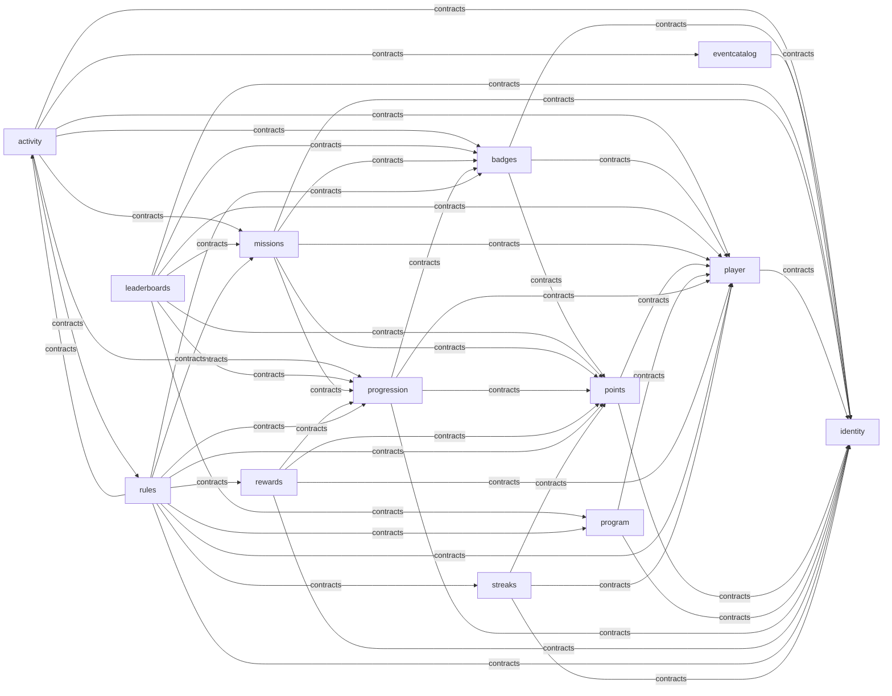

# Module dependency graph

Generated by `task arch` (test/arch, R21). Edges are compile-time
imports of another module's contracts — the only legal kind (PRD §9).

Async reactions (event subscriptions) are not imports and do not
appear above; see each module's Subscriptions() for those edges.
