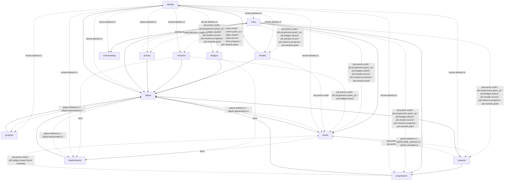
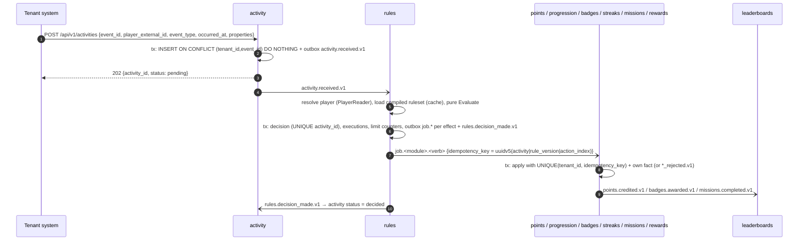
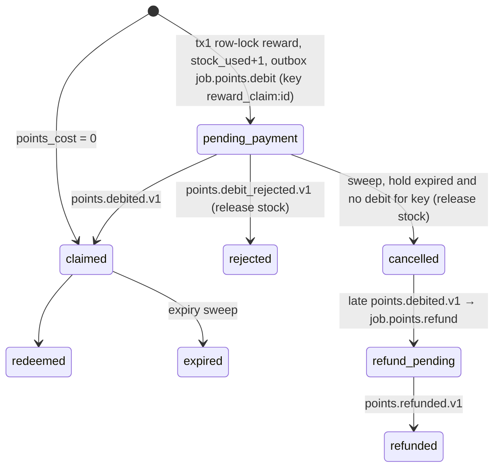

# 00 — LevelUpOS on the Go Modular Monolith Blueprint (target architecture & PRD)

This is the **canonical** synthesis for rewriting the LevelUpOS Laravel backend in Go on
`/Users/saba/Projects/golang_advanced_blueprint`. It is shaped to fill exactly what the blueprint's
`docs/architecture.md` §21 says a PRD on the blueprint must specify: module list in dependency order,
per-module ownership/routes/events/subscriptions/ports/jobs/permissions, cross-module flows as event
chains, identity, non-functional targets, stack additions, and requirements numbered from R50.

Docs 01–06 hold the as-is behaviour (with `path:line` citations), bugs, and a per-domain Go mapping.
**Where a domain doc's naming disagrees with this file, this file wins** (§3 lists the reconciliations).

| Doc | Scope |
|---|---|
| [01-platform-cross-cutting.md](01-platform-cross-cutting.md) | Routing, 97-route inventory, auth, authz matrix, tenancy semantics, wire contract, observers, queues, Filament, config, test inventory |
| [02-identity-tenancy.md](02-identity-tenancy.md) | Register/login/refresh/logout, users, tenants, roles → `identity` |
| [03-players-programs-events.md](03-players-programs-events.md) | Players, programs + enrolment, event-type catalogue → `player`, `program`, `eventcatalog` |
| [04-points-levels-badges.md](04-points-levels-badges.md) | Wallet ledger, XP/levels, badges → `points`, `progression`, `badges` |
| [05-missions-streaks-rewards-leaderboards.md](05-missions-streaks-rewards-leaderboards.md) | → `missions`, `streaks`, `rewards` (claim saga), `leaderboards` |
| [06-rules-engine-activity-pipeline.md](06-rules-engine-activity-pipeline.md) | Rule grammar, execution, golden corpus → `activity`, `rules` |

---

## 1. What LevelUpOS is (in one paragraph)

A multi-tenant **gamification engine as a service**. A tenant (a customer business) registers, gets an
owner user, defines **event types** (`purchase_completed`, …), **rules** ("on `purchase_completed` where
`amount >= 100` → credit 50 points, grant 20 XP, award badge X, record streak Y"), and the mechanics
those rules drive: **points wallets** with a ledger, **levels/XP**, **badges**, **missions**, **streaks**,
**rewards** purchasable with points, and **leaderboards**. **Players** are the tenant's end users,
identified by the tenant's own `external_id`. **Programs** group players into campaigns.

### 1.1 The honest state of the Laravel code (drives the rewrite)

The Go port is not a line-by-line translation. The docs found that the Laravel implementation is an
early, largely synchronous prototype:

| Area | Reality (see doc) | Consequence for Go |
|---|---|---|
| Activity ingestion | No real pipeline. `ProcessPlayerActivityJob` only logs and is never dispatched; the only path is sync `POST /rules/execute` with an internal `player_id` (06 §0, §4) | Build ingestion new: `POST /api/v1/activities`, 202, idempotent on `(tenant_id, event_id)` |
| Events | 51 domain events dispatched, **zero listeners** (01 §8) | Map 1:1 to outbox topics; nothing depends on them yet, so naming is free |
| Concurrency | No row locks anywhere (`lockForUpdate` never called); balances can go negative; double awards on retry (04 §10, 05 §8) | Row lock + `version` + idempotency keys everywhere money/awards move |
| Tenancy | Tenant = logged-in user's `tenant_id`; `TenantScope` silently disables when there is no user (queues, platform admins) (01 §5) | Explicit `tid` claim + tenant in every payload; never "no tenant ⇒ see all" |
| Security | `GET /users` lists all tenants; `POST /users` into any tenant; several endpoints with no policy (01 §20, 02 §10) | Fixed by design, not ported |
| Admin | Filament panel exists but likely unusable in prod; most mechanics have no resource (01 §12) | API-only; admin surface = API + separate frontend |
| Scheduling | None | Reconciling crons introduced (§7) |

**Rule of the port: preserve the wire contract clients depend on, not the bugs.** Every "do not port
blindly" list in docs 01–06 is a checklist of behaviours to deliberately change.

---

## 2. Module list (dependency order = `MODULES_ENABLED` order)

```
MODULES_ENABLED=identity,player,eventcatalog,program,points,badges,progression,streaks,missions,rewards,leaderboards,activity,rules
```

| # | Module | Schema | Shape | Source of truth for | Doc |
|---|---|---|---|---|---|
| 1 | `identity` | `identity_svc` | rich | tenants, users, credentials, roles, role assignments | 02 §11 |
| 2 | `player` | `player_svc` | rich | players (`tenant_id`, `external_id`, active flag) | 03 §11.2 |
| 3 | `eventcatalog` | `eventcatalog_svc` | thin | event types (global `tenant_id NULL` + tenant-defined), event categories | 03 §11.4 |
| 4 | `program` | `program_svc` | rich | programs, program state machine, enrolments | 03 §11.3 |
| 5 | `points` | `points_svc` | rich | wallets, append-only ledger, transfers | 04 §11 |
| 6 | `badges` | `badges_svc` | rich | badge catalogue, player badges, award ledger | 04 §11 |
| 7 | `progression` | `progression_svc` | rich | level ladder, player XP/level, XP grant ledger | 04 §11 |
| 8 | `streaks` | `streaks_svc` | rich | streak definitions, period buckets, milestones | 05 §11.3 |
| 9 | `missions` | `missions_svc` | rich | missions, player attempts, completions | 05 §11.2 |
| 10 | `rewards` | `rewards_svc` | rich | reward catalogue, stock, claims (saga owner) | 05 §11.4 |
| 11 | `leaderboards` | `leaderboards_svc` | rich | leaderboard defs, per-period scores (PG), Redis ZSET read model | 05 §11.5 |
| 12 | `activity` | `activity_svc` | thin | inbound activities, ingest status projection | 06 §11.2 |
| 13 | `rules` | `rules_svc` | rich | rules, immutable versions, decisions, executions, limit counters, pure evaluator | 06 §11 |

Two modules never own the same fact. Notable boundary choices (rationale in the docs):

- **One `identity` module, not `tenant` + `user`** — registration must atomically create tenant + owner
  user + role and return a token carrying `tid`; splitting would force a saga onto a login flow (02 §11.1).
- **`points` / `progression` / `badges` separate** — XP and points are independent counters; the only
  coupling (level-up bonus) becomes a command (04 §11.1).
- **`activity` separate from `rules`** — ingest must stay a single cheap insert, available even when
  evaluation is degraded. Merging is acceptable if the team prefers fewer modules (06 §11.2).
- The Laravel `Event` model is renamed **`EventType`** in Go (it is a trigger-type definition, not an
  occurrence); HTTP path `/api/v1/events` is kept for compatibility (03 §11.1).

### 2.1 Module dependency graph

Solid = synchronous port (consumer-owned port + adapter over provider `contracts.Reader`).
Dashed = asynchronous (events or `job.*` commands through the outbox).



Cycles exist only on the event plane (rules → points → …), never in imports — allowed by the blueprint.

---

## 3. Canonical naming (overrides docs 02–06)

The domain docs were written in parallel and drifted in topic prefixes (`players.*` vs `player.*`,
`badges.badge_awarded` vs `badges.awarded`, `levels.*` vs `progression.*`, events vs commands for the
reward debit). The canonical rules:

1. **Fact topics:** `<module>.<past_tense>.v1`, prefix = module name. Exception: `identity` publishes
   entity-named `tenant.*` / `user.*` (matches the blueprint's reference `user.registered.v1`).
2. **Commands** ("do this", exactly one consumer, state-change triggered) are **`job.<module>.<verb>`**
   through the outbox (blueprint R46). Payload structs live in the **target** module's `contracts/jobs.go`.
3. **Who issues a command:** the module that *decides* the effect and owns its parameters. Level-up bonus
   points → `progression` issues `job.points.credit`; mission rewards → `missions` issues it; streak points
   → `streaks`; reward price → `rewards` issues `job.points.debit`. `points` never subscribes to another
   module's facts to decide an amount.
4. **A business rejection is a result, not an error:** targets publish `<module>.<verb>_rejected.v1` and ack;
   only malformed payloads are `errs.Invalid` → immediate DLQ.

### 3.1 Canonical topic catalogue

| Module | Facts published | Commands consumed (`Jobs()`, no Schedule) |
|---|---|---|
| identity | `tenant.created.v1`, `tenant.updated.v1`, `tenant.deleted.v1`, `user.registered.v1`, `user.created.v1`, `user.updated.v1`, `user.deleted.v1`, `user.roles_changed.v1` | — |
| player | `player.created.v1`, `player.updated.v1`, `player.activated.v1`, `player.deactivated.v1`, `player.deleted.v1` | — |
| eventcatalog | `eventcatalog.type_created.v1`, `eventcatalog.type_updated.v1`, `eventcatalog.type_deleted.v1` | — |
| program | `program.created.v1`, `program.updated.v1`, `program.activated.v1`, `program.paused.v1`, `program.ended.v1`, `program.deleted.v1`, `program.player_enrolled.v1`, `program.player_unenrolled.v1` | — |
| points | `points.wallet_opened.v1`, `points.credited.v1`, `points.debited.v1`, `points.debit_rejected.v1`, `points.transferred.v1`, `points.refunded.v1` | `job.points.credit`, `job.points.debit`, `job.points.refund` |
| badges | `badges.awarded.v1`, `badges.award_rejected.v1`, `badges.revoked.v1` | `job.badges.award` |
| progression | `progression.xp_gained.v1`, `progression.level_reached.v1` | `job.progression.grant_xp` |
| streaks | `streaks.activity_recorded.v1`, `streaks.milestone_reached.v1`, `streaks.broken.v1` | `job.streaks.record` |
| missions | `missions.started.v1`, `missions.progress_updated.v1`, `missions.completed.v1`, `missions.expired.v1` | `job.missions.progress` |
| rewards | `rewards.claim_requested.v1`, `rewards.claimed.v1`, `rewards.claim_rejected.v1`, `rewards.redeemed.v1`, `rewards.claim_expired.v1`, `rewards.claim_cancelled.v1` | `job.rewards.grant` |
| leaderboards | `leaderboards.period_closed.v1` | — |
| activity | `activity.received.v1` | — |
| rules | `rules.decision_made.v1`, `rules.version_published.v1` | — |

### 3.2 Reconciliation table (doc wording → canonical)

| Doc says | Canonical |
|---|---|
| `players.deleted.v1`, `players.deactivated.v1`, `players.player_created.v1` (05) | `player.deleted.v1`, `player.deactivated.v1`, `player.created.v1` |
| `programs.player_enrolled.v1` (05) | `program.player_enrolled.v1` |
| `eventtype.*.v1` (03) | `eventcatalog.type_*.v1` |
| `badges.badge_awarded.v1` (04), `badge.awarded.v1` | `badges.awarded.v1` |
| `levels.*`, `level.reached.v1`, `job.levels.grant_xp` (06) | `progression.*`, `progression.level_reached.v1`, `job.progression.grant_xp` |
| `mission.completed.v1` | `missions.completed.v1` |
| `rules.streak_activity_requested.v1`, `rules.mission_progress_requested.v1` (05) | `job.streaks.record`, `job.missions.progress` (06 §11.4 option B) |
| Rewards → points debit via `rewards.claim_requested.v1` subscription (05 §11.4) | Rewards publishes `job.points.debit` (key `reward_claim:<claim_id>`) **and** the fact `rewards.claim_requested.v1` for observers; points answers with `points.debited.v1` / `points.debit_rejected.v1` carrying the key |
| `points` subscribing to `progression.level_reached.v1` / `badges.awarded.v1` for bonus points (04 §11.1 diagram) | `progression` / `badges` issue `job.points.credit` in the same tx as their fact (rule 3) |
| `rules.executed.v1`, `rule.executed.v1` | `rules.decision_made.v1` |
| `identity.user_*` | `user.*` |

---

## 4. Platform decisions (cross-cutting)

| # | Decision | Recommendation | Blueprint impact | Doc |
|---|---|---|---|---|
| D1 | Identifiers | UUIDv7 everywhere; keep `legacy_id BIGINT UNIQUE` on migrated rows; deterministic UUIDv5 from legacy ids during migration | none | 02 §11.13 |
| D2 | Tenant in token | Add `tid` claim to `platform/authn` claims → `authz.Principal.TenantID` | **platform change + ADR** | 02 §11.2–11.3 |
| D3 | Tenancy enforcement | Repos take tenant from context/payload, explicit `tenant_id = $tid`; `OR tenant_id IS NULL` only for event types/categories; cross-tenant → 404; no tenant on a tenant route → 403; optional Postgres RLS as defence in depth | none (RLS = ADR) | 01 §5.5 |
| D4 | Async tenant context | Every event and job payload carries `tenant_id` (+ `player_id`); handlers never infer tenant | none | 01 §5.5 |
| D5 | Wire contract v1 | Keep Laravel shapes: bare DTOs, `{data, links, meta}` lists, `{message, errors{field:[..]}}` validation, `{error, message, ...extras}` domain errors. Build `httpx` compat renderer; problem+json via `Accept` and default on `/api/v2` | **`errs` gets `Code` + `Extras` (additive ADR)**, `httpx/compat.go` | 01 §7.4 |
| D6 | Pagination | v1 keeps `page/per_page` (cap 100, deterministic `ORDER BY`) **plus** opaque `cursor`; ledger/execution lists cursor-first | small helper in `shared/pagination` | 01 §7.5 |
| D7 | Tokens | Access JWT 15 min (HS256 per platform) + rotating refresh in redis-core; logout = deny `jti` + revoke all. Passport tokens are not migrated → everyone re-logs in at cutover | none | 02 §11.3 |
| D8 | Passwords | Copy Laravel `$2y$12$` bcrypt hashes byte-for-byte; truncate to 72 bytes before compare; new hashes cost 12; opportunistic rehash | none | 02 §11.4 |
| D9 | Activity ingest returns | **202** + `activity_id`; sync decisions only via `POST /rules/simulate` (no writes). A sync fast path needs a written justification (blueprint sagas rule) | none | 06 §11.1 |
| D10 | Dispatcher latency | Activity→decision p95 < 100 ms needs ≤25 ms outbox poll or `LISTEN/NOTIFY` wake-up | **platform change + ADR** | 06 §11.10 |
| D11 | Leaderboards store | Postgres per-period scores = truth; redis-core ZSETs = derived read model, rebuildable | uses existing redis-core role | 05 §11.5 |
| D12 | Admin UI | Drop Filament; every admin capability is an API endpoint under `platform:*` / module admin permissions | none | 01 §12 |
| D13 | Database | MySQL → Postgres, schema per module, no cross-schema FKs (bare uuids) | none | 01 §13 |

### 4.1 Roles and permissions

Laravel roles (`spatie/laravel-permission`, `app/Domain/User/Enums/Role.php`) become seeded casbin roles;
each module declares `module:action` permissions in `contracts/permissions.go` and seeds default grants in
a Go migration. The consolidated matrix is in **01 §4.3–4.4**; per-module catalogues are in each doc's §11.
Ownership in this product means **tenant ownership** (+ player-level ownership only where a player-facing
API exists), checked in the service after loading the entity.

---

## 5. Cross-module flows as event chains

Each flow: trigger → owning row + state machine → events in order → settler → accepted consistency
window → sweep. All handlers are idempotent under redelivery and reordering.

### F1. Tenant registration (single module, synchronous)
`POST /auth/register` → `identity` tx: tenant + user + owner role + outbox `tenant.created.v1`,
`user.registered.v1` → 201 with tokens carrying `tid`. No saga. Window: n/a. Sweep: none.

### F2. Activity → rules → effects (the core engine)



- Owning rows: `activity_svc.activities` (pending → decided), `rules_svc.decisions` + `rule_execution_effects` (requested → applied | rejected).
- Window: p95 < 100 ms activity → decision committed; effects applied seconds-level.
- Sweep: `activity.stuck_sweep` re-publishes activities pending > N min; `rules.effects_reconcile` settles effects with no outcome via target Readers.
- Unknown players: auto-create is **open question Q2**; default = reject with `activity.status=rejected:unknown_player`.

### F3. Level-up rewards
`job.progression.grant_xp` → `progression` tx: XP ledger row (unique key), recompute level from **total XP**
(commutative), for each newly reached level insert `level_rewards UNIQUE(player_id, level_id)` → outbox
`progression.level_reached.v1` + `job.points.credit` (key `level_reward:<player>:<level>`) + optional
`job.badges.award`. Exactly-once regardless of order.

### F4. Mission completion
`job.missions.progress` → `missions` tx: increment keyed by idempotency key; when target reached, row-lock
transition `in_progress → completed` (guard fixes the "complete forever" bug, 05 §8) → `missions.completed.v1`
+ `job.points.credit` / `job.progression.grant_xp` / `job.badges.award` keyed `mission_completion:<attempt_id>:<kind>`.
Sweep: `missions.expire_sweep` (*/5 min).

### F5. Streak record
`job.streaks.record` → `streaks` tx: `UNIQUE(player_streak_id, period_start)` bucket keyed by
`activity.occurred_at` in tenant timezone; current/longest derived from buckets (fixes "every call increments",
05 §8) → `streaks.activity_recorded.v1`, on milestone `streaks.milestone_reached.v1` + `job.points.credit`.
Sweep: `streaks.break_sweep` (hourly) → `streaks.broken.v1`.

### F6. Reward claim (saga, owner = `rewards`)



Client gets **202 `pending_payment`** and polls `GET /rewards/claims/{id}` (Q1: confirm the portal accepts this;
otherwise a sync fast path layered on the event path, per blueprint). Sweeps: `rewards.claims_reconcile` (1 min,
asks points by key), `rewards.claims_expire` (hourly). Full DDL in 05 §11.4.

### F7. Leaderboard scoring
`leaderboards` subscribes to `points.credited.v1`, `points.debited.v1`, `badges.awarded.v1`, `missions.completed.v1`,
`program.player_enrolled/unenrolled.v1`, `player.deactivated.v1`; applies increments keyed by event id
(`applied_events`), writes PG period score then ZINCRBY after commit. Jobs: `leaderboards.rollover` (hourly),
`leaderboards.rebuild` (daily/manual). Metric semantics for `points` (period earned vs balance) = Q5.

### F8. Tenant deletion
`tenant.deleted.v1` → every module soft-deletes / purges its tenant rows idempotently (replaces MySQL cascades).
Sweep: `<module>.tenant_purge` verifies none left.

### F9. Player deletion / deactivation
`player.deactivated.v1` / `player.deleted.v1` → `program` drops enrolments, `leaderboards` hides entries,
mechanics reject new commands for inactive players **as results** (`*_rejected.v1`). Today inactive players
still earn (03 §0) — this is a behaviour change to confirm (Q6).

---

## 6. HTTP surface

All routes under `/api/v1`, mounted by the composition root; `RequireAuth` per group; tenant from token.
Per-endpoint request/response contracts (Laravel as-is + Go) are in each doc's §5 and §11 "endpoints".

| Prefix | Module | Notes |
|---|---|---|
| `/auth/*` (`register`, `login`, `refresh`, `logout`, `me`) | identity | `refresh` becomes a real refresh-token rotation (contract change, Q3) |
| `/users`, `/tenants` | identity | `/users` tenant-scoped (fixes cross-tenant listing); tenant admin endpoints new |
| `/players` | player | add lookup by `external_id` |
| `/programs` (+ `activate/pause/end`, players enrol) | program | state machine enforced; `PUT` no longer nulls omitted fields |
| `/events` | eventcatalog | path kept; `is_predefined` writable only by platform admins |
| `/wallets` (balance, credit, debit, transfer, transactions) | points | `Idempotency-Key` required on money endpoints |
| `/levels`, players' level/XP | progression | |
| `/badges` (+ award/revoke) | badges | |
| `/missions` (+ start/progress/complete) | missions | `progress` gets authorization (missing today) |
| `/streaks` (+ record/reset) | streaks | |
| `/rewards` (+ claim/redeem, claims) | rewards | claim → 202 |
| `/leaderboards` (+ rankings) | leaderboards | index gets authorization (missing today) |
| `/rules` (+ versions, `publish`, `simulate`) and `/rules/execute` (deprecated alias → activities) | rules | |
| `/activities` | activity | new ingestion endpoint |
| `/ping`, `/up` | platform | health; metrics/pprof on admin port only |

---

## 7. Jobs (crons) — all reconciling, enqueued by `cmd/scheduler`, run by `cmd/worker`

| Job | Schedule | Purpose |
|---|---|---|
| `points.reconcile` | */15 min | ledger Σ == balance, chain continuity; alert only |
| `progression.reconcile` | hourly | total_xp == Σ grants; level matches ladder |
| `badges.reconcile` | hourly | earned_count == awards ≤ max_awards |
| `missions.expire_sweep` | */5 min | expire missions/attempts past `end_at` |
| `streaks.break_sweep` | hourly | break lapsed streaks per tenant tz |
| `rewards.claims_reconcile` | 1 min | settle/cancel stuck `pending_payment` |
| `rewards.claims_expire` | hourly | expire claims and rewards |
| `leaderboards.rollover` / `.rebuild` | hourly / daily | period close + snapshot; ZSET rebuild |
| `activity.stuck_sweep` | 1 min | re-publish undecided activities |
| `rules.effects_reconcile` | 5 min | settle effects with no outcome |

---

## 8. Non-functional targets

| Path | Target |
|---|---|
| `POST /activities` (202) | p95 < 15 ms, p99 < 40 ms |
| Pure evaluator | < 1 ms for 200 rules × 20 conditions |
| Activity → decision committed | p95 < 100 ms (needs D10) |
| `POST /rules/simulate` | p95 < 50 ms, p99 < 100 ms |
| CRUD reads | p95 < 50 ms |
| Effect application (job → fact) | p95 < 2 s end-to-end |
| Alerting | blueprint runbook defaults (`outbox_unpublished_age_seconds` > 60 s, DLQ rate > 0) |

Peak RPS per tenant and globally is **Q7** (not derivable from the code).

---

## 9. Stack additions (each needs an ADR, blueprint ADR-0009)

| Addition | Why |
|---|---|
| `tid` claim in `platform/authn` | tenant in principal (D2) |
| `errs.Code` / `errs.Extras` + `httpx` compat renderer | v1 wire compatibility (D5) |
| Offset-page helper alongside cursors | v1 pagination (D6) |
| Dispatcher `LISTEN/NOTIFY` or short poll | rules latency (D10) |
| (optional) Postgres RLS on `tenant_id` | defence in depth (D3) |
| (optional) expression library for rule grammar v2 aggregates | only if grammar v2 adopted; v1 is a hand-written evaluator (06 §11.5) |

No new infrastructure beyond the blueprint's Postgres + PgBouncer + 2× Redis + RabbitMQ.

---

## 10. Requirements (from R50)

| ID | Requirement | Acceptance (a test that can fail) |
|---|---|---|
| R50 | Every tenant-owned query filters by the principal's / payload's tenant | Arch/integration test: tenant B token gets 404 on every tenant-A resource across all modules |
| R51 | A principal without `tid` gets 403 on tenant routes | Integration test per route group |
| R52 | v1 responses are byte-compatible with recorded Laravel golden files | Contract tests over the bruno collection + recorded responses (01 §17) |
| R53 | Laravel bcrypt hashes verify unchanged | Unit test with real `$2y$12$` fixtures incl. >72-byte password |
| R54 | Activity ingestion is idempotent on `(tenant_id, event_id)` and `Idempotency-Key` | Same activity twice → one decision, one ledger entry |
| R55 | Every effect is applied exactly once under redelivery and reordering | Fault-injection test: duplicate + shuffled job delivery → identical final state |
| R56 | Business rejections never reach the DLQ | Badge-already-earned / insufficient balance → `*_rejected.v1`, DLQ count 0 |
| R57 | Wallet balance never negative; ledger Σ == balance | Concurrency test: N parallel debits; `points.reconcile` finds no drift |
| R58 | Level derived from total XP; level rewards once per (player, level) | Out-of-order XP grants → same level and same bonus count |
| R59 | Streak counts are per period bucket in tenant timezone | Two records same day → +1; late record fills gap deterministically |
| R60 | Reward stock never oversold; claim saga settles every claim | Concurrency test on last unit; sweep resolves forced-stuck claims |
| R61 | Missions complete at most once per attempt | Repeated complete → 409/no-op, single reward set |
| R62 | Rules evaluator is pure and deterministic | Golden corpus (06 §9.2, 28 cases) passes against Go and documents Laravel divergences |
| R63 | Publishing a rule version deactivates the previous one atomically | Only one live version per rule; no double firing |
| R64 | Leaderboard ZSETs are rebuildable from Postgres | Flush Redis → rebuild → identical ranks |
| R65 | Tenant deletion purges all module data | After `tenant.deleted.v1`, every `<module>_svc` has zero rows for the tenant |
| R66 | Data migration preserves balances, XP, badges, and ids via `legacy_id` | Migration verification job: per-tenant aggregates equal pre/post (with opening-balance adjustment entries where the seeded ledger already drifts, 04 §11.11) |

---

## 11. Delivery phases

| Phase | Scope | Exit criterion |
|---|---|---|
| P0 Foundations | Bootstrap from blueprint (`docs/getting-started.md`), rename module, ADRs for §9, compat renderer | `task check` green; golden-file harness running against Laravel |
| P1 Identity & catalogue | identity, player, eventcatalog, program | Auth + CRUD contract tests pass; R50–R53 |
| P2 Ledgers | points, progression, badges | R55–R58; reconcile jobs green |
| P3 Engine | activity, rules (grammar v1 = Laravel superset), simulate | Golden corpus R62; R54; latency targets |
| P4 Engagement | streaks, missions, rewards saga, leaderboards | R59–R61, R64 |
| P5 Cutover | MySQL → Postgres migration, dual-run comparison, forced re-login, DNS switch | R66; shadow traffic shows no contract diffs |

Where the code lives: `~/Projects/LevelUpOS_GO` is an earlier attempt with its own `PRD.md` (the product
vision that doc 06 compares against); `~/Projects/levelupos_monorepo` is empty. Start from a fresh copy of the
blueprint rather than the earlier attempt.

---

## 12. Consolidated open questions (blocking decisions for the product owner)

| # | Question | Default if unanswered | Docs |
|---|---|---|---|
| Q1 | Can clients accept 202 + polling for activity ingestion and reward claims? | Yes (event path) | 05 §12, 06 §12 |
| Q2 | Auto-create unknown players on ingestion? | No, reject | 06 §12 |
| Q3 | Accept client-visible changes: UUID ids, refresh-token contract, forced re-login? | Yes, UUIDs + `legacy_id` | 02 §12 |
| Q4 | Keep v1 error shapes or move straight to problem+json? | Keep v1 via compat | 01 §21 |
| Q5 | Leaderboard `points` = period earned or current balance? | Period earned; `balance` metric for parity | 05 §12 |
| Q6 | Should inactive players stop earning? | Yes (behaviour change) | 03 §12 |
| Q7 | Peak RPS / tenant counts / retention for audit? | — | — |
| Q8 | Are rules program-scoped? | Nullable `program_id`, null = tenant-wide | 06 §12 |
| Q9 | How to migrate rules that currently have several live versions? | Keep newest active, archive others | 06 §12 |
| Q10 | Do points expire? Are level `badge_reward_id`s awarded? | No / yes | 04 §12 |
| Q11 | Platform-admin cross-tenant access model | Explicit `platform:*` endpoints with `tenant_id` param | 01 §21, 02 §12 |
| Q12 | Webhooks / notifications module (product PRD lists them, Laravel has none) | Out of scope for parity; `rules.decision_made.v1` is the hook point | 06 §11.1 |

Each domain doc's §12 has the full, more detailed list (≈80 questions in total).
