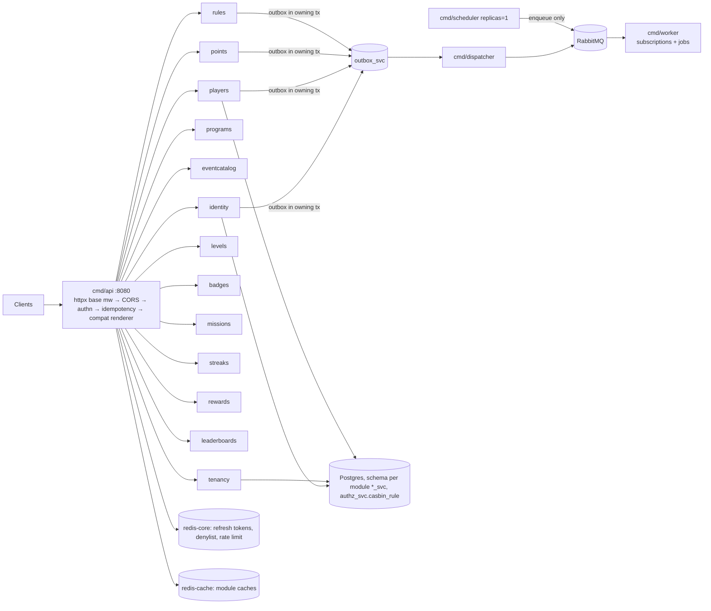

# 01 — Platform & Cross-Cutting Concerns (Laravel → Go blueprint)

> Scope: everything in LevelUpOS that is not a single domain's business logic — request lifecycle, auth, authorization, multi-tenancy, shared kernel, response/error contracts, observers and events, queues, scheduling, caching, admin panel, database conventions, seeds, config, tests, API collection, observability.
> Domain behaviour is in `02-identity-tenancy`, `03-players-programs-events`, `04-points-levels-badges`, `05-missions-streaks-rewards-leaderboards`, `06-rules-engine-activity-pipeline`.
> Target architecture: `/Users/saba/Projects/golang_advanced_blueprint` (modkit modules, schema-per-module `<name>_svc`, `contracts/` with versioned topics, transactional outbox, casbin in `platform/authz`, `platform/authn` JWT, `httpx` RFC 9457, `errs` kinds, Idempotency-Key middleware, dual Redis, jobs vs events, keyset cursors in `shared/pagination`).
>
> Citations are `path:line` relative to the Laravel repo root unless prefixed with `blueprint:`. "Inferred" marks statements derived from framework defaults rather than code in this repo (the repo has no `vendor/`, so `artisan route:list` could not be run).

---

## 1. System overview

LevelUpOS is a **multi-tenant gamification backend**. A *tenant* (customer organisation) registers, gets an owner user, and then uses the REST API (bearer token) to manage *players* (the tenant's end-users, identified by the tenant's own `external_id`) and gamification mechanics: points wallets and transactions, XP levels, badges, missions, streaks, rewards, leaderboards, programs (campaign containers), an event catalogue (predefined + custom events) and a rules engine (`trigger_event` + conditions → actions). A separate React frontend (referenced in `LEADERBOARDS_IMPLEMENTATION.md:99-117`, "React Query hooks") consumes the API. A Filament admin panel exists but currently manages only event categories.

### 1.1 Tech stack

| Concern | Laravel today | Evidence | Go blueprint replacement |
|---|---|---|---|
| Runtime | PHP ^8.2 (8.5 per CLAUDE.md), Laravel 12 | `composer.json:9-11` | Go 1.26, `cmd/api` (chi) |
| API auth | **laravel/passport ^13.4**, guard `api` (`driver: passport`) | `config/auth.php:44-47`, all `routes/api/v1/*.php` use `auth:api` | `platform/authn` (HS256 JWT access + opaque Redis refresh) |
| Unused auth | laravel/sanctum ^4 (installed, never used) | `config/sanctum.php`, no `auth:sanctum` anywhere | drop |
| Authorization | spatie/laravel-permission ^6.24 (roles only, no permissions) + Laravel Policies | `config/permission.php`, `app/Providers/DomainServiceProvider.php:135-149` | `platform/authz` casbin, per-module `contracts/permissions.go` |
| DTO / validation | spatie/laravel-data ^4.18 | `app/Domain/**/DataTransferObjects` | transport DTOs + `validate` tags + `httpx.Decode` |
| Queue | Redis via laravel/horizon ^5.43 (`QUEUE_CONNECTION` default `redis`) | `config/queue.php:16`, `config/horizon.php` | RabbitMQ: `platform/jobs` + `platform/bus` |
| Admin UI | filament/filament ^4 at `/admin` | `app/Providers/Filament/AdminPanelProvider.php:27-59` | none (API-only) — see §12 |
| Observability | laravel/nightwatch ^1.22 (installed, not configured), Monolog `stack→single` | `composer.json:13`, `config/logging.php:21,55-62` | `platform/telemetry` (OTel traces, Prometheus on admin port, zap) |
| DB | MySQL in `.env.example:23`; framework default `sqlite`; tests sqlite `:memory:` | `config/database.php:19`, `phpunit.xml:26-27` | PostgreSQL 16+ via PgBouncer, goose migrations |
| Cache / session | `database` store and `database` sessions | `config/cache.php:18`, `config/session.php:21` | `redis.Core` (durable) + `redis.Cache` (LRU) |
| Tests | Pest 4, 287 feature tests | `tests/Feature/Api/V1/*` | Go unit + testcontainers integration + e2e |

### 1.2 Component diagram (current Laravel)

```mermaid
flowchart LR
  subgraph Clients
    FE[React frontend / API clients<br/>Bearer token]
    ADM[Platform admin browser<br/>session cookie]
  end
  subgraph Laravel["Laravel 12 app (single process)"]
    MW[Global middleware<br/>HandleCors, TrimStrings, ConvertEmptyStringsToNull]
    API["/api/v1/* routes<br/>auth:api (Passport)"]
    CTRL[Controllers Api\V1<br/>authorize() → Policies]
    DTO[spatie/laravel-data DTOs<br/>validation + serialization]
    ACT[Actions<br/>DB::transaction + event()]
    REPO[Repositories<br/>AbstractRepository]
    ELO[Eloquent models<br/>TenantScope + Observers]
    EVT[(51 domain events<br/>NO listeners)]
    FIL[Filament /admin<br/>EventCategory CRUD]
    HZ[Horizon /horizon]
  end
  DB[(MySQL<br/>domain + oauth_* + permission + cache/sessions/jobs tables)]
  RD[(Redis<br/>Horizon queue only)]
  FE --> MW --> API --> CTRL --> DTO
  CTRL --> ACT --> REPO --> ELO --> DB
  ACT -.dispatch.-> EVT
  ADM --> FIL --> ELO
  ADM --> HZ --> RD
```

### 1.3 Target shape (Go)



Module names above are a proposal; final module boundaries are set in docs 02–06.

---

## 2. Request lifecycle

### 2.1 Bootstrap and routing

| Item | Behaviour | Citation |
|---|---|---|
| Route files | `web`, `api`, `console`, health `/up` | `bootstrap/app.php:9-14` |
| API prefix | Laravel applies `api` URI prefix and `api` middleware group to `routes/api.php` (inferred, framework default) | `bootstrap/app.php:11` |
| Version auto-loading | `$apiVersions = ['v1']`; for each, every `routes/api/v1/*.php` file becomes `Route::prefix(<filename>)->name("<filename>.")`, wrapped in `prefix('v1')->name('api.v1.')` | `routes/api.php:21-37` |
| Final URL pattern | `/api/v1/<file-basename>/<route>` e.g. `routes/api/v1/wallets.php` `post('/credit')` → `POST /api/v1/wallets/credit` | `routes/api.php:30-35` |
| Route names | `api.v1.<file>.<name>`; anomalies: leaderboards double-prefixed (`api.v1.leaderboards.leaderboards.index`, `routes/api/v1/leaderboards.php:10`), wallets `api.v1.wallets.wallet.show` (`routes/api/v1/wallets.php:10`), users via `apiResource('/')->parameters([''=>'user'])` (`routes/api/v1/users.php:9`, generated names not verifiable without vendor). Names are not used by any code; irrelevant for Go. | |
| Web routes | `GET /` → `welcome` view | `routes/web.php:5-7` |
| Exception config | empty — no custom rendering/reporting | `bootstrap/app.php:18-20` |
| Middleware config | only `append(HandleCors::class)` | `bootstrap/app.php:15-17` |

**Global middleware (inferred, Laravel 12 defaults)**: `InvokeDeferredCallbacks`, `TrustProxies`, `HandleCors`, `PreventRequestsDuringMaintenance`, `ValidatePostSize`, `TrimStrings` (except `password`, `password_confirmation`, `current_password`), `ConvertEmptyStringsToNull`. `HandleCors` is already in the default global stack, so the explicit append at `bootstrap/app.php:16` registers it twice (harmless; the middleware de-dups by response headers). **`api` group (inferred)**: only `SubstituteBindings` — **no `throttle:api`** (Laravel 11+ does not add it unless `throttleApi()` is called; it is not).

Input normalisation that clients may unknowingly rely on: string inputs are trimmed and `""` becomes `null` before validation (TrimStrings / ConvertEmptyStringsToNull). The Go `httpx.Decode` does not do this; see §16.

### 2.2 Complete route inventory (97 routes incl. PATCH)

All under `/api/v1`, all `auth:api` unless marked **public**. "Ability" is the policy method invoked (`$this->authorize`), `—` = no authorization call.

| File | Method & path | Ability (policy) |
|---|---|---|
| ping.php:7 | GET `/ping` **public** → `{status:"ok",message,timestamp(ISO8601),version:"v1"}` | — |
| auth.php:8-9 | POST `/auth/register`, POST `/auth/login` **public** | — |
| auth.php:11-15 | POST `/auth/logout`, GET `/auth/me`, POST `/auth/refresh` | — |
| users.php:9 | GET/POST `/users`, GET/PUT/PATCH/DELETE `/users/{user}` (implicit model binding) | User: viewAny/create/view/update/delete |
| players.php:9-14 | GET/POST `/players`, GET `/players/external/{externalId}`, GET/PUT/DELETE `/players/{player}` | Player: viewAny/create/view/update/delete |
| programs.php:9-26 | CRUD `/programs`, POST `/{p}/activate|pause|end`, GET `/{p}/stats`, GET/POST `/{p}/players`, DELETE `/{p}/players/{player}` | Program: CRUD + activate/pause/end; stats & players → view; add/remove player → update |
| wallets.php:9-22 | GET `/players/{player}/wallet`, GET `/players/{player}/wallet/transactions`, POST `/credit`, `/debit`, `/transfer` | Wallet: view, viewTransactions, credit, debit(model), transfer |
| badges.php:9-17 | CRUD `/badges`, POST `/award`, DELETE `/players/{player}/badges/{badge}`, GET `/players/{player}` | Badge: CRUD, award(model), revoke(model), player list → viewAny |
| levels.php:9-16 | CRUD `/levels`, POST `/xp`, GET `/players/{player}` | Level: CRUD, grantXp, player → viewAny |
| missions.php:9-18 | CRUD `/missions`, POST `/start`, POST `/progress`, POST `/players/{p}/missions/{m}/complete`, GET `/players/{p}` | Mission: CRUD, start; **progress → none** (`MissionController.php:130-139`); complete → viewAny; player list → viewAny |
| streaks.php:9-18 | CRUD `/streaks`, POST `/activity`, POST `/players/{p}/streaks/{s}/reset`, GET `/players/{p}/streaks/{s}`, GET `/players/{p}` | Streak: CRUD, recordActivity; **reset → viewAny**; reads → viewAny |
| rewards.php:9-17 | CRUD `/rewards`, POST `/claim`, POST `/players/{p}/rewards/{r}/redeem`, GET `/players/{p}` | Reward: CRUD, claim; **redeem → viewAny**; list → viewAny |
| rules.php:9-18 | CRUD `/rules`, POST `/{rule}/version`, GET `/{rule}/executions`, POST `/execute` | Rule: CRUD, version → update, executions → view, execute |
| events.php:9-15 | GET/POST `/events`, GET `/events/predefined`, GET `/events/custom`, GET/PUT/DELETE `/events/{event}` | Event: viewAny/create/view/update/delete |
| leaderboards.php:9-28 | GET/POST `/leaderboards`, GET/PUT/DELETE `/{lb}`, GET `/{lb}/entries?limit&offset`, GET `/{lb}/players/{player}` | Leaderboard: **index → none** (`LeaderboardController.php:25-32`), create/view/update/delete |

Route-parameter typing: controllers declare `int $id` (e.g. `PlayerController.php:53`). Inferred: a non-numeric segment (`/players/abc`) raises a PHP `TypeError` → HTTP 500, not 404. There are **no tenant routes** even though `TenantPolicy` and Tenant actions exist (`app/Domain/Tenant/*`).

### 2.3 Health and ping

| Endpoint | Behaviour | Citation |
|---|---|---|
| `GET /up` | Laravel built-in health page (HTML, 200 if boot succeeds; fires `DiagnosingHealth`) — no DB/Redis checks (inferred) | `bootstrap/app.php:13` |
| `GET /api/v1/ping` | public JSON, no dependencies touched | `routes/api/v1/ping.php:7-14` |

### 2.4 CORS

`config/cors.php:18-32`: paths `api/*`, `sanctum/csrf-cookie`; methods `*`; **origins `*`**; headers `*`; no exposed headers; `max_age` 0; `supports_credentials` false. Git history: commit `cbd4e69` had an allow-list (`FRONTEND_URL`, `TEMP_FRONTEND_URL`, paths `login`, `logout`, `oauth/*`, max_age 3600); HEAD `9b84e42` replaced it with the permissive default. Bearer-token auth makes `*` workable, but it is a decision to confirm (§20).

### 2.5 Rate limiting

None. No `throttle` middleware on any route, no `RateLimiter::for` definitions (grep: no matches). Login and register are unthrottled.

### 2.6 `EnsurePlatformAdmin` middleware

`app/Http/Middleware/EnsurePlatformAdmin.php:18-31`: if no user → pass (so the login page renders); if user and **not** `isPlatformAdmin()` → `abort(403, 'Access denied. Platform Admin role required.')`. Used **only** in the Filament panel middleware stack (`AdminPanelProvider.php:55`), not on API routes.

### 2.7 Go blueprint mapping

- Mount every module under `/api/v1` (composition root already does this — `blueprint: CLAUDE.md` "Routes are mounted under /api/v1"). Each module's `RegisterHTTP` owns its path prefix (`/players`, `/wallets`, …); reproduce the exact paths in §2.2, including the odd ones (`/wallets/players/{player}/wallet`, `/badges/players/{player}/badges/{badge}`), because the React client and Bruno collection use them.
- Ping: keep `GET /api/v1/ping` (public) with the identical body. Health: blueprint already serves `GET /health` (`blueprint: internal/app/lifecycle.go:64`) aggregating `Module.Health`; also alias `GET /up` → 200 for any existing load-balancer probe.
- CORS: blueprint has **no CORS middleware** → add `platform/httpx` CORS (e.g. `go-chi/cors`, needs an ADR per ADR-0009) configured from `HTTP_CORS_ALLOWED_ORIGINS` (default `*`), methods `*`, headers `*` + expose `Idempotency-Key`/`X-Request-Id` if wanted, credentials false.
- Rate limiting: blueprint `httpx.RateLimit` (per principal or IP, `HTTP_RATE_LIMIT_PER_MINUTE`, fails open) is new behaviour; set generously for v1 and add a stricter per-IP limit on `/auth/login` and `/auth/register`.
- Path params: validate numeric ids in transport; non-numeric → 404 (`errs.NotFound`), not 500.
- `EnsurePlatformAdmin`: becomes a casbin permission (`platform:admin_access`) checked by any future admin routes (§12).

---

## 3. Authentication

### 3.1 Which mechanism is live

| Question | Answer | Citation |
|---|---|---|
| Default guard | `web` (session) — `AUTH_GUARD` unset | `config/auth.php:16-19` |
| API guard | `api` → `driver: passport`, provider `users` (Eloquent `App\Domain\User\Models\User`) | `config/auth.php:44-47,67-71` |
| Routes | every protected API route uses `auth:api` (Passport). No route uses `auth:sanctum` | `routes/api/v1/*.php` |
| Passport config | `guard: web` (used only for Passport's own OAuth UI routes), keys from `PASSPORT_PRIVATE_KEY`/`PASSPORT_PUBLIC_KEY` or `storage/oauth-*.key`; no `token_expiration` key exists | `config/passport.php:16,29-31` |
| Token issuance | **Personal Access Tokens** `$user->createToken('auth_token')` (Passport personal access client, provider `users`) | `RegisterUserAction.php:57`, `LoginUserAction.php:35`, `AuthController.php:76` |
| Token format | Passport PAT = RS256-signed JWT whose `jti` is the `oauth_access_tokens.id` row; every request re-checks the row's `revoked` flag (inferred, Passport behaviour) | `database/migrations/2025_12_29_221514_*` |
| Expiry | No `Passport::tokensExpireIn/personalAccessTokensExpireIn` call anywhere → Passport default **1 year** (inferred). Response field `expires_in` is `config('passport.token_expiration', 525600)` → always **525600** (= minutes in a year, although OAuth `expires_in` is seconds) | `LoginUserAction.php:42`, `AuthController.php:81` |
| Refresh | `POST /auth/refresh` with a valid bearer: revokes current token, issues a new PAT. No OAuth refresh tokens are ever issued (`oauth_refresh_tokens` unused) | `AuthController.php:69-84` |
| Logout | revokes the current token only | `LogoutUserAction.php:15-21` |
| OAuth clients | One "Personal Access Client" created by `PassportClientsSeeder` (generates keys if missing via `passport:keys --force`) | `database/seeders/PassportClientsSeeder.php:18-78` |
| OAuth flows | none exposed (no `Passport::routes`-style OAuth endpoints used by clients; CORS once listed `oauth/*`) | |
| Guard switching | `auth:api` middleware calls `shouldUse('api')`, so `auth()->user()` inside the request (TenantScope, observers) resolves the Passport user (inferred, framework behaviour) | `app/Domain/Shared/Scopes/TenantScope.php:18` |
| Session auth | `web` guard used only by Filament `/admin` and Horizon `/horizon` | `AdminPanelProvider.php:45-58`, `config/horizon.php:75` |
| Sanctum | installed, config present, `personal_access_tokens` table migrated, never used | `config/sanctum.php`, `2025_12_29_214249_*` |

Auth response DTO `AuthTokenData` = `{access_token, token_type:"Bearer", expires_in:int, user:UserData}` (`app/Domain/Auth/DataTransferObjects/AuthTokenData.php:12-17`). Register returns it with **201** (`AuthController.php:29`), login and refresh with 200.

### 3.2 Go blueprint mapping

- `platform/authn` issues **HS256** access JWTs (`sub`, `jti`, `iat`, `exp`, `rids` role ids) and opaque rotating refresh tokens in redis-core (`blueprint: internal/platform/authn/jwt.go:47-68`, `store.go`). The identity module owns credentials (doc 02).
- **Breaking differences to manage:**
  1. Passport RS256 tokens cannot be verified by the Go issuer → every client must re-login at cutover, *or* add a transitional verifier that accepts legacy RS256 tokens (public key from `PASSPORT_PUBLIC_KEY`) and checks `oauth_access_tokens.revoked` copied into identity until the 1-year tokens are retired. Recommendation: forced re-login (tokens are short-lived in Go anyway), communicated as a release note.
  2. Access TTL changes from 1 year to `JWT_ACCESS_TTL` (15 m default). Existing clients never refresh; they would start getting 401 after 15 minutes. Compatibility options: (a) keep `POST /auth/refresh` accepting the **access token** as bearer (current contract) and returning a new access token, plus *also* return `refresh_token` for new clients; (b) set `JWT_ACCESS_TTL` long for v1. Recommended: (a) plus a moderate TTL (e.g. 1 h) and document the new `refresh_token` field (additive, non-breaking).
  3. `expires_in`: emit seconds (`AccessTTL.Seconds()`) — the current 525600 is wrong for both units' semantics; flag to client team (open question §20).
- Logout → `RefreshStore.Deny(jti, remaining)` + `RevokeAll` for the family (blueprint pattern).
- Principal must carry **TenantID** (blueprint `authz.Principal` already has `TenantID string`, `blueprint: internal/platform/authz/authz.go:22-26`) — add a `tid` claim in the JWT so tenant resolution needs no DB read. Changing a user's tenant then requires token revocation (rare; tenant is set once at registration).
- Drop: `oauth_*` tables, Passport keys, `personal_access_tokens`, Sanctum config, `password_reset_tokens` (no reset flow exists), `sessions`.

---

## 4. Authorization foundation

### 4.1 Mechanism

| Piece | Behaviour | Citation |
|---|---|---|
| Roles store | spatie/laravel-permission tables (`roles`, `permissions`, `model_has_roles`, `model_has_permissions`, `role_has_permissions`); teams disabled; wildcard disabled; cache 24 h key `spatie.permission.cache` in the default cache store | `config/permission.php:31-72,134,169,179-201` |
| Permissions | **none defined** — no `Permission::create`, no `givePermissionTo`, no `->can('perm')`; only roles are used | grep |
| Role enum | `owner`, `super_admin`, `platform_admin`, `admin`, `program_manager`, `developer` | `app/Domain/User/Enums/Role.php:9-14` |
| Administrative roles | owner, super_admin, platform_admin, admin | `Role.php:61-69` |
| Hierarchy (unused by checks) | owner 1, super_admin 2, platform_admin 3, admin 4, program_manager 4, developer 5; `outranks()` | `Role.php:82-100` |
| Role seeding | every enum case `findOrCreate(value, 'web')` | `database/seeders/RoleSeeder.php:18-20` |
| Role helpers | `isOwner/isSuperAdmin/isPlatformAdmin/isAdmin/isProgramManager/isDeveloper`, `isAdministrative()` = hasAnyRole(admin set), `setAsPlatformAdmin()` | `app/Domain/User/Traits/HasRoleHelpers.php:23-63` |
| Role assignment in app code | only `RegisterUserAction` assigns `owner` | `RegisterUserAction.php:55` |
| Policies | 13 policies registered with `Gate::policy` in a loop | `app/Providers/DomainServiceProvider.php:135-149,181-186` |
| Gate abilities | only `viewHorizon` → `isPlatformAdmin()` | `app/Providers/HorizonServiceProvider.php:30-35` |
| Super-user bypass | **none** — no `Gate::before`; platform admins get no special treatment in policies | grep |
| Guard subtlety | roles are created for guard `web`; `hasRole('x')` without guard matches any guard (spatie behaviour, inferred); tests create roles for both `web` and `api` because `Passport::actingAs` switches the default guard and `assignRole` resolves the role by default guard (`tests/Feature/Api/V1/PlayerControllerTest.php:16-19`) | |
| Users with no role | pass every non-administrative ability (only tenant equality is checked) | policies below |

### 4.2 Consolidated role table

| Role (value) | Label | Administrative? | Who gets it today | Notes |
|---|---|---|---|---|
| `owner` | Owner | yes | self-registration (`RegisterUserAction.php:55`), `TenantsSeeder.php:76-78` | also `tenants.owner_id` ownership checked separately by TenantPolicy |
| `super_admin` | Super Admin | yes | seed (`UsersSeeder.php:50-54`) | only distinguished in `TenantPolicy::manageSettings` |
| `platform_admin` | Platform Admin | yes | seed: hard-coded user with **no tenant** (`UsersSeeder.php:111-119`) | gates Filament + Horizon; inside the API it is just "administrative" and actually breaks (§5.4) |
| `admin` | Admin | yes | seed | |
| `program_manager` | Program Manager | no | seed | behaves exactly like a role-less tenant member |
| `developer` | Developer | no | seed | same as program_manager |

### 4.3 Consolidated ability matrix (every policy method)

Legend: **T** = `user.tenant_id === resource.tenant_id`; **T?** = `user.tenant_id !== null`; **A** = `isAdministrative()`; **✓** = always true.

| Policy (file) | Abilities |
|---|---|
| PlayerPolicy (`app/Domain/Player/Policies/PlayerPolicy.php`) | viewAny T?, view T, create T?, update T, delete T∧A |
| ProgramPolicy (`app/Domain/Program/Policies/ProgramPolicy.php`) | viewAny T?, view T, create T?, update T, delete T∧A, activate T∧A, pause T∧A, end T∧A |
| WalletPolicy (`app/Domain/Mechanics/Points/Policies/WalletPolicy.php`) | viewAny T? (unused), view T, credit T?, debit T, transfer T?, viewTransactions T |
| BadgePolicy | viewAny T?, view T, create T?∧A, update T∧A, delete T∧A, award T, revoke T∧A |
| LevelPolicy | viewAny T?, view T, create T?∧A, update T∧A, delete T∧A, grantXp T? |
| MissionPolicy | viewAny T?, view T, create T?∧A, update T∧A, delete T∧A, start T? |
| StreakPolicy | viewAny T?, view T, create T?∧A, update T∧A, delete T∧A, recordActivity T? |
| RewardPolicy | viewAny T?, view T, create T?∧A, update T∧A, delete T∧A, claim T? |
| RulePolicy | viewAny T?, view T, create T?∧A, update T∧A, delete T∧A, execute T? |
| EventPolicy (`app/Domain/Event/Policies/EventPolicy.php`) | viewAny T?, view T (so predefined/null-tenant events are **not** viewable by id), create T?, update: predefined → T∧A else T, delete: predefined → never, else T∧A |
| LeaderboardPolicy | viewAny ✓, view T, create ✓, update T, delete T (compares `tenant_id` directly, no accessor) |
| UserPolicy (`app/Domain/User/Policies/UserPolicy.php`) | viewAny ✓, view self, create ✓, update self, delete self |
| TenantPolicy (no routes) | viewAny A, view A ∨ owner ∨ member, create A, update A ∨ owner, delete A ∨ owner, inviteUsers owner ∨ (member∧A), manageSettings owner ∨ (member∧super_admin) |
| Gate `viewHorizon` | platform_admin (non-local envs only) |
| Filament panel | `EnsurePlatformAdmin` → platform_admin |

### 4.4 Go blueprint mapping — casbin catalogue split per module

The Laravel model is effectively **two tiers inside a tenant** ("member" vs "administrative") plus tenant equality, plus a platform tier that is barely implemented. Proposed mapping:

- Casbin model stays plain RBAC (`blueprint: internal/platform/authz/model.conf`): `role:{id}` → `module:action`. Roles are global (spatie teams = false), so no casbin domains are needed; **tenant equality is not a casbin concern** — it is enforced by the tenant filter in every repository plus a resource check in the service (`resource.TenantID == principal.TenantID`), per blueprint constraint 3 (ownership in service, `PRD §7.6`).
- Seed a role catalogue (identity module Go migration) with the 6 roles; give every user at least one role. Because Laravel lets **role-less users** act as members (users created via `POST /users` get no role), either backfill a `member` role or treat program_manager/developer as the member grant set and assign `developer`/`member` by default (open question §20).
- Each module declares `contracts/permissions.go`; actions marked (A) are granted to owner/super_admin/platform_admin/admin only; the rest to all six roles.

| Module | Permission keys (action → Laravel ability; A = admin-only today) |
|---|---|
| `identity` | `identity:users_view_any`(✓), `identity:users_create`(✓ — see risk R3), `identity:users_view_self`, `identity:users_update_self`, `identity:users_delete_self` |
| `tenancy` | `tenancy:view_any`(A), `tenancy:view`, `tenancy:create`(A), `tenancy:update`(A/owner), `tenancy:delete`(A/owner), `tenancy:invite_users`, `tenancy:manage_settings` |
| `players` | `players:view_any`, `players:view`, `players:create`, `players:update`, `players:delete`(A) |
| `programs` | `programs:view_any`, `programs:view`, `programs:create`, `programs:update`, `programs:delete`(A), `programs:activate`(A), `programs:pause`(A), `programs:end`(A) |
| `points` | `points:view_wallet`, `points:view_transactions`, `points:credit`, `points:debit`, `points:transfer` |
| `levels` | `levels:view_any`, `levels:view`, `levels:create`(A), `levels:update`(A), `levels:delete`(A), `levels:grant_xp` |
| `badges` | `badges:view_any`, `badges:view`, `badges:create`(A), `badges:update`(A), `badges:delete`(A), `badges:award`, `badges:revoke`(A) |
| `missions` | `missions:view_any`, `missions:view`, `missions:create`(A), `missions:update`(A), `missions:delete`(A), `missions:start`, **new** `missions:progress` (today unchecked), **new** `missions:complete` (today = view_any) |
| `streaks` | `streaks:view_any`, `streaks:view`, `streaks:create`(A), `streaks:update`(A), `streaks:delete`(A), `streaks:record_activity`, **new** `streaks:reset` (today = view_any) |
| `rewards` | `rewards:view_any`, `rewards:view`, `rewards:create`(A), `rewards:update`(A), `rewards:delete`(A), `rewards:claim`, **new** `rewards:redeem` (today = view_any) |
| `leaderboards` | `leaderboards:view_any`, `leaderboards:view`, `leaderboards:create`, `leaderboards:update`, `leaderboards:delete` |
| `rules` | `rules:view_any`, `rules:view`, `rules:create`(A), `rules:update`(A, also versioning), `rules:delete`(A), `rules:execute` |
| `eventcatalog` | `events:view_any`, `events:view`, `events:create`, `events:update`, `events:update_predefined`(A), `events:delete`(A), `events:categories_manage`(platform) |
| platform (owned by identity or a thin `platformadmin` module) | `platform:admin_access` (Filament equivalent), `platform:queue_dashboard` (Horizon equivalent), `platform:cross_tenant_read` |

The "new" keys should initially be granted to exactly the roles that pass today (all members) so behaviour is unchanged; product can then tighten them. Boot-time catalogue verification (`blueprint: internal/platform/authz/catalogue.go`) guarantees drift is caught.

---

## 5. Multi-tenancy (critical)

### 5.1 How the tenant is resolved

There is **no tenant middleware, header, subdomain or path segment**. The tenant is purely `auth()->user()->tenant_id` of the authenticated user (`users.tenant_id`, nullable, FK → tenants, `cascadeOnDelete`, `2025_12_29_230508_add_tenant_id_to_users_table.php`). Tenant is set at registration (`RegisterUserAction.php:49-51`) or by whoever creates the user (`CreateUserData.tenant_id`, client-supplied, `app/Domain/User/DataTransferObjects/CreateUserData.php:31-32`).

### 5.2 `TenantScope` — exact semantics

```php
// app/Domain/Shared/Scopes/TenantScope.php:16-24
if (auth()->check() && auth()->user()->tenant_id) {
    $builder->where(function ($q) use ($model) {
        $q->where($model->getTable().'.tenant_id', auth()->user()->tenant_id)
          ->orWhereNull($model->getTable().'.tenant_id');
    });
}
```

| Condition | Effect |
|---|---|
| Authenticated user with non-null `tenant_id` | every query on a scoped model gets `AND (table.tenant_id = :tid OR table.tenant_id IS NULL)` |
| Authenticated user with `tenant_id` NULL (e.g. seeded platform admin) | **no filter at all** → sees every tenant's rows |
| Unauthenticated context (queue jobs, console, seeders, `/register`) | **no filter** |
| `withoutGlobalScope` | never used (grep) |
| Raw validation rules (`exists:players,id`, `Unique(...)`) and `DB::` queries | **bypass the scope** (e.g. `ProgramController.php:239-242`) |
| Route-model binding | only `User` uses implicit binding and `User` is not scoped |

The `OR tenant_id IS NULL` branch only matters where the column is nullable: **`events`** (made nullable by `2026_01_01_162111_make_tenant_id_nullable_in_events_table.php`) and **`event_categories`** (`2026_01_01_095125_*:16`). Those NULL rows are *global* rows shared by all tenants (predefined events seeded by `PredefinedEventsSeeder.php` with `tenant_id => null`; categories created in Filament, which never sets a tenant).

### 5.3 Models using the scope (registered in each model's `booted()`)

| Scoped (19) | tenant_id nullable? |
|---|---|
| Player, Program, Wallet, PointTransaction, Badge, PlayerBadge, Level, PlayerLevel, Mission, PlayerMission, Streak, PlayerStreak, Reward, PlayerReward, Leaderboard, Rule, RuleExecution | NOT NULL |
| Event, EventCategory | **nullable** (global rows) |

Not scoped: `User`, `Tenant` (so `GET /users` lists **all users of all tenants** — `UserController.php:29-36` + `UserPolicy::viewAny` ✓), `ProgramPlayer` pivot (`program_player` has no `tenant_id` column).

### 5.4 Tenant stamping on write (observers) and the platform-admin case

Observers set `tenant_id = auth()->user()->tenant_id` on `creating` when authenticated and not already set (§8). Consequences:
- Cross-tenant reads return **404**, not 403, because `find()` is scoped first; tests assert this (`tests/Feature/Api/V1/PlayerControllerTest.php:210-219,365-374`). Policies are a second line.
- **Platform admin "bypass" is accidental and broken.** No `Gate::before`; the seeded platform admin has `tenant_id = NULL`. `User::getTenantId(): int` (`app/Domain/User/Traits/HasUserAccessors.php:23-26`) returns `null` → PHP `TypeError` → **HTTP 500** on every policy that calls it (all except Leaderboard/User). `GET /leaderboards` has no authorize and the scope is off, so a tenant-less user sees all tenants' leaderboards. Creating records as a tenant-less user would insert `tenant_id NULL` → NOT NULL violation (500), except `events` where it would create a *global* event.

### 5.5 Semantics to reproduce in Go (normative)

1. **Tenant source**: `authz.Principal.TenantID` from a `tid` JWT claim (identity module). Never from the request body/header for tenant users.
2. **Read filter**: every repository method on a tenant-owned table takes the tenant from context (`PRD R31`: "Repositories take tenant from context, never from a global") and adds `tenant_id = $tid`. For `events` and `event_categories` only: `(tenant_id = $tid OR tenant_id IS NULL)`.
3. **Cross-tenant access** → `errs.NotFound` (404), preserving test expectations.
4. **Write stamping**: services set `tenant_id = principal.TenantID` (and `created_by`/`awarded_by` = principal.UserID where Laravel observers did) in the domain constructor. Reject (`errs.PermissionDenied`) when the principal has no tenant and the route is tenant-scoped — do **not** reproduce "no tenant ⇒ see everything".
5. **Platform administrators**: explicit `platform:*` permissions on explicit admin endpoints; cross-tenant reads only through those endpoints with an explicit `tenant_id` parameter. Decide with product (§20).
6. **Async context**: workers have no principal — every event/job payload must carry `tenant_id` (and `player_id`), and handlers pass it explicitly to repositories. This replaces Laravel's "no filter in queue context".
7. **Validation existence checks** (e.g. `player_id` exists) must be tenant-filtered lookups through the owning module's `Reader`, not global existence checks.
8. Uniqueness: today slugs are **globally** unique (§13); Go should make them `UNIQUE (tenant_id, slug)` (behaviour-widening, safe).
9. Defence in depth (optional): Postgres RLS on `tenant_id` with `SET LOCAL app.tenant_id` inside `postgres.InTx` — not required by the blueprint, but cheap insurance; note it conflicts with PgBouncer transaction pooling only if set outside the tx.

---

## 6. Shared kernel and layering

### 6.1 Inventory

| Artifact | What it is | Used? | Citation |
|---|---|---|---|
| `AbstractAction` | `transaction(callable)` → `DB::transaction` | **No** class extends it (actions call `DB::transaction` directly in 14 actions) | `app/Domain/Shared/Abstracts/AbstractAction.php:14-17` |
| `ActionInterface` | `execute(): mixed` | not implemented anywhere | `app/Domain/Shared/Contracts/ActionInterface.php` |
| `RepositoryInterface` | find/findOrFail/all/paginate(15)/create/update/delete | base of all 20 repo interfaces | `app/Domain/Shared/Contracts/RepositoryInterface.php:11-51` |
| `AbstractRepository` | Eloquent implementation; `paginate()` with **no ORDER BY**; `update()` returns `fresh()`; `delete()` = query-builder delete (soft delete honoured? no — builder `delete()` on a SoftDeletes model *does* soft-delete via the scope's `onDelete` macro, inferred) | yes | `app/Domain/Shared/Abstracts/AbstractRepository.php:13-123` |
| `TenantScope` | §5 | 19 models | `app/Domain/Shared/Scopes/TenantScope.php` |
| `HasUuid` | uuid primary key trait | **unused** | `app/Domain/Shared/Traits/HasUuid.php` |
| `Email`, `Name` value objects | validation-only VOs | **unused** (grep) | `app/Domain/Shared/ValueObjects/*.php` |
| `helpers.php` | `domain_path()`, `money_format()` (NumberFormatter en_US) | **unused** | `app/Support/Helpers/helpers.php:5-27` |
| `HasApiResponse` | `{success, message, data?}` / `{success:false, message, errors?}` envelope | **unused** — no controller uses the trait | `app/Support/Traits/HasApiResponse.php:17-88` |
| `Str::slugForTenant` macro | `slug(title)` + `-{tenantId}` | **unused** | `app/Providers/AppServiceProvider.php:23-31` |
| Repository bindings | 20 interface→class binds | yes | `DomainServiceProvider.php:107-128,171-176` |

### 6.2 Layering pattern per domain

`Controller (Api\V1)` → resolves `XxxData` (laravel-data: validation attributes on constructor params, auto-validated from request) → `authorize()` via Policy → `XxxAction::execute(Data)` (business logic, `DB::transaction` for multi-row writes, `event(new …)` inside the transaction) → `XxxRepositoryInterface` (Eloquent) → `Model` (casts, relations, scopes, `HasXxxAccessors` trait of typed getters) → `XxxData::fromModel()` (output DTO, `Lazy` for timestamps/relations) → JSON.

| Laravel layer | Blueprint layer | Notes |
|---|---|---|
| `Http/Controllers/Api/V1/*` | `internal/transport` (chi handlers, DTOs with `validate` tags, swag annotations) | handlers stay thin |
| `DataTransferObjects/Create*/Update*Data` (input) | transport request DTOs + `httpx.Decode` | validation rules port 1:1 to `validate` tags; DB rules (`Unique`, `Exists`) move into the service |
| `DataTransferObjects/*Data` (output) | transport response DTOs (explicit JSON tags) | must reproduce field names and omissions (Lazy, §7.3) |
| Policies | `authz.Enforcer.Authorize` + resource checks in `internal/app` | §4.4 |
| Actions | `internal/app` service methods (one tx per command via `postgres.InTx`, outbox publish inside tx) | |
| Repository interfaces | `internal/ports` (only for cross-module needs) / unexported repo in `internal/repo` | blueprint forbids mocking repos; test against testcontainers |
| Models + accessor traits | `internal/domain` entities (no tags) + unexported GORM models in `internal/repo` with `toDomain/fromDomain` | accessor traits disappear (Go fields are typed) |
| Observers | domain constructors / service code | §8 |
| Exceptions with `render()` | `internal/domain/errors.go` sentinel vars with `errs` kinds + machine code | §7.5 |
| Events (`Domain/*/Events`) | `contracts/` payload structs + versioned topics, published via outbox | §8.3 |
| `DomainServiceProvider` | `module.go` + `internal/app/registry.go` | |

### 6.3 spatie/laravel-data conventions that affect the wire format

- Output DTOs expose `snake_case` property names verbatim (no mappers configured; no `config/data.php`, defaults apply).
- `Lazy::create(...)` properties (e.g. `PlayerData::full_name/created_at/updated_at`, `UserData::tenant/created_at/updated_at`, `app/Domain/User/DataTransferObjects/UserData.php:16-19`) are **omitted from JSON unless explicitly included** (inferred, laravel-data v4 default; no controller calls `->include()`). 18 DTO files use `Lazy`. Consequence: most responses have **no `created_at`/`updated_at`**. Must be verified against a live response before porting (§20).
- Date values that are serialized use laravel-data's default date format (inferred: ISO-8601 `Y-m-d\TH:i:sP`), not Laravel's model default (`…000000Z`).
- `XxxData::from($model)` resolves the magic `fromModel()` creator.

---

## 7. HTTP response contract (what clients actually receive)

### 7.1 There is no uniform envelope

`HasApiResponse` (`{success, message, data, errors}`) is dead code. Actual shapes, by endpoint family:

| Shape | Where | Example citation |
|---|---|---|
| **Bare object** (DTO) | show/store/update for players, programs, wallets, badges, levels, missions, streaks, rewards, rules, leaderboards, users; auth me/login/refresh | `PlayerController.php:47,63`, `AuthController.php:35-38` |
| **`{"data": {...}}`** | events show/store/update | `EventController.php:73-75,91-93,111-113` |
| **`{"data": [...]}`** (no meta) | `GET /events/predefined`, `GET /events/custom` | `EventController.php:143-145,157-159` |
| **Paginated** `{"data":[...],"links":[...],"meta":{...}}` | every `PaginatedDataCollection` return (players, users, programs, program players, badges, player badges, missions, player missions, streaks, player streaks, rewards, player rewards, rules, rule executions, wallet transactions, events) | `PlayerController.php:29-36` |
| **Bare array** | `GET /levels` (`LevelController.php:38-45`, plain `Collection`), `GET /leaderboards` (`LeaderboardController.php:25-32`, `DataCollection`), `GET /leaderboards/{id}/entries` (repository array) | |
| **Custom objects** | `/programs/{p}/stats` `{total_players, active_players}` (`ProgramController.php:200-204`); `/missions/progress` `{player_mission, completed}` (`MissionController.php:134-137`); `/wallets/transfer` `{message, source_transaction, destination_transaction}` 201 (`WalletController.php:116-120`); `/levels/xp`, `/streaks/activity`, `/rules/execute`, `/missions/.../complete` (domain docs) | |
| **Message only** | logout 200 `{"message":"Successfully logged out."}`; add program player 201 `{"message":"Player added to program successfully."}`; leaderboard delete **200** `{"message":"Leaderboard deleted successfully"}` | `AuthController.php:50-52`, `ProgramController.php:246`, `LeaderboardController.php:105` |
| **204 No Content** | delete for players, users, programs, badges, levels, missions, streaks, rewards, rules, events; badge revoke; program remove player | `PlayerController.php:115`, `BadgeController.php:111` |

Status codes: create → 201 (incl. award badge, start mission, claim reward, credit/debit/transfer, rule version); everything else 200.

### 7.2 Pagination shape (offset-based)

`AbstractRepository::paginate(15)` → `LengthAwarePaginator`; controllers wrap with `PaginatedDataCollection`. Inferred laravel-data v4 output (tests assert `data`, `links`, `meta`, and `meta.per_page`, `ProgramControllerTest.php:597-601`):

```json
{
  "data": [ { ... } ],
  "links": [ {"url": null, "label": "&laquo; Previous", "active": false}, {"url": "...?page=1", "label": "1", "active": true}, ... ],
  "meta": {
    "current_page": 1, "first_page_url": "...?page=1", "from": 1, "last_page": 3,
    "last_page_url": "...?page=3", "next_page_url": "...?page=2", "path": "http://host/api/v1/players",
    "per_page": 15, "prev_page_url": null, "to": 15, "total": 42
  }
}
```

Parameters: `page` (1-based, framework), `per_page` only on `/events` and `/programs` (default 15, **no upper bound**, `EventController.php:58`, `ProgramController.php:63`) and `/programs/{p}/players` (default 20, `ProgramController.php:220`); all other lists are fixed at 15. Leaderboard entries use `limit` (default 100, max 500) + `offset` (`LeaderboardController.php:121-124`). Ordering: base `paginate()` has **no ORDER BY** (non-deterministic); player-scoped lists order by domain timestamp desc (`PointTransactionRepository.php:30`, `PlayerBadgeRepository.php:31`, etc.).

### 7.3 Error shapes

| Source | Status | Body |
|---|---|---|
| Domain exceptions with `render()` (32 classes) | 404 / 409 / 422 | `{"error":"<snake_code>","message":"…", ...extras}` — extras: `requested`,`available` (InsufficientBalance), `max_awards` (BadgeMaxAwardsReached), `current_level` (MaxLevelReached) |
| `InvalidCredentialsException` | 401 | `{"message":"Invalid credentials provided."}` (no `error` key) |
| Validation (`ValidationException` from laravel-data / `$request->validate`) | 422 | `{"message":"The x field is required. (and N more errors)","errors":{"field":["msg", ...]}}` (framework) |
| `authorize()` denial | 403 | `{"message":"This action is unauthorized."}` (framework) |
| Missing/invalid/revoked token | 401 | `{"message":"Unauthenticated."}` (framework) |
| `abort(404, 'Event not found.')` | 404 | `{"message":"Event not found."}` |
| Inline leaderboard 404 | 404 | `{"message":"Leaderboard not found"}` / `{"message":"Player not found in leaderboard"}` |
| `User` route binding miss | 404 | `{"message":"No query results for model [App\\Domain\\User\\Models\\User] 5"}` (framework, leaks class name) |
| Unknown route / wrong method | 404 / 405 | `{"message":"The route … could not be found."}` / method-not-supported message |
| Exceptions without `render()` (`UserNotFound`, `UserAlreadyExists`, `EventNotFound`) & any other throwable | 500 | `{"message":"Server Error"}` when `APP_DEBUG=false`; with debug: `message, exception, file, line, trace` |

JSON rendering of framework errors depends on `Accept: application/json` (`expectsJson()`, inferred). Without it, validation failures redirect (302) and unauthenticated requests try to redirect to a route named `login`, which does not exist (the API one is `api.v1.auth.login`) → likely 500. The Bruno collection sends `Accept: application/json` only on some requests.

Domain error catalogue (machine codes clients may switch on):

| Code | Status | Code | Status |
|---|---|---|---|
| player_not_found | 404 | player_external_id_exists | 409 |
| program_not_found | 404 | program_status_error | 422 |
| tenant_not_found | 404 | tenant_already_exists / tenant_owner_exists | 409 |
| wallet_not_found | 404 | wallet_inactive | 422 |
| insufficient_balance (+requested, available) | 422 | insufficient_points | 422 |
| badge_not_found | 404 | badge_inactive / badge_already_earned | 422 |
| badge_max_awards_reached (+max_awards) | 422 | level_not_found / player_level_not_found | 404 |
| max_level_reached (+current_level) | 422 | mission_not_found | 404 |
| mission_not_available / mission_already_started / mission_not_completed | 422 | streak_not_found | 404 |
| streak_already_recorded | 422 | reward_not_found / player_reward_not_found | 404 |
| reward_not_available / reward_depleted | 422 | rule_not_found | 404 |
| rule_execution_failed | 422 | (no render) UserNotFound, UserAlreadyExists, EventNotFound | 500 |

There is no `try/catch` in any controller; mapping is entirely via exception `render()` methods and framework defaults. `bootstrap/app.php:18-20` adds nothing.

### 7.4 Recommendation: envelope vs RFC 9457

**Recommendation: ship v1 with a wire-compatibility renderer; adopt problem+json for v2 and opt-in.** Reasoning: (1) there is no `{success,data}` envelope to preserve — porting `HasApiResponse` would *break* clients; (2) the React client and any tenant integrations already parse `message`, `errors.{field}[]`, and the `error` codes above (e.g. to show "insufficient balance" with `available`); (3) blueprint `httpx.Error` emits `application/problem+json` with `errors map[string]string` (`blueprint: internal/platform/httpx/errors.go:31-38`), which changes both the content type and the `errors` value type.

Concrete design:
- Extend `shared/errs` (additively, ADR) with an optional machine `Code` string and `Extras map[string]any` (e.g. `errs.New(errs.Invalid, "Insufficient balance for this transaction.").WithCode("insufficient_balance").With("requested", 100).With("available", 40)`).
- Add `platform/httpx/compat.go`: `LegacyError(w, r, err)` renders `application/json` `{"error": code?, "message": detail, "errors": {field: [msg]}?, ...extras}` with the same kind→status mapping as `statusOf`, plus 401 `{"message":"Unauthenticated."}` and 403 `{"message":"This action is unauthorized."}` text for authn/authz failures, and `{"message":"Server Error"}` for 5xx (no detail echo — matches blueprint rule).
- Content negotiation: if `Accept` includes `application/problem+json`, render RFC 9457 instead (lets new clients migrate without a version bump). `/api/v2` defaults to problem+json.
- Keep 422 for business-rule violations (`errs.Invalid`), 409 for duplicates (`errs.AlreadyExists`), 404 for not-found including cross-tenant.
- Validation messages: generate Laravel-style English messages (`The {field} field is required.`) from `validate` tag failures; top-level `message` = first error + `(and N more errors)`.

### 7.5 Pagination recommendation

Blueprint bans OFFSET on unbounded lists and provides `(created_at,id)` keyset cursors (`blueprint: internal/shared/pagination/cursor.go`). For v1 compatibility:
- Keep `page`/`per_page` on existing list endpoints and emit the same `data/links/meta` shape (compute `total` with `COUNT(*)`; tenant-filtered tables are small per tenant), **add a deterministic `ORDER BY id`** (or the domain timestamp desc), and **cap `per_page` at 100**.
- Additionally accept `cursor` (opaque, from `pagination.EncodeCursor`) and return `meta.next_cursor`; document cursor mode as preferred. High-volume lists (`point_transactions`, `rule_executions`) should be cursor-first; total counts there are optional.
- Put the compat paginator in `platform/httpx` (or `shared/pagination` as `OffsetPage` helper) so modules do not each re-implement `meta`.

### 7.6 Go blueprint mapping (summary)

`httpx.Decode` + compat renderer; response DTOs reproduce each endpoint's shape from §7.1 exactly (including the events `data` wrapper and bare arrays). Write golden-file contract tests from recorded Laravel responses (§15).

---

## 8. Observers, events and listeners

### 8.1 Registration

All observers are registered explicitly in `DomainServiceProvider::registerObservers()` (`app/Providers/DomainServiceProvider.php:191-210`). No `#[ObservedBy]` attributes, no `Event::listen`, **no `app/Listeners` directory**, no `EventServiceProvider` (event discovery finds nothing). **No queued listeners, no broadcasting.**

### 8.2 Observer catalogue

All observers hook **only `creating`** (pre-insert); they are tenant/actor stampers and default-setters, not side-effect emitters. They fire only for Eloquent model saves (not query-builder inserts) and only stamp when `auth()->check()`.

| Observer (`app/Observers/…`) | Model | Behaviour on `creating` |
|---|---|---|
| PlayerObserver.php:14-23 | Player | tenant_id ← user.tenant_id if empty; created_by ← user id if empty |
| ProgramObserver.php:14-19 | Program | tenant_id stamp; `created/updated/deleted/restored/forceDeleted` are empty stubs |
| WalletObserver.php:14 | Wallet | tenant_id stamp |
| PointTransactionObserver.php:14-23 | PointTransaction | tenant_id stamp; created_by ← user id |
| BadgeObserver.php:14 | Badge | tenant_id stamp |
| PlayerBadgeObserver.php:14-31 | PlayerBadge | tenant_id stamp; awarded_by ← user id; awarded_at ← now() if empty; earned_count ← 1 if falsy |
| LevelObserver.php:14 | Level | tenant_id stamp |
| PlayerLevelObserver.php:14-23 | PlayerLevel | tenant_id stamp; level_reached_at ← now() if empty |
| MissionObserver / PlayerMissionObserver | Mission / PlayerMission | tenant_id stamp |
| StreakObserver / PlayerStreakObserver | Streak / PlayerStreak | tenant_id stamp |
| RewardObserver / PlayerRewardObserver | Reward / PlayerReward | tenant_id stamp |
| RuleObserver.php:14-23 | Rule | tenant_id stamp; version ← 1 if empty |
| RuleExecutionObserver.php:14-23 | RuleExecution | tenant_id stamp; created_at ← now() (model has `$timestamps=false`) |
| EventObserver.php:14-25 | Event | if `tenant_id === null && is_predefined` → leave NULL (global); else tenant_id stamp |
| *(none)* | Leaderboard, EventCategory, Tenant, User, ProgramPlayer | — `LeaderboardController::store` builds the attribute array without `tenant_id` (`LeaderboardController.php:57-67`) and `LeaderboardRepository::create` is a plain `Leaderboard::create($data)` (`LeaderboardRepository.php:49-52`); with no observer, `leaderboards.tenant_id` (NOT NULL) is never set → inferred 500 on every API create (untested — no leaderboard tests) |

### 8.3 Domain events

52 event classes under `app/Domain/**/Events`; 51 are dispatched with `event(new …)` from Actions (one, `Points\Events\WalletCreated`, is never dispatched). Because nothing listens, **they currently have zero runtime effect** — they are design intent. Most are dispatched **inside** `DB::transaction` closures (e.g. `CreditPointsAction.php:29-58`), which is exactly the outbox placement the blueprint requires.

Proposed topic mapping (producer module owns `contracts/`; payloads must include `tenant_id`, ids, and the numeric facts — never serialized models):

| Laravel event(s) | Topic(s) | Producer module |
|---|---|---|
| Auth: UserRegistered, UserLoggedIn, UserLoggedOut | `identity.user_registered.v1`, `identity.user_logged_in.v1`, `identity.user_logged_out.v1` | identity |
| User: UserCreated/Updated/Deleted | `identity.user_created.v1` / `_updated` / `_deleted` | identity |
| Tenant: TenantCreated/Updated/Deleted | `tenancy.tenant_created.v1` / … | tenancy |
| Player: PlayerCreated/Updated/Deleted | `players.player_created.v1` / … | players |
| Program: ProgramCreated/Updated/Deleted/Activated/Paused/Ended, PlayerAddedToProgram, PlayerRemovedFromProgram | `programs.program_*.v1`, `programs.player_added.v1`, `programs.player_removed.v1` | programs |
| Points: PointsCredited, PointsDebited, PointsTransferred, (WalletCreated) | `points.credited.v1`, `points.debited.v1`, `points.transferred.v1`, `points.wallet_created.v1` | points |
| Levels: LevelCreated, LevelUpdated, XpGained, PlayerLeveledUp | `levels.level_*.v1`, `levels.xp_gained.v1`, `levels.player_leveled_up.v1` | levels |
| Badges: BadgeCreated, BadgeUpdated, BadgeAwarded, BadgeRevoked | `badges.badge_*.v1`, `badges.awarded.v1`, `badges.revoked.v1` | badges |
| Missions: MissionCreated/Updated/Started/ProgressUpdated/Completed | `missions.*.v1` | missions |
| Streaks: StreakCreated/Updated/ActivityRecorded/MilestoneReached/Broken | `streaks.*.v1` | streaks |
| Rewards: RewardCreated/Updated/Claimed/Redeemed | `rewards.*.v1` | rewards |
| Rules: RuleCreated, RuleUpdated, RuleExecuted | `rules.rule_created.v1`, `rules.rule_updated.v1`, `rules.executed.v1` | rules |
| Event catalogue: EventCreated/Updated/Deleted | `eventcatalog.event_*.v1` | eventcatalog |

Only publish topics that have (or soon will have) a subscriber — the outbox costs a row per event. The obvious first consumers are the rules engine (reacting to `*_completed`, `player_leveled_up`, `badges.awarded`, matching the predefined event slugs `level_up`, `badge_earned`, `mission_completed` in `PredefinedEventsSeeder.php`) and leaderboards (if it moves from live queries to projections). See doc 06.

### 8.4 Go blueprint mapping

- Observers → no framework hooks. Put stamping/defaulting in domain constructors (`NewPlayer(tenantID, createdBy, …)`, `NewPlayerBadge(...){AwardedAt: clock.Now(), EarnedCount: 1}`, `NewRule(...){Version: 1}`), fed by the service from `authz.From(ctx)`. Add an arch/unit test per entity asserting `tenant_id` is never zero.
- Events → `s.outbox.Publish(ctx, tx, topic, payload)` inside the same `postgres.InTx` as the write. Subscribers live in consuming modules' `Subscriptions()`; idempotent handlers (at-least-once, unordered).
- Do not port the empty `ProgramObserver` lifecycle stubs.

---

## 9. Queues and Horizon

| Item | Value | Citation |
|---|---|---|
| Default connection | `redis` (`QUEUE_CONNECTION`); `.env.example` still says `database` — `ENV_HORIZON_CHANGES.md:1-14` instructs switching | `config/queue.php:16`, `.env.example:38` |
| Redis queue | queue `default`, `retry_after` 90 s, `after_commit` false | `config/queue.php:67-74` |
| Failed jobs | `database-uuids` → `failed_jobs` table | `config/queue.php:123-127` |
| Horizon | path `/horizon`, middleware `web`, prefix `<app>_horizon:`, wait threshold `redis:default` 60 s, trim recent/completed 60 min, failed 7 days, metrics snapshots 24 | `config/horizon.php:20-141` |
| Supervisor | `supervisor-1`: queue `[default]`, balance `auto` (time strategy), maxProcesses 1 (prod 10, local 3), memory 128 MB, **tries 1**, **timeout 60 s** | `config/horizon.php:184-215` |
| Access | non-local: `viewHorizon` gate → platform_admin (session login via Filament) | `HorizonServiceProvider.php:30-35` |
| Jobs | exactly one: `App\Jobs\ProcessPlayerActivityJob` (`$tries=3`, `$timeout=120`, logs only) — **never dispatched** | `app/Jobs/ProcessPlayerActivityJob.php:14-68` |
| Dev runner | `composer dev` runs `php artisan horizon` | `composer.json:57-60` |
| Docs | `HORIZON_SETUP.md`, `HORIZON_QUICK_REFERENCE.md` describe priority queues (`high-priority`, `low-priority`) and example jobs that do **not** exist in code | `HORIZON_SETUP.md:166-183` |

Conflict to note: the job's `timeout` (120 s) exceeds the supervisor timeout (60 s) and `retry_after` (90 s), so a long run would be killed and/or double-processed.

**Go mapping:** nothing to port functionally. Drop Horizon, `jobs`, `job_batches`, `failed_jobs`. Blueprint equivalents: `platform/jobs` (`jobs.Job{Name, Schedule, Priority}`), worker retry ladder 5s/30s/2m → `<queue>.dlq` mirrored into `outbox_svc.dead_letters`, `task outbox:deadletter:*` / `task rabbit:replay` replacing `queue:retry`/`queue:forget`. RabbitMQ management UI + Prometheus (`rabbitmq_dlq_total`, `outbox_unpublished_age_seconds`) replace the Horizon dashboard (gate with `platform:queue_dashboard` if exposed). If player activity processing is reintroduced (doc 06), model it as an **event** (`players.activity_recorded.v1`) consumed by rules/streaks/missions, or as a state-triggered job published through the outbox as `job.process_player_activity` (R46) — never a direct `Enqueue` from the API.

---

## 10. Scheduling

`routes/console.php:6-8` defines only the stock `inspire` command; no `Schedule::` entries, no `app/Console/Commands`. **Nothing runs on a schedule.** Features that imply schedules but have none: leaderboard `reset_frequency` (daily/weekly/monthly/never; `LEADERBOARDS_IMPLEMENTATION.md:231-233` lists "scheduled job to reset rankings" as future work), streak breaking (computed lazily on next activity, doc 05), reward/player-reward expiry, program start/end dates, Passport token pruning, Horizon snapshotting (`horizon:snapshot` is not scheduled, so Horizon metrics graphs stay empty).

**Go mapping:** `cmd/scheduler` (replicas 1 + Redis lock, enqueue-only) with reconciling jobs declared in module `Jobs()` when product confirms them, e.g. `leaderboards.reset` (sweep from last-successful-run marker), `streaks.expire`, `rewards.expire`, `programs.lifecycle` (auto-activate/end by date), `idempotency.prune`. None is required for parity.

---

## 11. Cache, Redis and sessions

| Use | Store | Citation |
|---|---|---|
| Application caching (`Cache::`, `cache()`, tags) | **none** (grep: zero matches in `app/`) | |
| Permission cache | spatie `spatie.permission.cache`, 24 h, default store (`database`) | `config/permission.php:179-201` |
| Default cache store | `database` (`cache`, `cache_locks` tables) | `config/cache.php:18` |
| Redis | only Horizon/queue; connections `default` (db 0) and `cache` (db 1), phpredis | `config/database.php:145-180` |
| Sessions | `database` driver, 120 min; used only by Filament/Horizon | `config/session.php:21` |
| Locks / atomic ops | none (wallet concurrency handled in DB transactions — doc 04) | |

**Go mapping:** `redis.Core` (noeviction, persistent) for refresh tokens, JWT deny-list, rate limiting, scheduler locks, worker event dedupe; `redis.Cache` (LRU) for optional read caches (leaderboard entries are the only candidate; Laravel computes them live). Casbin policy cache + redis watcher replaces the spatie permission cache. Drop `cache`, `cache_locks`, `sessions`.

---

## 12. Filament admin panel

| Item | Value | Citation |
|---|---|---|
| Panels | one: id `admin`, path `/admin`, default panel, built-in login page, primary colour Amber | `AdminPanelProvider.php:27-34` |
| Discovery | Resources in `app/Filament/Resources`, Pages in `app/Filament/Pages` (dir absent), Widgets in `app/Filament/Widgets` (dir absent) | `AdminPanelProvider.php:35-40` |
| Pages/widgets | Dashboard; `AccountWidget`, `FilamentInfoWidget` | `AdminPanelProvider.php:37-44` |
| Middleware | cookies, session, `AuthenticateSession`, CSRF, bindings, `EnsurePlatformAdmin`; auth middleware `Authenticate` (web guard) | `AdminPanelProvider.php:45-58` |
| Panel access in production | `User` does **not** implement `Filament\Models\Contracts\FilamentUser`; Filament denies panel access to such users outside `local` (inferred, Filament v4 behaviour) → admin panel likely unusable in production | `app/Domain/User/Models/User.php:18` |

Resources (only one):

| Resource | Model | Form | Table | Filters | Actions |
|---|---|---|---|---|---|
| `EventCategoryResource` (`app/Filament/Resources/Domain/Event/Models/EventCategories/EventCategoryResource.php`) | `EventCategory` | name (req, ≤255), slug (req, ≤255, unique ignoring record), description (≤65535), is_active toggle default true (`Schemas/EventCategoryForm.php`) | name (search, sort), slug (search, sort), description (limit 50, search), is_active toggle column (inline edit), created_at (hidden by default) (`Tables/EventCategoriesTable.php`) | TernaryFilter is_active | Edit row; bulk delete; header Create; Delete on edit page |

Because the platform admin has `tenant_id NULL`, the TenantScope is off in the panel (sees all categories), and categories are created with `tenant_id NULL` (global). `event_categories` is not referenced by `events` (no `category_id` column) — categories are currently orphaned data.

**Admin capabilities the Go API (or a separate admin frontend) must cover** (Go is API-only):

| Capability | Today | Proposed Go endpoint (permission) |
|---|---|---|
| Event category CRUD + toggle active + bulk delete | Filament | `/api/v1/admin/event-categories` CRUD (`events:categories_manage`), or drop if categories stay unused |
| Queue monitoring, retry failed jobs | Horizon | RabbitMQ mgmt UI / Grafana + `task` CLI; optional `/api/v1/admin/dead-letters` read-only (`platform:queue_dashboard`) |
| Tenant management (list/create/deactivate/delete) | **nowhere** (policy + actions exist, no routes) | `/api/v1/admin/tenants` (`tenancy:*`, platform) |
| Platform user / role management | **nowhere** (roles only via seeder/tinker) | `/api/v1/admin/users/{id}/roles` (`platform:admin_access`) |
| Predefined event catalogue management | seeder only | `/api/v1/admin/events/predefined` (`events:update_predefined`) |

---

## 13. Database-wide conventions

### 13.1 Survey of migrations

| Convention | Laravel | Go/Postgres recommendation |
|---|---|---|
| Primary keys | `BIGINT UNSIGNED AUTO_INCREMENT` (`$table->id()`) on every domain table; only `oauth_clients` uses uuid; `HasUuid` unused | Keep `BIGINT GENERATED ALWAYS AS IDENTITY` for v1 (clients send integer ids in paths and bodies; tests assert integer ids). Blueprint `id.NewID()` (uuid v7) can be used for new tables/outbox; Principal.UserID is a string → `strconv.FormatInt`. Decide (§20). |
| Foreign keys | `foreignId()->constrained()` everywhere: `tenant_id → tenants` **cascadeOnDelete** (deleting a tenant deletes all its data), `player_id → players` cascade, `created_by/awarded_by → users` nullOnDelete, `badge_reward_id → badges` nullOnDelete | Within one module schema: keep FKs. Across modules (`tenant_id`, `player_id`, `user_id`, `badge_reward_id`) → **bare columns** (blueprint forbids `REFERENCES other_svc.`); tenant deletion becomes an event `tenancy.tenant_deleted.v1` that every module handles (purge or soft-delete). |
| Soft deletes | `deleted_at` on players, programs, badges, levels, missions, streaks, rewards, rules, events, event_categories, leaderboards (11) | Keep `deleted_at` + partial indexes `WHERE deleted_at IS NULL`; repositories filter by default (Eloquent did implicitly). Unique indexes must be partial too. |
| Timestamps | `created_at/updated_at` `TIMESTAMP` (no tz), app tz UTC (`config/app.php:68`); `rule_executions` has only `created_at` | `timestamptz`, set by service via `clock.Clock` |
| JSON | MySQL `JSON` columns: `metadata` (most tables), `objectives`, `requirements`, `progress`, `bonus_milestones`, `settings`, `mechanics`, `conditions`, `actions` (NOT NULL), `trigger_data`, `actions_executed`, `scopes` (oauth) | `jsonb`; domain types as typed structs where schema is known (doc 06 for rules) |
| Points / XP | `BIGINT` for balances, lifetime totals, amounts, `xp_required`, `current_xp`, `total_xp`; `INT` for `points_value`, `points_reward`, `xp_reward`, `max_awards`, `earned_count` | `bigint` / `int`; use `shared/money.Amount` (int64, overflow-checked) for wallet arithmetic |
| Money | `rewards.value DECIMAL(10,2)` (only decimal in the schema) | `numeric(10,2)` mapped to a decimal string / minor units — never float |
| Enums | stored as `VARCHAR(50)` (tier, category, type, status, execution_status), PHP backed enums | `text` + `CHECK` constraint or Go typed string constants |
| Slugs | **globally** `UNIQUE` on badges, missions, streaks, rewards, events, event_categories, leaderboards, tenants; `rules.slug` non-unique (`(slug, version)` index); actions append `-` + 5 random chars to dodge collisions (`CreateBadgeAction.php:29`), leaderboards do not (`LeaderboardController.php:59`) | `UNIQUE (tenant_id, slug)` (tenants: global) |
| Per-tenant uniqueness | `players (tenant_id, external_id)`, `wallets (tenant_id, player_id)`, `levels (tenant_id, number)`, `streaks (tenant_id, activity_key)`; `player_badges/player_missions/player_streaks (player_id, x)`, `player_levels (player_id)` | keep |
| Indexes | composite `(tenant_id, …)` on almost every table | keep; tenant_id first |

### 13.2 Framework tables and their fate

| Table(s) | Purpose | Go |
|---|---|---|
| `users` (+ `remember_token`, `email_verified_at`, `tenant_id`) | identity | keep in `identity_svc.users` (drop `remember_token`) |
| `password_reset_tokens` | unused (no reset flow) | drop (or re-create if reset flow is specified) |
| `sessions` | Filament/Horizon sessions | drop |
| `cache`, `cache_locks` | DB cache store | drop |
| `jobs`, `job_batches`, `failed_jobs` | DB queue / failures | drop → RabbitMQ + `outbox_svc` |
| `personal_access_tokens` | Sanctum, unused | drop |
| `oauth_auth_codes`, `oauth_access_tokens`, `oauth_refresh_tokens`, `oauth_clients`, `oauth_device_codes` | Passport | drop (optionally read `oauth_access_tokens` during a transition window, §3.2) |
| `roles`, `permissions`, `model_has_roles`, `model_has_permissions`, `role_has_permissions` | spatie | replace with identity role tables + `authz_svc.casbin_rule`; migrate `model_has_roles` (model_type `App\Domain\User\Models\User`) → user↔role rows by role **id** |

### 13.3 Data migration note

Source is MySQL (`.env.example:23`); target is Postgres. A one-off ETL (per module schema) is needed: map `tinyint(1)`→`boolean`, `json`→`jsonb`, timestamps → `timestamptz` (assume UTC), keep ids and reset identity sequences (`setval`).

---

## 14. Seeders and factories

### 14.1 Seeder chain (`database/seeders/DatabaseSeeder.php:16-36`)

| Seeder | Creates | Required in prod? | Go port |
|---|---|---|---|
| RoleSeeder | 6 roles (guard web) | **yes** | identity Go migration seeding roles (stable ids) + casbin grants per module (`migrations/000N_seed_permissions.go`, blueprint `docs/examples.md` §9) |
| PassportClientsSeeder | Passport keys + personal access client | yes (Laravel only) | drop |
| TenantsSeeder | 5 demo tenants (Acme Corporation, TechStart Inc, Global Solutions, Digital Ventures, Innovation Labs) with owners `owner@<domain>.com`, password `password`, role owner | demo | dev-only seed command (not a goose migration) |
| UsersSeeder | per tenant: super_admin, 2 admins, 2 PMs, developer (`<role>@<slug>.com`, password `password`) + 5 random users with random role; **and a platform admin with a real personal e-mail hard-coded, password `password`, no tenant** (`UsersSeeder.php:111-119`) | platform admin: yes (bootstrap), rest demo | bootstrap platform admin from env (`IDENTITY_BOOTSTRAP_ADMIN_EMAIL`, `_PASSWORD`) in a Go seed that is idempotent; never hard-code |
| PredefinedEventsSeeder | 10 global events (`tenant_id NULL`, `is_predefined`): purchase_completed, user_signup, user_login, referral_completed, subscription_upgraded, task_completed, achievement_unlocked, level_up, badge_earned, mission_completed (`PredefinedEventsSeeder.php:15-90`) | **yes** (reference data the rules engine keys on) | eventcatalog Go migration seed (idempotent upsert on slug) |
| BadgesSeeder, LevelsSeeder (12 levels Novice→Elite…), MissionsSeeder, RewardsSeeder, StreaksSeeder, LeaderboardsSeeder (6 per tenant), ProgramsSeeder (4 per tenant), RulesSeeder (10 rules per tenant) | per-tenant demo content | demo (but maybe "tenant starter kit" — §20) | dev seed command; if product wants defaults for new tenants, implement as a `tenancy.tenant_created.v1` subscriber per module |
| PlayersSeeder | 20 players per tenant with wallets, levels, badges, missions | demo | dev seed |
| WalletActivitySeeder | credits/debits/transfers through Actions | demo | dev seed through services |
| (LeaderboardsSeeder listed twice) | | | |
| WalletTransactionsSeeder | alternative raw-insert version (not in chain) | no | drop |

Seeders run unauthenticated, so observers do not stamp tenants; seeders set `tenant_id` explicitly.

### 14.2 Factories (`database/factories`)

21 factories with states usable as Go test-fixture builders: Badge(inactive, secret, stackable, ofTier, ofCategory), EventCategory(inactive, withSlug), Event(predefined, inactive, withSlug), Leaderboard(points, badges, missions, global, active, inactive, daily, weekly, allTime, forTenant), Level(withNumber, withXpRequired), Mission(daily, weekly, inactive), PlayerBadge(earnedTimes), Player(inactive, forTenant, createdBy, minimal), PlayerLevel(withXp), PlayerMission(completed), PlayerReward(redeemed, expired), PlayerStreak(withStreak), PointTransaction(credit, debit, missionReward, rewardPurchase), Program(active, paused, ended), Reward(discount, inactive), RuleExecution(failed, skipped), Rule(draft, inactive, withTriggerEvent), Streak(weekly, monthly, inactive), Tenant(inactive, withOwner), User(unverified, forTenant), Wallet(inactive, empty, withBalance). Port as `test/fixtures` builders per module.

---

## 15. Configuration and environment

### 15.1 Env vars actually consumed

Of the many `env()` calls in `config/*.php`, these matter to runtime behaviour: `APP_NAME`, `APP_ENV`, `APP_KEY`, `APP_DEBUG` (controls 5xx detail), `APP_URL` (pagination URLs), `APP_LOCALE`; `DB_CONNECTION/HOST/PORT/DATABASE/USERNAME/PASSWORD`; `REDIS_HOST/PORT/PASSWORD/DB/CACHE_DB/CLIENT`; `QUEUE_CONNECTION`, `REDIS_QUEUE`, `REDIS_QUEUE_RETRY_AFTER`; `CACHE_STORE`; `SESSION_DRIVER/LIFETIME`; `LOG_CHANNEL/STACK/LEVEL`; `PASSPORT_PRIVATE_KEY/PUBLIC_KEY/CONNECTION`; `HORIZON_PATH/DOMAIN/PREFIX`; `AUTH_GUARD`, `AUTH_MODEL`; `BCRYPT_ROUNDS` (12; tests 4); mail/AWS/SES/Postmark/Resend/Slack/Papertrail are configured but unused (no notifications or mail are sent anywhere). Historical CORS envs `FRONTEND_URL`, `TEMP_FRONTEND_URL` (removed at HEAD). Nightwatch needs `NIGHTWATCH_TOKEN` (not in `.env.example`; tests set `NIGHTWATCH_ENABLED=false`, `phpunit.xml:33`).

### 15.2 Proposed Go config (platform fields already in `blueprint: internal/config/config.go:17-73`; additions marked +)

| Go field | Env | Replaces | Default |
|---|---|---|---|
| `Env` | `APP_ENV` | APP_ENV | local |
| `ModulesEnabled` | `MODULES_ENABLED` | — | `identity,tenancy,players,programs,eventcatalog,points,levels,badges,missions,streaks,rewards,leaderboards,rules` (dependency order) |
| `HTTP.Addr` / `AdminAddr` | `HTTP_ADDR`, `HTTP_ADMIN_ADDR` | `php artisan serve` | :8080 / :8081 |
| `HTTP.RateLimitPerMinute` | `HTTP_RATE_LIMIT_PER_MINUTE` | (none) | 600 |
| + `HTTP.CORSAllowedOrigins` | `HTTP_CORS_ALLOWED_ORIGINS` | config/cors.php, FRONTEND_URL | `*` |
| + `HTTP.PublicBaseURL` | `HTTP_PUBLIC_BASE_URL` | APP_URL (pagination links) | http://localhost:8080 |
| + `HTTP.ErrorFormat` | `HTTP_ERROR_FORMAT` (`legacy`/`problem`) | — | legacy |
| `DB.WriterDSN/ReaderDSN/MigrateDSN/MaxConns` | `DB_WRITER_DSN`, … | DB_* | — |
| `JWT.Secret/AccessTTL/RefreshTTL` | `JWT_SECRET`, `JWT_ACCESS_TTL`, `JWT_REFRESH_TTL` | PASSPORT_* keys, implicit 1 y expiry | 15m / 720h (consider 1h for v1) |
| + `JWT.LegacyRS256PublicKey` (optional) | `JWT_LEGACY_RS256_PUBLIC_KEY` | PASSPORT_PUBLIC_KEY | empty = disabled |
| `Redis.CoreAddr/CacheAddr` | `REDIS_CORE_ADDR`, `REDIS_CACHE_ADDR` | REDIS_HOST/PORT/DB/CACHE_DB | — |
| `Rabbit.*` | `RABBIT_URL`, `RABBIT_MGMT_*` | QUEUE_CONNECTION/Horizon | — |
| `Outbox.MaxPublishAttempts` | `OUTBOX_MAX_PUBLISH_ATTEMPTS` | Horizon tries | 10 |
| + `Log.Level` | `LOG_LEVEL` | LOG_LEVEL | info |
| OTel | `OTEL_EXPORTER_OTLP_ENDPOINT` (read by `platform/telemetry`) | Nightwatch | empty |
| identity module | `IDENTITY_BCRYPT_COST`, `IDENTITY_BOOTSTRAP_ADMIN_EMAIL`, `IDENTITY_BOOTSTRAP_ADMIN_PASSWORD` | BCRYPT_ROUNDS, hard-coded seed | 12 |
| leaderboards module | `LEADERBOARDS_ENTRIES_DEFAULT_LIMIT`=100, `LEADERBOARDS_ENTRIES_MAX_LIMIT`=500 | `LeaderboardController.php:121` | |
| shared pagination | `HTTP_DEFAULT_PER_PAGE`=15, `HTTP_MAX_PER_PAGE`=100 | hard-coded 15/20 | |

Drop: session, cache store, mail, AWS, filesystem, broadcast, Horizon, Sanctum, Passport connection settings.

---

## 16. Testing inventory (acceptance checklist for the port)

Setup: `tests/Pest.php:14-16` extends `Tests\TestCase` for `Feature`; `TestCase::setUp` loads Passport keys from `storage/` (`tests/TestCase.php:13-18`). Each feature file uses `RefreshDatabase`, creates roles for **both** `web` and `api` guards, creates a Passport personal client, a tenant and an `authUser` bound to it, and `Passport::actingAs($authUser)`; most files additionally give the user `Role::Admin` (`BadgeControllerTest.php:38`). DB = sqlite in-memory, queue sync (`phpunit.xml:21-33`).

| File | `it` cases | `describe` groups | Areas covered |
|---|---|---|---|
| AuthControllerTest | 21 | 6 | register (tenant created, owner role), login (401 shape), logout, me, refresh, protected-route 401 |
| UserControllerTest | 21 | 6 | CRUD, self-only view/update/delete |
| PlayerControllerTest | 28 | 8 | CRUD, external id, per-tenant external_id uniqueness, cross-tenant 404, policy (admin delete, owner/super_admin) |
| ProgramControllerTest | 49 | 13 | CRUD, filters `status`/`search`/`per_page`, activate/pause/end, stats, players list (`meta.per_page`), add/remove player validation |
| WalletControllerTest | 23 | 7 | wallet show, transactions, credit, debit, transfer, insufficient balance |
| BadgeControllerTest | 25 | 9 | CRUD, award, revoke, player badges, auth required |
| LevelControllerTest | 24 | 8 | CRUD, grant XP, player level |
| MissionControllerTest | 18 | 10 | CRUD, start, progress, complete, player missions |
| StreakControllerTest | 20 | 10 | CRUD, activity, reset, player streak(s) |
| RewardControllerTest | 19 | 9 | CRUD, claim, redeem, player rewards |
| RuleControllerTest | 15 | 9 | CRUD, version, execute, executions |
| EventControllerTest | 22 | 7 | CRUD, predefined/custom, predefined protection (admin vs program_manager) |
| PingTest | 2 | 0 | ping public JSON |
| ExampleTest (Feature/Unit) | 1 + 1 | 0 | stock |
| **Total** | **287 API + 2 stock** | | **Not covered:** leaderboards, tenants, observers, TenantScope edge cases (null-tenant user), Filament, Horizon, jobs, rate limits, CORS |

**Go mapping:** port each `describe` as a table-driven e2e/integration test over HTTP (`test/e2e`, blueprint `E2E=1`) asserting the same status codes and JSON shapes; record golden responses from the Laravel app for every route in §2.2 before decommissioning; add the missing leaderboard and tenancy-isolation tests (cross-tenant 404 for every module).

---

## 17. Bruno collection (`bruno/`)

Collection "LevelUpOS API" (`bruno/bruno.json`, `collection.bru`: bearer `{{access_token}}`), environments `local` (`http://127.0.0.1:8000/api/v1`) and `production` (placeholder domain). 78 requests across auth (5: Login, Logout, Me, Refresh, Register — login post-script stores `access_token`), badges (8), events (7), health/Ping (1), levels (7), missions (9), players (6), rewards (8), rules (8), streaks (9), users (5), wallets (5). **Missing:** leaderboards and programs. Each request's `docs {}` block documents body fields and example responses (e.g. `auth/Login.bru` shows `expires_in: 525600`; `wallets/Credit Points.bru` lists transaction types `credit, transfer_in, mission_reward, level_bonus, refund`) — useful as contract reference.

Inconsistencies: two variable conventions (`{{base_url}}` + `{{access_token}}` vs `{{baseUrl}}` + `{{accessToken}}`); events and rules requests use `{{base_url}}/api/v1/...` although `base_url` already ends in `/api/v1` (double prefix). Fix when regenerating the collection from the Go OpenAPI (blueprint swag, `PRD §7.12`).

---

## 18. Observability

| Item | State | Citation |
|---|---|---|
| Nightwatch | package installed; no config file, no token in `.env.example`, agent not started by `composer dev`; disabled in tests | `composer.json:13`, `phpunit.xml:33` |
| Logging | `stack` → `single` (`storage/logs/laravel.log`), level `debug` in `.env.example`; `pail` used in dev | `config/logging.php:21,55-66`, `.env.example:18-21` |
| App logging calls | only `ProcessPlayerActivityJob` (`logger()->info/error`) | `app/Jobs/ProcessPlayerActivityJob.php:49,63` |
| Metrics / tracing | none | |
| Request ids | none | |

**Go mapping:** `platform/telemetry` (zap JSON logs with module tag, OTel traces with W3C context propagated through the outbox envelope, Prometheus on the admin port), `httpx` request-id + access log + recoverer middleware (`blueprint: internal/platform/httpx/middleware.go:22-31`). Key alerts from `blueprint: docs/runbook.md` (`outbox_unpublished_age_seconds`, `rabbitmq_dlq_total`).

---

## 19. Behaviours that must be preserved for client compatibility

1. Base path `/api/v1/...` and every path/method in §2.2, including `/wallets/players/{player}/wallet`, `/badges/players/{player}/badges/{badge}`, `/missions/players/{p}/missions/{m}/complete`, `/rewards/players/{p}/rewards/{r}/redeem`, `/streaks/players/{p}/streaks/{s}/reset`, `/rules/{rule}/version`, `/events/predefined|custom`, `/players/external/{externalId}`.
2. Bearer auth via `Authorization: Bearer <token>`; `POST /auth/login|register|refresh` return `{access_token, token_type:"Bearer", expires_in, user}`; register → 201.
3. Response shapes per §7.1 (bare objects; `{data}` only for events; paginated `data/links/meta`; bare arrays for levels and leaderboards; custom bodies; 204 deletes; leaderboard delete 200 with message).
4. Integer ids everywhere; `snake_case` field names; Lazy fields omitted (verify).
5. Error bodies: `{"message"}` for framework errors, `{"error","message",...extras}` for domain errors, `{"message","errors":{field:[...]}}` for validation (422); status codes 401/403/404/409/422 as catalogued in §7.3.
6. Cross-tenant resource access returns **404**.
7. Predefined (`tenant_id NULL`) events appear in every tenant's event lists; tenant-owned data never leaks across tenants.
8. Pagination parameters `page`, `per_page` (where supported), leaderboard `limit` (≤500) / `offset`.
9. Input normalisation: trimmed strings, empty string → null (except password fields).
10. `GET /api/v1/ping` body and public access; CORS allowing the frontend origin(s) without credentials.

---

## 20. Bugs, inconsistencies & risks found in the Laravel code (do not port blindly)

| # | Finding | Evidence | Go action |
|---|---|---|---|
| R1 | Tenant-less users (incl. the seeded platform admin) hit `TypeError` → 500 in policies because `User::getTenantId(): int` returns null; same `: int` pattern on 16 other accessor traits | `app/Domain/User/Traits/HasUserAccessors.php:23-26` | explicit tenant requirement → 403; explicit platform endpoints |
| R2 | `GET /users` lists all users of all tenants (User not tenant-scoped, `viewAny` ✓) | `UserController.php:29-36`, `UserPolicy` | tenant-filter users; platform-only global list |
| R3 | `POST /users`: any authenticated user can create a user in **any** tenant (`tenant_id` client-supplied, `create` ✓); created users get no role | `CreateUserData.php:31-32`, `UserPolicy::create` | restrict to tenant admins, force principal's tenant, assign default role |
| R4 | `GET /leaderboards` has no authorization; tenant-less users see every tenant's leaderboards | `LeaderboardController.php:25-32` | authorize + tenant filter |
| R5 | `POST /missions/progress` has no authorization check; mission complete, streak reset, reward redeem only check `viewAny` | `MissionController.php:130-139,143-151` | dedicated permissions (§4.4) |
| R6 | TenantScope disabled when there is no authenticated user or user has no tenant (silent "see everything"); raw `exists:` validation bypasses tenancy | `TenantScope.php:18`, `ProgramController.php:239-242` | tenant mandatory from context; scoped existence checks |
| R7 | Slugs globally unique; leaderboards use plain `Str::slug(name)` → second tenant creating "Weekly Points Race" gets a DB unique violation (500) | `2026_01_12_162111_create_leaderboards_table.php:20`, `LeaderboardController.php:59` | `UNIQUE(tenant_id, slug)` |
| R8 | `events.slug` globally unique → a tenant cannot create a custom event whose slug equals a predefined one, nor can two tenants share a custom slug | `2026_01_01_135918_create_events_table.php:20` | per-tenant uniqueness + rule for predefined collision |
| R9 | Predefined events listed for all tenants but `GET /events/{id}` on one returns 403 (policy requires tenant equality with NULL) | `EventPolicy.php` view | decide: allow read of global rows |
| R10 | `HasApiResponse` envelope, `AbstractAction`, `ActionInterface`, `HasUuid`, `Email`/`Name` VOs, helpers, `slugForTenant` macro are dead code | §6.1 | do not port |
| R11 | 51 domain events dispatched with no listeners; `WalletCreated` never dispatched | §8.3 | only publish topics with consumers |
| R12 | `expires_in` hard-coded 525600 (minutes) while the token lives ~1 year; `config('passport.token_expiration')` key doesn't exist | `LoginUserAction.php:42`, `config/passport.php` | emit real seconds |
| R13 | 1-year bearer tokens, no refresh tokens, no rate limit on login/register | §3, §2.5 | short TTL + refresh + rate limit |
| R14 | Hard-coded personal e-mail and password `password` for the platform admin in a seeder that runs per tenant | `UsersSeeder.php:111-119` | env-driven bootstrap seed |
| R15 | Filament panel likely inaccessible in production (`User` lacks `FilamentUser`), and Horizon gate requires a web session only obtainable via that panel | `User.php:18`, `HorizonServiceProvider.php:32` | n/a (no admin UI in Go) |
| R16 | `ProcessPlayerActivityJob` timeout (120 s) > Horizon supervisor timeout (60 s) and `retry_after` (90 s); job never dispatched; Horizon docs describe queues that don't exist | `ProcessPlayerActivityJob.php:24-29`, `config/horizon.php:194-195` | drop |
| R17 | `paginate()` without `ORDER BY` → unstable pages; unbounded `per_page` on events/programs | `AbstractRepository.php:64-67`, `EventController.php:58` | deterministic order + cap |
| R18 | Non-numeric path ids → 500 (`int` controller params) | `PlayerController.php:53` | 404 |
| R19 | Leaderboard creation sets no `tenant_id`, the repository does not either, and Leaderboard has no observer → NOT NULL violation (500) on `POST /leaderboards` (inferred from schema; no test covers it) | `LeaderboardController.php:57-67`, `LeaderboardRepository.php:49-52`, `DomainServiceProvider.php:191-210` | stamp in service |
| R20 | `HandleCors` appended although already global; CORS reverted from allow-list to `*` in the last commit | `bootstrap/app.php:16`, git `9b84e42` | explicit allow-list config |
| R21 | Accessors typed non-nullable for nullable columns (e.g. `Player::getEmail(): string` while `players.email` nullable) → latent TypeErrors | `app/Domain/Player/Traits/HasPlayerAccessors.php:23-46` | Go pointer/sql.Null types |
| R22 | `event_categories` not linked to `events`; categories created in Filament are global (`tenant_id NULL`) | migrations, `EventCategoryForm.php` | confirm purpose or drop |
| R23 | `DatabaseSeeder` calls `LeaderboardsSeeder` twice | `DatabaseSeeder.php:27,33` | n/a |
| R24 | Bruno: mixed variable names, double `/api/v1` prefix on events/rules; programs & leaderboards missing | §17 | regenerate from OpenAPI |
| R25 | Spatie roles exist only for guard `web`; assigning a role while the `api` guard is active (e.g. a future "assign role" endpoint) would throw `RoleDoesNotExist` | `RoleSeeder.php:19`, tests create both guards | guard-less roles in Go |
| R26 | Tenant deletion cascades through every table via FKs (`cascadeOnDelete`) — irreversible mass delete, and `TenantPolicy::delete` lets the owner do it (no route today) | migrations | soft-delete tenant + async purge events |

---

## 21. Open questions for the product owner

1. **Platform administrators**: what must a platform admin be able to do via the API (list/manage tenants, impersonate/read any tenant, manage predefined events and categories, manage roles)? Today they can effectively do nothing via the API (R1).
2. **Role model**: are `program_manager` and `developer` meant to differ from each other / from role-less users? Should every user get a default role? Should roles become tenant-scoped (casbin domains)?
3. **Response format**: confirm v1 must remain wire-compatible (recommended). Is there any client consuming the unused `{success,data}` envelope? Do clients read `created_at`/`updated_at` (currently omitted via `Lazy`)?
4. **Token lifetime**: acceptable to force re-login at cutover and move from 1-year tokens to short access tokens + refresh tokens? Should `expires_in` switch to seconds?
5. **Ids**: keep integer ids (recommended for v1) or move to UUIDv7 with a v2 API?
6. **CORS**: allow-list (which frontend origins?) or keep `*`?
7. **Scheduled behaviour**: should leaderboards actually reset per `reset_frequency`, streaks expire proactively, rewards expire, programs auto-activate/end by date?
8. **Tenant starter kit**: should new tenants receive the default badges/levels/missions/rewards/streaks/leaderboards/programs/rules that the demo seeders create?
9. **Event categories**: what are they for (no link to events)? Global or per-tenant?
10. **Tenant deletion**: hard cascade (today) or soft-delete + retention period?
11. **Rate limits**: desired per-tenant/per-key API limits (none today)?
12. **Admin UI**: is a separate admin frontend planned, or are the Filament/Horizon capabilities (§12) acceptable as API + ops tooling only?
13. **Data migration**: is production data in MySQL to be migrated to Postgres, and is downtime acceptable for the ETL?
