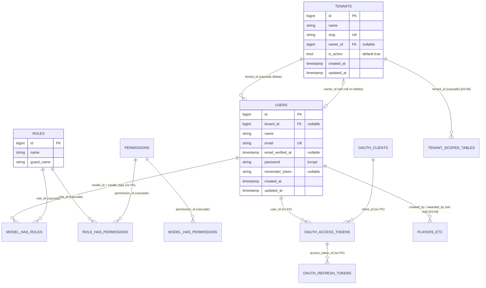
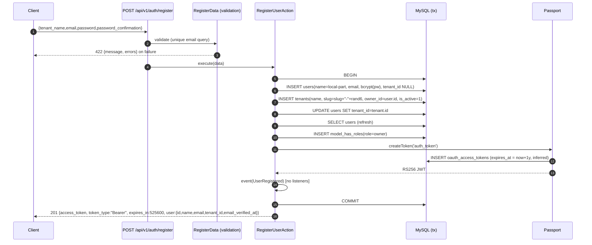
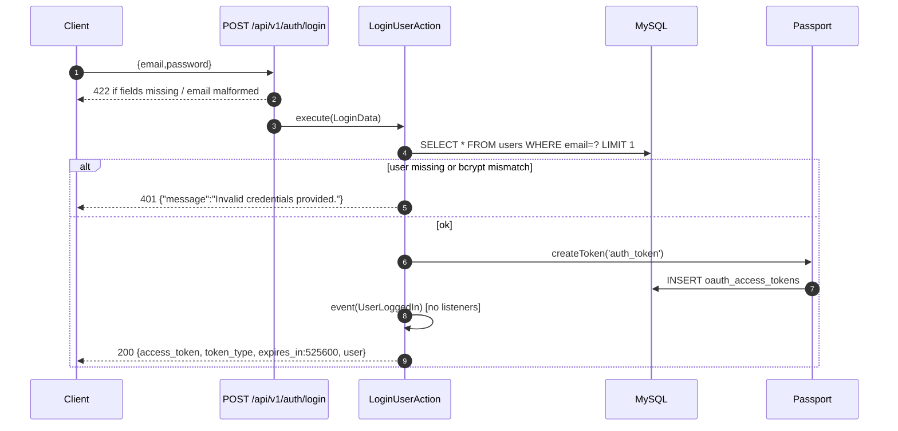

# 02 — Identity & Tenancy (Auth, User, Tenant)

Scope: `app/Domain/Auth`, `app/Domain/User`, `app/Domain/Tenant`, `AuthController`, `UserController`, `routes/api/v1/auth.php`, `routes/api/v1/users.php`, identity-related migrations, factories/seeders, policies, Filament/Horizon gates, and `tests/Feature/Api/V1/{Auth,User}ControllerTest.php`.
Target: the Go modular monolith blueprint at `/Users/saba/Projects/golang_advanced_blueprint` (`CLAUDE.md`, `go-modular-monolith-blueprint-prd.md`, `docs/examples.md`).

Sibling docs: 01 platform (HTTP/errors/CORS/ping/queues), 03 players/programs/events, 04 points/levels/badges, 05 missions/streaks/rewards/leaderboards, 06 rules engine. Integration points with those are flagged with **[→0N]**.

Conventions in this doc: `path:line` cites the Laravel repo unless prefixed `bp:` (blueprint repo). "Inferred" means not directly visible in the repo (usually because `vendor/` is not installed, so package internals and `route:list` could not be checked).

---

## 1. Purpose and concepts

| Concept | What it is in the Laravel code | Where |
| --- | --- | --- |
| **Tenant** | A customer organisation. Every gamification row (players, wallets, badges, missions, rules, events...) carries `tenant_id`. Has a `name`, globally unique `slug`, an optional `owner_id` (user) and an `is_active` flag. | `app/Domain/Tenant/Models/Tenant.php:15-75`, `database/migrations/2025_12_29_230502_create_tenants_table.php:14-23` |
| **User** | A human operator of the dashboard/API (not an end player; players are a separate entity, **[→03]**). Authenticates with email + password. Belongs to at most one tenant (`users.tenant_id`, nullable). | `app/Domain/User/Models/User.php:18-72`, `database/migrations/2025_12_29_230508_add_tenant_id_to_users_table.php:15` |
| **Role** | A Spatie `laravel-permission` role name (string) attached to a user via `model_has_roles`. Six fixed values from `Role` enum. Roles are **global, not per-tenant** (`permission.teams = false`, `config/permission.php:134`). Tenant scoping is implied by the user's single `tenant_id`. No Spatie *permissions* are ever created or checked; only role names. | `app/Domain/User/Enums/Role.php:7-101`, `app/Domain/User/Traits/HasRoleHelpers.php:9-64`, `database/seeders/RoleSeeder.php:16-20` |
| **Owner** | Two overlapping notions: (a) `tenants.owner_id` points at a user (`Tenant::owner()`, `Tenant.php:55-58`; `User::ownedTenant()`, `User.php:60-63`); (b) the `owner` role. Registration sets both (`RegisterUserAction.php:42-55`). Nothing keeps them in sync afterwards. | |
| **Platform admin** | User with role `platform_admin`, normally `tenant_id = NULL` (seeded at `database/seeders/UsersSeeder.php:111-119`). Only role allowed into the Filament admin panel (`app/Http/Middleware/EnsurePlatformAdmin.php:26-28`) and Horizon (`app/Providers/HorizonServiceProvider.php:32-34`). Has no special API powers beyond being "administrative" (`Role::administrativeRoles()`, `Role.php:61-69`). | |
| **Administrative** | Any of `owner`, `super_admin`, `platform_admin`, `admin` (`Role.php:61-69`, `HasRoleHelpers.php:58-63`). Used by every domain policy to gate writes, **[→03-06]**. | |
| **Tenant isolation (read side)** | `TenantScope` global scope on tenant-owned models (not on `User` or `Tenant`): if the authenticated user has a `tenant_id`, queries filter `tenant_id = user.tenant_id OR tenant_id IS NULL` (`app/Domain/Shared/Scopes/TenantScope.php:16-24`). Applied by 20 models in other domains **[→03-06]**. | |

Relationships:

- `Tenant 1 —— 0..N User` via `users.tenant_id` (`Tenant::users()`, `Tenant.php:63-66`; `User::tenant()`, `User.php:56-59`).
- `Tenant 0..1 —— 1 User (owner)` via `tenants.owner_id` (`Tenant.php:55-58`).
- `User N —— M Role` via Spatie `model_has_roles` (polymorphic).
- Passport `oauth_access_tokens.user_id` → user (no FK).



---

## 2. Data model

DB engine: MySQL per `.env.example:23` (`DB_CONNECTION=mysql`). Note MySQL default collations make `users.email` uniqueness and lookups **case-insensitive**; Postgres will not (see section 10).

### 2.1 `users`
Created `database/migrations/0001_01_01_000000_create_users_table.php:14-22`, altered `2025_12_29_230508_add_tenant_id_to_users_table.php:14-18`.

| Column | Type | Null | Default | Index / constraint | Source |
| --- | --- | --- | --- | --- | --- |
| `id` | BIGINT UNSIGNED auto-increment | no | | PK | `:15` |
| `tenant_id` | BIGINT UNSIGNED | yes | NULL | FK → `tenants.id` **ON DELETE CASCADE**; FK index plus an extra explicit `index('tenant_id')` (redundant on MySQL) | add_tenant_id `:15-17` |
| `name` | VARCHAR(255) | no | | | `:16` |
| `email` | VARCHAR(255) | no | | UNIQUE (global, not per tenant) | `:17` |
| `email_verified_at` | TIMESTAMP | yes | NULL | | `:18` |
| `password` | VARCHAR(255) | no | | bcrypt hash (`$2y$12$...`, `BCRYPT_ROUNDS=12` in `.env.example:16`) | `:19` |
| `remember_token` | VARCHAR(100) | yes | NULL | web-session "remember me" (Filament only) | `:20` |
| `created_at`, `updated_at` | TIMESTAMP | yes | NULL | | `:21` |

No soft deletes. Key type: auto-increment int.

Model `App\Domain\User\Models\User` (`app/Domain/User/Models/User.php`):

| Aspect | Value | Line |
| --- | --- | --- |
| Base class | `Illuminate\Foundation\Auth\User` (Authenticatable) | `:13,18` |
| Traits | `HasApiTokens` (Passport), `HasFactory`, `HasRoleHelpers`, `HasRoles` (Spatie), `Notifiable`, `HasUserAccessors` | `:21-26` |
| `$fillable` | `name`, `email`, `password`, `tenant_id` | `:27-32` |
| `$hidden` | `password`, `remember_token` | `:33-36` |
| casts | `email_verified_at => datetime`, `password => hashed` (auto-hash on assignment; skips already-hashed values) | `:37-43` |
| Relations | `tenant(): BelongsTo Tenant` (`:56-59`), `ownedTenant(): HasOne Tenant (owner_id)` (`:60-63`), plus Passport `tokens()` and Spatie `roles()`/`permissions()` from traits | |
| Helpers | `hasVerifiedEmail()` `:48-51`, `getFullName()` `:52-55`, `ownsTenant()` (extra query) `:64-67`, `belongsToTenant(Tenant)` strict `===` on ids `:68-71` | |
| Global scopes | **none** (users are not tenant-scoped) | |
| Accessors (trait) | `getId(): int`, `getName()`, `getEmail()`, `getTenantId(): int` (**non-nullable return, column is nullable**), `getEmailVerifiedAt(): ?CarbonImmutable`, `getCreatedAt(): CarbonImmutable`, `getUpdatedAt(): CarbonImmutable` | `app/Domain/User/Traits/HasUserAccessors.php:11-38` |
| Role helpers | `assignRoleEnum`, `hasRoleEnum`, `isOwner`, `isSuperAdmin`, `isPlatformAdmin`, `setAsPlatformAdmin`, `isAdmin`, `isProgramManager`, `isDeveloper`, `isAdministrative` | `app/Domain/User/Traits/HasRoleHelpers.php:11-63` |

### 2.2 `tenants`
`database/migrations/2025_12_29_230502_create_tenants_table.php:14-23`.

| Column | Type | Null | Default | Index / constraint |
| --- | --- | --- | --- | --- |
| `id` | BIGINT UNSIGNED auto-increment | no | | PK |
| `name` | VARCHAR(255) | no | | (not unique) |
| `slug` | VARCHAR(255) | no | | UNIQUE |
| `owner_id` | BIGINT UNSIGNED | yes | NULL | FK → `users.id` **ON DELETE SET NULL** |
| `is_active` | BOOLEAN | no | `true` | INDEX |
| `created_at`, `updated_at` | TIMESTAMP | yes | NULL | |

No soft deletes. Circular FK with `users` (`users.tenant_id` ↔ `tenants.owner_id`).

Model `App\Domain\Tenant\Models\Tenant` (`app/Domain/Tenant/Models/Tenant.php`): fillable `name, slug, owner_id, is_active` (`:25-30`); cast `is_active => boolean` (`:37-42`); relations `owner()` (`:55-58`), `users()` (`:63-66`); `isOwnedBy(User)` (`:71-74`). Accessors `getId(): int`, `getName()`, `getSlug()`, `getOwnerId(): int` (**non-nullable, column nullable**), `getIsActive()`, `getCreatedAt(): CarbonImmutable`, `getUpdatedAt(): CarbonImmutable` (`app/Domain/Tenant/Traits/HasTenantAccessors.php:11-38`). No scopes.

Other tables with a FK to `tenants.id` ON DELETE CASCADE **[→03-06]**: players, wallets, point_transactions, player_badges, player_levels, missions, player_missions, streaks, player_streaks, rewards, rules, events (nullable since `2026_01_01_162111_make_tenant_id_nullable_in_events_table.php:19-23`). FKs to `users.id` ON DELETE SET NULL: `players.created_by` (`2025_12_30_104958_create_players_table.php:25`), `point_transactions.created_by` (`2025_12_30_123611...:29`), `player_badges.awarded_by` (`2025_12_30_124535...:22`).

### 2.3 Spatie permission tables
`database/migrations/2025_12_29_215856_create_permission_tables.php` (teams disabled, `config/permission.php:134`).

| Table | Columns | Keys |
| --- | --- | --- |
| `permissions` | `id` bigint PK, `name`, `guard_name`, timestamps | UNIQUE(`name`,`guard_name`) `:23-31` |
| `roles` | `id` bigint PK, `name`, `guard_name`, timestamps | UNIQUE(`name`,`guard_name`) `:33-48` |
| `model_has_permissions` | `permission_id`, `model_type`, `model_id` | PK(permission_id, model_id, model_type); FK permission ON DELETE CASCADE `:50-72` |
| `model_has_roles` | `role_id`, `model_type`, `model_id` | PK(role_id, model_id, model_type); FK role ON DELETE CASCADE; **no FK to users** `:74-95` |
| `role_has_permissions` | `permission_id`, `role_id` | PK; both FKs CASCADE `:97-112` |

Data: `RoleSeeder` creates one row per `Role` case with guard `web` (`database/seeders/RoleSeeder.php:18-20`). Tests additionally create `api`-guard duplicates (`tests/Feature/Api/V1/AuthControllerTest.php:16-19`). `permissions` table is empty; nothing checks Spatie permissions. Spatie caches roles 24h (`config/permission.php:186`).

### 2.4 Passport / Sanctum / session tables (relevant only for migration)

| Table | Purpose | Migration |
| --- | --- | --- |
| `oauth_access_tokens` | One row per issued personal access token: `id` char(80) PK (= JWT `jti`), `user_id` nullable indexed, `client_id` uuid, `name` (`'auth_token'`), `scopes`, `revoked` bool, timestamps, `expires_at` | `2025_12_29_221514...:14-23` |
| `oauth_refresh_tokens` | unused by personal tokens | `2025_12_29_221515...:14-19` |
| `oauth_clients` | the "Personal Access Client" (created by `PassportClientsSeeder.php:40-44` or per test) | `2025_12_29_221516...:14-24` |
| `oauth_auth_codes`, `oauth_device_codes` | unused flows | `2025_12_29_221513`, `221517` |
| `personal_access_tokens` | Sanctum table; Sanctum installed but **not used** by any guard (`config/auth.php` `api` guard driver is `passport`) | `2025_12_29_214249...:14-23` |
| `password_reset_tokens`, `sessions` | Laravel defaults; no API password reset exists; sessions back the Filament web login | `0001_01_01_000000...:24-37` |

Guards (`config/auth.php`): default `web` (session); `api` → driver `passport`, provider `users` (Eloquent `App\Domain\User\Models\User`). `config/passport.php` only sets `guard => web`, keys from env; there is **no** `token_expiration` key.

---

## 3. Enums

| Enum | Values (value → label) | Extra behaviour | Used? |
| --- | --- | --- | --- |
| `App\Domain\User\Enums\Role` (`Role.php:7-101`) | `owner`→Owner, `super_admin`→Super Admin, `platform_admin`→Platform Admin, `admin`→Admin, `program_manager`→Program Manager, `developer`→Developer | `description()` `:34-44`; `values()` `:51-54`; `administrativeRoles()` = owner, super_admin, platform_admin, admin `:61-69`; `isAdministrative()` `:74-77`; `hierarchyLevel()` owner 1, super_admin 2, platform_admin 3, admin 4, program_manager 4, developer 5 `:82-92`; `outranks()` `:97-100` | Yes (roles, policies). `hierarchyLevel`/`outranks` unused. |
| `App\Domain\User\Enums\UserStatus` (`UserStatus.php:7-34`) | `active`, `inactive`, `suspended`, `pending_verification` (label "Pending Verification") | `canPerformActions()` true only for `active` `:30-33` | **Dead code**: no `status` column, never referenced. |
| `App\Domain\Tenant\Enums\TenantStatus` (`TenantStatus.php:7-47`) | `active`→Active, `suspended`→Suspended, `pending`→Pending Activation, `cancelled`→Cancelled | `description()` `:30-38`, `canAccessPlatform()` only `active` `:43-46` | **Dead code**: table has boolean `is_active` instead. |

---

## 4. Business flows

All actions run synchronously in the HTTP request. No listeners are registered for any event in this area (no `app/Listeners`, no `Event::listen`), so every `event(...)` below is currently a no-op.

### 4.1 Register — `RegisterUserAction::execute` (`app/Domain/Auth/Actions/RegisterUserAction.php:31-68`)

**Yes, it creates a tenant and makes the user its owner.**

1. Validation (via `RegisterData`, `app/Domain/Auth/DataTransferObjects/RegisterData.php:19-28`): `tenant_name` required|string|max:255; `email` required|string|email|max:255|unique:users,email; `password` required|string|min:8|confirmed. No name field. Failure → 422.
2. `DB::transaction` opens (`:33`).
3. Create user (`:35-39`): `name = Str::before(email,'@')` (`RegisterData.php:41-44`), `email` as given (not normalised), `password = Hash::make(password)` (bcrypt, the `hashed` cast does not double-hash), `tenant_id = NULL`.
4. Create tenant (`:42-47`): `name = tenant_name`, `slug = Str::slug(tenant_name).'-'.Str::random(6)` (`RegisterData.php:33-36`; 6 random alphanumerics, mixed case; a collision would raise a unique violation → 500, no retry), `owner_id = user.id`, `is_active = true`. Note: this bypasses `CreateTenantAction`, so `TenantCreated` is **not** fired.
5. Update user `tenant_id = tenant.id` (`:49-51`), then `$user->refresh()` (`:53`).
6. Assign Spatie role `owner` (`:55`). If the `owner` role row does not exist (seeder not run), Spatie throws `RoleDoesNotExist` → 500 and the tx rolls back.
7. Issue Passport personal access token `createToken('auth_token')` (`:57`): inserts an `oauth_access_tokens` row inside the same tx and returns an RS256 JWT. Requires a personal access client to exist (else exception → 500).
8. `event(new UserRegistered($user))` (`:59`) **inside** the transaction (a listener would observe uncommitted data).
9. Return `AuthTokenData{access_token, token_type:'Bearer', expires_in: config('passport.token_expiration', 525600), user: UserData}` (`:61-66`). Controller sets 201 (`AuthController.php:25-30`).



### 4.2 Login — `LoginUserAction::execute` (`app/Domain/Auth/Actions/LoginUserAction.php:27-45`)

1. Validation (`LoginData.php:14-20`): `email` required|string|email; `password` required|string. → 422.
2. `findByEmail(email)` exact `where('email', ...)` (`UserRepository.php:25-28`) (case-insensitive only thanks to MySQL collation).
3. If no user **or** `Hash::check` fails → `InvalidCredentialsException` → 401 `{"message":"Invalid credentials provided."}` (`InvalidCredentialsException.php:14-27`). Same response for both cases (no user enumeration through the message), but no constant-time dummy hash on the "no user" path (timing side channel).
4. **No other checks**: no user status (no column), no `email_verified_at`, no tenant `is_active`, no throttling/lockout (the `api` middleware group in Laravel 12 has no throttle by default and none is configured in `bootstrap/app.php:15-17`).
5. `createToken('auth_token')` → new `oauth_access_tokens` row + JWT. No scopes. Prior tokens are not revoked (unbounded tokens per user).
6. `event(new UserLoggedIn($user))` (`:37`), no listeners.
7. Return `AuthTokenData` (200).

Token details (inferred from Passport 13 defaults; vendor not installed): RS256 JWT signed with `storage/oauth-private.key` (`PassportClientsSeeder.php:52-78`, `tests/TestCase.php:17`), claims `aud` (personal client uuid), `jti` (= `oauth_access_tokens.id`), `iat`, `nbf`, `exp`, `sub` (user id as string), `scopes: []`. Personal access token lifetime defaults to **1 year** because no `Passport::personalAccessTokensExpireIn` call exists. `expires_in` in the response is the hard-coded fallback `525600` (minutes in a year), not seconds.



### 4.3 Logout — `LogoutUserAction::execute` (`LogoutUserAction.php:15-22`)
`$user->token()->revoke()` sets `revoked = 1` on the current access token row only (other tokens of the user stay valid); fires `UserLoggedOut`; controller returns 200 `{"message":"Successfully logged out."}` (`AuthController.php:43-53`).

### 4.4 Me — `AuthController::me` (`AuthController.php:58-64`)
Returns `UserData::from($request->user())`. No roles, no tenant object in the payload.

### 4.5 Refresh — `AuthController::refresh` (`AuthController.php:69-84`, logic inline, no Action)
Requires a **valid, unrevoked access token** (route is behind `auth:api`). Revokes the current token, issues a new personal token, returns `AuthTokenData`. There is no refresh-token concept; an expired token cannot be refreshed. No event.

### 4.6 User CRUD (`UserController`, `app/Http/Controllers/Api/V1/UserController.php`)

| Op | Steps | Events | Exceptions |
| --- | --- | --- | --- |
| **List** `index` `:29-36` | `authorize('viewAny')` (always true) → `userRepository->paginate()` (15/page, `AbstractRepository.php:64-67`), **unscoped: all users of all tenants** → `PaginatedDataCollection` of `UserData` | none | 401 |
| **Create** `store` `:41-50` → `CreateUserAction` (`CreateUserAction.php:22-35`) | validate `CreateUserData` → `authorize('create')` (always true) → insert `name`, `email`, `bcrypt(password)`, `tenant_id` (**from request, nullable, any existing tenant**). No role assigned, `email_verified_at` NULL. No tx. | `UserCreated` after insert | 422, 401 |
| **Show** `show` `:55-60` | route-model binding `{user}` (404 if missing) → `authorize('view')` = self only | none | 404 `No query results for model [...]`, 403 `This action is unauthorized.` |
| **Update** `update` `:65-72` → `UpdateUserAction` (`UpdateUserAction.php:22-36`) | binding → validate `UpdateUserData` (runs before authorize because the Data object is resolved first) → `authorize('update')` self only → keep non-null fields (`UpdateUserData.php:34-39`) → hash password if present → `repository->update(id, attrs)` = `findOrFail` + `update` + `fresh()` (`AbstractRepository.php:84-90`) | `UserUpdated` | 422, 403, 404; **duplicate email → unhandled unique violation → 500** (no `unique` rule) |
| **Delete** `destroy` `:77-84` → `DeleteUserAction` (`DeleteUserAction.php:20-25`) | binding → `authorize('delete')` self only → fire `UserDeleted` **before** deleting → query-builder delete (`AbstractRepository.php:95-98`, bypasses model events, so Spatie's `deleting` hook does not detach roles) → 204 empty body | `UserDeleted` (pre-delete) | 403, 404 |

Side effects of deleting a user at DB level: `tenants.owner_id` → NULL if they owned a tenant; `players.created_by`, `point_transactions.created_by`, `player_badges.awarded_by` → NULL; `model_has_roles` and `oauth_access_tokens` rows are orphaned (no FK).

Unused query objects: `GetUserByIdQuery` (`GetUserByIdQuery.php:22-31`, throws `UserNotFoundException::withId`) and `GetUserByEmailQuery` (`GetUserByEmailQuery.php:22-31`, throws `withEmail`). Unused repository methods: `emailExists`, `getVerifiedUsers`, `getUnverifiedUsers` (`UserRepository.php:33-56`). `UserAlreadyExistsException` (`UserAlreadyExistsException.php`) is never thrown.

### 4.7 Tenant CRUD (actions exist, **no HTTP routes, no Filament resource, no callers**)

| Action | Behaviour | Status |
| --- | --- | --- |
| `CreateTenantAction` (`CreateTenantAction.php:21-34`) | `CreateTenantData` (`name` required|string|max:255; `slug` required|string|max:255|unique:tenants,slug; `owner_id` required int, **no `exists` rule**) → insert with `is_active=true` → `TenantCreated`. Does not set the owner's `tenant_id` nor assign the owner role. | dead code |
| `UpdateTenantAction` (`UpdateTenantAction.php:23-49`) | find by id or `TenantNotFoundException` (404 `{"message":"Tenant not found.","error":"tenant_not_found"}`) → apply non-Optional, non-null `name`, `is_active` → `tenantRepository->update($tenant, ...)` → `TenantUpdated` (fired even when nothing changed). | **broken**: passes a `Tenant` model to `update(int|string $id, ...)` under `strict_types` → `TypeError` (`:42` vs `AbstractRepository.php:84`) |
| `DeleteTenantAction` (`DeleteTenantAction.php:21-36`) | find or 404 → clone → `tenantRepository->delete($tenant)` → `TenantDeleted(clone)`. Deleting cascades to users and all tenant-scoped tables. | **broken**: same `TypeError` (`:31` vs `AbstractRepository.php:95`) |
| `TenantOwnerExistsException` (`TenantOwnerExistsException.php:13-27`) | 409 `{"message":"This tenant already has an owner.","error":"tenant_owner_exists"}`. Intended semantics (inferred): refuse to set an owner on a tenant whose `owner_id` is already set (one owner per tenant). **Never thrown.** | dead code |
| `TenantAlreadyExistsException` (`TenantAlreadyExistsException.php:13-27`) | 409 `{"message":"A tenant with this name already exists.","error":"tenant_already_exists"}`. Never thrown; tenant names are not unique in the DB. | dead code |

Unused repository methods: `findBySlug`, `findByOwnerId`, `getActiveTenants` (`TenantRepository.php:28-55`).

---

## 5. HTTP API

Routing: `bootstrap/app.php:9-14` loads `routes/api.php` under prefix `/api` with the `api` middleware group; `routes/api.php:21-36` mounts every `routes/api/v1/<file>.php` under `/api/v1/<file>` with name prefix `api.v1.<file>.`. CORS: `HandleCors` appended globally (`bootstrap/app.php:16`), `config/cors.php` allows all origins/methods/headers on `api/*`.

Global response conventions (Laravel defaults, no custom handler, `bootstrap/app.php:18-20`):
- 401 (missing/invalid/revoked token): `{"message":"Unauthenticated."}`. Inferred risk: a request without `Accept: application/json` gets redirected to `route('login')`, which does not exist (the route is `api.v1.auth.login`), so it becomes a 500.
- 403: `{"message":"This action is unauthorized."}`.
- 404 (route model binding): `{"message":"No query results for model [App\\Domain\\User\\Models\\User] 999"}`.
- 422: `{"message":"<first error> (and N more errors)","errors":{"field":["..."]}}`.
- Dates: laravel-data default `DATE_ATOM`, for example `2026-01-05T10:00:00+00:00` (inferred: no `config/data.php`).

`UserData` serialisation (`app/Domain/User/DataTransferObjects/UserData.php:15-41`): `tenant`, `created_at`, `updated_at` are `Lazy` and **never included** (no `include()` is called anywhere), so the wire shape is always:

```json
{ "id": 12, "name": "john", "email": "john@example.com", "tenant_id": 7, "email_verified_at": null }
```

`AuthTokenData` (`AuthTokenData.php:12-17`): `{ "access_token": string, "token_type": "Bearer", "expires_in": 525600, "user": UserData }`.

### 5.1 Endpoint table

| # | Method | Path | Route name (inferred for users) | Middleware / guard | Authorization | Success |
| --- | --- | --- | --- | --- | --- | --- |
| 1 | POST | `/api/v1/auth/register` | `api.v1.auth.register` | `api` | public | 201 `AuthTokenData` |
| 2 | POST | `/api/v1/auth/login` | `api.v1.auth.login` | `api` | public | 200 `AuthTokenData` |
| 3 | POST | `/api/v1/auth/logout` | `api.v1.auth.logout` | `api`, `auth:api` | any authenticated | 200 `{"message":"Successfully logged out."}` |
| 4 | GET | `/api/v1/auth/me` | `api.v1.auth.me` | `api`, `auth:api` | any authenticated | 200 `UserData` |
| 5 | POST | `/api/v1/auth/refresh` | `api.v1.auth.refresh` | `api`, `auth:api` | any authenticated | 200 `AuthTokenData` |
| 6 | GET | `/api/v1/users` | `api.v1.users.index` | `api`, `auth:api` | `UserPolicy::viewAny` (always true) | 200 paginated |
| 7 | POST | `/api/v1/users` | `api.v1.users.store` | `api`, `auth:api` | `UserPolicy::create` (always true) | 201 `UserData` |
| 8 | GET | `/api/v1/users/{user}` | `api.v1.users.show` | `api`, `auth:api` | `UserPolicy::view` (self) | 200 `UserData` |
| 9 | PUT, PATCH | `/api/v1/users/{user}` | `api.v1.users.update` | `api`, `auth:api` | `UserPolicy::update` (self) | 200 `UserData` |
| 10 | DELETE | `/api/v1/users/{user}` | `api.v1.users.destroy` | `api`, `auth:api` | `UserPolicy::delete` (self) | 204 empty |

Routes: `routes/api/v1/auth.php:8-15`, `routes/api/v1/users.php:8-10` (`apiResource('/')->parameters(['' => 'user'])`, so URIs are `/api/v1/users` and `/api/v1/users/{user}`; route names inferred from Laravel's ResourceRegistrar with an empty resource name). There are **no tenant routes**. `GET /api/v1/ping` (`routes/api/v1/ping.php`) and `/up` belong to doc 01.

### 5.2 Request fields and validation

| Endpoint | Field | Rules (exact) | Source |
| --- | --- | --- | --- |
| register | `tenant_name` | required, string, max:255 | `RegisterData.php:20-21` |
| | `email` | required, string, email, max:255, unique:users,email | `:23-24` |
| | `password` | required, string, min:8, confirmed (needs `password_confirmation`) | `:26-27` |
| login | `email` | required, string, email | `LoginData.php:15-16` |
| | `password` | required, string | `:18-19` |
| users.store | `name` | required, string, max:255 | `CreateUserData.php:22-23` |
| | `email` | required, string, email, max:255, unique:users,email | `:25-26` |
| | `password` | required, string, min:8, confirmed | `:28-29` |
| | `tenant_id` | sometimes, nullable, exists:tenants,id (typed `?int`) | `:31-32` |
| users.update | `name` | sometimes, nullable, string, max:255 | `UpdateUserData.php:19-20` |
| | `email` | sometimes, nullable, string, email, max:255 (**no unique**) | `:22-23` |
| | `password` | sometimes, nullable, string, min:8 (no confirmation, no current password) | `:25-26` |

Explicit `null` values are dropped and do not clear a field (`UpdateUserData.php:34-39`). `tenant_id` cannot be changed through update. Laravel 12 default messages, for example "The email has already been taken.", "The password field must be at least 8 characters.", "The password field confirmation does not match.", "The tenant name field is required.", "The email field must be a valid email address."

### 5.3 Error cases per endpoint

| Endpoint | Status | Body / cause |
| --- | --- | --- |
| register | 422 | validation (above) |
| | 500 | missing `owner` role row, missing personal access client, slug collision |
| login | 422 | validation |
| | 401 | `{"message":"Invalid credentials provided."}` (unknown email or wrong password) |
| logout / me / refresh | 401 | `{"message":"Unauthenticated."}` |
| users.index | 401 | |
| users.store | 401, 422 | |
| users.show | 401, 403 (not self), 404 | |
| users.update | 401, 404, 422, 403 (not self), 500 (duplicate email) | |
| users.destroy | 401, 403, 404 | |

### 5.4 Examples

Register:
```http
POST /api/v1/auth/register
Content-Type: application/json
Accept: application/json

{"tenant_name":"Acme Corporation","email":"john@example.com","password":"password123","password_confirmation":"password123"}
```
```json
HTTP/1.1 201 Created
{
  "access_token": "eyJ0eXAiOiJKV1QiLCJhbGciOiJSUzI1NiJ9...",
  "token_type": "Bearer",
  "expires_in": 525600,
  "user": { "id": 1, "name": "john", "email": "john@example.com", "tenant_id": 1, "email_verified_at": null }
}
```

Login failure:
```json
HTTP/1.1 401 Unauthorized
{ "message": "Invalid credentials provided." }
```

Validation failure:
```json
HTTP/1.1 422 Unprocessable Content
{ "message": "The email has already been taken.", "errors": { "email": ["The email has already been taken."] } }
```

List users (shape inferred from spatie/laravel-data v4 `PaginatedDataCollection`; the test only asserts `data`, `links`, `meta` keys, `UserControllerTest.php:44-51`):
```json
{
  "data": [ { "id": 1, "name": "john", "email": "john@example.com", "tenant_id": 1, "email_verified_at": "2026-01-05T10:00:00+00:00" } ],
  "links": [ { "url": null, "label": "&laquo; Previous", "active": false }, { "url": "http://host/api/v1/users?page=1", "label": "1", "active": true } ],
  "meta": { "current_page": 1, "first_page_url": "...?page=1", "from": 1, "last_page": 1, "last_page_url": "...?page=1", "next_page_url": null, "path": "http://host/api/v1/users", "per_page": 15, "prev_page_url": null, "to": 1, "total": 1 }
}
```
Pagination: `?page=N`, `per_page` fixed at 15 (no client control).

Update self:
```http
PATCH /api/v1/users/1
Authorization: Bearer <token>

{"name":"New Name"}
```
→ `200 {"id":1,"name":"New Name","email":"john@example.com","tenant_id":1,"email_verified_at":null}`

---

## 6. Authorization matrix

### 6.1 `UserPolicy` (`app/Domain/User/Policies/UserPolicy.php:17-52`), enforced on the HTTP API. Roles are irrelevant.

| Action | Any authenticated user | Condition |
| --- | --- | --- |
| viewAny (list) | allow | `true` `:17-20` (all tenants) |
| view | self only | `user.id === model.id` `:25-28` |
| create | allow | `true` `:33-36` (any tenant, see 4.6) |
| update | self only | `:41-44` |
| delete | self only | `:49-52` |

Consequence: an owner or admin **cannot** view, update, or delete other users of their tenant through the API; any user can list every user on the platform and create users in any tenant.

### 6.2 `TenantPolicy` (`app/Domain/Tenant/Policies/TenantPolicy.php:15-66`). Registered (`DomainServiceProvider.php:137,181-186`) but **not exercised** by any route or test.

"Admin*" below = has any administrative role (owner, super_admin, platform_admin, admin), **regardless of which tenant** the user belongs to. "Owner-of-T" = `tenant.owner_id === user.id`. "Member-of-T" = `user.tenant_id === tenant.id`.

| Action | owner role | super_admin | platform_admin | admin | program_manager | developer | Extra condition |
| --- | --- | --- | --- | --- | --- | --- | --- |
| viewAny `:15-18` | Y | Y | Y | Y | N | N | |
| view `:23-26` | Y | Y | Y | Y | if member/owner-of-T | if member/owner-of-T | `admin* OR owner-of-T OR member-of-T` |
| create `:31-34` | Y | Y | Y | Y | N | N | |
| update `:39-42` | Y (any tenant) | Y (any) | Y | Y (any) | if owner-of-T | if owner-of-T | `admin* OR owner-of-T` |
| delete `:47-50` | Y (any tenant) | Y (any) | Y | Y (any) | if owner-of-T | if owner-of-T | `admin* OR owner-of-T` |
| inviteUsers `:55-58` | if member-of-T | if member-of-T | if member-of-T | if member-of-T | if owner-of-T | if owner-of-T | `owner-of-T OR (member-of-T AND admin*)` |
| manageSettings `:63-66` | if owner-of-T | if member-of-T | if owner-of-T | if owner-of-T | if owner-of-T | if owner-of-T | `owner-of-T OR (member-of-T AND super_admin)` |

### 6.3 Other gates in scope

| Gate | Rule | Source |
| --- | --- | --- |
| Filament `/admin` panel | Unauthenticated users pass (to reach login); authenticated users need `platform_admin` or get 403 "Access denied. Platform Admin role required." | `app/Http/Middleware/EnsurePlatformAdmin.php:18-31`, `app/Providers/Filament/AdminPanelProvider.php:55` |
| Horizon `viewHorizon` | `isPlatformAdmin()` | `app/Providers/HorizonServiceProvider.php:30-35` |
| Tenant-scoped policies **[→03-06]** | Pattern: `user.getTenantId() === model.getTenantId()` plus `isAdministrative()` for writes (for example `app/Domain/Player/Policies/PlayerPolicy.php:15-50`). Program managers and developers can only read/create in most domains. | |

---

## 7. Domain events and observers

All events are plain classes with `Dispatchable`, `InteractsWithSockets`, `SerializesModels`; none implements `ShouldBroadcast`, `ShouldQueue` or `ShouldDispatchAfterCommit`; **none has a listener**. They carry the whole Eloquent model.

| Event | Payload | Fired from | Timing |
| --- | --- | --- | --- |
| `Auth\Events\UserRegistered` (`UserRegistered.php:12-19`) | `User $user` | `RegisterUserAction.php:59` | inside the DB transaction |
| `Auth\Events\UserLoggedIn` (`UserLoggedIn.php:12-19`) | `User $user` | `LoginUserAction.php:37` | after token issue |
| `Auth\Events\UserLoggedOut` (`UserLoggedOut.php:12-19`) | `User $user` | `LogoutUserAction.php:19` | after revoke |
| `User\Events\UserCreated` (`UserCreated.php:12-19`) | `User $user` | `CreateUserAction.php:32` | after insert, no tx |
| `User\Events\UserUpdated` (`UserUpdated.php:12-19`) | `User $user` (fresh) | `UpdateUserAction.php:33` | after update |
| `User\Events\UserDeleted` (`UserDeleted.php:12-19`) | `User $user` | `DeleteUserAction.php:22` | **before** delete |
| `Tenant\Events\TenantCreated` (`TenantCreated.php:12-21`) | `Tenant $tenant` | `CreateTenantAction.php:31` (dead) | |
| `Tenant\Events\TenantUpdated` (`TenantUpdated.php:12-21`) | `Tenant $tenant` | `UpdateTenantAction.php:46` (dead, broken) | even with no change |
| `Tenant\Events\TenantDeleted` (`TenantDeleted.php:12-21`) | `Tenant $tenant` (clone) | `DeleteTenantAction.php:33` (dead, broken) | after delete |

Observers: none for `User` or `Tenant` (`DomainServiceProvider.php:191-210` registers observers only for other domains **[→03-06]**). Spatie `HasRoles` registers a model `deleting` hook that detaches roles, but the query-builder delete in `AbstractRepository::delete` bypasses it.

---

## 8. Filament admin

- Panel `admin` at `/admin`, session login (`AdminPanelProvider.php:27-31`), gated by `EnsurePlatformAdmin`.
- **No User or Tenant resources exist.** The only resource is `EventCategoryResource` (`app/Filament/Resources/Domain/Event/Models/EventCategories/...`) **[→03]**.
- `User` does not implement `Filament\Models\Contracts\FilamentUser`. Per Filament v4 docs, panel access is then allowed only in the `local` environment. In production nobody, including platform admins, can open the panel (inferred; verify).
- The Go blueprint has no admin UI. Any platform-admin capability needs explicit endpoints (see 11.8) or a separate tool (open question).

---

## 9. Existing test coverage → acceptance checklist

Test files: `tests/Feature/Api/V1/AuthControllerTest.php`, `tests/Feature/Api/V1/UserControllerTest.php` (both `RefreshDatabase`, create roles for `web` and `api` guards, create a Passport personal client in `beforeEach`). No unit tests and no tenant tests.

| # | Test (file:line) | Go acceptance item (adjusted where behaviour is intentionally fixed) |
| --- | --- | --- |
| A1 | registers a new user and creates a tenant successfully `Auth:29` | `POST /auth/register` → 201, body has `access_token, token_type, expires_in, user{id,name,email,tenant_id}`, rows in `users` and `tenants` |
| A2 | assigns owner role to registered user `Auth:59` | registered user holds role `owner` |
| A3 | sets registered user as tenant owner `Auth:72` | `tenant.owner_user_id == user.id` and `user.tenant_id == tenant.id` |
| A4 | returns validation error for missing tenant name `Auth:87` | 422 with `errors.tenant_name` |
| A5 | returns validation error for invalid email `Auth:98` | 422 `errors.email` |
| A6 | returns validation error for duplicate email `Auth:110` | 422 `errors.email` (Go: also case-insensitive duplicate) |
| A7 | returns validation error for password mismatch `Auth:124` | 422 `errors.password` |
| A8 | returns validation error for short password `Auth:136` | 422 `errors.password` |
| A9 | logs in a user with valid credentials `Auth:150` | 200 token payload; **plus**: works against a legacy `$2y$` bcrypt hash |
| A10 | returns error for invalid password `Auth:174` | 401, message "Invalid credentials provided." (Go: problem+json detail; see 11.10) |
| A11 | returns error for non-existent email `Auth:191` | 401 same body as A10 |
| A12 | returns validation error for missing email `Auth:200` | 422 `errors.email` |
| A13 | returns validation error for missing password `Auth:209` | 422 `errors.password` |
| A14 | logs out an authenticated user `Auth:220` | 200 `{"message":"Successfully logged out."}` (or 204, decide); token unusable afterwards (**not tested today; add**) |
| A15 | logout returns unauthorized for unauthenticated request `Auth:232` | 401 |
| A16 | returns the authenticated user `Auth:240` | `GET /auth/me` 200 with name and email |
| A17 | me returns unauthorized `Auth:256` | 401 |
| A18 | refreshes the token for authenticated user `Auth:264` | refresh → new `access_token` (Go: rotating refresh token, so the input changes) |
| A19 | refresh returns unauthorized `Auth:279` | 401 on missing or invalid refresh token |
| A20 | returns unauthorized for unauthenticated users list request `Auth:287` | 401 |
| A21 | allows authenticated user to access users list `Auth:293` | 200 |
| U1 | returns paginated list of users `User:37` | 200 `data[]{id,name,email}`, `links`, `meta` (Go: tenant-scoped) |
| U2 | returns data with only authenticated user when no other users exist `User:54` | count 1 (Go: count of own tenant) |
| U3 | creates a new user with valid data `User:63` | 201 and row exists (Go: requires `identity:user.create`; tenant forced to caller's) |
| U4-U8 | create validation: missing name `User:83`, invalid email `:94`, duplicate email `:106`, short password `:120`, password mismatch `:132` | 422 with the field key |
| U9 | allows user to view themselves `User:146` | 200 |
| U10 | returns 403 when viewing another user `User:157` | 403 (Go: unless the caller holds `identity:user.view_any` in the same tenant) |
| U11 | show returns 404 for non-existent user `User:167` | 404 |
| U12-U14 | update own name `User:175`, own email `:189`, multiple fields `:198` | 200 and persisted |
| U15 | returns 403 when updating another user `User:211` | 403 |
| U16 | update returns 404 `User:223` | 404 |
| U17 | update validation error for invalid email format `User:231` | 422 |
| U18 | allows user to delete themselves `User:242` | 204 and row gone (Go: refuse if caller is tenant owner; see 10) |
| U19 | returns 403 when deleting another user `User:251` | 403 |
| U20 | delete returns 404 `User:261` | 404 |
| U21 | returns unauthorized without token `User:269` | 401 |

Gaps to add in Go: login rate limiting; token unusable after logout; refresh replay revokes the family; duplicate email on update → 409; case-insensitive email; cross-tenant list isolation; create-user cannot target a foreign tenant; tenant endpoints; legacy-hash login; deleting a tenant owner; inactive tenant/user cannot log in.

---

## 10. Bugs, inconsistencies, security concerns, dead code (do not port blindly)

### Security
1. **Cross-tenant user enumeration**: `GET /users` returns every user of every tenant (`UserPolicy.php:17-20` + unscoped `paginate()` at `UserController.php:33`; `User` has no `TenantScope`). Leaks names and emails platform-wide.
2. **Tenant takeover through user creation**: any authenticated user can `POST /users` with any `tenant_id` (`CreateUserData.php:31-32`, `UserPolicy.php:33-36`), then log in as that user. `TenantScope` (`TenantScope.php:18-23`) then grants read access to the victim tenant's data **[→03-06]**. Even without `tenant_id`, they can mint unlimited tenantless accounts.
3. **No brute-force protection** on login (no throttle middleware; `bootstrap/app.php:15-17`). Login also has a timing difference between unknown email (no bcrypt work) and wrong password.
4. **Password change without re-authentication** (`UpdateUserData.php:25-26`: no current password, no confirmation); email change without re-verification (`email_verified_at` kept). A stolen token gives permanent account takeover.
5. **1-year bearer tokens** (Passport default, inferred) with no refresh rotation; logout revokes only the current token; tokens are not revoked on password change or user delete; tokens accumulate per login.
6. **TenantPolicy is not tenant-scoped**: any administrative role (including a tenant's `owner` or `admin`) passes `update`/`delete`/`create` for **any** tenant (`TenantPolicy.php:31-50`). Dormant today (no routes) but must not be ported.
7. **`TenantScope` includes `tenant_id IS NULL` rows** for everyone (`TenantScope.php:21`) and **is skipped entirely when the user has no tenant** (`:18`), so tenantless users (platform admins, or accounts created through issue 2) see all tenants' data **[→03-06]**.
8. Hard-coded seeded credentials with password `password`, including a real personal email promoted to `platform_admin` (`UsersSeeder.php:111-119`, `TenantsSeeder.php:21-47`). Must not reach production data.
9. CORS `*` for all `api/*` (`config/cors.php`) **[→01]**.

### Correctness bugs
10. `getTenantId(): int` on a nullable column (`HasUserAccessors.php:23-26`) → `TypeError` (500) for tenantless users in every domain policy using it (for example `PlayerPolicy.php:17`) **[→03-06]**. Same for `Tenant::getOwnerId(): int` (`HasTenantAccessors.php:23-26`) after the owner is deleted (`owner_id` set NULL), which breaks `isOwnedBy` and `TenantData::fromModel` (`TenantData.php:19,35`, non-nullable `owner_id`).
11. `getCreatedAt()/getUpdatedAt()/getEmailVerifiedAt()` declare `CarbonImmutable`, but the model returns mutable `Carbon` (no `Date::use(CarbonImmutable)` anywhere) → `TypeError` if called (currently uncalled).
12. `UpdateTenantAction`/`DeleteTenantAction` pass a model to `int|string $id` under `strict_types` → `TypeError` (`UpdateTenantAction.php:42`, `DeleteTenantAction.php:31`).
13. Duplicate email on `PUT /users/{id}` → unhandled `QueryException` → 500 (`UpdateUserData.php:22-23` lacks `unique:users,email,{id}`).
14. `expires_in` is `525600` from a non-existent config key (`LoginUserAction.php:42`, `RegisterUserAction.php:64`, `AuthController.php:81`). It is minutes-in-a-year, OAuth clients read it as seconds (about 6 days), and it does not match the real expiry.
15. Deleting a user with `DeleteUserAction` bypasses model events → orphaned `model_has_roles` rows; `UserDeleted` fires before the delete and would report a delete that might then fail.
16. Deleting the tenant owner leaves `tenants.owner_id = NULL` while other users may still hold the `owner` role; owner role and `owner_id` are never reconciled.
17. `UserRegistered` is dispatched inside the transaction (`RegisterUserAction.php:59`); `TenantCreated` is never dispatched on registration, so any future tenant-provisioning listener would miss self-signups.
18. The circular FK (`users.tenant_id` ↔ `tenants.owner_id`) needs the insert-then-update dance in register (`RegisterUserAction.php:35-51`).
19. Non-JSON unauthenticated API requests try `route('login')`, which does not exist → 500 (inferred Laravel 12 behaviour).
20. Email is stored and compared as typed; uniqueness relies on MySQL's case-insensitive collation. On Postgres, `John@x.com` and `john@x.com` would become two accounts.
21. `CreateTenantData.owner_id` has no `exists:users,id` rule (`CreateTenantData.php:22-23`).
22. Role hierarchy puts `platform_admin` (3) below tenant `owner` (1) and `super_admin` (2) (`Role.php:82-92`), which is inconsistent with platform admins being global. `description()` gives super_admin and platform_admin the same text (`:38-39`).
23. Bcrypt silently truncates passwords at 72 bytes in PHP; there is no max-length rule, so two long passwords with the same first 72 bytes are equivalent.

### Dead code
`UserStatus`, `TenantStatus`, `GetUserByIdQuery`, `GetUserByEmailQuery`, `UserAlreadyExistsException`, `UserNotFoundException` (only from the dead queries), all three Tenant actions and their DTOs (`CreateTenantData`, `UpdateTenantData`), `TenantAlreadyExistsException`, `TenantOwnerExistsException`, `TenantNotFoundException` (only from the dead actions), `TenantPolicy::inviteUsers/manageSettings`, `Role::hierarchyLevel/outranks`, `User::ownsTenant/getFullName/hasVerifiedEmail`, `UserRepository::emailExists/getVerifiedUsers/getUnverifiedUsers`, `TenantRepository::findBySlug/findByOwnerId/getActiveTenants`, `Shared\ValueObjects\Email`, `Shared\ValueObjects\Name`, `Shared\Traits\HasUuid` (no references), the Sanctum `personal_access_tokens` table, Passport auth-code/device/refresh tables, and every event in section 7 (no listeners).

---

## 11. Go blueprint mapping

### 11.1 Module decision

**Recommendation: one module `identity`** (schema `identity_svc`) owning tenants, users, credentials, role assignments and the role catalogue. Platform `authn` keeps JWT issue/verify, the refresh store and the deny list; `authz` keeps casbin.

Why not separate `tenant` and `user` modules:
- Registration must atomically create a tenant, a user, the ownership link and the owner role, and must return a token that already carries `tenant_id`. The blueprint forbids atomic multi-module writes (`bp:CLAUDE.md` "Cross-module communication"). A saga (user pending → `user.registered.v1` → tenant module creates the tenant → `tenant.created.v1` → identity finalises) would make the register response either lack `tenant_id` or need polling. That is a regression for no gain.
- The owner invariant (`tenants.owner_user_id` must be a member of that tenant) spans both entities. Inside one schema it can be a real FK and a single-transaction check.
- Every other module needs the same thing from both: "does this tenant exist and is it active", "who is this user". One Reader surface keeps that simple.

Inside the module, keep two aggregates and two services (`app.TenantService`, `app.UserService`, plus `app.AuthService`) so a later split is mechanical. Topics stay entity-named (`tenant.*.v1`, `user.*.v1`), as the blueprint's `user` module did (`user.registered.v1`, `bp:docs/examples.md` §4).

Layout (following `bp:docs/examples.md` §1):
```
internal/modules/identity/
  module.go            New(d modkit.Deps, cfg Config, auth *authn.Auth) — auth passed explicitly, like the reference user module
  config.go            IDENTITY_* (see 11.12)
  contracts/           topics.go, events.go, permissions.go, roles.go, types.go (Reader interfaces)
  internal/domain      tenant.go, user.go, role.go, errors.go
  internal/app         auth_service.go, user_service.go, tenant_service.go, reader.go (implements contracts readers)
  internal/ports       (none needed at first: identity consumes no other module)
  internal/repo        tenants.go, users.go, roles.go (unexported gorm models), cached.go (read-through decorator)
  internal/transport   auth_handlers.go, user_handlers.go, tenant_handlers.go, internal_handlers.go, dto.go
  migrations/          0001_init.sql, 0002_seed_roles.sql, 0003_seed_permissions.go, 0004_seed_default_grants.go
```

### 11.2 What lives in platform vs module

| Concern | Location | Notes |
| --- | --- | --- |
| JWT signing/verification, `jti`, distinct failure sentinels | `platform/authn` (`bp:internal/platform/authn/jwt.go`) | **Platform change needed**: the `claims` struct only carries `rids` and `sub` (`bp:jwt.go:37-40`), while `authz.Principal` already has `TenantID` (`bp:internal/platform/authz/authz.go:22-26`). Add `TenantID string \`json:"tid,omitempty"\`` to claims, a `tenantID` parameter to `IssueAccess`, and map it in `Verify`. Record it in an ADR. |
| Refresh tokens (opaque, rotating, family revoke), access-token deny list | `platform/authn` `RefreshStore` on redis-core (`bp:store.go:63-125`, PRD §7.8.2) | reused as is |
| Bearer parsing middleware, `RequireAuth` | `platform/authn.Middleware`, `platform/httpx.RequireAuth` | reused |
| Role → permission checks | `platform/authz` casbin; subjects `role:{id}` | role IDs come from the token (`rids`) |
| Password hashing, credential check, user/tenant lifecycle, register/login/refresh/logout orchestration | `identity/internal/app` | uses `*authn.Auth` |
| Tenant-membership ("same tenant") checks | each module's service, comparing `principal.TenantID` with the loaded entity's `tenant_id` | replaces `TenantScope` and the `getTenantId() ===` pattern **[→03-06]** |
| Login rate limit | `platform/httpx` rate limiter (fails open, PRD §7.8.3) keyed by IP + email | new behaviour |

### 11.3 JWT claims

| Claim | Value | Notes |
| --- | --- | --- |
| `sub` | user UUID | `Principal.UserID` |
| `tid` | tenant UUID, omitted for platform users | `Principal.TenantID` (new) |
| `rids` | `[]int64` role IDs from `identity_svc.user_roles` | casbin subjects `role:{id}` |
| `jti` | UUIDv7 | used by logout deny list |
| `iat`, `exp` | access TTL, recommended 15 minutes | HS256 per the platform |

Roles and tenant in the token can be stale until the next refresh. That is acceptable at a 15-minute TTL. On role change or user suspension, call `Refresh.RevokeAll(userID)` so the user must log in again within one TTL.

### 11.4 Password hashing (data migration critical)

- Existing hashes are PHP bcrypt `$2y$12$...` (`.env.example:16`, `Hash::make`). Go's `golang.org/x/crypto/bcrypt` parses the `$2y$` prefix (it reads the minor-version byte without restricting it) and `CompareHashAndPassword` verifies these hashes as they are. **Copy the `password` column byte for byte into `password_hash`. Do not re-hash.**
- New hashes: `bcrypt.GenerateFromPassword(pw, 12)` (cost 12 to match; the reference example used `DefaultCost`=10, `bp:docs/examples.md` §12). PHP can verify `$2a$` too, so a rollback stays possible.
- 72-byte limit: PHP truncated silently; recent x/crypto versions reject passwords over 72 bytes in `GenerateFromPassword` (inferred: check the version actually in `go.mod`). For legacy compatibility, truncate the input to 72 bytes **before** `CompareHashAndPassword`. Enforce `max=72` (bytes) on new passwords in the DTO so the gap never grows.
- Opportunistic rehash on successful login when `bcrypt.Cost(hash) < cfg.BcryptCost`, written in the login path with a short tx.
- Run a dummy `CompareHashAndPassword` against a fixed hash when the email is unknown, to equalise timing (the Laravel code does not).

### 11.5 Schema DDL sketch (goose, applied into `identity_svc`)

Within-module FKs are allowed; only cross-module FKs are banned (`bp:CLAUDE.md`, arch test "no `REFERENCES other_svc.`").

```sql
-- migrations/0001_init.sql
-- +goose Up
CREATE TABLE tenants (
    id             UUID PRIMARY KEY,
    legacy_id      BIGINT UNIQUE,                 -- Laravel tenants.id, for migration traceability
    name           TEXT NOT NULL CHECK (char_length(name) BETWEEN 1 AND 255),
    slug           TEXT NOT NULL,
    owner_user_id  UUID NULL,                     -- FK added below (circular)
    status         TEXT NOT NULL DEFAULT 'active'
                   CHECK (status IN ('active','suspended','pending','cancelled')),
    version        INT  NOT NULL DEFAULT 0,
    created_at     TIMESTAMPTZ NOT NULL,
    updated_at     TIMESTAMPTZ NOT NULL,
    deleted_at     TIMESTAMPTZ NULL               -- soft delete; purge is async via tenant.deleted.v1
);
CREATE UNIQUE INDEX idx_tenants_slug ON tenants (slug);
CREATE INDEX idx_tenants_status ON tenants (status) WHERE deleted_at IS NULL;

CREATE TABLE users (
    id                 UUID PRIMARY KEY,
    legacy_id          BIGINT UNIQUE,
    tenant_id          UUID NULL REFERENCES tenants(id) ON DELETE RESTRICT,  -- NULL = platform user
    name               TEXT NOT NULL CHECK (char_length(name) BETWEEN 1 AND 255),
    email              TEXT NOT NULL CHECK (email = lower(email)),            -- stored normalised
    password_hash      TEXT NOT NULL,
    status             TEXT NOT NULL DEFAULT 'active'
                       CHECK (status IN ('active','inactive','suspended','pending_verification')),
    email_verified_at  TIMESTAMPTZ NULL,
    password_changed_at TIMESTAMPTZ NULL,
    version            INT NOT NULL DEFAULT 0,
    created_at         TIMESTAMPTZ NOT NULL,
    updated_at         TIMESTAMPTZ NOT NULL
);
CREATE UNIQUE INDEX idx_users_email ON users (email);
CREATE INDEX idx_users_tenant ON users (tenant_id, created_at, id);   -- tenant-scoped keyset/offset listing

ALTER TABLE tenants
    ADD CONSTRAINT fk_tenants_owner FOREIGN KEY (owner_user_id)
    REFERENCES users(id) ON DELETE RESTRICT DEFERRABLE INITIALLY DEFERRED;

CREATE TABLE roles (
    id     BIGINT PRIMARY KEY,                    -- fixed IDs; casbin subject role:{id}
    key    TEXT NOT NULL UNIQUE,                  -- 'owner', 'super_admin', ...
    label  TEXT NOT NULL,
    scope  TEXT NOT NULL CHECK (scope IN ('tenant','platform')),
    rank   SMALLINT NOT NULL
);

CREATE TABLE user_roles (
    user_id    UUID   NOT NULL REFERENCES users(id) ON DELETE CASCADE,
    role_id    BIGINT NOT NULL REFERENCES roles(id),
    granted_at TIMESTAMPTZ NOT NULL,
    PRIMARY KEY (user_id, role_id)
);

-- +goose Down
DROP TABLE user_roles; DROP TABLE roles;
ALTER TABLE tenants DROP CONSTRAINT fk_tenants_owner;
DROP TABLE users; DROP TABLE tenants;
```

```sql
-- migrations/0002_seed_roles.sql  (IDs are part of the contract: never renumber)
-- +goose Up
INSERT INTO roles (id, key, label, scope, rank) VALUES
 (1,'owner','Owner','tenant',1),
 (2,'super_admin','Super Admin','tenant',2),
 (3,'platform_admin','Platform Admin','platform',0),
 (4,'admin','Admin','tenant',4),
 (5,'program_manager','Program Manager','tenant',5),
 (6,'developer','Developer','tenant',6)
ON CONFLICT (id) DO NOTHING;
-- +goose Down
DELETE FROM roles WHERE id BETWEEN 1 AND 6;
```

Decisions embedded above (all are changes from Laravel; confirm in section 12): `status` columns replace `is_active` and the dead enums (`is_active=true` → `active`, `false` → `suspended`); tenant soft delete; `ON DELETE RESTRICT` instead of cascade/set-null (user deletion is a service operation that checks ownership first); emails lower-cased; `platform_admin` ranked above tenant roles.

### 11.6 Domain entities and invariants (`internal/domain`, no tags)

`Tenant{ID, Name, Slug, OwnerUserID *string, Status, Version, CreatedAt, UpdatedAt, DeletedAt}`
- `NewTenant(name, now)`: trims name and checks 1..255; slug = `slugify(name)+"-"+rand6` (lower-case alphanumerics; regenerate on unique violation, at most 3 tries).
- `AssignOwner(userID)`: `ErrTenantHasOwner` (Conflict, the intended `TenantOwnerExistsException`) if `OwnerUserID != nil`; `TransferOwnership(from, to)` requires `to` to be a member.
- `Rename`, `Suspend`, `Activate`, `Cancel`; `Active()` = `status == active && DeletedAt == nil` (`TenantStatus::canAccessPlatform`).

`User{ID, TenantID *string, Name, Email, PasswordHash, Status, EmailVerifiedAt, PasswordChangedAt, RoleIDs []int64, Version, ...}`
- `NewUser(tenantID, name, email, now)`: lower-cases and trims the email (as the reference `user.NewUser` did, `bp:docs/examples.md` §5); name 1..255.
- `Active()` = `status == active` (`UserStatus::canPerformActions`).
- `IsPlatform()` = `TenantID == nil`; invariant: a platform role (3) is only allowed for platform users, tenant roles only for tenant users.
- `MemberOf(tenantID)`.

Errors (`internal/domain/errors.go`):

| Var | Kind | Replaces |
| --- | --- | --- |
| `ErrBadCredentials` "invalid credentials" | Unauthenticated | `InvalidCredentialsException` |
| `ErrEmailTaken` | AlreadyExists | unique validation / 500 on update |
| `ErrUserNotFound` | NotFound | `UserNotFoundException`, 404 binding |
| `ErrTenantNotFound` | NotFound | `TenantNotFoundException` |
| `ErrTenantHasOwner` | Conflict | `TenantOwnerExistsException` |
| `ErrSlugTaken` | AlreadyExists | slug unique |
| `ErrOwnerCannotBeDeleted` "transfer ownership first" | Conflict | new (fixes bug 16) |
| `ErrTenantInactive`, `ErrUserInactive` | PermissionDenied (for login: return `ErrBadCredentials` to avoid enumeration, decision in section 12) | new |
| `ErrCrossTenant` | PermissionDenied | new |
| `ErrWeakPassword` | Invalid | |

### 11.7 Services and transaction boundaries

All writes use `s.tx(ctx, func(tx *gorm.DB) error {...})` and publish to the outbox in the same tx; cache eviction (`user:v1:{id}`, `tenant:v1:{id}`) happens after commit (`bp:CLAUDE.md` persistence rules).

| Method | Authz | Tx contents | Outbox | After commit |
| --- | --- | --- | --- | --- |
| `AuthService.Register(cmd{TenantName, Email, Password})` | public | INSERT tenant (owner = new user id, deferred FK) → INSERT user (tenant_id) → INSERT user_roles(owner) | `tenant.created.v1`, `user.registered.v1` | hash computed **before** the tx; issue access (sub, tid, rids=[1]) + refresh |
| `AuthService.Login(email, pw)` | public, rate-limited | none (optional short tx for rehash) | none (login/logout are not state changes; emit metrics and an audit log line instead of `UserLoggedIn/Out`) | issue tokens |
| `AuthService.Refresh(refreshToken)` | public | none | none | `Refresh.Rotate` (replay → `RevokeAll` + 401); reload user, roles and tenant; reject if inactive |
| `AuthService.Logout(p)` | authenticated | none | none | `Deny(jti, AccessTTL)` + `RevokeAll(userID)` (stronger than Laravel's single-token revoke; decision in section 12) |
| `UserService.Me(p)` | authenticated | read | | |
| `UserService.List(p, page)` | `identity:user.view_any`; tenant forced to `p.TenantID`; platform users may filter by `tenant_id` | read | | |
| `UserService.Get(p, id)` | self, or `view_any` **and** same tenant (platform: any) | read | | |
| `UserService.Create(p, cmd)` | `identity:user.create`; `tenant_id = p.TenantID` (platform may pass one); requested roles must not outrank the caller | INSERT user + user_roles | `user.created.v1` | |
| `UserService.Update(p, id, cmd)` | self, or `identity:user.update_any` + same tenant; changing password requires `current_password` when self; email change sets `email_verified_at=NULL` | `SELECT ... FOR UPDATE`, UPDATE with version | `user.updated.v1` (changed fields) | evict; if password changed → `RevokeAll(id)` |
| `UserService.Delete(p, id)` | self, or `identity:user.delete_any` + same tenant | lock user; if owner of its tenant → `ErrOwnerCannotBeDeleted`; DELETE user (user_roles cascade) | `user.deleted.v1` | evict; `RevokeAll(id)` |
| `UserService.AssignRoles(p, id, roleIDs)` (new; Laravel has no API) | `identity:role.assign`, same tenant, no escalation above own rank | replace user_roles | `user.roles_changed.v1` | `RevokeAll(id)` |
| `TenantService.Current(p)` / `Get(p, id)` | member, or `identity:tenant.view_any` (platform) | read | | |
| `TenantService.List(p)` | `identity:tenant.view_any` (platform only) | read | | |
| `TenantService.Create(p, cmd{Name, OwnerUserID?})` | `identity:tenant.create` (platform only) | INSERT tenant; if owner given → set owner, move user into tenant, grant owner role | `tenant.created.v1` | |
| `TenantService.Update(p, id, cmd{Name?, Status?})` | owner-of-T or (`identity:tenant.manage_settings` + member) or platform; status change platform-only | lock + version | `tenant.updated.v1` (only when something changed) | evict |
| `TenantService.TransferOwnership(p, id, newOwner)` | current owner or platform | lock tenant + both users; swap owner role | `tenant.owner_changed.v1` | `RevokeAll` both |
| `TenantService.Delete(p, id)` | owner-of-T or platform | soft delete (`deleted_at`, `status=cancelled`); users set `suspended` | `tenant.deleted.v1` | `RevokeAll` for every member (batched) |

### 11.8 HTTP endpoints (chi, mounted under `/api/v1` by the composition root)

```go
func (h *Handler) Mount(r chi.Router) {
    r.Route("/auth", func(r chi.Router) {
        r.With(h.loginLimiter).Post("/register", h.register)
        r.With(h.loginLimiter).Post("/login", h.login)
        r.Post("/refresh", h.refresh)                  // body: {"refresh_token": "..."}; no bearer needed
        r.Group(func(r chi.Router) {
            r.Use(httpx.RequireAuth)
            r.Post("/logout", h.logout)
            r.Get("/me", h.me)
        })
    })
    r.Route("/users", func(r chi.Router) {
        r.Use(httpx.RequireAuth)
        r.Get("/", h.listUsers)
        r.Post("/", h.createUser)
        r.Get("/{id}", h.getUser)
        r.Put("/{id}", h.updateUser)
        r.Patch("/{id}", h.updateUser)
        r.Delete("/{id}", h.deleteUser)
        r.Put("/{id}/roles", h.assignRoles)            // new
    })
    r.Route("/tenants", func(r chi.Router) {          // new: Laravel had actions but no routes
        r.Use(httpx.RequireAuth)
        r.Get("/current", h.currentTenant)
        r.Patch("/current", h.updateCurrentTenant)
        r.Post("/current/transfer-ownership", h.transferOwnership)
        r.Get("/", h.listTenants)                      // platform
        r.Post("/", h.createTenant)                    // platform
        r.Get("/{id}", h.getTenant)
        r.Patch("/{id}", h.updateTenant)
        r.Delete("/{id}", h.deleteTenant)
    })
    // Internal batch surface for remote adapters (needs a service credential before shared envs; bp:docs/examples.md §8)
    r.Get("/internal/tenants", h.batchTenants)        // ?ids=a,b,c
    r.Get("/internal/users", h.batchUsers)
}
```

DTOs (`validate` tags only in transport):
```go
type RegisterReq struct {
    TenantName           string `json:"tenant_name"           validate:"required,max=255"`
    Email                string `json:"email"                 validate:"required,email,max=255"`
    Password             string `json:"password"              validate:"required,min=8,max=72"`
    PasswordConfirmation string `json:"password_confirmation" validate:"required,eqfield=Password"`
}
type LoginReq struct {
    Email    string `json:"email"    validate:"required,email"`
    Password string `json:"password" validate:"required"`
}
type CreateUserReq struct {
    Name                 string  `json:"name"                  validate:"required,max=255"`
    Email                string  `json:"email"                 validate:"required,email,max=255"`
    Password             string  `json:"password"              validate:"required,min=8,max=72"`
    PasswordConfirmation string  `json:"password_confirmation" validate:"required,eqfield=Password"`
    TenantID             *string `json:"tenant_id"             validate:"omitempty,uuid"` // platform callers only
    RoleIDs              []int64 `json:"role_ids"              validate:"omitempty,dive,min=1"`
}
type UpdateUserReq struct {
    Name            *string `json:"name"             validate:"omitempty,max=255"`
    Email           *string `json:"email"            validate:"omitempty,email,max=255"`
    Password        *string `json:"password"         validate:"omitempty,min=8,max=72"`
    CurrentPassword *string `json:"current_password" validate:"required_with=Password"`
}
type TokenResp struct {
    AccessToken  string   `json:"access_token"`
    RefreshToken string   `json:"refresh_token"` // new field
    TokenType    string   `json:"token_type"`    // "Bearer"
    ExpiresIn    int      `json:"expires_in"`    // seconds (fixes bug 14)
    User         UserResp `json:"user"`
}
type UserResp struct {
    ID              string     `json:"id"`
    Name            string     `json:"name"`
    Email           string     `json:"email"`
    TenantID        *string    `json:"tenant_id"`
    EmailVerifiedAt *time.Time `json:"email_verified_at"`
    Roles           []string   `json:"roles,omitempty"` // role keys; new, useful to clients
}
```
List response: keep the `{data, links, meta}` envelope via `shared/pagination` if the frontend depends on it (open question), with `per_page` client-tunable up to 100.

### 11.9 Contracts (`identity/contracts`)

```go
// topics.go
const (
    TopicTenantCreated      = "tenant.created.v1"
    TopicTenantUpdated      = "tenant.updated.v1"
    TopicTenantOwnerChanged = "tenant.owner_changed.v1"
    TopicTenantDeleted      = "tenant.deleted.v1"
    TopicUserRegistered     = "user.registered.v1"   // self-signup (owner of a new tenant)
    TopicUserCreated        = "user.created.v1"      // created by an admin
    TopicUserUpdated        = "user.updated.v1"
    TopicUserRolesChanged   = "user.roles_changed.v1"
    TopicUserDeleted        = "user.deleted.v1"
)

// events.go: additive changes only; new fields optional
type TenantCreatedV1 struct {
    TenantID    string    `json:"tenant_id"`
    Name        string    `json:"name"`
    Slug        string    `json:"slug"`
    OwnerUserID *string   `json:"owner_user_id,omitempty"`
    Status      string    `json:"status"`
    At          time.Time `json:"at"`
}
type TenantUpdatedV1 struct {
    TenantID      string    `json:"tenant_id"`
    Name          string    `json:"name"`
    Slug          string    `json:"slug"`
    Status        string    `json:"status"`
    ChangedFields []string  `json:"changed_fields"`
    At            time.Time `json:"at"`
}
type TenantOwnerChangedV1 struct {
    TenantID            string    `json:"tenant_id"`
    PreviousOwnerUserID *string   `json:"previous_owner_user_id,omitempty"`
    NewOwnerUserID      string    `json:"new_owner_user_id"`
    At                  time.Time `json:"at"`
}
type TenantDeletedV1 struct {
    TenantID string    `json:"tenant_id"`
    At       time.Time `json:"at"`
}
type UserRegisteredV1 struct {
    UserID   string    `json:"user_id"`
    TenantID string    `json:"tenant_id"`
    Email    string    `json:"email"`
    Name     string    `json:"name"`
    At       time.Time `json:"at"`
}
type UserCreatedV1 struct {
    UserID      string    `json:"user_id"`
    TenantID    *string   `json:"tenant_id,omitempty"`
    Email       string    `json:"email"`
    Name        string    `json:"name"`
    RoleKeys    []string  `json:"role_keys"`
    CreatedBy   string    `json:"created_by"`
    At          time.Time `json:"at"`
}
type UserUpdatedV1 struct {
    UserID        string    `json:"user_id"`
    TenantID      *string   `json:"tenant_id,omitempty"`
    ChangedFields []string  `json:"changed_fields"` // never includes the password value
    Name          string    `json:"name"`
    Email         string    `json:"email"`
    Status        string    `json:"status"`
    At            time.Time `json:"at"`
}
type UserRolesChangedV1 struct {
    UserID   string    `json:"user_id"`
    TenantID *string   `json:"tenant_id,omitempty"`
    RoleKeys []string  `json:"role_keys"`
    At       time.Time `json:"at"`
}
type UserDeletedV1 struct {
    UserID   string    `json:"user_id"`
    TenantID *string   `json:"tenant_id,omitempty"`
    At       time.Time `json:"at"`
}

// roles.go: stable IDs, mirrored by migration 0002
const (
    RoleOwner          int64 = 1
    RoleSuperAdmin     int64 = 2
    RolePlatformAdmin  int64 = 3
    RoleAdmin          int64 = 4
    RoleProgramManager int64 = 5
    RoleDeveloper      int64 = 6
)

// types.go: read projections, not domain entities
type Tenant struct {
    ID          string
    Name        string
    Slug        string
    OwnerUserID *string
    Status      string // active|suspended|pending|cancelled
}
func (t Tenant) Active() bool { return t.Status == "active" }

type User struct {
    ID       string
    TenantID *string
    Name     string
    Email    string
    Status   string
    RoleKeys []string
}

type TenantReader interface {
    TenantByID(ctx context.Context, id string) (Tenant, error)
    TenantsByIDs(ctx context.Context, ids []string) (map[string]Tenant, error)
}
type UserReader interface {
    UserByID(ctx context.Context, id string) (User, error)
    UsersByIDs(ctx context.Context, ids []string) (map[string]User, error) // e.g. resolve created_by / awarded_by names [→03-04]
}
```
`module.go` exposes `TenantReader()` and `UserReader()` returning the service (method names are distinct so one type can implement both).

Permission catalogue (`contracts/permissions.go`, keys `identity:<action>`; seeded by a Go migration from the same slice, `bp:docs/examples.md` §9):

| Permission | Key | Default grant (role IDs) | Derived from |
| --- | --- | --- | --- |
| `PermUserViewAny` | `identity:user.view_any` | 1, 2, 3, 4 | new (Laravel had self-only plus global list) |
| `PermUserCreate` | `identity:user.create` | 1, 2, 3, 4 | `TenantPolicy::inviteUsers` (`:55-58`) |
| `PermUserUpdateAny` | `identity:user.update_any` | 1, 2, 3, 4 | new |
| `PermUserDeleteAny` | `identity:user.delete_any` | 1, 2, 3 | new |
| `PermRoleAssign` | `identity:role.assign` | 1, 2, 3 | new |
| `PermTenantViewAny` | `identity:tenant.view_any` | 3 | `TenantPolicy::viewAny` (narrowed to platform) |
| `PermTenantCreate` | `identity:tenant.create` | 3 | `TenantPolicy::create` (narrowed) |
| `PermTenantUpdate` | `identity:tenant.update` | 3 (owner gets it through the ownership check in the service) | `TenantPolicy::update` |
| `PermTenantManageSettings` | `identity:tenant.manage_settings` | 2 | `TenantPolicy::manageSettings` (`:63-66`) |
| `PermTenantDelete` | `identity:tenant.delete` | 3 (owner through ownership) | `TenantPolicy::delete` |
| `PermTenantSuspend` | `identity:tenant.suspend` | 3 | new |

The casbin check answers "may this role ever"; the service then enforces same-tenant (`principal.TenantID == entity.TenantID`, unless the principal holds a platform permission) and ownership. This replaces the non-tenant-scoped `isAdministrative()` (bug 6).

**[→03-06]** The other modules' catalogues should reproduce the `isAdministrative()` write gate as grants to roles 1–4 and keep the same-tenant check in their services. Platform admins (no `tid`) must be handled deliberately there: either denied tenant data, or allowed with an explicit `tenant_id` parameter. They must never be silently unscoped (bug 7).

### 11.10 Error mapping (Laravel → `errs` kinds → problem+json)

| Laravel | Go kind | HTTP |
| --- | --- | --- |
| validation 422 `{message, errors}` | `Invalid` with field map (`httpx.Problem.Errors`) | 422 |
| `InvalidCredentialsException` 401 | `Unauthenticated` (`ErrBadCredentials`) | 401 |
| `Unauthenticated.` 401 | `Unauthenticated` (`RequireAuth`) | 401 |
| `AuthorizationException` 403 | `PermissionDenied` | 403 |
| ModelNotFound 404 | `NotFound` | 404 |
| unique email | `AlreadyExists` | 409 (Laravel: 422 on create, 500 on update) |
| `TenantOwnerExistsException` 409 | `Conflict` | 409 |

The body format changes from Laravel's `{"message":...}` to RFC 9457 problem+json. That is a client-visible break (coordinate with 01).

### 11.11 Subscriptions and consumers

`identity` subscribes to nothing initially (it is upstream of everything). Consumers of its topics **[→03-06]**:

| Topic | Likely subscriber | Idempotent handling |
| --- | --- | --- |
| `tenant.created.v1` | events module: seed predefined events per tenant (today `PredefinedEventsSeeder`) **[→03]**; any per-tenant defaults (levels, leaderboards) **[→04/05]** | upsert keyed on `(tenant_id, slug)` |
| `tenant.updated.v1` (status) | modules caching tenant status, rules engine to stop processing for suspended tenants **[→06]** | last-write-wins on `at` |
| `tenant.deleted.v1` | **every tenant-scoped module**, replacing today's `ON DELETE CASCADE` | `DELETE ... WHERE tenant_id = $1` (naturally idempotent); large tenants → batched job `job.<module>.purge_tenant` via outbox (R46) |
| `user.deleted.v1` | players / points / badges: nothing required (bare uuid `created_by` stays as a historical reference; Laravel set NULL) **[→03/04]** | no-op or null-out |

Ports consumed by identity: none. Ports other modules declare against identity: `TenantReader` (validate `tenant_id` on writes, `Active()`), `UserReader.ByIDs` (display names).

### 11.12 Module config (`IDENTITY_*`)

| Var | Default | Purpose |
| --- | --- | --- |
| `IDENTITY_BCRYPT_COST` | 12 | match legacy hashes |
| `IDENTITY_CACHE_TTL` | 5m | reader cache |
| `IDENTITY_LOGIN_RATE` | 10/min per IP+email | login limiter |
| `IDENTITY_ALLOW_SELF_SIGNUP` | true | gate `/auth/register` |
| `IDENTITY_SLUG_SUFFIX_LEN` | 6 | parity with `Str::random(6)` |
| platform `AUTH_ACCESS_TTL` / `AUTH_REFRESH_TTL` | 15m / 30d | replace the 1-year Passport tokens |

### 11.13 Data migration from the Laravel DB (MySQL → Postgres)

1. **IDs**: derive deterministic UUIDv5s, `uuid5(NS_LEVELUP, "tenant:"+id)` and `uuid5(NS_LEVELUP, "user:"+id)`, and store `legacy_id`. Every other module's migration (03–06) computes the same function for its `tenant_id`, `created_by` and `awarded_by` columns **without any cross-schema join**. Publish the namespace UUID and the helper in `tools/` (migration-only code, not runtime `shared/`).
2. **Users**: copy `name`, `email` → `lower(trim(email))`. **Before cutover, detect case-insensitive duplicates** (`GROUP BY lower(email) HAVING count(*)>1`) and resolve them by hand; MySQL's collation should have prevented them, but trailing spaces and collation changes can still produce some. `password` → `password_hash` verbatim. `email_verified_at` copied. `status='active'`. `tenant_id` mapped (NULL stays NULL). Drop `remember_token`.
3. **Tenantless users**: classify them as (a) holders of `platform_admin` → keep as platform users; (b) everyone else (created through `POST /users` without `tenant_id`, bug 2) → `status='suspended'` and list them for review.
4. **Tenants**: `is_active` → `status` (`true`→`active`, `false`→`suspended`); `owner_id` mapped (NULL allowed). Check the invariant "owner is a member" (`users.tenant_id = tenants.id`) and report violations. Slugs copy as they are; seeded slugs have no random suffix (`TenantsSeeder.php:62`), which is fine.
5. **Roles**: `model_has_roles` JOIN `roles` WHERE `model_type = 'App\Domain\User\Models\User'` → `user_roles(user_id, role_id by roles.key)`, de-duplicating `web`/`api` guard copies. Drop orphan rows whose user no longer exists (bug 15). Report users who hold `owner` but own no tenant, and tenant owners who lack the `owner` role (bug 16).
6. **Tokens**: do **not** migrate `oauth_*` or `personal_access_tokens`. Passport tokens are RS256 with a different key and claim set. Cutover forces re-login. Optional grace period, only if required: a temporary verifier that accepts the Passport RS256 public key and checks `oauth_access_tokens.revoked` from a read-only snapshot, mapping `sub` through the UUIDv5 function. Not recommended.
7. Drop `password_reset_tokens`, `sessions`, the Spatie `permissions`/`role_has_permissions`/`model_has_permissions` tables (empty), and the `oauth_*` tables.
8. Seeded demo accounts (password `password`) must be excluded from production imports (bug 8).
9. Order: identity migrates first; the other modules import after it, computing their UUIDs independently.

### 11.14 Unit/integration test plan (blueprint style)

- Service tests with a fake repo, fake outbox, `clock.NewFake`, and a fake `authn` store: register publishes both events in one tx and rolls back both on user insert conflict; login with a `$2y$12$` fixture hash; login unknown email returns the same error as a wrong password; refresh replay → `ErrTokenReused` and family revoked; delete owner → `ErrOwnerCannotBeDeleted`; cross-tenant get/update → `PermissionDenied`; role escalation refused.
- Repo tests on testcontainers Postgres: case-insensitive email unique; deferred circular FK on register; `ON DELETE RESTRICT` behaviour.
- E2E: register → me → refresh → logout → me returns 401.

---

## 12. Open questions

1. **ID strategy**: UUIDv7 (blueprint default) breaks every client that stores integer `id`/`tenant_id`. Accept the break (with UUIDv5 mapping for legacy rows), or keep `BIGINT` identity keys in Go?
2. **Error body**: keep Laravel's `{"message","errors"}` shape for frontend compatibility, or adopt problem+json as the platform does (doc 01)?
3. **Refresh contract**: Laravel refresh needs a *valid* access token and returns only a new access token. Go will use a body `refresh_token` and add `refresh_token` to responses. Is a breaking client change acceptable? Is `expires_in` (in seconds) relied on?
4. **Logout scope**: current-session only (Laravel) or logout-everywhere (`RevokeAll`, the blueprint reference)? Should the refresh store track per-device families to support current-session only?
5. **Login with an inactive tenant or user**: should it return 401 (no enumeration) or 403 with a reason? Laravel never checks either.
6. **Email verification and password reset**: no API exists today (tables only). Are they required for parity, or part of a later phase?
7. **Self-signup**: should `/auth/register` stay open to the public (creates a tenant per call) or be gated by invitation, captcha or platform approval (`TenantStatus::Pending` hints at an approval flow)?
8. **Platform admin data access**: should platform admins read tenant data (support use cases) and through which explicit mechanism? Today `TenantScope` grants it implicitly (and also to every tenantless user).
9. **Admin UI**: Filament is the only admin surface (and is probably locked in production, section 8). Does the Go rewrite need tenant and user admin endpoints only (proposed in 11.8), or also a UI?
10. **Tenant deletion**: hard delete with cascade (Laravel) or soft delete + async purge via `tenant.deleted.v1` (proposed)? What retention applies?
11. **Users in multiple tenants**: the model is single-tenant per user with globally unique email. Is multi-tenant membership (an agency managing several tenants) on the roadmap? If so, model `memberships` now instead of `users.tenant_id`.
12. **Role semantics**: what distinguishes `owner` vs `super_admin` vs `admin`, beyond `manageSettings`? Should `program_manager`/`developer` get API-key style access (developer → server-to-server keys for event ingestion **[→03/06]**)? No API-key/client-credentials mechanism exists today, although Passport supports one.
13. **User `name` on self-signup**: derived from the email local part (`RegisterData.php:41-44`). Keep that, or add an optional `name` field?
