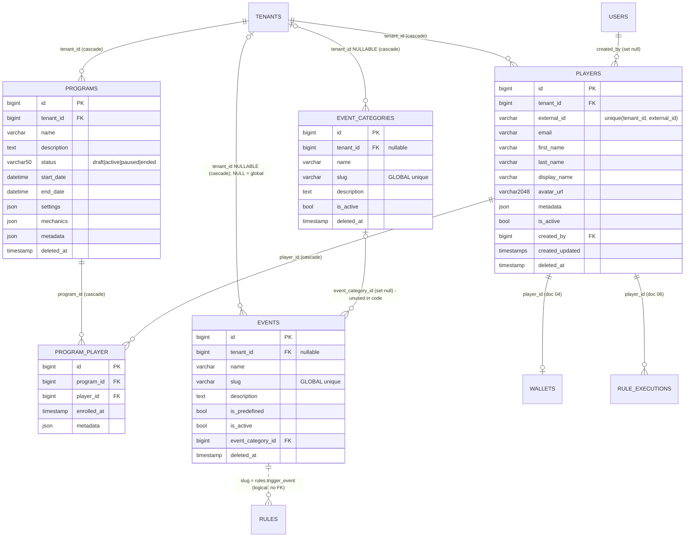
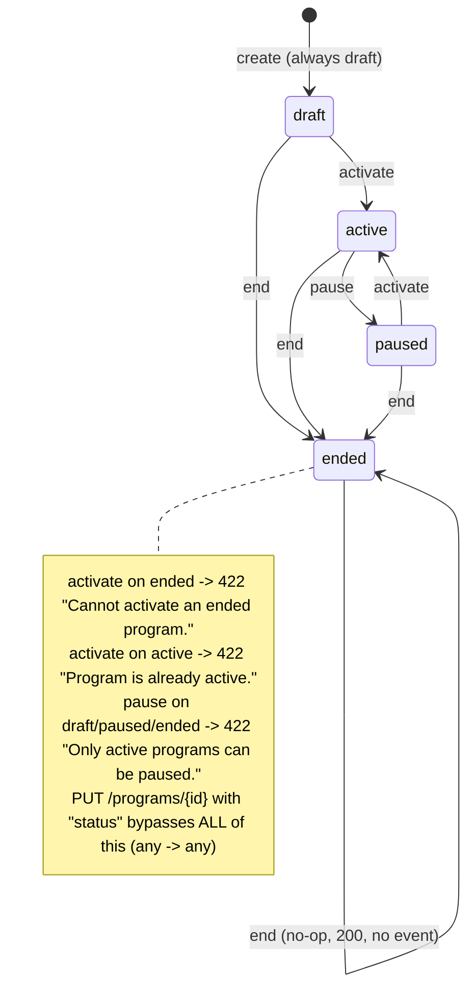

# 03 — Players, Programs, Event Catalog

Part of the LevelUpOS → Go rewrite documentation set. This file covers three Laravel sub-domains and how they map onto the Go modular-monolith blueprint (`/Users/saba/Projects/golang_advanced_blueprint`, "the blueprint"):

| Laravel sub-domain | Source root | Proposed Go module (schema) |
|---|---|---|
| Player | `app/Domain/Player` | `player` (`player_svc`) |
| Program + ProgramPlayer pivot | `app/Domain/Program` | `program` (`program_svc`) |
| Event + EventCategory | `app/Domain/Event` | `eventcatalog` (`eventcatalog_svc`), entity renamed **EventType** |

Neighbouring docs: 01 cross-cutting platform, 02 identity/tenancy (users, tenants, roles, `TenantScope`), 04 points/levels/badges, 05 missions/streaks/rewards/leaderboards, 06 rules engine and `ProcessPlayerActivityJob`. Integration points with them are called out, not re-documented.

Conventions in this doc: `path:line` cites refer to the LevelUpOS repo. **(inferred)** marks conclusions drawn from reading code, not from running it. The test suite could not be run while writing this, because `vendor/` is not installed (`php artisan test` fails on `vendor/autoload.php`), so every runtime claim is from reading the code.

---

## 0. TL;DR

- **Player**: a tenant's end user (the person being gamified), identified to the tenant's own systems by `external_id`. Unique per tenant: `(tenant_id, external_id)` (`database/migrations/2025_12_30_104958_create_players_table.php:29`). All mechanics (wallet, levels, badges, missions, streaks, rewards, rule executions) hang off `player_id`. A wallet or player level is **not** created when a player is created. They are created lazily with `getOrCreateForPlayer` (`app/Domain/Mechanics/Points/Repositories/WalletRepository.php:32`, `app/Domain/Mechanics/Levels/Repositories/PlayerLevelRepository.php:42`). There are no listeners for any Player domain event.
- **Program**: a tenant-scoped campaign container (`name`, date window, free-form `settings`/`mechanics` JSON) with a 4-state lifecycle `draft → active ⇄ paused → ended`, plus a membership pivot `program_player`. Today **nothing else in the system reads programs**. Mechanics are not program-scoped. The `mechanics` flags are stored but never enforced, and the leaderboard `scope_id` that mentions programs is a bare integer with no relation.
- **"Event" is NOT an occurrence log.** It is a **catalog of trigger types**: named, slugged definitions such as `purchase_completed` and `user_login` that rules reference by slug (`rules.trigger_event` is a free string, `app/Domain/Rule/Models/Rule.php:35`. `Event::rules()` joins on `trigger_event = slug`, `app/Domain/Event/Models/Event.php:81-84`). Rows with `tenant_id IS NULL` are **global/system ("predefined") event types** seeded once for all tenants (`database/seeders/PredefinedEventsSeeder.php:90-104`). The nullable tenant was added by `2026_01_01_162111_make_tenant_id_nullable_in_events_table.php`. Tenants can add custom ones. Actual activity occurrences are not stored here. They flow through `POST /api/v1/rules/execute` as `(player_id, trigger_event, trigger_data)` and are logged in `rule_executions` (doc 06). The catalog is **not validated** against anywhere: a rule's `trigger_event` can be any string (`app/Domain/Rule/DataTransferObjects/CreateRuleData.php:25-26`).
- **EventCategory** is a table, model, and Filament CRUD with no link to Event. The `events.event_category_id` column exists but is not fillable and has no relation. It is effectively dead.
- **Top risks** (detail in §10):
  1. `events` has **no `metadata` column**, but the factory, actions, and DTO all use it. The Event feature tests almost certainly fail.
  2. Any tenant user can create a **global** predefined event that leaks to every tenant (`EventObserver` keeps `tenant_id` null when `is_predefined=true`).
  3. Global unique `events.slug` blocks tenants from reusing a slug.
  4. `PUT /programs/{id}` writes `null` into omitted fields, including `status`, and lets you set any status, bypassing the state machine.
  5. `ProgramData` and `PlayerData` use lazy properties, so `settings`, `mechanics`, `metadata`, and timestamps are never returned.
  6. Re-creating a soft-deleted player's `external_id` returns 500.
  7. Platform admins with a null tenant hit a `TypeError` (500) in every policy.

---

## 1. Purpose, concepts, relationships

### 1.1 Player
A *player* is an end user of a tenant's product who takes part in gamification. Tenants push players over the API, keyed by their own `external_id` (`app/Domain/Player/DataTransferObjects/CreatePlayerData.php:19-20`), and can look them up by it (`routes/api/v1/players.php:11`). LevelUpOS users (`users` table, doc 02) are the tenant's **operators** (admins, program managers). They are not players. `players.created_by` records which operator created the player (`app/Observers/PlayerObserver.php:20-22`).

Relations (`app/Domain/Player/Models/Player.php`):
- `tenant()` belongsTo Tenant (`:76-79`)
- `creator()` belongsTo User via `created_by` (`:84-87`)
- `wallet()` hasOne Wallet (`:120-123`), owned by doc 04
- Inverse relations exist on mechanics models (PlayerBadge, PlayerLevel, PlayerMission, PlayerStreak, PlayerReward, Wallet, PointTransaction, RuleExecution). Every one has a DB FK `player_id → players.id ON DELETE CASCADE` (e.g. `database/migrations/2025_12_30_123555_create_wallets_table.php:19`).
- Membership in programs goes through `program_player`. **There is no `programs()` relation on Player.** Only `Program::players()` exists.
- `ExecuteRuleAction` reads `$player->currentLevel` (`app/Domain/Rule/Actions/ExecuteRuleAction.php:163`), but **Player has no `currentLevel` relation**, so it always evaluates to `null` → level `0` (bug, doc 06).

### 1.2 Program
A *program* is a time-boxed (optional `start_date`/`end_date`) gamification campaign inside a tenant, for example a "Welcome Program" or "Holiday Special" (`database/seeders/ProgramsSeeder.php:37-122`). It has:
- a status lifecycle (`ProgramStatus`, §3),
- free-form JSON: `settings` (seed and factory shape: `allow_public_signup`, `require_email_verification`, `welcome_points`), `mechanics` (feature toggles `points_enabled`, `badges_enabled`, `levels_enabled`, `missions_enabled`, `streaks_enabled`, `leaderboards_enabled`, `rewards_enabled`), and `metadata`. **None of these keys is read anywhere in the codebase (inferred, grep).** They are configuration placeholders.
- player membership (`program_player`), with `enrolled_at` and per-enrolment `metadata`.

Players can be enrolled only while the program `canAcceptPlayers()`: status `active` **and** now within `[start_date, end_date]` (`app/Domain/Program/Models/Program.php:130-151`).

### 1.3 Event (= event type / trigger catalog) and EventCategory
An `Event` row is a **definition of a kind of thing that can happen** (a trigger type). It is not a record of something that happened.
- `is_predefined = true` with `tenant_id = NULL`: system catalog visible to every tenant (seeded by `PredefinedEventsSeeder`, 10 slugs: `purchase_completed, user_signup, user_login, referral_completed, subscription_upgraded, task_completed, achievement_unlocked, level_up, badge_earned, mission_completed`, `database/seeders/PredefinedEventsSeeder.php:17-88`).
- `is_predefined = false` with `tenant_id = X`: a tenant's custom trigger types.
- `is_predefined = true` with `tenant_id = X` is also possible (factory/tests do it, `tests/Feature/Api/V1/EventControllerTest.php:276-278`): a tenant-owned "predefined" event with stricter edit rules.
- Rules (doc 06) reference events by **slug** in `rules.trigger_event` (varchar 100, `database/migrations/2025_12_30_201208_create_rules_table.php:22`). Rule execution (`POST /api/v1/rules/execute`) matches active rules by `trigger_event` string. The `events` table is **never consulted at runtime**. It only serves catalog UIs and the RulesSeeder.
- Slug formats are inconsistent. Seeded slugs use underscores (`purchase_completed`), while API-generated slugs use `Str::slug` → hyphens (`my-custom-event`, `tests/Feature/Api/V1/EventControllerTest.php:160`).

`EventCategory` (`app/Domain/Event/Models/EventCategory.php`) is a grouping catalog (name, slug, description, is_active, nullable tenant). It has no relation to `Event` in code, despite `events.event_category_id` (`database/migrations/2026_01_01_135918_create_events_table.php:24`). It is managed only via Filament (§8).

### 1.4 ER diagram



---

## 2. Data model

Production DB is MySQL (`.env.example:23`). Tests use SQLite (`phpunit.xml:26`). Every key is a `bigint unsigned` auto-increment (`$table->id()`).

### 2.1 `players` (`database/migrations/2025_12_30_104958_create_players_table.php:14-32`)

| Column | Type | Null | Default | Notes |
|---|---|---|---|---|
| id | bigint PK AI | no | | |
| tenant_id | bigint FK→tenants.id | no | | `cascadeOnDelete` (:16) |
| external_id | varchar(255) | no | | tenant's own player identifier |
| email | varchar(255) | yes | | **not unique** (only indexed) |
| first_name | varchar(255) | yes | | |
| last_name | varchar(255) | yes | | |
| display_name | varchar(255) | yes | | |
| avatar_url | varchar(2048) | yes | | |
| metadata | json | yes | | free-form. Factory shape `{source: web\|mobile\|api, registered_at: "Y-m-d H:i:s"}` (`database/factories/PlayerFactory.php:39-42`) |
| is_active | boolean | no | true | |
| created_by | bigint FK→users.id | yes | | `nullOnDelete` (:25) |
| created_at / updated_at | timestamp | yes | | |
| deleted_at | timestamp | yes | | SoftDeletes |

Indexes: `UNIQUE(tenant_id, external_id)` (:29), which **includes soft-deleted rows**. `INDEX(tenant_id, email)` (:30), `INDEX(tenant_id, is_active)` (:31).

Model `app/Domain/Player/Models/Player.php`:
- Traits: `HasFactory`, `SoftDeletes`, `HasPlayerAccessors` (:22-24)
- `$fillable`: tenant_id, external_id, email, first_name, last_name, display_name, avatar_url, metadata, is_active, created_by (:31-42)
- casts: `metadata => array`, `is_active => boolean` (:49-55). Timestamps are not cast to immutable.
- Global scope: `TenantScope` (:68-71). See §2.7.
- Accessor `full_name`: "first last" when both are set, else `display_name ?? email ?? 'Unknown Player'` (:92-99)
- Scopes: `active()` (:104-107), `byExternalId($id)` (:112-115)
- `HasPlayerAccessors` (`app/Domain/Player/Traits/HasPlayerAccessors.php:11-58`): typed getters. Several declare non-nullable returns (`getEmail(): string`, `getFirstName(): string`, …) for nullable columns, so they throw `TypeError` on null. `getCreatedAt(): CarbonImmutable` returns a mutable Carbon and would throw too. Only `getTenantId()` is used (policies).

### 2.2 `programs` (`database/migrations/2025_12_30_140000_create_programs_table.php:16-33`)

| Column | Type | Null | Default | Notes |
|---|---|---|---|---|
| id | bigint PK AI | no | | |
| tenant_id | bigint FK→tenants.id | no | | `cascadeOnDelete` (:18) |
| name | varchar(255) | no | | |
| description | text | yes | | DTO caps at 1000 chars |
| status | varchar(50) | no | `'draft'` | ProgramStatus enum value |
| start_date | datetime | yes | | |
| end_date | datetime | yes | | no check `end >= start` anywhere |
| settings | json | yes | | see §1.2 |
| mechanics | json | yes | | see §1.2 |
| metadata | json | yes | | seeder shape `{source:"seeder", created_at: ISO8601}` (`database/seeders/ProgramsSeeder.php:137-140`) |
| created_at / updated_at | timestamp | yes | | |
| deleted_at | timestamp | yes | | SoftDeletes |

Indexes: `(tenant_id, status)`, `(tenant_id, start_date, end_date)`, `(status, start_date)` (:30-32). No unique on name.

Model `app/Domain/Program/Models/Program.php`:
- `$fillable` (:32-42). casts: `status => ProgramStatus`, `start_date/end_date => datetime`, `settings/mechanics/metadata => array` (:49-59)
- `TenantScope` (:72-75)
- `players()`: belongsToMany Player via `program_player`, `withPivot(['enrolled_at','metadata'])`, `withTimestamps()` (:88-93). Player's own global scopes (TenantScope, SoftDeletes) apply to the related side.
- Scopes: `active()` (:98-101), `running()` = active|paused (:106-109), `byStatus()` (:114-117)
- `isActive()` (:122-125). `isWithinDateRange()`: false if now < start_date or now > end_date, null bounds are open (:130-143). `canAcceptPlayers()` = `status->canAcceptPlayers() && isWithinDateRange()` (:148-151)
- `HasProgramAccessors` (`app/Domain/Program/Traits/HasProgramAccessors.php`) has the same non-nullable getter problem (`getDescription(): string`, `getStartDate(): CarbonImmutable`, …).

### 2.3 `program_player` (`database/migrations/2025_12_30_140001_create_program_player_table.php:16-27`)

| Column | Type | Null | Notes |
|---|---|---|---|
| id | bigint PK AI | no | |
| program_id | FK→programs.id | no | cascadeOnDelete |
| player_id | FK→players.id | no | cascadeOnDelete |
| enrolled_at | timestamp | no | set to `now()` on attach |
| metadata | json | yes | always written as JSON string. `[]` when absent (`app/Domain/Program/Actions/AddPlayerToProgramAction.php:49-52`) |
| created_at / updated_at | timestamp | yes | |

Indexes: `UNIQUE(program_id, player_id)` (:24), `(program_id, enrolled_at)`, `(player_id, enrolled_at)`. There is **no tenant_id**. Tenancy is implied by both parents. There is no soft delete: unenrol is a hard detach.

Model `app/Domain/Program/Models/ProgramPlayer.php`: table `program_player`, casts `enrolled_at => datetime`, `metadata => array`, relations `program()`, `player()`. **Unused (dead)**: the relation does not use `->using(ProgramPlayer::class)`.

### 2.4 `events` (`database/migrations/2026_01_01_135918_create_events_table.php:16-31` + `2026_01_01_162111_make_tenant_id_nullable_in_events_table.php:14-24`)

| Column | Type | Null | Default | Notes |
|---|---|---|---|---|
| id | bigint PK AI | no | | |
| tenant_id | bigint FK→tenants.id | **yes** (after 2nd migration) | | cascadeOnDelete. NULL = global/system |
| name | varchar(255) | no | | |
| slug | varchar(255) | no | | **`UNIQUE(slug)` globally** (:20). Includes soft-deleted rows |
| description | text | yes | | |
| is_predefined | boolean | no | false | |
| is_active | boolean | no | true | |
| event_category_id | FK→event_categories.id | yes | | nullOnDelete. **Not fillable, no relation: dead** |
| created_at / updated_at | timestamp | yes | | |
| deleted_at | timestamp | yes | | SoftDeletes |

Indexes: `(tenant_id, is_predefined)`, `(tenant_id, is_active)`, `(tenant_id, slug)` (:28-30).

**There is no `metadata` column**, yet `CreateEventAction` (:33), `UpdateEventAction` (:41-43), `EventData` (:20, :38), `HasEventAccessors::getMetadata` (:70-73) and `EventFactory` (:40) all use it (§10).

Model `app/Domain/Event/Models/Event.php`:
- `$fillable`: tenant_id, name, slug, description, is_predefined, is_active (:32-39). `metadata` and `event_category_id` are absent.
- casts: booleans (:46-52). `TenantScope` (:65-68)
- `tenant()` (:73-76), `rules()` hasMany Rule on `trigger_event`→`slug` (:81-84). Not used anywhere.
- Scopes `active()`, `predefined()`, `custom()` (:89-108). `isActive()`, `isPredefined()`.
- Factory lives at `Database\Factories\Domain\Event\Models\EventFactory` (non-standard namespace, `:11`).

### 2.5 `event_categories` (`database/migrations/2026_01_01_095125_create_event_categories_table.php:14-26`)

Columns: id, `tenant_id` nullable FK cascade, name, `slug UNIQUE` (global), description text null, is_active bool default true, timestamps, softDeletes. Indexes `(tenant_id, is_active)`, `(tenant_id, slug)`.
Model `app/Domain/Event/Models/EventCategory.php`: fillable (:27-33), cast is_active, `TenantScope`, `tenant()`, `active()`. There is no observer, so `tenant_id` is never auto-set. Created via Filament by platform admins, it stays NULL (inferred).

### 2.6 JSON column shapes

| Column | Validated shape | Observed/seeded shape |
|---|---|---|
| players.metadata | any array (`#[Sometimes, Nullable]`, `CreatePlayerData.php:37-38`) | `{source, registered_at}`. Tests: `{level, experience, achievements[]}` |
| programs.settings | any array | `{allow_public_signup: bool, require_email_verification: bool, welcome_points: int}` |
| programs.mechanics | any array | `{points_enabled, badges_enabled, levels_enabled, missions_enabled, streaks_enabled, leaderboards_enabled, rewards_enabled}` all bool |
| programs.metadata | any array | `{source}` |
| program_player.metadata | `array` (`ProgramController.php:241`) | e.g. `{source:"manual", referral_code:"REF123"}` (test) |
| events.metadata | n/a (column missing) | |

There is no JSON schema validation anywhere. A JSON **list** is also accepted (PHP arrays).

### 2.7 Tenant scoping mechanics (shared, owned by doc 02)
`TenantScope::apply` (`app/Domain/Shared/Scopes/TenantScope.php:16-24`): when a user is authenticated **and** has a non-null `tenant_id`, it adds `WHERE (table.tenant_id = :userTenant OR table.tenant_id IS NULL)`. It is applied to Player, Program, Event, and EventCategory. Consequences:
- For `players`/`programs` (NOT NULL tenant), the `IS NULL` branch is inert.
- For `events`, global rows are visible to every tenant in lists.
- For an authenticated user with `tenant_id = NULL` (platform admin) **no filter is applied**: they see all tenants' rows. But see §6: policies crash for them.
- Unauthenticated contexts (queue jobs, seeders, console) are unscoped.
- Cross-tenant access to a single record therefore yields **404**, not 403, because the scope hides the row before the policy runs (asserted in tests, `tests/Feature/Api/V1/PlayerControllerTest.php:365-386`).

Tenant assignment on create is done by observers (§7.2), not by actions.

---

## 3. Enums and state machines

### 3.1 `ProgramStatus` (`app/Domain/Program/Enums/ProgramStatus.php`)

| Case | Value | label() | description() | canAcceptPlayers | canBeModified | isRunning |
|---|---|---|---|---|---|---|
| Draft | `draft` | Draft | "Program is being configured and not yet active" | no | yes | no |
| Active | `active` | Active | "Program is currently running and accepting participants" | **yes** | no | yes |
| Paused | `paused` | Paused | "Program is temporarily paused" | no | yes | yes |
| Ended | `ended` | Ended | "Program has been completed and is no longer active" | no | no | no |

(`:9-12`, `:17-25`, `:30-38`, `:43-62`). `canBeModified()` is **never called**: updates are allowed in every state.

### 3.2 Program lifecycle (exact behaviour of the actions)



| Action | Allowed from | Rejected from → error (HTTP 422, `error: program_status_error`) | Source |
|---|---|---|---|
| activate | draft, paused | active → "Program is already active."; ended → "Cannot activate an ended program." | `ActivateProgramAction.php:31-37` |
| pause | active | any other → "Only active programs can be paused." | `PauseProgramAction.php:31-33` |
| end | draft, active, paused | ended → **returns program unchanged, no event** (idempotent) | `EndProgramAction.php:30-32` |
| update (PUT) | any | none: `status` is written verbatim | `UpdateProgramAction.php:41-43` |
| delete | any | none | `DeleteProgramAction.php` |

There are no time-based transitions: nothing moves a program to `ended` when `end_date` passes, and activation ignores dates. Dates only gate enrolment.

### 3.3 Other "enums"
- `is_predefined` / `is_active` booleans on events, which affect policies (§6).
- Roles (doc 02, `app/Domain/User/Enums/Role.php`): `owner, super_admin, platform_admin, admin, program_manager, developer`. **Administrative** = owner, super_admin, platform_admin, admin (`Role::administrativeRoles()`).
- `LeaderboardScope::Program = 'program'` (`app/Domain/Mechanics/Leaderboards/Enums/LeaderboardScope.php:11`) with `leaderboards.scope_id` "segment_id or program_id" (`database/migrations/2026_01_12_162111_create_leaderboards_table.php:24`). This is a declared but **unimplemented** program integration (doc 05).

---

## 4. Business flows (Actions)

General properties of these three domains:
- **No action uses a DB transaction**, except where noted for other domains.
- Domain events are dispatched synchronously with `event(...)` **after** the write and have **no listeners** (§7).
- Lookups go through repositories whose queries carry `TenantScope` and `SoftDeletes`.
- Laravel Data DTOs validate the request automatically when injected into controllers. Failures return 422 `{message, errors}`.

### 4.1 Player

**CreatePlayerAction** (`app/Domain/Player/Actions/CreatePlayerAction.php:22-43`)
1. Validation (`CreatePlayerData.php:19-38`): `external_id` required|string|max:255. `email` sometimes|nullable|string|email|max:255. `first_name`, `last_name`, `display_name` sometimes|nullable|string|max:255. `avatar_url` sometimes|nullable|string|url|max:2048. `metadata` sometimes|nullable (array by type).
2. Uniqueness: `externalIdExists(external_id)` (`PlayerRepository.php:60-69`), scoped to the current tenant and **excluding soft-deleted** rows. If it exists → `PlayerExternalIdExistsException` → **409** `{"message":"A player with this external ID already exists.","error":"player_external_id_exists"}` (`PlayerExternalIdExistsException.php:13-27`).
3. Insert: external_id, profile fields, metadata, `is_active=true`. `PlayerObserver::creating` fills `tenant_id` from the auth user and `created_by = auth()->id()` (`app/Observers/PlayerObserver.php:14-23`).
4. `event(new PlayerCreated($player))`.
5. Not done: wallet, level, or program enrolment creation. No email uniqueness check (`emailExists` exists in the repository but is unused).
6. Races: check-then-insert without a lock. A concurrent duplicate, or an external_id that belongs to a **soft-deleted** player, hits `UNIQUE(tenant_id, external_id)` and returns **500 QueryException** (inferred).

**UpdatePlayerAction** (`UpdatePlayerAction.php:23-69`)
1. Validation (`UpdatePlayerData.php:20-39`): same rules as create, all `sometimes|nullable`, plus `is_active` sometimes|nullable|boolean. `external_id` cannot be changed.
2. find(id) or `PlayerNotFoundException` (404 `{"message":"Player not found.","error":"player_not_found"}`).
3. Builds an update map for each field that is not `Optional`. `is_active` is applied only when non-null (:57-59). `metadata` is replaced wholesale, not merged.
4. ⚠ **(inferred)** The DTO properties have `= null` defaults. With laravel-data 4.18, an omitted key most likely resolves to the default `null` rather than `Optional`. The Event "partial update" test (`EventControllerTest.php:253-267`) depends on exactly that behaviour. If so, a `PUT` with only `email` also **nulls** first_name, last_name, display_name, avatar_url, and metadata. The PUT therefore behaves as a full replace, except `is_active`. Verify before porting, and implement true PATCH semantics in Go.
5. Writes via `repository->update` (findOrFail + `update` + `fresh`), then `$player->refresh()`.
6. `event(new PlayerUpdated($player))` fires **even when nothing changed**.

**DeletePlayerAction** (`DeletePlayerAction.php:21-36`)
1. find or 404. Clones the model.
2. `repository->delete(id)` runs a query-builder delete, which the SoftDeletes scope turns into `UPDATE deleted_at`. Model events/observers do **not** fire (mass operation).
3. `event(new PlayerDeleted($clone))`.
4. Side effects: none. Wallets, levels, enrolments, etc. remain. FK cascades fire only on hard delete, which never happens. A soft-deleted player disappears from every mechanics lookup because `playerRepository->find` excludes trashed rows, from program member lists, and from stats.

**Read paths**: `find(id)`, `findByExternalId` (`PlayerRepository.php:28-33`), `paginate(15)`. `findByEmail` and `getActivePlayers` are unused.

**Integration (other docs)**: every mechanics action resolves the player with `PlayerRepositoryInterface::find` (tenant-scoped, non-trashed) and throws `PlayerNotFoundException` when it is absent: `GainXpAction.php:40`, `AwardBadgeAction.php:52`, `RecordActivityAction.php:55`, `ClaimRewardAction.php:53`, `ExecuteRuleAction.php:50`, and others. **None checks `is_active`**, so inactive players still earn points, XP, and badges (inferred, grep). Rule conditions can read `is_active`, `points` (wallet balance), and `level` (broken), and fall back to any player attribute (`ExecuteRuleAction.php:160-167`).

### 4.2 Program

**CreateProgramAction** (`CreateProgramAction.php:22-39`)
- Validation (`CreateProgramData.php:18-37`): `name` required|string|max:255. `description` sometimes|nullable|string|max:1000. `start_date`/`end_date` sometimes|nullable|date. `settings`/`mechanics`/`metadata` sometimes|nullable (array). There is **no `end_date after start_date` rule**. A `status` field in the request is silently ignored.
- Inserts `status=draft`. Dates are parsed with `now()->parse(...)` (app timezone). JSON defaults to `[]` when null.
- `ProgramObserver::creating` sets `tenant_id` from the auth user (`app/Observers/ProgramObserver.php:14-19`).
- `event(new ProgramCreated)`.

**UpdateProgramAction** (`UpdateProgramAction.php:23-73`)
- Validation (`UpdateProgramData.php:18-40`): every field sometimes|nullable. `status` is cast to `ProgramStatus` (invalid value → 422).
- ⚠ The DTO types are **not** `|Optional`, so omitted fields arrive as `null` and the `instanceof Optional` checks are always false. **Every** column is written with the request value or null. Omitting `status` writes `status = NULL` into a NOT NULL column → **500**. Omitting `name` → 500. Omitting `settings` wipes them. This is why every test sends `name` and `status` (`ProgramControllerTest.php:270-273, 293-297, 312-319`). **(Inferred from types; high confidence.)**
- `status` changes here bypass the state machine and dispatch no Activated/Paused/Ended event.
- `event(new ProgramUpdated)` always fires.

**Activate / Pause / End**: §3.2. Each does find → guard → `repository->update(['status'=>…])` → refresh → event (ProgramActivated / ProgramPaused / ProgramEnded). End is idempotent with no event.

**DeleteProgramAction** (`DeleteProgramAction.php:21-36`): find or 404 → soft delete → `ProgramDeleted`. Allowed in every state, including active. `program_player` rows remain.

**AddPlayerToProgramAction** (`AddPlayerToProgramAction.php:26-55`)
1. Controller validation (`ProgramController.php:239-242`): `player_id` required|integer|`exists:players,id`. This check is **not tenant-scoped and ignores soft deletes**. `metadata` sometimes|array.
2. Program find or 404 `program_not_found`.
3. `!canAcceptPlayers()` → 422 "Program cannot accept new players at this time." (not active, or outside the date window).
4. Player find (tenant-scoped, non-trashed) or **404** `player_not_found`. This catches other-tenant and soft-deleted players that passed the `exists` rule.
5. Already enrolled → **silent return**. The controller still answers 201 "Player added to program successfully." (idempotent).
6. `attach(player_id, {enrolled_at: now(), metadata: json_encode(metadata ?: [])})`.
7. `event(new PlayerAddedToProgram($program, $player))`.
8. Race: exists-then-attach has no lock, so a concurrent duplicate hits `UNIQUE(program_id, player_id)` → 500.
9. `is_active=false` players can be enrolled.

**RemovePlayerFromProgramAction** (`RemovePlayerFromProgramAction.php:25-47`): program 404 → player 404 → not enrolled → silent return (204) → `detach` (hard delete of the pivot row) → `PlayerRemovedFromProgram`. Works in any program status.

**Stats** (`ProgramController.php:190-205`): `{total_players: count(members), active_players: count(members where players.is_active)}`. Soft-deleted players are excluded from both counts by the related model's scope (inferred).

**Unused repository methods**: `findByStatus`, `getActivePrograms`, `getRunningPrograms`, `getProgramsAcceptingPlayers` (`ProgramRepository.php:31-82`). No caller.

### 4.3 Event catalog

**CreateEventAction** (`CreateEventAction.php:22-39`)
- Validation (`CreateEventData.php:18-34`): `name` required|string|max:255. `slug` sometimes|nullable|string|max:255, with **no format rule and no unique rule**. `description` sometimes|nullable|string|max:1000. `is_predefined` sometimes|boolean (default false). `is_active` sometimes|boolean (default true). `metadata` sometimes|nullable.
- `slug = data.slug ?? Str::slug(name)` → hyphenated lowercase.
- Inserts `metadata`, which is not fillable and is silently dropped by mass assignment.
- `EventObserver::creating` (`app/Observers/EventObserver.php:14-25`): if `is_predefined` and `tenant_id === null`, it leaves the tenant **null** (a global event). Otherwise it sets `tenant_id` from the auth user. Because the API never passes `tenant_id`, **any tenant user can create a global predefined event via the API** (§10).
- A duplicate slug in **any** tenant, including soft-deleted rows, causes a unique violation → **500**.
- `event(new EventCreated)`.

**UpdateEventAction** (`UpdateEventAction.php:21-51`)
- Validation (`UpdateEventData.php:18-31`): `name` sometimes|string|max:255 (not nullable). `slug` sometimes|nullable|string|max:255. `description` sometimes|nullable|string|max:1000. `is_active` sometimes|boolean. `metadata` sometimes|nullable. `is_predefined` cannot be changed.
- Applies name/slug only if non-null and non-empty, description/is_active/metadata only if non-null. A description therefore **cannot be cleared to null**. Metadata is dropped (not fillable).
- `repository->update` (findOrFail → 404 via ModelNotFound in theory, but the controller checks first). Changing a slug does **not** cascade to `rules.trigger_event`, which orphans rules.
- `event(new EventUpdated)`.

**DeleteEventAction** (`DeleteEventAction.php:20-27`): findOrFail → soft delete → `EventDeleted`. Rules that reference the slug keep working because rules never consult `events`.

**Repository** (`EventRepository.php`): `getActiveEvents` (unused), `getPredefinedEvents`, `getCustomEvents`, `findBySlug` (unused). All are tenant-scoped, so they include globals.

`EventNotFoundException` (`app/Domain/Event/Exceptions/EventNotFoundException.php`) is **unused** and has no render method. The controller uses `abort(404, 'Event not found.')`.

---

## 5. HTTP API

Routing: `routes/api.php:21-37` mounts every file in `routes/api/v1/*.php` under `/api/v1/{filename}` with route names `api.v1.{filename}.{name}`. Each file wraps its routes in `auth:api` (Passport guard, `config/auth.php:44-47`). Only global middleware is CORS (`bootstrap/app.php:16`). There is no rate limiting and no idempotency handling. Route params are `int` (non-numeric → TypeError → 500, inferred).

Common error shapes (Laravel defaults, `bootstrap/app.php:18-20` has no customisation):

| Case | Status | Body |
|---|---|---|
| no or invalid token | 401 | `{"message":"Unauthenticated."}` |
| policy denied | 403 | `{"message":"This action is unauthorized."}` |
| validation | 422 | `{"message":"The name field is required.","errors":{"name":["The name field is required."]}}` |
| domain exceptions | as listed | `{"message":"…","error":"<code>"}` |
| `abort(404,'Event not found.')` | 404 | `{"message":"Event not found."}` |
| user with null tenant | 500 | `TypeError` from `User::getTenantId(): int` (`app/Domain/User/Traits/HasUserAccessors.php:23-26`) |

Paginated responses use `Spatie\LaravelData\PaginatedDataCollection` (offset pagination): `{"data":[…], "links":[{url,label,active}…], "meta":{current_page, first_page_url, from, last_page, last_page_url, next_page_url, path, per_page, prev_page_url, to, total}}` (shape inferred from laravel-data v4. Tests assert `data`, `links`, `meta`, `meta.per_page`). Query `page` selects the page. `per_page` is **unbounded** (no max).

### 5.1 DTO output shapes

**PlayerData** (`app/Domain/Player/DataTransferObjects/PlayerData.php:14-29`). Emitted fields, since `Lazy` properties are excluded unless explicitly included (inferred, laravel-data semantics):
```json
{ "id": 12, "tenant_id": 3, "external_id": "ext-12345", "email": "player@game.com",
  "first_name": "John", "last_name": "Gamer", "display_name": "ProGamer",
  "avatar_url": null, "metadata": {"source":"api"}, "is_active": true, "created_by": 7 }
```
Never emitted: `full_name`, `created_at`, `updated_at` (Lazy, :26-28).

**ProgramData** (`app/Domain/Program/DataTransferObjects/ProgramData.php:15-30`). Emitted:
```json
{ "id": 5, "tenant_id": 3, "name": "Loyalty Rewards", "description": "…",
  "status": "draft", "start_date": "2026-10-01T00:00:00+00:00", "end_date": null }
```
Never emitted (Lazy): `settings`, `mechanics`, `metadata`, `player_count`, `created_at`, `updated_at`, `deleted_at`. **Clients cannot read back settings or mechanics.**

**EventData** (`app/Domain/Event/DataTransferObjects/EventData.php:12-42`). All fields emitted:
```json
{ "id": 9, "tenant_id": 3, "name": "Custom Event", "slug": "custom-event", "description": "A custom event",
  "is_predefined": false, "is_active": true, "metadata": null,
  "created_at": "2026-10-05T10:00:00+00:00", "updated_at": "2026-10-05T10:00:00+00:00" }
```
`metadata` is always null (no column).

Envelope inconsistency: Player and Program single-resource responses are **bare objects**. Event single-resource responses are wrapped in `{"data": …}`.

### 5.2 Players (`routes/api/v1/players.php`, `app/Http/Controllers/Api/V1/PlayerController.php`)

| # | Method & path | Route name | Policy | Request | Success | Errors |
|---|---|---|---|---|---|---|
| P1 | GET `/api/v1/players` | `api.v1.players.index` | `viewAny` (:31) | query: `page` only (fixed per-page 15, :33). **No filters, no sort** (DB order) | 200 paginated PlayerData | 401, 403 |
| P2 | POST `/api/v1/players` | `api.v1.players.store` | `create` (:43) | CreatePlayerData (§4.1) | **201** PlayerData (bare) | 401, 403, 409 `player_external_id_exists`, 422, 500 (soft-deleted dup or race) |
| P3 | GET `/api/v1/players/external/{externalId}` | `api.v1.players.showByExternalId` | `view` (:77) | path `externalId` (string, no `/`) | 200 PlayerData | 404 `{"message":"Player with this external ID not found.","error":"player_not_found"}` (:74) |
| P4 | GET `/api/v1/players/{player}` | `api.v1.players.show` | `view` (:61) | path int | 200 PlayerData | 404 `player_not_found` (incl. other tenant), 403 |
| P5 | PUT `/api/v1/players/{player}` | `api.v1.players.update` | `update` (:93) | UpdatePlayerData | 200 PlayerData | 404, 403, 422 |
| P6 | DELETE `/api/v1/players/{player}` | `api.v1.players.destroy` | `delete` (:111) | none | **204** empty | 404, 403 (non-admin) |

Note: for show, update, and delete, 404 is checked **before** authorization (`:55-61`), so existence of out-of-scope IDs never leaks (the scope hides them anyway).

Example P2:
```http
POST /api/v1/players
Authorization: Bearer <token>
{"external_id":"ext-12345","email":"player@game.com","first_name":"John","last_name":"Gamer","display_name":"ProGamer","metadata":{"source":"mobile"}}
```
→ `201` with the PlayerData object above. A repeat returns `409 {"message":"A player with this external ID already exists.","error":"player_external_id_exists"}`.

### 5.3 Programs (`routes/api/v1/programs.php`, `app/Http/Controllers/Api/V1/ProgramController.php`)

| # | Method & path | Route name | Policy | Request | Success | Errors |
|---|---|---|---|---|---|---|
| G1 | GET `/api/v1/programs` | `…programs.index` | `viewAny` | query `status` (enum value; an invalid value is **ignored**, :47-52), `search` (LIKE on name OR description, :55-61), `per_page` (default 15, unbounded), `page`. No sort | 200 paginated ProgramData | 401/403 |
| G2 | POST `/api/v1/programs` | `…programs.store` | `create` | CreateProgramData | **201** ProgramData (status draft) | 422 |
| G3 | GET `/api/v1/programs/{program}` | `…programs.show` | `view` | none | 200 ProgramData | 404 `{"message":"Program not found.","error":"program_not_found"}` |
| G4 | PUT `/api/v1/programs/{program}` | `…programs.update` | `update` | UpdateProgramData (effectively a **full replace**, §4.2) | 200 ProgramData | 404, 403, 422, **500 if name/status omitted** |
| G5 | DELETE `/api/v1/programs/{program}` | `…programs.destroy` | `delete` (admin) | none | **204** | 404, 403 |
| G6 | POST `/api/v1/programs/{program}/activate` | `…programs.activate` | `activate` (admin) | none | 200 ProgramData | 404, 403, 422 `program_status_error` |
| G7 | POST `/api/v1/programs/{program}/pause` | `…programs.pause` | `pause` (admin) | none | 200 | 404, 403, 422 |
| G8 | POST `/api/v1/programs/{program}/end` | `…programs.end` | `end` (admin) | none | 200 (also when already ended) | 404, 403 |
| G9 | GET `/api/v1/programs/{program}/stats` | `…programs.stats` | `view` | none | 200 `{"total_players":5,"active_players":5}` | 404 |
| G10 | GET `/api/v1/programs/{program}/players` | `…programs.players` | `view` | `per_page` (default **20**), `page` | 200 paginated PlayerData (pivot fields **not** exposed) | 404 |
| G11 | POST `/api/v1/programs/{program}/players` | `…programs.addPlayer` | **`update`** (any tenant user) | `player_id` required\|integer\|exists:players,id. `metadata` sometimes\|array | **201** `{"message":"Player added to program successfully."}` (also when already enrolled) | 404 program/player, 422 validation or "Program cannot accept new players at this time.", 500 on race |
| G12 | DELETE `/api/v1/programs/{program}/players/{player}` | `…programs.removePlayer` | `update` | none | **204** (also when not enrolled) | 404 program/player |

Order of checks for G11: program 404 → authorize → validate → action (status/date 422 → player 404 → idempotent).

Example G2 + G6:
```http
POST /api/v1/programs
{"name":"Loyalty Rewards","description":"A loyalty program","start_date":"2026-10-01T00:00:00Z","end_date":"2026-12-31T23:59:59Z","settings":{"welcome_points":100},"mechanics":{"points_enabled":true}}
→ 201 {"id":5,"tenant_id":3,"name":"Loyalty Rewards","description":"A loyalty program","status":"draft","start_date":"2026-10-01T00:00:00+00:00","end_date":"2026-12-31T23:59:59+00:00"}

POST /api/v1/programs/5/activate   → 200 {…,"status":"active"}
POST /api/v1/programs/5/activate   → 422 {"message":"Program is already active.","error":"program_status_error"}
POST /api/v1/programs/5/players {"player_id":12,"metadata":{"source":"manual"}}
→ 201 {"message":"Player added to program successfully."}
```

### 5.4 Events (`routes/api/v1/events.php`, `app/Http/Controllers/Api/V1/EventController.php`)

| # | Method & path | Route name | Policy | Request | Success | Errors |
|---|---|---|---|---|---|---|
| E1 | GET `/api/v1/events` | `…events.index` | `viewAny` | query `is_predefined` (bool-ish via FILTER_VALIDATE_BOOLEAN; any unrecognised string → false), `is_active` (same), `search` (LIKE on name OR description OR slug), `per_page` (default 15, unbounded), `page` | 200 paginated EventData, **including global events** | 401/403 |
| E2 | POST `/api/v1/events` | `…events.store` | `create` | CreateEventData | **201** `{"data": EventData}` | 422, 500 (slug collision in any tenant) |
| E3 | GET `/api/v1/events/predefined` | `…events.predefined` | `viewAny` | none | 200 `{"data":[EventData…]}` **unpaginated** (tenant + global) | |
| E4 | GET `/api/v1/events/custom` | `…events.custom` | `viewAny` | none | 200 `{"data":[…]}` unpaginated | |
| E5 | GET `/api/v1/events/{event}` | `…events.show` | `view` | none | 200 `{"data": EventData}` | 404 `{"message":"Event not found."}`, **403 for global events** (policy compares `int === null`) |
| E6 | PUT `/api/v1/events/{event}` | `…events.update` | `update` | UpdateEventData | 200 `{"data": EventData}` | 404, 403 (predefined + non-admin, or global), 422, 500 slug collision |
| E7 | DELETE `/api/v1/events/{event}` | `…events.destroy` | `delete` | none | **204** | 404, 403 (predefined always, or non-admin) |

Route order matters: `/predefined` and `/custom` are declared before `/{event}` (`routes/api/v1/events.php:11-13`).

Example E2:
```http
POST /api/v1/events
{"name":"My Custom Event","description":"Fired by our checkout","is_active":true}
→ 201 {"data":{"id":31,"tenant_id":3,"name":"My Custom Event","slug":"my-custom-event","description":"Fired by our checkout","is_predefined":false,"is_active":true,"metadata":null,"created_at":"…","updated_at":"…"}}
```

---

## 6. Authorization matrix

Policies are registered in `app/Providers/DomainServiceProvider.php:135-149, 181-186`. "Tenant user" means a user with a non-null `tenant_id`, **regardless of role, including users with no role at all** (tests create role-less users who can create players and programs: `PlayerControllerTest.php:30-36`, `ProgramControllerTest.php:213-224`). "Admin" means `isAdministrative()` = owner | super_admin | platform_admin | admin (`app/Domain/User/Traits/HasRoleHelpers.php:58-63`). "Same tenant" means `user.tenant_id === resource.tenant_id` (strict int comparison).

| Resource / action | Policy method (file:line) | Rule | owner/super_admin/platform_admin/admin (tenant) | program_manager / developer / no role (tenant) | Any user with `tenant_id = NULL` |
|---|---|---|---|---|---|
| Player list | `PlayerPolicy::viewAny` (`app/Domain/Player/Policies/PlayerPolicy.php:15-18`) | has tenant | ✅ | ✅ | 💥 500 TypeError |
| Player view / by external id | `view` (:23-26) | same tenant | ✅ | ✅ | 💥 |
| Player create | `create` (:31-34) | has tenant | ✅ | ✅ | 💥 |
| Player update | `update` (:39-42) | same tenant | ✅ | ✅ | 💥 |
| Player delete | `delete` (:47-50) | same tenant **and admin** | ✅ | ❌ 403 | 💥 |
| Program list / view / stats / members | `ProgramPolicy::viewAny/view` (`app/Domain/Program/Policies/ProgramPolicy.php:15-26`) | tenant / same tenant | ✅ | ✅ | 💥 |
| Program create | `create` (:31-34) | has tenant | ✅ | ✅ | 💥 |
| Program update, **add/remove member** | `update` (:39-42) | same tenant | ✅ | ✅ | 💥 |
| Program delete | `delete` (:47-50) | same tenant + admin | ✅ | ❌ | 💥 |
| Program activate / pause / end | `activate/pause/end` (:55-74) | same tenant + admin | ✅ | ❌ | 💥 |
| Event list / predefined / custom | `EventPolicy::viewAny` (`app/Domain/Event/Policies/EventPolicy.php:15-18`) | has tenant | ✅ | ✅ | 💥 |
| Event view | `view` (:23-26) | same tenant (**global → ❌**) | ✅ own / ❌ global | ✅ own / ❌ global | 💥 |
| Event create (incl. predefined → global!) | `create` (:31-34) | has tenant | ✅ | ✅ | 💥 |
| Event update, custom | `update` (:39-47) | same tenant | ✅ | ✅ | 💥 |
| Event update, predefined | `update` (:42-44) | same tenant + admin | ✅ own / ❌ global | ❌ | 💥 |
| Event delete, custom | `delete` (:52-60) | same tenant + admin | ✅ | ❌ | 💥 |
| Event delete, predefined | `delete` (:55-57) | never | ❌ | ❌ | ❌ |

💥: `User::getTenantId(): int` returns null and triggers a TypeError (`app/Domain/User/Traits/HasUserAccessors.php:23-26`). Platform admins without a tenant can therefore use these resources only through Filament (EventCategory only, §8).
Spatie roles are guarded by `web`/`api` and are not team-scoped (`config/permission.php:126-130`, teams off: inferred). Role semantics are covered in doc 02.

---

## 7. Domain events and observers

### 7.1 Domain events

All are plain synchronous Laravel events that carry the Eloquent model (`Dispatchable`, `SerializesModels`, and for Player/Program `InteractsWithSockets`). None implements `ShouldBroadcast` or `ShouldQueue`. **There are zero listeners or subscribers in the codebase**: no `app/Listeners`, no `Event::listen`, and no references outside the defining domains (grep). They are dead signals today.

| Class | Payload | Dispatched by | Notes |
|---|---|---|---|
| `Player\Events\PlayerCreated` | `Player $player` | CreatePlayerAction:40 | |
| `PlayerUpdated` | `Player` | UpdatePlayerAction:66 | fires even with no changes |
| `PlayerDeleted` | `Player` (clone before delete) | DeletePlayerAction:33 | |
| `Program\Events\ProgramCreated` | `Program` | CreateProgramAction:36 | |
| `ProgramUpdated` | `Program` | UpdateProgramAction:70 | also on status change via PUT |
| `ProgramActivated` | `Program` | ActivateProgramAction:45 | |
| `ProgramPaused` | `Program` | PauseProgramAction:41 | |
| `ProgramEnded` | `Program` | EndProgramAction:40 | not on idempotent re-end |
| `ProgramDeleted` | `Program` (clone) | DeleteProgramAction:33 | |
| `PlayerAddedToProgram` | `Program`, `Player` | AddPlayerToProgramAction:54 | not when already enrolled |
| `PlayerRemovedFromProgram` | `Program`, `Player` | RemovePlayerFromProgramAction:46 | not when not enrolled |
| `Event\Events\EventCreated` | `Event` | CreateEventAction:36 | |
| `EventUpdated` | `Event` | UpdateEventAction:48 | |
| `EventDeleted` | `Event` | DeleteEventAction:26 | |

Because they are dispatched outside any transaction and after the write, a listener added in Laravel would have had dual-write semantics. The Go outbox fixes this (§11).

### 7.2 Observers (registered `DomainServiceProvider.php:191-210`)

| Observer | Hook | Effect |
|---|---|---|
| `PlayerObserver` (`app/Observers/PlayerObserver.php:14-23`) | creating | if authenticated: `tenant_id ??= auth.tenant_id`. `created_by ??= auth.id` |
| `ProgramObserver` (`app/Observers/ProgramObserver.php:14-59`) | creating | `tenant_id ??= auth.tenant_id`. The created/updated/deleted/restored/forceDeleted hooks are **empty stubs** |
| `EventObserver` (`app/Observers/EventObserver.php:14-25`) | creating | if authenticated and `tenant_id === null && is_predefined`: keep null (global). Else `tenant_id ??= auth.tenant_id` |

No observer exists for EventCategory or ProgramPlayer. Mass `delete()` via the repositories bypasses deleting/deleted hooks (none exist anyway).

---

## 8. Filament admin

Panel `admin` at `/admin`, gated by `EnsurePlatformAdmin` middleware (`app/Providers/Filament/AdminPanelProvider.php:28-56`, doc 02). Resources are auto-discovered from `app/Filament/Resources`.

**Only `EventCategoryResource` exists** for this scope (`app/Filament/Resources/Domain/Event/Models/EventCategories/EventCategoryResource.php`). There is no Filament resource for Player, Program, or Event.
- Pages: list `/admin/event-categories` (inferred slug), create, edit (`:40-47`). Header actions: Create on the list page, Delete on the edit page.
- Form (`Schemas/EventCategoryForm.php:14-31`): name (required, max 255), slug (required, max 255, `unique(ignoreRecord)`), description (textarea, max 65535), is_active toggle (default true). **No tenant field**, so records are created with `tenant_id = NULL` (global) when the platform admin has no tenant (inferred).
- Table (`Tables/EventCategoriesTable.php:17-51`): columns name, slug (searchable/sortable), description (limit 50, searchable), is_active (inline `ToggleColumn`), created_at (hidden by default). Ternary filter `is_active`. Row edit action. Bulk delete (soft).

The Go rewrite needs an admin surface for categories. Fold it into `eventcatalog` admin endpoints (§11.4) or doc 01's admin strategy.

---

## 9. Existing test coverage → acceptance checklist

Files: `tests/Feature/Api/V1/PlayerControllerTest.php` (413 lines), `ProgramControllerTest.php` (777), `EventControllerTest.php` (378). Setup: RefreshDatabase, all roles seeded for both guards, a Passport personal client, one tenant plus an auth user (`Admin` for Program/Event. **No role** for Player unless assigned). There are no unit tests for actions, policies, or enums (`tests/Unit/ExampleTest.php` only). No Filament tests.

Every bullet is a Go e2e/service test to write. Items marked **[fix]** should assert the corrected behaviour rather than the legacy one (see §10).

**Players**
- [ ] List returns only own-tenant players, paginated with `data/links/meta` (`:39-78`). An empty tenant returns 0 items.
- [ ] Create with full profile → 201 and the fields echoed. Row has `tenant_id` of the caller (`:82-104`).
- [ ] Create with only `external_id` → 201 (`:106-115`). Create with nested metadata → 201 (`:117-134`).
- [ ] Missing external_id → 422 field `external_id`. Invalid email → 422 field `email` (`:136-153`).
- [ ] Duplicate external_id in the same tenant → 409 `player_external_id_exists` (`:155-169`). The same external_id in another tenant → 201 (`:171-183`).
- [ ] **[fix]** Re-create the external_id of a deleted player → decide (§12). It must not be 500.
- [ ] Show own → 200. Unknown id → 404. Other tenant's id → 404 (`:186-219`, `:365-374`).
- [ ] Lookup by external id → 200. Unknown → 404 (`:222-242`).
- [ ] Update email, display_name, is_active=false, multiple fields → 200 (`:245-305`). Unknown → 404. Other tenant → 404 (`:376-387`).
- [ ] **[fix]** A partial update leaves omitted fields untouched (PATCH semantics).
- [ ] Delete as admin, owner, or super_admin → 204 and soft-deleted (`:316-330`, `:389-411`). No role → 403 (`:332-340`). Unknown → 404.
- [ ] No token → 401 (`:351-360`).

**Programs**
- [ ] List paginated. Tenant isolation. `status` filter. `search` matches name **and** description case-insensitively (`'loyalty'` matches "loyalty program"). `per_page` honoured and echoed in `meta.per_page` (`:45-141`). **[fix]** becomes a cursor page in Go (§11).
- [ ] Create → 201 status draft, tenant set, settings/mechanics/dates persisted (`:144-202`). Missing name → 422. A role-less user may create (`:213-225`).
- [ ] Show / 404 / other tenant → 404 (`:228-259`).
- [ ] Update name, description, settings → 200 (`:262-330`). **[fix]** works without resending name/status, and status cannot be changed via update.
- [ ] Delete → 204 soft. 404. Non-admin → 403 (`:333-364`).
- [ ] Activate from draft and from paused → 200 `status: active`. 404. Non-admin 403 (`:367-415`). Add: activate active/ended → 422 (untested today).
- [ ] Pause active → 200 paused. 404. 403 (`:418-454`). Add: pause draft → 422.
- [ ] End active and paused → 200 ended. 404. 403 (`:457-504`). Add: end ended → 200 no event.
- [ ] Stats → `total_players`, `active_players`. 404. Other tenant 404 (`:507-551`).
- [ ] Member list paginated, default page size 20, per_page honoured, empty list (`:553-619`).
- [ ] Add member to an active, in-window program → 201 message plus pivot row. With metadata. Missing player_id → 422. Nonexistent player → 422. Unknown program → 404. Role-less same-tenant user allowed (`:622-718`).
- [ ] Remove member → 204, pivot row gone. Unknown program → 404. Role-less user allowed (`:721-766`).
- [ ] No token → 401 (`:768-776`).
- [ ] Add (untested today): add to a draft, paused, ended, or out-of-window program → 422. Add an other-tenant player → 404 (or 422 in Go). Double add → idempotent.

**Events (catalog)**. ⚠ Probably failing today (§10.1).
- [ ] List paginated. Tenant isolation. Filters `is_predefined`, `is_active`. `search` over name, slug, description (`:39-123`). Add: global events appear in the list.
- [ ] Create → 201 `{data}`, `is_predefined` false, `tenant_id` = caller. Slug auto-generated `my-custom-event`. Explicit slug honoured. name required, name max 255 (`:125-188`).
- [ ] Show → 200. Unknown 404. Other tenant 404 (`:190-229`). **[fix]** a global event is viewable (200).
- [ ] Update full and partial, keeping the other fields (`:231-267`). Predefined + non-admin → 403. Predefined + admin → 200 (`:269-297`).
- [ ] Delete custom → 204 soft. Predefined → 403. Non-admin → 403 (`:300-342`).
- [ ] `/predefined` and `/custom` return only their kind (`:344-378`).
- [ ] **[fix]** A tenant user cannot create a global event. Slugs are unique per (tenant ∪ global) scope, not globally.

---

## 10. Bugs, inconsistencies, dead code (do not port blindly)

### 10.1 Severe
1. **`events.metadata` column does not exist** (`database/migrations/2026_01_01_135918_create_events_table.php:16-31`, no later migration). `EventFactory` sets `'metadata' => null` (`database/factories/Domain/Event/Models/EventFactory.php:40`). Factories create unguarded, so the INSERT names a non-existent column and every Event factory call should throw. **The Event feature tests very likely all fail (inferred, not run).** Through the API, metadata is silently dropped because it is not fillable, and `EventData.metadata` is always null.
2. **Cross-tenant data leak via global events**: `POST /api/v1/events {"name":"x","is_predefined":true}` by any tenant user (no role needed) creates `tenant_id = NULL` (`EventObserver.php:17-19`). The event then appears in **every** tenant's lists. Its creator cannot view, update, or delete it afterwards (policy `int === null` → 403. Delete of predefined is always forbidden).
3. **Global `UNIQUE(slug)` on events and event_categories**: tenant B cannot create slug `checkout` if tenant A has it, including soft-deleted rows. A collision surfaces as 500 (no validation rule). Rules use `Str::slugForTenant` (`app/Providers/AppServiceProvider.php:23-31`) to dodge the same problem. Events do not.
4. **`PUT /programs/{id}` nulls omitted fields**, including `status` and `name` (NOT NULL → 500), because `UpdateProgramData` lacks `Optional` types (`UpdateProgramData.php:18-40`) while the action checks `instanceof Optional` (`UpdateProgramAction.php:33-63`).
5. **The state machine is bypassable**: `UpdateProgramData.status` lets any tenant user (not just admins) move `ended → active` and so on via PUT, without the Activated/Paused/Ended events. Activate, pause, and end are admin-only, but update is not.
6. **Soft-delete versus unique index on players**: the existence check ignores trashed rows, but the unique index includes them, so re-creating returns 500 (§4.1).
7. **Platform admins (`tenant_id NULL`) get 500** on every Player, Program, and Event endpoint because `User::getTenantId(): int` throws a TypeError (doc 02 owns the fix).

### 10.2 Functional and API inconsistencies
8. Lazy DTO fields are never serialised. Program `settings`, `mechanics`, `metadata`, `player_count`, and timestamps, and Player `full_name` and timestamps, are write-only over the API (`ProgramData.php:45-51`, `PlayerData.php:48-50`).
9. **(inferred)** `UpdatePlayerData` likely nulls omitted profile fields too (§4.1.4). Event update cannot clear `description`.
10. Envelope inconsistency: Events wrap in `{data}`, Players and Programs do not. Event single-resource 404 uses `abort` (`{message}` only) while others include `error` codes. `EventNotFoundException` is unused and unrenderable.
11. `per_page` is unbounded on 3 endpoints. Negative or huge values are accepted (DoS). Players index ignores `per_page`. Program members default to 20, everything else to 15.
12. `exists:players,id` (`ProgramController.php:240`) is not tenant-scoped and counts trashed rows. The action catches this with 404, so validation and action disagree (422 versus 404 for "player not usable").
13. Idempotent add/remove return 201/204 even when nothing happened. That is fine, but no event fires either.
14. No `end_date >= start_date` validation. Activation ignores the date window. Nothing auto-ends programs. `canBeModified()` is unused, so updates are allowed in `active`/`ended`.
15. Inactive players can be enrolled and still earn rewards everywhere (no `is_active` checks in mechanics).
16. Slug style differs between seeded predefined events (`snake_case`) and generated ones (`kebab-case`). There is no slug format validation. `rules.trigger_event` is varchar(100) but `events.slug` allows 255.
17. Rules never validate `trigger_event` against the catalog. Renaming a slug or deleting an event silently orphans rules (doc 06).
18. Search uses `LIKE %term%`, which relies on MySQL/SQLite case-insensitivity. Use `ILIKE` with a trigram index in Postgres. FILTER_VALIDATE_BOOLEAN maps garbage like `is_active=foo` to `false`.
19. Non-nullable typed accessors on nullable columns (`HasPlayerAccessors`, `HasProgramAccessors`) are latent TypeErrors.
20. `DeletePlayerAction`/`DeleteProgramAction` delete via query builder, so model events are skipped. They also cascade nothing: mechanics rows and enrolments of deleted players or programs linger.
21. Int route params with non-numeric input → TypeError 500 (inferred).
22. Check-then-act races (player create, enrol) → 500 on unique violations.

### 10.3 Seeder bugs (affect data you may migrate)
23. `ProgramsSeeder::firstOrCreate(['tenant_id'=>…], …)` keys only on tenant, so **only the first program per tenant is ever created** (`database/seeders/ProgramsSeeder.php:124-142`).
24. `RulesSeeder` operator precedence: `where tenant OR whereNull(tenant) AND slug=?` matches any event of the tenant regardless of slug (`database/seeders/RulesSeeder.php:233-236`).
25. `PlayersSeeder` comment "Create wallet (should be auto-created…)" (`database/seeders/PlayersSeeder.php:59`): it is not auto-created anywhere, which confirms the lazy-creation model.

### 10.4 Dead code
`ProgramPlayer` model. `EventCategory`↔`Event` link (`event_category_id`). `Event::rules()`. `EventNotFoundException`. Repository methods `findByEmail`, `getActivePlayers`, `emailExists`, `findByStatus`, `getActivePrograms`, `getRunningPrograms`, `getProgramsAcceptingPlayers`, `getActiveEvents`, `findBySlug`. `ProgramStatus::canBeModified/isRunning/label/description`. `ProgramObserver` stub hooks. All 14 domain events (no listeners). `programs.settings`/`mechanics` contents. `ProcessPlayerActivityJob` takes a Player but only logs (`app/Jobs/ProcessPlayerActivityJob.php:44-56`, doc 06).

---

## 11. Go blueprint mapping

Conventions applied (blueprint `CLAUDE.md`, PRD §6/§7/§8, `docs/examples.md`):
- one module per bounded context
- schema `<name>_svc`
- layers domain/app/ports/repo/transport
- `contracts/` holds topics, payloads, permissions, and the Reader
- outbox publish inside the owning tx
- idempotent, at-least-once subscribers
- casbin role checks plus service-level ownership checks (ownership here means **tenant ownership**)
- `errs` kinds
- no cross-module FK or join (bare uuid)
- keyset cursor pagination (`internal/shared/pagination`, `(created_at, id)`)
- `Principal.TenantID` from `platform/authz` (PRD §7.6, R31: "Repositories take tenant from context")

### 11.1 Module boundaries

| Module | Owns | Depends on (ports) | Offers (contracts) |
|---|---|---|---|
| `player` | players | `TenantReader` (doc 02), optional: only to reject writes for suspended tenants | `player.Reader`, topics `player.*.v1`, perms `player:*` |
| `program` | programs, enrollments | `PlayerReader` (→ player.contracts.Reader) | `program.Reader`, topics `program.*.v1`, perms `program:*` |
| `eventcatalog` | event_types, event_categories | none | `eventcatalog.Reader`, topics `eventtype.*.v1`, perms `eventcatalog:*` |

Naming: the Laravel model `Event` collides with "domain event", "bus event", and "envelope". In Go, name the entity **`EventType`** (it is a trigger-type definition) and the module **`eventcatalog`**. Keep the HTTP path `/api/v1/events` for client compatibility (open question §12). Registry order: `tenant`/identity (02) → `player` → `eventcatalog` → `program` → mechanics (04/05) → `rule` (06).

### 11.2 `player` module

**DDL** (`internal/modules/player/migrations/0001_init.sql`, applied in `player_svc`):
```sql
-- +goose Up
CREATE TABLE players (
    id            UUID PRIMARY KEY,                 -- uuid v7 (shared/id)
    tenant_id     UUID NOT NULL,                    -- bare uuid, NO FK to tenant_svc (P5)
    external_id   TEXT NOT NULL CHECK (length(external_id) BETWEEN 1 AND 255),
    email         TEXT NULL,
    first_name    TEXT NULL,
    last_name     TEXT NULL,
    display_name  TEXT NULL,
    avatar_url    TEXT NULL CHECK (avatar_url IS NULL OR length(avatar_url) <= 2048),
    metadata      JSONB NOT NULL DEFAULT '{}'::jsonb,
    is_active     BOOLEAN NOT NULL DEFAULT TRUE,
    created_by    UUID NULL,                        -- bare uuid of identity user
    legacy_id     BIGINT NULL UNIQUE,               -- Laravel players.id, for migration/lookup
    version       INT NOT NULL DEFAULT 0,
    created_at    TIMESTAMPTZ NOT NULL,
    updated_at    TIMESTAMPTZ NOT NULL,
    deleted_at    TIMESTAMPTZ NULL
);
-- Live uniqueness only: a deleted player's external_id can be re-used (fixes §10.6; confirm §12).
CREATE UNIQUE INDEX ux_players_tenant_external ON players (tenant_id, external_id) WHERE deleted_at IS NULL;
CREATE INDEX ix_players_tenant_created ON players (tenant_id, created_at DESC, id DESC) WHERE deleted_at IS NULL; -- cursor list
CREATE INDEX ix_players_tenant_email ON players (tenant_id, lower(email)) WHERE deleted_at IS NULL;
CREATE INDEX ix_players_tenant_active ON players (tenant_id, is_active) WHERE deleted_at IS NULL;
-- +goose Down
DROP TABLE players;
```
Go seed migration `0002_seed_permissions.go` inserts `contracts.AllPermissions` (pattern in examples §9).

**Domain** (`internal/domain`):
```go
type Player struct {
    ID, TenantID, ExternalID string
    Email, FirstName, LastName, DisplayName, AvatarURL *string
    Metadata  map[string]any
    Active    bool
    CreatedBy *string
    Version   int
    CreatedAt, UpdatedAt time.Time
    DeletedAt *time.Time
}
func NewPlayer(tenantID, externalID string, p Profile, createdBy *string, now time.Time) (Player, error)
func (p *Player) ApplyPatch(patch Patch, now time.Time) (changed []string)   // true PATCH: nil field = untouched; explicit null = clear
func (p *Player) Deactivate(now time.Time) / Activate(now time.Time)
func (p Player) FullName() string   // first+" "+last | display_name | email | "Unknown Player"
func (p Player) BelongsTo(tenantID string) bool
```
Invariants: tenant and external_id non-empty, external_id ≤ 255 and trimmed, email lower-cased when present, metadata is a JSON **object** (reject lists, unlike Laravel).
Errors (`internal/domain/errors.go`):
- `ErrNotFound = errs.New(errs.NotFound, "player not found")`
- `ErrExternalIDExists = errs.New(errs.AlreadyExists, "a player with this external ID already exists")` (→ 409, same as Laravel)
- `ErrNoTenant = errs.New(errs.Invalid, …)`
- `ErrVersionConflict = errs.New(errs.Conflict, …)`

**Service** (`internal/app`). Every method takes `authz.Principal` and resolves the tenant from it:

| Method | Authz | Tx / publish |
|---|---|---|
| `Create(ctx, p, CreateCmd) (Player, error)` | `PermCreate` | `tx{ repo.Create` with `INSERT … ON CONFLICT (tenant_id, external_id) WHERE deleted_at IS NULL DO NOTHING`. 0 rows → `ErrExternalIDExists` (race-safe, no pre-check). `outbox.Publish(player.created.v1) }` |
| `Get(ctx, p, id)` | `PermView` + `BelongsTo(p.TenantID)` else `ErrNotFound` (404, not 403, matching Laravel) | read |
| `GetByExternalID(ctx, p, extID)` | `PermView` | read `WHERE tenant_id=? AND external_id=? AND deleted_at IS NULL` |
| `List(ctx, p, ListQuery{Cursor, Limit≤100, Active *bool, Search})` | `PermView` | keyset `(created_at,id)` desc |
| `Update(ctx, p, id, Patch)` | `PermUpdate` + tenant ownership | `tx{ ByIDForUpdate`, ApplyPatch, Save with version check. If `changed` is non-empty, publish `player.updated.v1` (`changed_fields`, `is_active`). If `is_active` flipped, also publish `player.deactivated.v1`/`player.activated.v1`. If nothing changed: no write, no event }` |
| `Delete(ctx, p, id)` | `PermDelete` + tenant ownership | `tx{ soft delete; publish player.deleted.v1 }` |
| `Reader` impl: `ByID/ByIDs/ByExternalID/ByExternalIDs` | none (in-process trust, tenant passed explicitly) | read |

Subscriptions:
- `tenant.deleted.v1` (doc 02) → `PurgeTenant(tenantID)`. Idempotent soft-delete of all live players, batched, publishing `player.deleted.v1` per row, or one `player.tenant_purged.v1`. This replaces the FK `ON DELETE CASCADE`. Decide in §12.

**contracts/**:
```go
const (
    TopicPlayerCreated     = "player.created.v1"
    TopicPlayerUpdated     = "player.updated.v1"
    TopicPlayerDeactivated = "player.deactivated.v1"
    TopicPlayerActivated   = "player.activated.v1"
    TopicPlayerDeleted     = "player.deleted.v1"
)
type PlayerCreatedV1 struct {
    PlayerID, TenantID, ExternalID string
    DisplayName *string            `json:"display_name,omitempty"`
    IsActive   bool                `json:"is_active"`
    CreatedBy  *string             `json:"created_by,omitempty"`
    At         time.Time           `json:"at"`
}
type PlayerUpdatedV1 struct {
    PlayerID, TenantID, ExternalID string
    ChangedFields []string `json:"changed_fields"`
    IsActive      bool     `json:"is_active"`
    DisplayName   *string  `json:"display_name,omitempty"` // consumers that denormalize names (leaderboards)
    At            time.Time `json:"at"`
}
type PlayerStatusChangedV1 struct { PlayerID, TenantID string; IsActive bool; At time.Time } // activated/deactivated
type PlayerDeletedV1 struct { PlayerID, TenantID, ExternalID string; At time.Time }

var (
    PermView   = authz.Permission{Module: "player", Action: "view"}
    PermCreate = authz.Permission{Module: "player", Action: "create"}
    PermUpdate = authz.Permission{Module: "player", Action: "update"}
    PermDelete = authz.Permission{Module: "player", Action: "delete"}
    AllPermissions = []authz.Permission{PermView, PermCreate, PermUpdate, PermDelete}
)

type Player struct {           // projection, NOT the entity
    ID, TenantID, ExternalID string
    DisplayName string         // computed FullName()
    Email       *string        // consider omitting (PII): only notifications need it
    Active      bool
    Deleted     bool
}
type Reader interface {
    ByID(ctx context.Context, tenantID, id string) (Player, error)                    // errs.NotFound if missing/other tenant/deleted
    ByIDs(ctx context.Context, tenantID string, ids []string) (map[string]Player, error)
    ByExternalID(ctx context.Context, tenantID, externalID string) (Player, error)
    ByExternalIDs(ctx context.Context, tenantID string, externalIDs []string) (map[string]Player, error)
}
```
**Addressing**: tenant systems know players by `external_id`, as the `/players/external/{externalId}` lookup shows. Mechanics endpoints today take the internal `player_id`. The ingestion path (doc 06) should accept `external_id` and resolve it through `ByExternalID`. That is why `ByExternalID(s)` is offered from day one.

**Consumers of `player.Reader` / topics (integration)**:
- 04 points/levels: today they create wallets and levels lazily (`getOrCreateForPlayer`). Keep lazy idempotent upserts, or subscribe to `player.created.v1` and upsert on unique `(player_id)` / `(tenant_id, player_id)` as in the wallet example (examples §6). Either way, port the existence check as `PlayerReader.ByID`. Decide whether inactive players may earn (§12). Subscribe to `player.deleted.v1` to freeze or purge wallets (replaces the FK cascade).
- 05 leaderboards: need `ByIDs` for display names, or denormalize via `player.updated.v1`.
- 06 rules: `ByID`/`ByExternalID` plus the `is_active` attribute for conditions. The `level`/`points` facts come from 04's readers, not from player.

**Transport** (`internal/transport`), mounted at `/api/v1`, all under `httpx.RequireAuth`:

| Go route | Maps from | Notes |
|---|---|---|
| `GET /players?cursor=&limit=&active=&search=` | P1 | cursor page `{items:[…], next_cursor}`. Envelope standard is decided in doc 01 |
| `POST /players` | P2 | 201. Platform `Idempotency-Key` supported |
| `GET /players/external/{externalId}` | P3 | URL-encode the external id |
| `GET /players/{id}` | P4 | |
| `PATCH /players/{id}` (+ `PUT` alias for compatibility) | P5 | true partial update |
| `DELETE /players/{id}` | P6 | 204 |
| `GET /internal/players?ids=` / `?external_ids=&tenant_id=` | n/a | batch surface for remote adapters (examples §8), service-credential only |

DTOs carry validate tags: `ExternalID string \`validate:"required,max=255"\``, `Email *string \`validate:"omitempty,email,max=255"\``, `AvatarURL *string \`validate:"omitempty,url,max=2048"\``, names `max=255`. Response DTO returns **all** fields, including `full_name`, `created_at`, and `updated_at` (fixes §10.8).

### 11.3 `program` module

**DDL** (`program_svc`):
```sql
-- +goose Up
CREATE TABLE programs (
    id          UUID PRIMARY KEY,
    tenant_id   UUID NOT NULL,                         -- bare uuid
    name        TEXT NOT NULL CHECK (length(name) BETWEEN 1 AND 255),
    description TEXT NULL CHECK (description IS NULL OR length(description) <= 1000),
    status      TEXT NOT NULL DEFAULT 'draft' CHECK (status IN ('draft','active','paused','ended')),
    start_at    TIMESTAMPTZ NULL,
    end_at      TIMESTAMPTZ NULL,
    settings    JSONB NOT NULL DEFAULT '{}'::jsonb,
    mechanics   JSONB NOT NULL DEFAULT '{}'::jsonb,
    metadata    JSONB NOT NULL DEFAULT '{}'::jsonb,
    legacy_id   BIGINT NULL UNIQUE,
    version     INT NOT NULL DEFAULT 0,
    created_at  TIMESTAMPTZ NOT NULL,
    updated_at  TIMESTAMPTZ NOT NULL,
    deleted_at  TIMESTAMPTZ NULL,
    CONSTRAINT ck_programs_window CHECK (start_at IS NULL OR end_at IS NULL OR end_at >= start_at)
);
CREATE INDEX ix_programs_tenant_created ON programs (tenant_id, created_at DESC, id DESC) WHERE deleted_at IS NULL;
CREATE INDEX ix_programs_tenant_status ON programs (tenant_id, status) WHERE deleted_at IS NULL;
CREATE INDEX ix_programs_name_trgm ON programs USING gin (name gin_trgm_ops); -- if pg_trgm allowed; else ILIKE scan

-- Membership: program_id is an intra-module FK (allowed); player_id is a BARE uuid (no FK to player_svc).
CREATE TABLE enrollments (
    program_id    UUID NOT NULL REFERENCES programs(id) ON DELETE CASCADE,
    player_id     UUID NOT NULL,
    tenant_id     UUID NOT NULL,          -- denormalized for tenant-scoped queries without joining
    player_active BOOLEAN NOT NULL DEFAULT TRUE,   -- denormalized via player.*.v1 for stats.active_players
    enrolled_at   TIMESTAMPTZ NOT NULL,
    metadata      JSONB NOT NULL DEFAULT '{}'::jsonb,
    created_at    TIMESTAMPTZ NOT NULL,
    updated_at    TIMESTAMPTZ NOT NULL,
    PRIMARY KEY (program_id, player_id)
);
CREATE INDEX ix_enrollments_program_cursor ON enrollments (program_id, enrolled_at DESC, player_id DESC);
CREATE INDEX ix_enrollments_player ON enrollments (player_id);
-- +goose Down
DROP TABLE enrollments; DROP TABLE programs;
```
Columns are renamed `start_date`/`end_date` → `start_at`/`end_at` internally. Keep the JSON names `start_date`/`end_date` at the API for compatibility.

**Domain**:
```go
type Status string // draft|active|paused|ended
type Program struct { ID, TenantID, Name string; Description *string; Status Status; StartAt, EndAt *time.Time
    Settings, Mechanics, Metadata map[string]any; Version int; CreatedAt, UpdatedAt time.Time; DeletedAt *time.Time }
func NewProgram(tenantID, name string, ..., now time.Time) (Program, error)  // status=draft, window check
func (p *Program) Activate(now) error  // from draft|paused; active→ErrAlreadyActive; ended→ErrEnded
func (p *Program) Pause(now) error     // only from active → ErrNotActive
func (p *Program) End(now) (changed bool) // idempotent
func (p *Program) Edit(patch EditPatch, now) ([]string, error) // NO status field; window invariant
func (p Program) AcceptsEnrollment(now time.Time) bool          // active && within window (open bounds)
type Enrollment struct { ProgramID, PlayerID, TenantID string; EnrolledAt time.Time; Metadata map[string]any }
```
Errors:
- `ErrNotFound` (NotFound). Status errors keep Laravel parity with **`errs.Invalid` → 422** and the same messages: "Program is already active.", "Cannot activate an ended program.", "Only active programs can be paused.", "Program cannot accept new players at this time.". `errs.Conflict` (409) is semantically better. See §12.
- `ErrBadWindow` (Invalid).
- `ErrPlayerNotFound` (NotFound), returned when the PlayerReader says missing, other tenant, or deleted.

**Service**:

| Method | Authz | Tx / publish |
|---|---|---|
| `Create` | `PermCreate` | tx{insert, `program.created.v1`} |
| `Get`, `List(cursor, limit, status, search)`, `Stats` | `PermView` + tenant ownership (404 if foreign) | read. Stats = `COUNT(*)`, `COUNT(*) FILTER (WHERE player_active)` |
| `Update(patch)` | `PermUpdate` + ownership | tx{lock, Edit, save(version), `program.updated.v1` if changed}. **Status not editable** (fixes §10.4/5) |
| `Activate/Pause/End` | `PermActivate`/`PermPause`/`PermEnd` + ownership | tx{lock row, transition, save, `program.activated.v1` / `program.paused.v1` / `program.ended.v1`}. End on ended: no write, no event, 200 |
| `Delete` | `PermDelete` + ownership | tx{soft delete, `program.deleted.v1`}. Enrollments stay (soft delete). Hard purge is a job |
| `Enroll(programID, playerID, metadata)` | `PermManageMembers` + ownership | 1) load program (no tx), check `AcceptsEnrollment(now)`. 2) **outside any tx**, `players.ByID(ctx, p.TenantID, playerID)` → NotFound → `ErrPlayerNotFound` (404). Decide whether inactive players may enroll (§12). 3) tx{re-read program `FOR SHARE` and recheck status, `INSERT … ON CONFLICT (program_id, player_id) DO NOTHING`. If inserted, publish `program.player_enrolled.v1`}. Return `created bool`: 201 when created, 200 when already enrolled (or keep 201 for parity) |
| `Unenroll(programID, playerID)` | `PermManageMembers` + ownership | tx{DELETE. If a row was deleted, publish `program.player_unenrolled.v1`}. Idempotent 204. No PlayerReader call is needed: Laravel's 404-for-unknown-player is replaced by an idempotent no-op (§12) |
| `ListMembers(programID, cursor, limit)` | `PermView` + ownership | page enrollments by `(enrolled_at, player_id)`, then hydrate with **one** `players.ByIDs` call. Players missing from the result (deleted) are omitted, as in Laravel |
| `Reader` impl | n/a | `ByID`, `ByIDs`, `ActiveForPlayer(tenantID, playerID)` (for mechanics that later become program-scoped), `IsEnrolled(programID, playerID)` |

Subscriptions (idempotent by construction):
- `player.deleted.v1` → `DELETE FROM enrollments WHERE player_id = $1`. A redelivery is a no-op. This replaces the FK cascade and matches Laravel visibility (deleted players vanish from member lists). Optionally publish unenrolled events.
- `player.deactivated.v1` / `player.activated.v1` → `UPDATE enrollments SET player_active = $2 WHERE player_id = $1`. This is order-sensitive: guard with the event `At` against a `player_active_at` column if out-of-order delivery matters (ADR-0012 unordered). Simplest alternative: drop the column and compute stats via `players.ByIDs` (can be expensive).
- `tenant.deleted.v1` → soft-delete the tenant's programs.

Jobs (optional, not in Laravel): `program.autoend` cron, a **reconciling** sweep `WHERE status IN ('active','paused') AND end_at < now()` → End(). Only add it if the product wants auto-ending (§12).

**contracts/**:
```go
const (
    TopicProgramCreated         = "program.created.v1"
    TopicProgramUpdated         = "program.updated.v1"
    TopicProgramActivated       = "program.activated.v1"
    TopicProgramPaused          = "program.paused.v1"
    TopicProgramEnded           = "program.ended.v1"
    TopicProgramDeleted         = "program.deleted.v1"
    TopicProgramPlayerEnrolled  = "program.player_enrolled.v1"
    TopicProgramPlayerUnenrolled = "program.player_unenrolled.v1"
)
type ProgramCreatedV1 struct { ProgramID, TenantID, Name, Status string; StartAt, EndAt *time.Time
    Mechanics map[string]bool `json:"mechanics"`; At time.Time }
type ProgramUpdatedV1 struct { ProgramID, TenantID string; ChangedFields []string; At time.Time }
type ProgramStatusChangedV1 struct { ProgramID, TenantID, From, To string; At time.Time } // payload for activated/paused/ended
type ProgramDeletedV1 struct { ProgramID, TenantID string; At time.Time }
type ProgramPlayerEnrolledV1 struct { ProgramID, PlayerID, TenantID string; EnrolledAt time.Time; Metadata map[string]any }
type ProgramPlayerUnenrolledV1 struct { ProgramID, PlayerID, TenantID string; At time.Time }

var (
    PermView          = authz.Permission{Module: "program", Action: "view"}
    PermCreate        = authz.Permission{Module: "program", Action: "create"}
    PermUpdate        = authz.Permission{Module: "program", Action: "update"}
    PermDelete        = authz.Permission{Module: "program", Action: "delete"}
    PermActivate      = authz.Permission{Module: "program", Action: "activate"}
    PermPause         = authz.Permission{Module: "program", Action: "pause"}
    PermEnd           = authz.Permission{Module: "program", Action: "end"}
    PermManageMembers = authz.Permission{Module: "program", Action: "manage_members"}
    AllPermissions = []authz.Permission{PermView, PermCreate, PermUpdate, PermDelete, PermActivate, PermPause, PermEnd, PermManageMembers}
)
type Program struct { ID, TenantID, Name, Status string; StartAt, EndAt *time.Time; Mechanics map[string]bool }
type Reader interface {
    ByID(ctx context.Context, tenantID, id string) (Program, error)
    ByIDs(ctx context.Context, tenantID string, ids []string) (map[string]Program, error)
    IsEnrolled(ctx context.Context, programID, playerID string) (bool, error)
}
```
No consumer exists today. Publishing is still cheap and gives 05 (program-scoped leaderboards) and future program-scoped mechanics a hook.

**Ports consumed**: `internal/ports.PlayerReader { ByID; ByIDs }` with snapshot `PlayerSnapshot{ID, TenantID, DisplayName, ExternalID, Active}`. The local adapter wraps `player/contracts.Reader`, the remote adapter calls `/internal/players` (examples §10).

**Transport**:
- `GET/POST /programs`
- `GET/PATCH(+PUT)/DELETE /programs/{id}`
- `POST /programs/{id}/activate|pause|end`
- `GET /programs/{id}/stats`
- `GET /programs/{id}/players?cursor=&limit=`
- `POST /programs/{id}/players` (body `{player_id | external_id, metadata}`. Allow `external_id` as a convenience: resolve via `PlayerReader.ByExternalID`, add to the port)
- `DELETE /programs/{id}/players/{playerId}`

The response DTO includes settings, mechanics, metadata, player_count (or a separate stats call), and timestamps.

### 11.4 `eventcatalog` module

**DDL** (`eventcatalog_svc`):
```sql
-- +goose Up
CREATE TABLE event_categories (
    id          UUID PRIMARY KEY,
    tenant_id   UUID NULL,                      -- NULL = global
    name        TEXT NOT NULL,
    slug        TEXT NOT NULL CHECK (slug ~ '^[a-z0-9]+([_-][a-z0-9]+)*$'),
    description TEXT NULL,
    is_active   BOOLEAN NOT NULL DEFAULT TRUE,
    legacy_id   BIGINT NULL UNIQUE,
    created_at  TIMESTAMPTZ NOT NULL, updated_at TIMESTAMPTZ NOT NULL, deleted_at TIMESTAMPTZ NULL
);
CREATE UNIQUE INDEX ux_event_categories_scope_slug
    ON event_categories (COALESCE(tenant_id, '00000000-0000-0000-0000-000000000000'::uuid), slug) WHERE deleted_at IS NULL;

CREATE TABLE event_types (
    id            UUID PRIMARY KEY,
    tenant_id     UUID NULL,                    -- NULL = global/system catalog entry
    category_id   UUID NULL REFERENCES event_categories(id) ON DELETE SET NULL, -- intra-module FK OK
    name          TEXT NOT NULL CHECK (length(name) BETWEEN 1 AND 255),
    slug          TEXT NOT NULL CHECK (length(slug) <= 100 AND slug ~ '^[a-z0-9]+([_-][a-z0-9]+)*$'), -- 100 = rules.trigger_event width
    description   TEXT NULL,
    is_predefined BOOLEAN NOT NULL DEFAULT FALSE,
    is_active     BOOLEAN NOT NULL DEFAULT TRUE,
    metadata      JSONB NOT NULL DEFAULT '{}'::jsonb,   -- the column Laravel forgot; may hold a payload schema (§12)
    legacy_id     BIGINT NULL UNIQUE,
    created_at    TIMESTAMPTZ NOT NULL, updated_at TIMESTAMPTZ NOT NULL, deleted_at TIMESTAMPTZ NULL,
    CONSTRAINT ck_global_is_predefined CHECK (tenant_id IS NOT NULL OR is_predefined)
);
-- per-scope uniqueness (fixes the global UNIQUE(slug)); tenant slugs may not shadow a live global slug -> enforced in service
CREATE UNIQUE INDEX ux_event_types_scope_slug
    ON event_types (COALESCE(tenant_id, '00000000-0000-0000-0000-000000000000'::uuid), slug) WHERE deleted_at IS NULL;
CREATE INDEX ix_event_types_tenant_created ON event_types (tenant_id, created_at DESC, id DESC) WHERE deleted_at IS NULL;
-- +goose Down
DROP TABLE event_types; DROP TABLE event_categories;
```
Go seed migration: the 10 predefined global event types from `PredefinedEventsSeeder`, with fixed uuids for determinism, plus the permission catalogue.

**Domain**: `EventType{ID, TenantID *string, CategoryID *string, Name, Slug, Description *string, Predefined, Active bool, Metadata map[string]any, …}`.
- `NewCustom(tenantID, name, slug?, …)`: slug defaults to the `snake_case` slug of the name. **Decide the canonical style (§12)**. Laravel used kebab-case for API-created entries.
- `NewGlobal(…)` is platform-only.
- `IsGlobal()`
- `VisibleTo(tenantID) = tenant==nil || *tenant==tenantID`
- `EditableBy(tenantID, isAdmin bool)`: global → only platform permission. Predefined tenant-owned → admin. Custom → tenant.
- `Deletable`: never if predefined.

Errors: `ErrNotFound` (404 "event not found"), `ErrSlugTaken` (AlreadyExists 409, replaces the 500), `ErrPredefinedImmutable` (PermissionDenied 403), `ErrSlugShadowsGlobal` (AlreadyExists).

**Service**:

| Method | Authz | Notes |
|---|---|---|
| `List(cursor, limit, predefined *bool, active *bool, search)` | `PermView` | `WHERE (tenant_id = $t OR tenant_id IS NULL)`. Includes globals as in Laravel |
| `ListPredefined`, `ListCustom` | `PermView` | keep the unpaginated legacy endpoints, capped (e.g. 500) |
| `Get(id)` | `PermView` + `VisibleTo` | **globals viewable** (fixes the 403) |
| `Create(cmd)` | `PermCreate`. If `cmd.Predefined`: tenant-owned predefined requires `PermManagePredefined`. **Global creation only via `PermManageGlobal`** (platform admin) | tx{insert (unique → ErrSlugTaken), `eventtype.created.v1`} |
| `Update(id, patch)` | `PermUpdate`. Predefined: `PermManagePredefined`. Global: `PermManageGlobal` | Slug change: either forbid when rules reference it (needs a `RuleReader` port, which is a cycle risk) or allow and publish `eventtype.updated.v1` with `old_slug` so `rule` can re-point (§12). tx{save, publish} |
| `Delete(id)` | `PermDelete`. Predefined → `ErrPredefinedImmutable` | tx{soft delete, `eventtype.deleted.v1`} |
| Category CRUD | `PermManageCategories` (platform) | replaces the Filament resource |
| `Reader` impl | n/a | `Resolve(ctx, tenantID, slug) (EventType, error)` (tenant entry first, then global), `BySlugs(ctx, tenantID, slugs []string) (map[string]EventType, error)`, `ByIDs` |

Subscriptions: `tenant.deleted.v1` → soft-delete tenant-owned rows.

**contracts/**:
```go
const (
    TopicEventTypeCreated = "eventtype.created.v1"
    TopicEventTypeUpdated = "eventtype.updated.v1"
    TopicEventTypeDeleted = "eventtype.deleted.v1"
)
type EventTypeCreatedV1 struct { EventTypeID string; TenantID *string; Slug, Name string; Predefined, Active bool; At time.Time }
type EventTypeUpdatedV1 struct { EventTypeID string; TenantID *string; Slug string; OldSlug *string `json:"old_slug,omitempty"`; Active bool; ChangedFields []string; At time.Time }
type EventTypeDeletedV1 struct { EventTypeID string; TenantID *string; Slug string; At time.Time }

var (
    PermView             = authz.Permission{Module: "eventcatalog", Action: "view"}
    PermCreate           = authz.Permission{Module: "eventcatalog", Action: "create"}
    PermUpdate           = authz.Permission{Module: "eventcatalog", Action: "update"}
    PermDelete           = authz.Permission{Module: "eventcatalog", Action: "delete"}
    PermManagePredefined = authz.Permission{Module: "eventcatalog", Action: "manage_predefined"} // tenant admins
    PermManageGlobal     = authz.Permission{Module: "eventcatalog", Action: "manage_global"}     // platform admins only
    PermManageCategories = authz.Permission{Module: "eventcatalog", Action: "manage_categories"} // platform admins
    AllPermissions = []authz.Permission{PermView, PermCreate, PermUpdate, PermDelete, PermManagePredefined, PermManageGlobal, PermManageCategories}
)
type EventType struct { ID string; TenantID *string; Slug, Name string; Predefined, Active, Global bool }
type Reader interface {
    Resolve(ctx context.Context, tenantID, slug string) (EventType, error)
    BySlugs(ctx context.Context, tenantID string, slugs []string) (map[string]EventType, error)
    ByIDs(ctx context.Context, ids []string) (map[string]EventType, error)
}
```
**How events feed rules (doc 06 integration)**: `rule` declares its own `EventTypeReader` port. On rule create or update it calls `Resolve(tenant, trigger_event)`: unknown or inactive → `errs.Invalid` (today unchecked). On activity ingestion the ingestion endpoint can reject or ignore unknown slugs. `rule` subscribes to `eventtype.updated.v1` (slug rename → re-point `trigger_event`, or flag) and `eventtype.deleted.v1` (mark rules orphaned or inactive). Occurrences stay in 06's domain (rule executions / activity log). `eventcatalog` never stores occurrences.

### 11.5 Role → permission seed (default grants)
Replicates today's policy behaviour (§6), with the fixes. Role ids come from doc 02's role seed.

| Permission | owner | super_admin | platform_admin | admin | program_manager | developer | (role-less tenant user) |
|---|---|---|---|---|---|---|---|
| player:view/create/update | ✅ | ✅ | ✅ | ✅ | ✅ | ✅ | ✅ today. Recommend a default "member" role, or drop |
| player:delete | ✅ | ✅ | ✅ | ✅ | ❌ | ❌ | ❌ |
| program:view/create/update/manage_members | ✅ | ✅ | ✅ | ✅ | ✅ | ✅ | ✅ today |
| program:delete/activate/pause/end | ✅ | ✅ | ✅ | ✅ | ❌ | ❌ | ❌ |
| eventcatalog:view/create/update | ✅ | ✅ | ✅ | ✅ | ✅ | ✅ | ✅ today |
| eventcatalog:delete, manage_predefined | ✅ | ✅ | ✅ | ✅ | ❌ | ❌ | ❌ |
| eventcatalog:manage_global, manage_categories | ❌ | ✅? | ✅ | ❌ | ❌ | ❌ | ❌ |

Every service method also enforces **tenant ownership** (`entity.TenantID == principal.TenantID`, else NotFound) after the casbin check. The PRD's casbin model carries a tenant field (R31). Whether grants are per-tenant (RBAC with domains) is PRD open question 1. A principal without a tenant (platform staff) must be handled explicitly: 403 for tenant resources, or an explicit `?tenant_id=` with a platform permission. Never crash.

### 11.6 Data migration notes (Laravel MySQL → Postgres schemas)
1. **IDs**: generate a uuid v7 per row and keep `legacy_id` (bigint) in each table. Build a mapping table, or a deterministic `uuid5(namespace, "players:"+id)` so other modules (04/05/06) can remap `player_id` FKs **without a cross-schema join at runtime**. A deterministic uuid5 is recommended: every module's migration computes the same uuid independently. Map `tenant_id` and `created_by` with the scheme doc 02 chooses.
2. **players**: copy every row, soft-deleted included. Check for live `(tenant_id, external_id)` duplicates (impossible today, given the index). Coerce `metadata` NULL → `{}`. Lists stay as they are or get wrapped (`{"_legacy": [...]}`): decide (§12). Lower-case emails.
3. **programs**: `status` copied verbatim (validate the enum). Datetimes: MySQL `datetime` has no timezone, so interpret it in the app timezone (`config/app.php` timezone, likely UTC, **verify**). Rows with `end < start` violate the new CHECK and need fixing or nulling. NULL JSON → `{}`.
4. **program_player → enrollments**: join to programs **in the migration script only**, to fill `tenant_id`. Skip rows whose program is hard-gone. `player_active` comes from `players.is_active AND deleted_at IS NULL`. Drop the surrogate `id`. Metadata JSON strings → JSONB (`[]` → `{}`).
5. **events → event_types**: there is no metadata to migrate. Slugs longer than 100 characters, or not matching the slug regex, need fixing. Keep `tenant_id NULL` rows as globals. Tenant-owned rows with `is_predefined=true` stay tenant-predefined. **Audit** global rows **not** created by the seeder (created through the §10.2 leak). Re-home them to the creating tenant if it can be identified (no `created_by` column exists, so match on `created_at`/logs), or delete them. `event_category_id` → `category_id` via the mapping.
6. **event_categories**: copy. Global `tenant_id NULL` stays.
7. Verify rule `trigger_event` values against the migrated catalog and report orphans to doc 06.
8. Replay nothing: no domain events were ever persisted, and the new topics start fresh. Downstream projections (`player_active`) are built by the migration, not by replaying.

---

## 12. Open questions

1. **Deleted player external_id reuse**: should re-creating a player whose external_id belongs to a soft-deleted player be allowed (partial unique index, as proposed), return 409, or **restore** the old player and their history?
2. **Inactive players**: should `is_active=false` block earning (04/05/06), enrolment, and leaderboard visibility? Today it blocks nothing.
3. **Auto-provisioning**: should activity ingestion (06) auto-create unknown players by `external_id`? This is common in gamification APIs. Today it does not.
4. **Program semantics**: are `settings.welcome_points` and the `mechanics.*_enabled` toggles meant to be enforced, and are mechanics (points, leaderboards, missions) meant to be program-scoped? This decides whether `program` needs more than placeholders and which modules subscribe to `program.*`.
5. **Auto-ending** programs at `end_date` (scheduler sweep), and refusing activation outside the window: wanted?
6. **Status error code**: keep 422 (Laravel parity) or move to 409 Conflict for invalid transitions?
7. **Idempotent membership responses**: keep 201 for "already enrolled" and 204/404 behaviour, or return 200 for no-op and 404 for unknown players on remove?
8. **HTTP compatibility**: must the Go API preserve the exact Laravel shapes (bare objects versus `{data}`, offset `meta/links` pagination, `PUT` full replace) for existing tenant integrations, or is a v1 contract break acceptable (cursor pagination, PATCH)? If compatibility matters, consider offset pagination for small catalogs (events) and cursor for players.
9. **Event naming and path**: rename the resource to `/api/v1/event-types` (Go module `eventcatalog`) or keep `/api/v1/events`?
10. **Slug canonical form**: snake_case (seeded catalog, rules) or kebab-case (API auto-slug)? Should a tenant slug be allowed to shadow a global slug?
11. **Slug rename or delete of an event type**: cascade to rules (re-point), block while referenced, or orphan?
12. **Payload schemas**: should an event type carry a JSON schema for `trigger_data` (a use for the missing `metadata` column) to validate ingestion?
13. **Who may manage the global catalog and categories**: platform_admin only, or super_admin too? Are categories per-tenant or global only?
14. **Tenant deletion**: hard purge versus soft delete of players, programs, and event types on `tenant.deleted.v1`. What retention is expected?
15. **Role-less tenant users** currently have full non-admin access to players, programs, and events. Introduce a default "member" role grant, or restrict?
16. **PII in contracts**: should `player.Reader` expose `email` to other modules at all?
