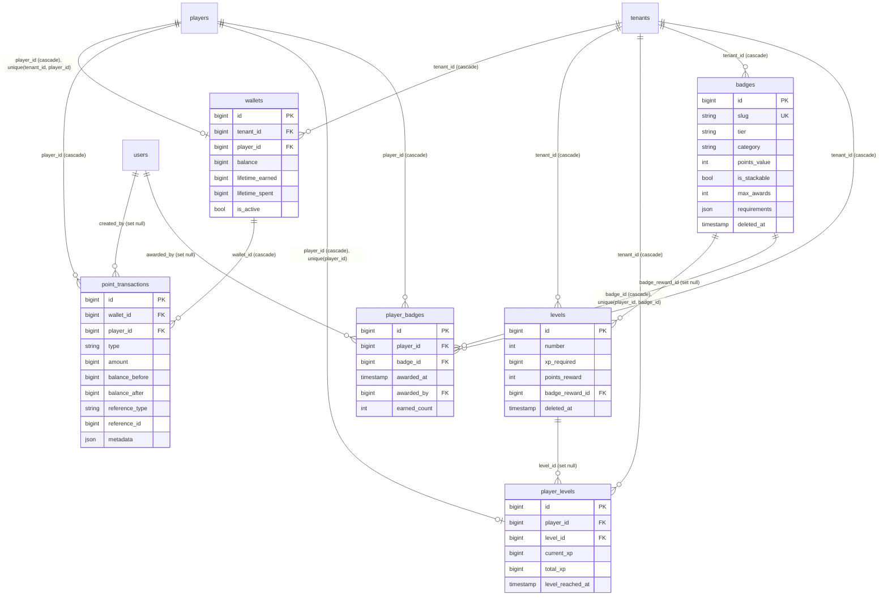
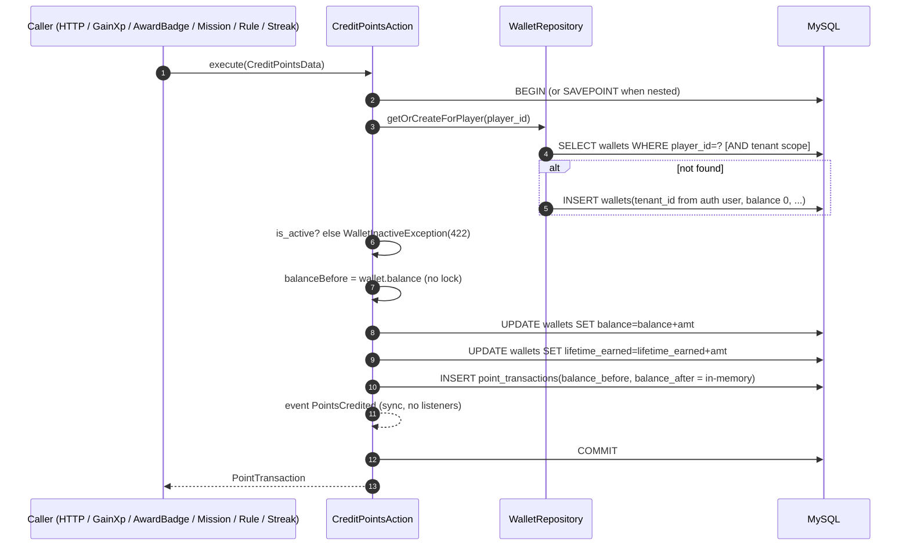
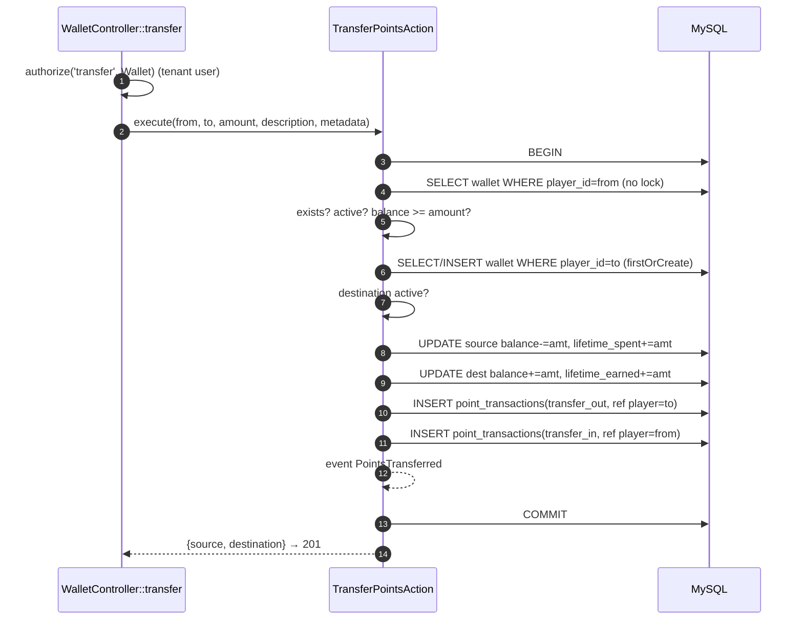
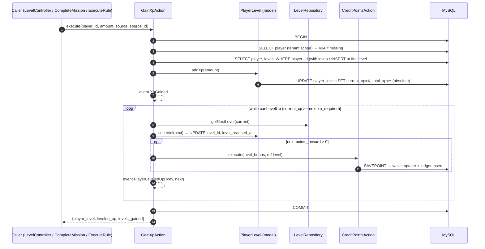
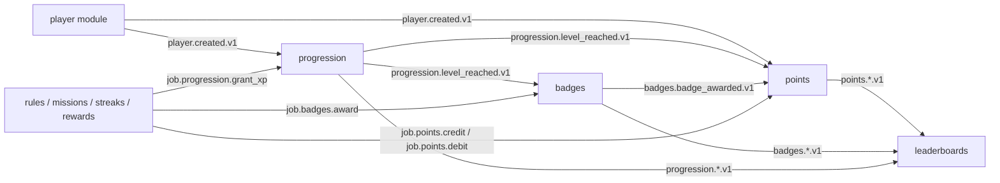

# 04 — Points (wallets), Levels (XP) and Badges

Scope: `app/Domain/Mechanics/Points`, `app/Domain/Mechanics/Levels`, `app/Domain/Mechanics/Badges`, their controllers, routes, migrations, factories, seeders, observers, policies and feature tests. Target: the Go modular monolith blueprint (`/Users/saba/Projects/golang_advanced_blueprint`, PRD + `docs/examples.md`).

Sibling documents: 01 cross-cutting, 02 identity/tenancy, 03 players/programs/events, 05 missions/streaks/rewards/leaderboards, 06 rules engine & `ProcessPlayerActivityJob`. This document only describes the integration points with them.

Conventions in this file:

- `path:line` refers to the Laravel repo at commit `9b84e42`.
- **(inferred)** marks a statement derived from framework behaviour (Laravel 12 / spatie/laravel-data 4.18) rather than read directly from project code. `vendor/` is not installed in the working tree, so framework internals could not be checked line by line.
- DB engine in `.env.example` is MySQL (`.env.example` `DB_CONNECTION=mysql`); tests use sqlite in-memory via `RefreshDatabase`.

---

## 0. Executive summary

| Area | Laravel today | What the Go port must do differently |
| --- | --- | --- |
| Point storage | `BIGINT` integer points (`wallets.balance`, `point_transactions.amount`), no decimals | Keep int64. Reuse `shared/money.Amount` (int64, overflow-checked, currency-agnostic) |
| Wallet creation | Lazy `firstOrCreate` on credit, on GET wallet, and on transfer destination | Create on `player.created.v1` (idempotent upsert) + keep a lazy upsert in credit paths |
| Concurrency | **No row lock anywhere.** `lockForUpdate()` exists but is never called (`WalletRepository.php:48-51`) | `SELECT … FOR UPDATE` + optimistic `version` on wallet, player progress and player badge |
| Overdraft | Check-then-act (`DebitPointsAction.php:45`) without lock: concurrent debits can drive the balance negative; no DB `CHECK` | Domain invariant + `CHECK (balance >= 0)` |
| Ledger | `balance_before/after` captured from the stale in-memory model (`CreditPointsAction.php:37-49`) | Compute from the locked row |
| Idempotency | None. Retries double-credit. `reference_type/reference_id` are not unique | Idempotency key per ledger entry, derived from the source (rule execution, mission completion, level reached, badge award, …) |
| XP | `addXp` writes absolute values from the in-memory model (`PlayerLevel.php:92-97`): lost updates under concurrency. No XP ledger | Locked + versioned progress row, `xp_grants` ledger with idempotency key |
| Level-up rewards | `points_reward` credited inline (nested tx); `levels.badge_reward_id` is **never awarded** | Publish `progression.level_reached.v1`; points and badges react |
| Badges | Imperative award only; `requirements` JSON is stored but never evaluated | Same (criteria engine stays in rules, doc 06) |
| Tenancy | `tenant_id` comes **only** from `auth()->user()` in observers; queue/console contexts write NULL and fail | `tenant_id` explicit in every command and event payload |
| Events | 13 Laravel events, **zero listeners**, none queued; `WalletCreated` never dispatched | Outbox-published versioned topics |
| Filament | No Filament resources exist for these mechanics | Nothing to port |

---

## 1. Purpose and concepts

### 1.1 Points (wallets)

A **wallet** is a per-player, per-tenant integer balance of points with two monotonically increasing counters (`lifetime_earned`, `lifetime_spent`) and an `is_active` switch. Every balance movement writes a **point transaction** (ledger row) carrying `type`, `amount` (always positive), `balance_before`, `balance_after`, an optional free-form `reference_type`/`reference_id` and JSON `metadata`. Movements are: credit, debit, and transfer (debit + credit across two wallets in one DB transaction).

### 1.2 Levels (XP progression)

A tenant defines a **level ladder**: rows of `levels` ordered by `number` with a cumulative `xp_required` threshold, an optional `points_reward` and an optional `badge_reward_id`. Each player has one **player level** row holding `current_xp`, `total_xp`, the current `level_id`, and `level_reached_at`. Gaining XP adds to both counters and then promotes the player level by level while `current_xp >= next.xp_required`, crediting `points_reward` for every level reached.

Note: `current_xp` is never reset on level-up, so in practice `current_xp == total_xp` and thresholds are cumulative (`GainXpAction.php:61-93`, `PlayerLevel.php:140-145`, progress maths at `PlayerLevel.php:116-135`).

### 1.3 Badges

A tenant defines **badges** (name, unique slug, tier, category, `points_value`, `is_stackable`, `max_awards`, opaque `requirements` JSON, `is_active`, `is_secret`). Awarding creates a **player badge** row (`earned_count = 1`) or, for stackable badges, increments `earned_count` up to `max_awards`. Each award (first or repeat) credits `points_value` points. Revoking deletes the player badge row entirely.

### 1.4 ER diagram (Laravel)



Other modules referencing these tables: `missions.badge_reward_id` (`Mission.php:106`), `rewards.badge_reward_id` and `rewards.level_reward_id` (`Reward.php:106,114`), leaderboards join `wallets` and `player_badges` directly (`LeaderboardRepository.php:145,186`).

---

## 2. Data model

All six tables use `$table->id()` (BIGINT UNSIGNED auto-increment PK), `timestamps()` (`created_at`, `updated_at` nullable TIMESTAMP) and `foreignId(...)->constrained()` (BIGINT UNSIGNED FK). Every model registers `TenantScope` as a global scope.

### 2.1 `wallets` — `database/migrations/2025_12_30_123555_create_wallets_table.php:16-28`

| Column | Type | Null | Default | Notes |
| --- | --- | --- | --- | --- |
| id | BIGINT UNSIGNED PK AI | no | | |
| tenant_id | BIGINT UNSIGNED FK → tenants.id | no | | `ON DELETE CASCADE` (:18) |
| player_id | BIGINT UNSIGNED FK → players.id | no | | `ON DELETE CASCADE` (:19) |
| balance | BIGINT (signed) | no | 0 | No `CHECK >= 0` (:20) |
| lifetime_earned | BIGINT | no | 0 | (:21) |
| lifetime_spent | BIGINT | no | 0 | (:22) |
| is_active | BOOLEAN | no | true | (:23) |
| created_at / updated_at | TIMESTAMP | yes | | |

Indexes: `UNIQUE (tenant_id, player_id)` (:26), `INDEX (tenant_id, balance)` (:27, used by points leaderboard). No soft deletes.

Model `App\Domain\Mechanics\Points\Models\Wallet` (`Wallet.php`):

- fillable `tenant_id, player_id, balance, lifetime_earned, lifetime_spent, is_active` (:27-34).
- casts: balance/lifetime_* → `integer`, is_active → `boolean` (:41-49).
- relations: `tenant()` BelongsTo (:70-73), `player()` BelongsTo (:78-81), `transactions()` HasMany ordered `created_at DESC` (:86-89).
- `hasSufficientBalance(int)` = `balance >= amount` (:94-97); `isActive()` (:102-105).
- `credit(int)` = `increment('balance')` then `increment('lifetime_earned')` (:110-114); `debit(int)` = `decrement('balance')` then `increment('lifetime_spent')` (:119-123). Each `increment` is a separate atomic `UPDATE … SET col = col ± ?` that also bumps `updated_at` and fires `updating/updated` model events **(inferred)**, while the in-memory attribute is updated as `old + amount` from the possibly stale model.
- `HasWalletAccessors::getMetadata()` reads a non-existent `metadata` attribute (`HasWalletAccessors.php:39-42`) — dead/buggy accessor.
- `Player::wallet()` HasOne (`app/Domain/Player/Models/Player.php:120-122`).

### 2.2 `point_transactions` — `2025_12_30_123611_create_point_transactions_table.php:16-36`

| Column | Type | Null | Default | Notes |
| --- | --- | --- | --- | --- |
| id | BIGINT PK AI | no | | |
| tenant_id | FK → tenants | no | | cascade (:18) |
| wallet_id | FK → wallets | no | | cascade (:19) |
| player_id | FK → players | no | | cascade (:20) — redundant with wallet.player_id |
| type | VARCHAR(50) | no | | `TransactionType` value (:21) |
| amount | BIGINT | no | | Always positive by convention, not enforced (:22) |
| balance_before | BIGINT | no | | (:23) |
| balance_after | BIGINT | no | | (:24) |
| description | VARCHAR(255) | yes | | (:25) |
| reference_type | VARCHAR(255) | yes | | free text: `level`, `badge`, `mission`, `rule`, `reward`, `streak`, `streak_milestone`, `player` (:26) |
| reference_id | BIGINT UNSIGNED | yes | | polymorphic id, no FK (:27) |
| metadata | JSON | yes | | free-form object from request (:28) |
| created_by | FK → users | yes | | `ON DELETE SET NULL` (:29) |
| created_at / updated_at | TIMESTAMP | yes | | |

Indexes: `(tenant_id, player_id, created_at)` (:32), `(wallet_id, created_at)` (:33), `(reference_type, reference_id)` (:34, **not unique**), `(type)` (:35).

Model `PointTransaction` (`PointTransaction.php`): fillable incl. `created_by` (:35-48); casts `type` → `TransactionType`, amounts → integer, `metadata` → array (:55-64); relations tenant/wallet/player (:85-104); `isCredit()/isDebit()` delegate to the enum (:109-120); `signed_amount` accessor = `isCredit() ? amount : -amount` (:125-128) — so `adjustment` (neither credit nor debit, see §3.1) is reported as negative.

### 2.3 `levels` — `2025_12_30_125628_create_levels_table.php:16-33`

| Column | Type | Null | Default | Notes |
| --- | --- | --- | --- | --- |
| id | BIGINT PK AI | no | | |
| tenant_id | FK → tenants | no | | cascade |
| number | INT | no | | ordinal; `UNIQUE (tenant_id, number)` (:31) incl. soft-deleted rows |
| name | VARCHAR(255) | yes | | defaulted to `"Level {number}"` by the action |
| description | TEXT | yes | | |
| xp_required | BIGINT | no | 0 | cumulative threshold |
| points_reward | INT | no | 0 | credited on reaching the level |
| badge_reward_id | FK → badges | yes | | `ON DELETE SET NULL` (:24) — never used by GainXp |
| icon_url | VARCHAR(500) | yes | | |
| color | VARCHAR(50) | yes | | |
| metadata | JSON | yes | | |
| created_at / updated_at / deleted_at | TIMESTAMP | yes | | soft deletes (:29) |

Index `(tenant_id, xp_required)` (:32).

Model `Level` (`Level.php`): SoftDeletes (:20); casts number/xp_required/points_reward/badge_reward_id → integer, metadata → array (:45-54); `badgeReward()` BelongsTo Badge (:83-86); `scopeOrdered` = `ORDER BY number` (:91-94); `getNextLevel()` = same tenant, `number > this.number` ascending first (:99-105); `getPreviousLevel()` (:110-116).

### 2.4 `player_levels` — `2025_12_30_125629_create_player_levels_table.php:16-29`

| Column | Type | Null | Default | Notes |
| --- | --- | --- | --- | --- |
| id | BIGINT PK AI | no | | |
| tenant_id | FK → tenants | no | | cascade |
| player_id | FK → players | no | | cascade; `UNIQUE (player_id)` (:26) |
| level_id | FK → levels | **yes** | | `ON DELETE SET NULL` (:20); NULL when the tenant has no levels |
| current_xp | BIGINT | no | 0 | |
| total_xp | BIGINT | no | 0 | |
| level_reached_at | TIMESTAMP | yes | | observer fills `now()` |

Indexes `(tenant_id, player_id)` (:27), `(tenant_id, total_xp)` (:28).

Model `PlayerLevel` (`PlayerLevel.php`): casts current_xp/total_xp → integer, level_reached_at → datetime (:40-47); relations tenant/player/level (:68-87); `addXp` (:92-97), `getXpToNextLevel` (:102-111), `getProgressPercentage` (:116-135), `canLevelUp` (:140-145), `setLevel` (:150-155). `HasPlayerLevelAccessors::getMetadata()` reads a non-existent column (:39-42).

### 2.5 `badges` — `2025_12_30_124521_create_badges_table.php:16-37`

| Column | Type | Null | Default | Notes |
| --- | --- | --- | --- | --- |
| id | BIGINT PK AI | no | | |
| tenant_id | FK → tenants | no | | cascade |
| name | VARCHAR(255) | no | | |
| slug | VARCHAR(255) | no | | **globally** `UNIQUE` (:20), `Str::slug(name).'-'.Str::random(5)` |
| description | TEXT | yes | | |
| image_url | VARCHAR(500) | yes | | |
| tier | VARCHAR(50) | no | `'bronze'` | `BadgeTier` |
| category | VARCHAR(50) | no | `'achievement'` | `BadgeCategory` |
| points_value | INT | no | 0 | |
| is_stackable | BOOLEAN | no | false | |
| max_awards | INT | yes | | only meaningful when stackable |
| requirements | JSON | yes | | opaque; never evaluated anywhere |
| is_active | BOOLEAN | no | true | |
| is_secret | BOOLEAN | no | false | not used for filtering in any API |
| metadata | JSON | yes | | |
| timestamps + deleted_at | | yes | | soft deletes (:33) |

Indexes `(tenant_id, tier)`, `(tenant_id, category)`, `(tenant_id, is_active)` (:35-37).

Model `Badge` (`Badge.php`): SoftDeletes; casts tier/category → enums, points_value/max_awards → integer, booleans, requirements/metadata → array (:53-66); `players()` BelongsToMany via `PlayerBadge` pivot with pivot cols (:95-101); `canAwardTo(Player)` (:130-151, **unused**); scopes `active`, `visible` (`is_secret = false`), `ofTier`, `ofCategory` (:156-183).

### 2.6 `player_badges` — `2025_12_30_124535_create_player_badges_table.php:16-29`

| Column | Type | Null | Default | Notes |
| --- | --- | --- | --- | --- |
| id | BIGINT PK AI | no | | |
| tenant_id | FK → tenants | no | | cascade |
| player_id | FK → players | no | | cascade |
| badge_id | FK → badges | no | | cascade (hard delete only; badges are soft-deleted) |
| awarded_at | TIMESTAMP | no | | last award time (overwritten on re-award) |
| awarded_by | FK → users | yes | | set null; observer sets `auth()->id()` on first award only |
| earned_count | INT | no | 1 | |
| metadata | JSON | yes | | from award request, first award only |
| timestamps | | yes | | |

Indexes: `UNIQUE (player_id, badge_id)` (:27), `(tenant_id, player_id)` (:28), `(badge_id, awarded_at)` (:29).

Model `PlayerBadge extends Pivot` (`PlayerBadge.php:17`), `$table = 'player_badges'` (:27), `$incrementing = true` (:34); casts awarded_at → datetime, earned_count → integer, metadata → array (:56-63); relations tenant/player/badge/awarder (:84-111); `incrementEarnedCount()` = atomic `increment('earned_count')` then `awarded_at = now(); save()` (:116-121).

### 2.7 Tenant scoping (applies to all models)

`TenantScope::apply` (`app/Domain/Shared/Scopes/TenantScope.php:16-24`) adds `WHERE (table.tenant_id = auth.tenant_id OR table.tenant_id IS NULL)` **only if** a user is authenticated and has a `tenant_id`. In console/queue contexts there is no scoping at all. `tenant_id` is written only by observers from `auth()->user()->tenant_id` (§7.2).

### 2.8 JSON column shapes

| Column | Shape | Source |
| --- | --- | --- |
| point_transactions.metadata | arbitrary object, nullable; client-provided on credit/debit/transfer (copied to both transfer legs) | `CreditPointsData.php:34-35`, `TransferPointsAction.php:81,96` |
| levels.metadata | arbitrary object | `CreateLevelData.php:42-43` |
| badges.requirements | arbitrary object; not interpreted | `CreateBadgeData.php:45-46` |
| badges.metadata / player_badges.metadata | arbitrary object | `CreateBadgeData.php:54-55`, `AwardBadgeData.php:21-22` |

---

## 3. Enums

### 3.1 `TransactionType` (`Points/Enums/TransactionType.php:7-68`)

| Case | Value | Label | `isCredit()` | `isDebit()` | Used by |
| --- | --- | --- | --- | --- | --- |
| Credit | `credit` | Credit | yes | | default of `CreditPointsData`; badges, rules, streaks |
| Debit | `debit` | Debit | | yes | default of `DebitPointsData`; reward claim (`ClaimRewardAction.php:87`) |
| TransferIn | `transfer_in` | Transfer In | yes | | transfer destination leg |
| TransferOut | `transfer_out` | Transfer Out | | yes | transfer source leg |
| RewardPurchase | `reward_purchase` | Reward Purchase | | yes | factories only (claims use `debit`) |
| MissionReward | `mission_reward` | Mission Reward | yes | | `CompleteMissionAction.php:80` |
| LevelBonus | `level_bonus` | Level Bonus | yes | | `GainXpAction.php:81` |
| Adjustment | `adjustment` | Adjustment | **no** | **no** | none (seeders) |
| Expiration | `expiration` | Expiration | | yes | none — no expiry mechanism exists |
| Refund | `refund` | Refund | yes | | seeders |
| Penalty | `penalty` | Penalty | | yes | seeders |

The enum classification is **not** used to choose the arithmetic: `CreditPointsAction` always adds and `DebitPointsAction` always subtracts, whatever `type` the client sent (§10).

### 3.2 `BadgeTier` (`Badges/Enums/BadgeTier.php:7-64`)

| Case | Value | rank() | defaultPoints() |
| --- | --- | --- | --- |
| Bronze | `bronze` | 1 | 10 |
| Silver | `silver` | 2 | 25 |
| Gold | `gold` | 3 | 50 |
| Platinum | `platinum` | 4 | 100 |
| Diamond | `diamond` | 5 | 250 |

`isHigherThan()` compares ranks (:60-63). `defaultPoints()` is used when `points_value` is omitted on create (`CreateBadgeAction.php:24`).

### 3.3 `BadgeCategory` (`Badges/Enums/BadgeCategory.php:7-50`)

`achievement`, `milestone`, `skill`, `social`, `exploration`, `collection`, `special`, `seasonal` — each with `label()` and `description()` (purely presentational).

---

## 4. Business flows

### 4.1 Points

#### 4.1.1 Wallet auto-creation

`WalletRepository::getOrCreateForPlayer` (`WalletRepository.php:32-43`) = `firstOrCreate(['player_id' => $id], ['balance'=>0,'lifetime_earned'=>0,'lifetime_spent'=>0,'is_active'=>true])`. The lookup is tenant-scoped via `TenantScope`; `tenant_id` is filled by `WalletObserver::creating` from the authenticated user (`WalletObserver.php:14-19`). Callers:

| Caller | When |
| --- | --- |
| `CreditPointsAction.php:31` | every credit (also nested credits from GainXp, AwardBadge, missions, rules, streaks) |
| `TransferPointsAction.php:55` | destination wallet |
| `GetWalletBalanceAction.php:19-22` | **HTTP GET** `/wallets/players/{player}/wallet` — a read creates a row |

There is no creation on player creation (`PlayerObserver` only sets tenant/creator). `WalletCreated` event exists (`Events/WalletCreated.php`) but is never dispatched. Debit and transfer-source require an existing wallet (`WalletNotFoundException`).

`firstOrCreate` is SELECT-then-INSERT: two concurrent first credits for one player collide on `UNIQUE(tenant_id, player_id)` and one request fails with a 500 `QueryException` **(inferred)**.

#### 4.1.2 Credit — `CreditPointsAction::execute` (`CreditPointsAction.php:28-60`)

1. `DB::transaction` (:30).
2. `getOrCreateForPlayer(player_id)` (:31). No lock.
3. If `!is_active` → `WalletInactiveException` (422 `wallet_inactive`) (:33-35).
4. `balanceBefore = wallet.balance` (in-memory) (:37).
5. `wallet.credit(amount)` → `UPDATE wallets SET balance = balance + ?` and `UPDATE … lifetime_earned = lifetime_earned + ?` (:39, `Wallet.php:110-114`).
6. Insert ledger row: tenant_id from wallet, wallet_id, player_id, `type` (from data, default `credit`), amount, `balance_before`, `balance_after = in-memory balance`, description, reference_type/id, metadata (:42-54). `created_by` filled by observer from auth user.
7. `event(new PointsCredited($wallet, $transaction, $amount))` (:56) — synchronous, no listeners.
8. Returns the transaction.

No amount upper bound, no idempotency, no reference uniqueness.



#### 4.1.3 Debit — `DebitPointsAction::execute` (`DebitPointsAction.php:32-75`)

1. `DB::transaction` (:34).
2. `findByPlayerId` (:35); missing → `WalletNotFoundException` 404 (:37-39). No lock.
3. Inactive → `WalletInactiveException` 422 (:41-43).
4. `!hasSufficientBalance(amount)` → `InsufficientBalanceException(requested, available)` 422 (:45-50). Balance may equal amount (→ 0).
5. `balanceBefore` in-memory (:52); `wallet.debit(amount)` → `balance - amt`, `lifetime_spent + amt` (:54).
6. Ledger insert with `type` (default `debit`) (:57-69); `PointsDebited` event (:71).

#### 4.1.4 Transfer — `TransferPointsAction::execute` (`TransferPointsAction.php:35-112`)

1. `DB::transaction` (:37) — both legs are atomic with each other.
2. Source wallet by `from_player_id`; missing → 404 `Source wallet not found.` (:38-42); inactive → 422 `Source wallet is inactive.` (:44-46); insufficient → 422 (:48-53).
3. Destination `getOrCreateForPlayer(to_player_id)` (:55); inactive → 422 `Destination wallet is inactive.` (:57-59). The destination player's existence/tenant is **not** checked.
4. `source.debit(amount)`, `destination.credit(amount)` (:64-65) — transfers count toward `lifetime_spent` / `lifetime_earned`.
5. Description defaults to `'Point transfer'` (:67).
6. Two ledger rows: source `transfer_out` with `reference_type='player'`, `reference_id=to_player_id` (:70-82); destination `transfer_in` with `reference_id=from_player_id` (:85-97). Same metadata on both. No shared transfer id.
7. `PointsTransferred(source, destination, sourceTx, destTx, amount)` (:99-105). Returns `['source'=>…, 'destination'=>…]`.

No locks, no deterministic lock order (concurrent A→B and B→A can deadlock **(inferred)**), overdraft race as in debit.



#### 4.1.5 Balance query

`GetWalletBalanceAction::execute(playerId)` = `getOrCreateForPlayer` (`GetWalletBalanceAction.php:19-22`). Transactions: `PointTransactionRepository::getByPlayerId` paginates 15/page by `created_at DESC` (`PointTransactionRepository.php:37-43`) — no secondary sort key (unstable pagination for same-second rows).

#### 4.1.6 Expiry

Not implemented. `TransactionType::Expiration` exists, there is no `expires_at`, no job, no FIFO lot tracking.

### 4.2 Levels / XP

#### 4.2.1 Level CRUD

- Create (`CreateLevelAction.php:21-39`): inserts with `name ?? "Level {number}"` (:26); `LevelCreated` event. Duplicate `(tenant_id, number)` → unique violation → 500 **(inferred)**. `badge_reward_id` is only `Min(1)` validated (no existence / tenant check; FK failure → 500).
- Update (`UpdateLevelAction.php:25-44`): `array_filter` drops nulls and `Optional` (:33-36) so fields cannot be cleared (e.g. `badge_reward_id: null` is ignored). No recalculation of player levels when `xp_required` changes. `LevelUpdated` event.
- Delete (`DeleteLevelAction.php:22-31`): soft delete via query builder (`AbstractRepository.php:95-98`). Players currently on that level keep a `level_id` pointing to a soft-deleted row; `PlayerLevel::level` then resolves to `null` (SoftDeletes scope) and subsequent `canLevelUp()` throws (§10).

#### 4.2.2 Player level auto-creation

`PlayerLevelRepository::getOrCreateForPlayer` (`PlayerLevelRepository.php:42-59`): `findByPlayerId` (with `level`), else create with `level_id = getFirstLevel()?->id` (lowest `number`, tenant-scoped), `current_xp = total_xp = 0`, `level_reached_at = now()`. Called by GainXp and by GET player level (a read creates a row). Not unique-safe under concurrency (`UNIQUE(player_id)` → 500).

#### 4.2.3 Gain XP — `GainXpAction::execute` (`GainXpAction.php:37-101`)

1. `DB::transaction` (:39).
2. `playerRepository->find(player_id)` (tenant-scoped) else `PlayerNotFoundException` 404 (:40-44).
3. `getOrCreateForPlayer` (:46).
4. `addXp(amount)`: `current_xp += amount; total_xp += amount; save()` — absolute write of in-memory values (`PlayerLevel.php:92-97`). **Lost update** under concurrency.
5. `event(XpGained(player, playerLevel, amount, source, source_id))` (:50-56).
6. Loop `while (playerLevel.canLevelUp())` (:61):
   - `canLevelUp` = `next = this.level.getNextLevel()` (tenant-filtered model method) and `current_xp >= next.xp_required` (`PlayerLevel.php:140-145`).
   - `nextLevel = levelRepository.getNextLevel(previousLevel)` — a **different** implementation, filtered only by `TenantScope` (`LevelRepository.php:60-66`) (:63). `break` if null (:65-67).
   - `setLevel(next)`: `level_id`, `level_reached_at = now()`, `save()` (:69, `PlayerLevel.php:150-155`); `refresh()`, `load('level')` (:70-71).
   - `leveledUp = true; levelsGained++` (:73-74).
   - If `points_reward > 0` → nested `CreditPointsAction` with `type=level_bonus`, `reference_type='level'`, `reference_id=level.id`, description `"Reached level {n}: {name}"` (:76-85).
   - `event(PlayerLeveledUp(player, playerLevel, previousLevel, nextLevel))` (:87-92).
7. Returns `{player_level, leveled_up, levels_gained}` (:95-99).

Algorithm properties:

- Thresholds are cumulative XP (`xp_required` compared to `current_xp`, which is never reduced).
- Multi-level jumps are supported: one `PlayerLeveledUp` and one `level_bonus` credit per level passed.
- Max level: the loop ends when there is no next level. `MaxLevelReachedException` (`Exceptions/MaxLevelReachedException.php`) and `LevelRepository::getMaxLevel/getLevelForXp` (:49-55, :71-74) are unused. XP keeps accumulating past the max level.
- `levels.badge_reward_id` is **never** awarded on level-up (seeders configure it for levels 5/10/15/20, `LevelsSeeder.php:60-75`).
- No demotion ever.
- If the tenant has no levels, `level_id` is NULL and `canLevelUp()` calls `getNextLevel()` on `null` → fatal error → 500 **(inferred)**.
- Because the level-bonus credit is nested in the same transaction, an **inactive wallet makes the whole XP grant fail** with 422 `wallet_inactive` and the XP is rolled back.
- Order of side effects inside the transaction: XpGained is dispatched before level processing; events fire even if the transaction later rolls back (no `afterCommit`).



#### 4.2.4 Read helpers

- `getXpToNextLevel()` = `max(0, next.xp_required - current_xp)` or `null` at max (`PlayerLevel.php:102-111`).
- `getProgressPercentage()` = `(current_xp - level.xp_required) / (next.xp_required - level.xp_required) * 100` clamped to [0,100]; 100 at max or when range ≤ 0 (`PlayerLevel.php:116-135`).
- Both are exposed only as `Lazy::create` properties in `PlayerLevelData` (`PlayerLevelData.php:39-40`) and are therefore **not** in API responses by default **(inferred from spatie/laravel-data lazy semantics)**.

### 4.3 Badges

#### 4.3.1 Badge CRUD

- Create (`CreateBadgeAction.php:22-46`): `points_value = data.points_value ?? tier.defaultPoints()` (:24); `slug = Str::slug(name).'-'.Str::random(5)` (:29); persists all fields; `BadgeCreated`.
- Update (`UpdateBadgeAction.php:26-49`): nulls dropped (:34-37); when `name` changes the slug is **regenerated** (new random suffix) (:39-41) — slugs are not stable identifiers. `BadgeUpdated`.
- Delete: soft delete (`DeleteBadgeAction.php:22-31`). Existing `player_badges` rows remain; `PlayerBadge::badge` then resolves to null.

#### 4.3.2 Award — `AwardBadgeAction::execute` (`AwardBadgeAction.php:43-106`)

1. `DB::transaction` (:45).
2. Badge by id (tenant scope; soft-deleted excluded) else `BadgeNotFoundException` 404 (:46-50).
3. Player by id else `PlayerNotFoundException` 404 (:52-56).
4. `!is_active` → `BadgeInactiveException` 422 (:58-60).
5. `existing = findByPlayerAndBadge` (:62-65), no lock; `isFirstEarn = !existing` (:67).
6. If existing:
   - not stackable → `BadgeAlreadyEarnedException` 422 (:70-72);
   - `max_awards !== null && earned_count >= max_awards` → `BadgeMaxAwardsReachedException(max)` 422 (:74-76);
   - `incrementEarnedCount()` (atomic increment + `awarded_at = now()`) (:78);
   - credit `points_value` if > 0 (:80-82);
   - `BadgeAwarded(player, badge, playerBadge, false)` (:84); return existing (HTTP still 201).
7. Else create `player_badges` (`awarded_at = now()`, `earned_count = 1`, `metadata`) (:90-96); observer fills `tenant_id`, `awarded_by` from auth.
8. Credit `points_value` if > 0 (:98-100) via `CreditPointsAction` with `type=credit`, `reference_type='badge'`, `reference_id=badge.id`, description `"Earned badge: {name}"` (:111-121). Inactive wallet → whole award fails.
9. `BadgeAwarded(..., isFirstEarn=true)` (:102).

Eligibility is purely: badge exists in tenant, active, player exists in tenant, stackable/max_awards rules. `requirements`, `is_secret`, tier, category play no role. `max_awards` is ignored for non-stackable badges (they are capped at 1 by the "already earned" rule). `max_awards = 1` + stackable behaves like non-stackable but with a different error code. `Badge::canAwardTo` (`Badge.php:130-151`) duplicates the rule but is unused.

#### 4.3.3 Revoke — `RevokeBadgeAction::execute` (`RevokeBadgeAction.php:30-55`)

1. Badge exists else 404 (:32-36); player exists else 404 (:38-42).
2. `findByPlayerAndBadge`; if none → return `false` (controller still answers 204) (:44-48).
3. Hard-delete the whole row regardless of `earned_count` (:50).
4. `BadgeRevoked(player, badge)` (:52).

Not transactional; points granted by the badge are **not** reversed; no audit of the revocation besides the event (which has no listener).

### 4.4 Integration points (who calls these actions)

| Caller | Calls | Data passed | Location |
| --- | --- | --- | --- |
| Rules engine `ExecuteRuleAction` action `credit_points` | `CreditPointsAction` | amount from rule action JSON, `type=credit`, `reference_type='rule'`, `reference_id = action['rule_id'] ?? null` (rule JSON normally has no `rule_id`, so usually NULL **(inferred)**) | `app/Domain/Rule/Actions/ExecuteRuleAction.php:227-242` |
| Rules engine action `grant_xp` | `GainXpAction` | `source='rule'`, `source_id = action['rule_id'] ?? null` | `ExecuteRuleAction.php:250-261` |
| Rules engine action `award_badge` | `AwardBadgeAction` | `badge_id` from action | `ExecuteRuleAction.php:269-284` |
| Rules engine overall | whole rule batch in one `DB::transaction`; any action exception is rethrown as `RuleExecutionException` → everything rolls back (including already-applied credits) | | `ExecuteRuleAction.php:49-103` |
| Missions `CompleteMissionAction` | Credit (`mission_reward`, ref `mission`), GainXp (`source='mission'`), AwardBadge (`mission.badge_reward_id`) | | `app/Domain/Mechanics/Missions/Actions/CompleteMissionAction.php:76-99` |
| Rewards `ClaimRewardAction` | Pre-check `Wallet::where(player_id)->balance` then `DebitPointsAction` (`type=debit`, ref `reward`) | | `app/Domain/Mechanics/Rewards/Actions/ClaimRewardAction.php:77-90` |
| Rewards `RedeemRewardAction` | `AwardBadgeAction` (`reward.badge_reward_id`) | | `RedeemRewardAction.php:56-61` |
| Streaks `RecordActivityAction` | Credit daily `points_per_day` (ref `streak`) and milestone `bonus_points` (ref `streak_milestone`) | | `app/Domain/Mechanics/Streaks/Actions/RecordActivityAction.php:86-107` |
| Leaderboards | SQL joins `wallets.balance` and `COUNT(player_badges.id)` | | `LeaderboardRepository.php:145-152, 181-187` |
| `ProcessPlayerActivityJob` | nothing (stub that only logs) | | `app/Jobs/ProcessPlayerActivityJob.php:44-56` |
| Level-up | `CreditPointsAction` (`level_bonus`) | | `GainXpAction.php:76-85` |
| Badge award | `CreditPointsAction` (`credit`, ref `badge`) | | `AwardBadgeAction.php:111-121` |

`rewards.level_reward_id` exists in the Reward model but no code grants a level (doc 05 to confirm).

---

## 5. HTTP API

Route files are mounted by `routes/api.php:22-36` as `/api/v1/{filename}/…` with route names `api.v1.{filename}.{name}`. All routes in scope use `auth:api` (Passport). No rate limiting or tenant middleware; tenant isolation comes from `TenantScope` and policies. Request DTOs are spatie `Data` objects injected into controllers; their attributes plus type inference generate Laravel validation rules **(inferred: `int` → `numeric`, `?T` → `nullable`, non-nullable without default → `required`, backed enum → `Enum` rule)**.

Common error responses:

| Situation | Status | Body |
| --- | --- | --- |
| No/invalid token | 401 | `{"message":"Unauthenticated."}` |
| Policy denies | 403 | `{"message":"This action is unauthorized."}` |
| Validation | 422 | `{"message":"…","errors":{"field":["…"]}}` |
| Domain exceptions | as listed | `{"error":"<code>","message":"…", …}` (see per-endpoint) |
| `PlayerNotFoundException` | 404 | `{"message":"Player not found.","error":"player_not_found"}` (`app/Domain/Player/Exceptions/PlayerNotFoundException.php`) |
| Unique/FK violations, null-deref bugs | 500 | Laravel default |
| User with `tenant_id = NULL` (platform admin) | 500 | `User::getTenantId(): int` (`HasUserAccessors.php:23-26`) throws `TypeError` inside every policy **(inferred)** |

Response DTO serialization: `Lazy::create(...)` properties are **omitted** by default; `Lazy::whenLoaded` properties appear only when the relation is loaded **(inferred)**. Dates use ISO-8601 with offset (`DATE_ATOM`, no `config/data.php` override) **(inferred)**.

### 5.1 Wallets — `routes/api/v1/wallets.php:8-23`, `WalletController.php`

| Method | Path | Route name | Controller | Authorization | Success |
| --- | --- | --- | --- | --- | --- |
| GET | `/api/v1/wallets/players/{player}/wallet` | `api.v1.wallets.wallet.show` | `show` (:38-51) | player found (tenant scope) else 404; wallet get-or-create **before** `authorize('view', $wallet)` | 200 `WalletData` |
| GET | `/api/v1/wallets/players/{player}/wallet/transactions` | `api.v1.wallets.wallet.transactions` | `transactions` (:56-69) | wallet by player (tenant scope) else 404 `wallet_not_found`; `viewTransactions` | 200 paginated `PointTransactionData` (15/page, `?page=`) |
| POST | `/api/v1/wallets/credit` | `api.v1.wallets.wallet.credit` | `credit` (:74-87) | player found else 404; `credit` (any tenant user) | 201 `PointTransactionData` |
| POST | `/api/v1/wallets/debit` | `api.v1.wallets.wallet.debit` | `debit` (:92-105) | wallet by player else 404 `wallet_not_found`; `debit` (same tenant) | 201 `PointTransactionData` |
| POST | `/api/v1/wallets/transfer` | `api.v1.wallets.wallet.transfer` | `transfer` (:110-121) | `transfer` (any tenant user); **players not validated** | 201 `{message, source_transaction, destination_transaction}` |

Request bodies:

| Endpoint | Field | Rules (attribute + inferred) | Source |
| --- | --- | --- | --- |
| credit | `player_id` | required, numeric, min:1 | `CreditPointsData.php:17-18` |
| | `amount` | required, numeric, min:1 (no max) | :20-21 |
| | `description` | nullable, string (DB limit 255 not validated → DB error/truncation on long input) | :23-24 |
| | `type` | optional, `Enum(TransactionType)`; default `credit`; **any** of the 11 values accepted | :26 |
| | `reference_type` | nullable, string | :28-29 |
| | `reference_id` | nullable, numeric | :31-32 |
| | `metadata` | nullable, array | :34-35 |
| debit | same fields, default `type=debit` | | `DebitPointsData.php:17-35` |
| transfer | `from_player_id` | required, numeric, min:1 | `TransferPointsData.php:17-18` |
| | `to_player_id` | required, numeric, min:1, `different:from_player_id` | :20-21 |
| | `amount` | required, numeric, min:1 | :23-24 |
| | `description` | nullable, string | :26-27 |
| | `metadata` | nullable, array | :29-30 |

Responses:

`WalletData` (`WalletData.php:14-24`; `created_at`/`updated_at` lazy → omitted):

```json
{ "id": 12, "tenant_id": 3, "player_id": 41, "balance": 500, "lifetime_earned": 1000, "lifetime_spent": 500, "is_active": true }
```

`PointTransactionData` (`PointTransactionData.php:15-28`; `metadata`, `created_at` lazy → omitted):

```json
{ "id": 901, "wallet_id": 12, "player_id": 41, "type": "credit", "amount": 100,
  "balance_before": 500, "balance_after": 600, "description": "Welcome bonus",
  "reference_type": null, "reference_id": null }
```

Transfer:

```json
{ "message": "Points transferred successfully.",
  "source_transaction": { "type": "transfer_out", "reference_type": "player", "reference_id": 42, "...": "..." },
  "destination_transaction": { "type": "transfer_in", "reference_type": "player", "reference_id": 41, "...": "..." } }
```

Transactions list: `{"data":[PointTransactionData…],"links":…,"meta":{current_page, per_page, total, …}}` (spatie `PaginatedDataCollection`; test asserts `data`, `links`, `meta` keys).

Domain errors:

| Code | Status | Body | Raised by |
| --- | --- | --- | --- |
| `insufficient_balance` | 422 | `{"error","message":"Insufficient balance for this transaction.","requested":100,"available":50}` | `InsufficientBalanceException.php:24-32` |
| `wallet_inactive` | 422 | message `Wallet is inactive and cannot process transactions.` / `Source wallet is inactive.` / `Destination wallet is inactive.` | `WalletInactiveException.php:13-27` |
| `wallet_not_found` | 404 | `Wallet not found.` / `Source wallet not found.` | `WalletNotFoundException.php:13-27` |

### 5.2 Levels — `routes/api/v1/levels.php:8-17`, `LevelController.php`

| Method | Path | Route name | Action | Authorization | Success |
| --- | --- | --- | --- | --- | --- |
| GET | `/api/v1/levels` | `api.v1.levels.index` | `index` (:38-45) | `viewAny` | 200 JSON **array** (not paginated) of `LevelData` ordered by `number` |
| POST | `/api/v1/levels` | `api.v1.levels.store` | `store` (:50-57) | `create` (tenant + administrative role) | 201 `LevelData` |
| GET | `/api/v1/levels/{level}` | `api.v1.levels.show` | `show` (:62-73) | 404 `level_not_found`, then `view` | 200 `LevelData` |
| PUT | `/api/v1/levels/{level}` | `api.v1.levels.update` | `update` (:78-91) | 404, then `update` (admin) | 200 `LevelData` |
| DELETE | `/api/v1/levels/{level}` | `api.v1.levels.destroy` | `destroy` (:96-109) | 404, then `delete` (admin) | 204 |
| POST | `/api/v1/levels/xp` | `api.v1.levels.xp.grant` | `grantXp` (:114-125) | `grantXp` (any tenant user) | **200** `{player_level, leveled_up, levels_gained}` |
| GET | `/api/v1/levels/players/{player}` | `api.v1.levels.player` | `playerLevel` (:130-143) | player 404 first, then `viewAny`; creates player level if missing | 200 `PlayerLevelData` |

Request bodies:

| Endpoint | Field | Rules | Source |
| --- | --- | --- | --- |
| store | `number` | required, numeric, min:1 (uniqueness not validated) | `CreateLevelData.php:18-19` |
| | `name` | nullable, string, max:255 | :21-22 |
| | `description` | nullable, string, max:1000 | :24-25 |
| | `xp_required` | required, numeric, min:0 | :27-28 |
| | `points_reward` | numeric, min:0, default 0 | :30-31 |
| | `badge_reward_id` | nullable, numeric, min:1 (no `exists`) | :33-34 |
| | `icon_url` | nullable, string, url, max:500 | :36-37 |
| | `color` | nullable, string, max:50 | :39-40 |
| | `metadata` | nullable, array | :42-43 |
| update | same fields, all `sometimes|nullable` (null = "leave unchanged") | | `UpdateLevelData.php:19-44` |
| xp | `player_id` | required, numeric, min:1 | `GainXpData.php:16-17` |
| | `amount` | required, numeric, min:1 | :19-20 |
| | `source` | nullable, string | :22-23 |
| | `source_id` | nullable, numeric | :25-26 |

`LevelData` (`LevelData.php:14-28`; `metadata`, timestamps lazy → omitted):

```json
{ "id": 7, "tenant_id": 3, "number": 2, "name": "Beginner", "description": null,
  "xp_required": 100, "points_reward": 50, "badge_reward_id": null, "icon_url": null, "color": "#ffcc00" }
```

`PlayerLevelData` (`PlayerLevelData.php:14-24`; `level` included when loaded; `xp_to_next_level`, `progress_percentage` lazy → omitted):

```json
{ "player_level": { "id": 5, "player_id": 41, "level_id": 8, "current_xp": 300, "total_xp": 300,
    "level_reached_at": "2026-01-02T10:00:00+00:00",
    "level": { "id": 8, "number": 3, "name": "Level 3", "xp_required": 250, "points_reward": 100, "...": "..." } },
  "leveled_up": true, "levels_gained": 2 }
```

`PlayerLevelData.level_id` is a non-nullable `int` (:17): a player level with `level_id = NULL` crashes serialization (500) **(inferred)**.

Errors: `level_not_found` 404 (`LevelNotFoundException.php:21-27`), `player_not_found` 404, `wallet_inactive` 422 (from nested level bonus credit).

### 5.3 Badges — `routes/api/v1/badges.php:8-18`, `BadgeController.php`

| Method | Path | Route name | Action | Authorization | Success |
| --- | --- | --- | --- | --- | --- |
| GET | `/api/v1/badges` | `api.v1.badges.index` | `index` (:40-47) | `viewAny` | 200 paginated `BadgeData` (15/page; includes inactive and secret badges; no filters) |
| POST | `/api/v1/badges` | `api.v1.badges.store` | `store` (:52-59) | `create` (admin) | 201 `BadgeData` |
| GET | `/api/v1/badges/{badge}` | `api.v1.badges.show` | `show` (:64-75) | 404 `badge_not_found` then `view` | 200 |
| PUT | `/api/v1/badges/{badge}` | `api.v1.badges.update` | `update` (:80-93) | 404 then `update` (admin) | 200 |
| DELETE | `/api/v1/badges/{badge}` | `api.v1.badges.destroy` | `destroy` (:98-111) | 404 then `delete` (admin) | 204 |
| POST | `/api/v1/badges/award` | `api.v1.badges.award` | `award` (:116-129) | badge 404 then `award` (same tenant, any role) | 201 `PlayerBadgeData` (also on stack increment) |
| DELETE | `/api/v1/badges/players/{player}/badges/{badge}` | `api.v1.badges.revoke` | `revoke` (:134-147) | badge 404 then `revoke` (admin); player 404 in action | 204 (also when the player never had it) |
| GET | `/api/v1/badges/players/{player}` | `api.v1.badges.player` | `playerBadges` (:152-165) | player 404 then `viewAny` | 200 paginated `PlayerBadgeData` with `badge`, `awarded_at DESC` |

Request bodies:

| Endpoint | Field | Rules | Source |
| --- | --- | --- | --- |
| store | `name` | required, string, max:255 | `CreateBadgeData.php:21-22` |
| | `description` | nullable, string, max:1000 | :24-25 |
| | `image_url` | nullable, string, url, max:500 | :27-28 |
| | `tier` | required, `Enum(BadgeTier)` | :30-31 |
| | `category` | required, `Enum(BadgeCategory)` | :33-34 |
| | `points_value` | nullable, numeric, min:0 (null → tier default) | :36-37 |
| | `is_stackable` | boolean, default false | :39-40 |
| | `max_awards` | nullable, numeric, min:1 | :42-43 |
| | `requirements` | nullable, array | :45-46 |
| | `is_active` | boolean, default true | :48-49 |
| | `is_secret` | boolean, default false | :51-52 |
| | `metadata` | nullable, array | :54-55 |
| update | same, all `sometimes|nullable` | | `UpdateBadgeData.php:22-56` |
| award | `player_id` | required, numeric, min:1 | `AwardBadgeData.php:15-16` |
| | `badge_id` | required, numeric, min:1 | :18-19 |
| | `metadata` | nullable, array | :21-22 |

`BadgeData` (`BadgeData.php:16-34`; `requirements`, `metadata`, timestamps lazy → omitted):

```json
{ "id": 3, "tenant_id": 3, "name": "First Steps", "slug": "first-steps-a9XkQ",
  "description": "Complete your first mission", "image_url": null, "tier": "bronze",
  "category": "achievement", "points_value": 25, "is_stackable": false, "max_awards": null,
  "is_active": true, "is_secret": false }
```

`PlayerBadgeData` (`PlayerBadgeData.php:14-23`; `badge` only when loaded — not on award responses; `metadata` lazy → omitted):

```json
{ "id": 77, "player_id": 41, "badge_id": 3, "awarded_at": "2026-01-02T10:00:00+00:00", "awarded_by": 9, "earned_count": 2 }
```

Domain errors (all `{"error","message"}`):

| Code | Status | Extra | Source |
| --- | --- | --- | --- |
| `badge_not_found` | 404 | | `BadgeNotFoundException.php:21-27` |
| `badge_inactive` | 422 | | `BadgeInactiveException.php:21-27` |
| `badge_already_earned` | 422 | | `BadgeAlreadyEarnedException.php:21-27` |
| `badge_max_awards_reached` | 422 | `max_awards` | `BadgeMaxAwardsReachedException.php:23-30` |

---

## 6. Authorization matrix

Policies registered in `DomainServiceProvider.php:140-142`. "Tenant user" = `user.tenant_id !== null`. "Same tenant" = `user.tenant_id === entity.tenant_id`. "Admin" = `isAdministrative()` = any of roles `owner`, `super_admin`, `platform_admin`, `admin` (`Role.php` `administrativeRoles()`; `HasRoleHelpers.php:58-63`). Users are back-office/API users, not players; there is no player self-service.

| Ability | Rule | Endpoint(s) | Source |
| --- | --- | --- | --- |
| Wallet `viewAny` | tenant user | (unused) | `WalletPolicy.php:15-18` |
| Wallet `view` | same tenant | GET wallet | :23-26 |
| Wallet `credit` | tenant user (no role check, no wallet) | POST credit | :31-34 |
| Wallet `debit` | same tenant | POST debit | :39-42 |
| Wallet `transfer` | tenant user (no wallet/player check) | POST transfer | :47-50 |
| Wallet `viewTransactions` | same tenant | GET transactions | :55-58 |
| Level `viewAny` | tenant user | GET levels, GET player level | `LevelPolicy.php:15-18` |
| Level `view` | same tenant | GET level | :23-26 |
| Level `create` | tenant user + admin | POST level | :31-34 |
| Level `update` / `delete` | same tenant + admin | PUT/DELETE level | :39-50 |
| Level `grantXp` | tenant user | POST xp | :55-58 |
| Badge `viewAny` | tenant user | GET badges, GET player badges | `BadgePolicy.php:15-18` |
| Badge `view` | same tenant | GET badge | :23-26 |
| Badge `create` | tenant user + admin | POST badge | :31-34 |
| Badge `update` / `delete` | same tenant + admin | PUT/DELETE badge | :39-50 |
| Badge `award` | same tenant (any role) | POST award | :55-58 |
| Badge `revoke` | same tenant + admin | DELETE revoke | :63-66 |

Role × ability (derived):

| Role | view* | credit/debit/transfer | grant XP | award badge | manage levels/badges | revoke badge |
| --- | --- | --- | --- | --- | --- | --- |
| owner / super_admin / admin (with tenant) | yes | yes | yes | yes | yes | yes |
| platform_admin (tenant_id NULL) | 500 (TypeError) | 500 | 500 | 500 | 500 | 500 |
| program_manager / developer / no role (with tenant) | yes | **yes** | **yes** | **yes** | no | no |

Observation: point credits, debits, transfers and XP grants require no role at all — any tenant API user can mint unlimited points.

---

## 7. Domain events and observers

### 7.1 Events

All events are plain synchronous classes using `Dispatchable, InteractsWithSockets, SerializesModels`; none implements `ShouldQueue`/`ShouldBroadcast`; there is no `app/Listeners` directory and no `Event::listen` registration. They are dispatched **inside** the DB transaction (no `ShouldDispatchAfterCommit`). Net effect today: no side effects.

| Event | Payload | Dispatched at |
| --- | --- | --- |
| `Points\Events\PointsCredited` | `Wallet $wallet, PointTransaction $transaction, int $amount` | `CreditPointsAction.php:56` |
| `Points\Events\PointsDebited` | same | `DebitPointsAction.php:71` |
| `Points\Events\PointsTransferred` | `sourceWallet, destinationWallet, sourceTransaction, destinationTransaction, amount` | `TransferPointsAction.php:99-105` |
| `Points\Events\WalletCreated` | `Wallet $wallet` | **never** |
| `Levels\Events\LevelCreated` / `LevelUpdated` | `Level $level` | `CreateLevelAction.php:36`, `UpdateLevelAction.php:41` |
| `Levels\Events\XpGained` | `Player, PlayerLevel, int amount, ?string source, ?int sourceId` | `GainXpAction.php:50-56` |
| `Levels\Events\PlayerLeveledUp` | `Player, PlayerLevel, Level previousLevel, Level newLevel` | `GainXpAction.php:87-92` (once per level) |
| `Badges\Events\BadgeCreated` / `BadgeUpdated` | `Badge` | `CreateBadgeAction.php:43`, `UpdateBadgeAction.php:46` |
| `Badges\Events\BadgeAwarded` | `Player, Badge, PlayerBadge, bool isFirstEarn` | `AwardBadgeAction.php:84,102` |
| `Badges\Events\BadgeRevoked` | `Player, Badge` | `RevokeBadgeAction.php:52` |

No delete events for levels/badges.

### 7.2 Observers (registered `DomainServiceProvider.php:195-200`)

| Observer | Hook | Side effect |
| --- | --- | --- |
| `WalletObserver` (`app/Observers/WalletObserver.php:14-19`) | creating | `tenant_id ??= auth user tenant` |
| `PointTransactionObserver` (:14-23) | creating | `tenant_id ??= auth tenant`; `created_by ??= auth()->id()` |
| `LevelObserver` (:14-19) | creating | `tenant_id ??= auth tenant` |
| `PlayerLevelObserver` (:14-23) | creating | `tenant_id ??= auth tenant`; `level_reached_at ??= now()` |
| `BadgeObserver` (:14-19) | creating | `tenant_id ??= auth tenant` |
| `PlayerBadgeObserver` (:14-31) | creating | `tenant_id ??= auth tenant`; `awarded_by ??= auth()->id()`; `awarded_at ??= now()`; `earned_count ??= 1` |

Consequence: any create from a context without an authenticated user (queue job, console, scheduler) inserts `tenant_id = NULL` into a `NOT NULL` column and fails — unless the caller passes `tenant_id` explicitly, which `getOrCreateForPlayer`, `PlayerLevelRepository::getOrCreateForPlayer` and `AwardBadgeAction` do not. `WalletActivitySeeder` (which calls the actions from console, `database/seeders/WalletActivitySeeder.php`) only works because `PlayersSeeder` pre-creates wallets with an explicit tenant (`PlayersSeeder.php:60`).

---

## 8. Filament admin

None. `app/Filament/Resources` contains only `Domain/Event/...`; no resource, page, widget or relation manager references `Wallet`, `PointTransaction`, `Level`, `PlayerLevel`, `Badge` or `PlayerBadge`. Nothing to port for the admin panel.

---

## 9. Existing test coverage → acceptance checklist

Feature tests: `tests/Feature/Api/V1/WalletControllerTest.php`, `LevelControllerTest.php`, `BadgeControllerTest.php` (plus indirect wallet assertions in `RewardControllerTest.php:196-236` and `RuleControllerTest.php:233-275,350-369`). No unit tests for the actions, no concurrency tests. Setup: tenant + user (wallet tests: no role; level/badge tests: `Role::Admin`) authenticated with `Passport::actingAs`.

Port each as a Go e2e/HTTP or service test (`require`, fake outbox, testcontainers for repo tests):

Wallets:

- [ ] GET wallet returns `player_id, balance, lifetime_earned, lifetime_spent` of an existing wallet (`WalletControllerTest.php:46-64`).
- [ ] GET wallet creates a zero wallet when missing (`:66-81`) — in Go the wallet should already exist from `player.created.v1`; keep the lazy upsert for parity.
- [ ] GET wallet → 404 for unknown player (`:83-87`) and for a player of another tenant (`:89-98`).
- [ ] Transactions list returns `data[*].{id,wallet_id,player_id,type,amount}` + `links` + `meta`, 5 rows (`:102-126`); 404 when no wallet (`:128-132`).
- [ ] Credit creates wallet, returns 201 with `balance_before 0 / balance_after 100`, wallet balance and `lifetime_earned` = 100 (`:136-157`).
- [ ] Credit on existing wallet 500 → 600 (`:159-183`).
- [ ] Credit with `type=mission_reward` + reference echoes the type (`:185-198`).
- [ ] Credit validation: missing `player_id` 422 (`:200-207`), negative amount 422 (`:209-217`); unknown player 404 (`:219-226`).
- [ ] Debit 500 → 400, `lifetime_spent` 100, 201 (`:230-258`); insufficient → 422 `{error: insufficient_balance, requested: 100, available: 50}` (`:260-278`); no wallet 404 (`:280-287`).
- [ ] Transfer moves 100 (source 400, dest 100), body has `message, source_transaction, destination_transaction` (`:291-325`); creates destination wallet (`:327-350`); insufficient 422 (`:352-373`); same player → 422 on `to_player_id` (`:375-384`); missing source wallet 404 (`:386-398`).
- [ ] Inactive wallet: credit 422 `wallet_inactive` (`:402-417`), debit 422 (`:419-435`).
- [ ] Unauthenticated → 401 (`:439-446`).

Levels:

- [ ] Index ordered by number, top-level array (`LevelControllerTest.php:46-70`); excludes other tenants (`:72-88`).
- [ ] Create returns 201 with fields, persisted with caller's tenant (`:92-114`); default name `Level 5` (`:116-127`); missing number 422 (`:129-136`); non-admin 403 (`:138-150`).
- [ ] Show 200 / 404 unknown / 404 other tenant (`:154-186`).
- [ ] Update name, `xp_required`, `points_reward` (`:190-240`).
- [ ] Delete → 204 + soft-deleted (`:243-253`); 404 unknown (`:255-259`).
- [ ] XP with ladder (1:0/0, 2:100/50, 3:250/100): +50 → no level-up, `current_xp = total_xp = 50` (`:287-301`); +100 → level 2, `levels_gained 1`, wallet 50 (`:303-320`); +300 → level 3, `levels_gained 2`, wallet 150 (`:322-339`); validation 422 for missing `player_id`/`amount` (`:341-357`); 404 unknown player (`:359-366`).
- [ ] Player level progress returns `current_xp/total_xp` (`:370-398`); auto-creates at first level (`:400-420`); 404 unknown player (`:422-426`).
- [ ] 401 unauthenticated (`:430-437`).

Badges:

- [ ] Index paginated `data[*].{id,name,slug,tier,category,points_value}` + `links` + `meta` (`BadgeControllerTest.php:49-65`); tenant isolation (`:67-81`).
- [ ] Create with explicit fields (`:85-107`); default points from tier (`gold` → 50) (`:109-120`); stackable + `max_awards` (`:122-136`); missing name 422 (`:138-145`); non-admin 403 (`:147-160`).
- [ ] Show / 404 / 404 other tenant (`:164-194`).
- [ ] Update name, tier, `is_active` (`:198-244`).
- [ ] Delete soft (`:247-256`), 404 (`:258-262`).
- [ ] Award 201 `earned_count 1`, row exists, wallet credited `points_value` (`:266-293`); stackable twice → `earned_count 2`, wallet 20 (`:295-320`); non-stackable twice → 422 `badge_already_earned` (`:322-342`); stackable(2) third → 422 `badge_max_awards_reached`, `max_awards 2` (`:344-369`); inactive → 422 `badge_inactive` (`:371-385`); unknown player 404 (`:387-398`).
- [ ] Revoke → 204 and row gone (`:402-421`).
- [ ] Player badges list, 3 rows (`:425-442`); 404 unknown player (`:444-448`).
- [ ] 401 unauthenticated (`:452-459`).

New tests the Go port must add (not covered today): concurrent debits never overdraw; concurrent credits produce a gap-free `balance_before/after` chain; replaying the same idempotency key credits once; transfer deadlock-freedom (A→B ∥ B→A); concurrent XP grants are additive; concurrent stackable awards never exceed `max_awards`; tenant with no levels; level-up badge reward; reconcile job detects drift; subscriber redelivery is a no-op.

---

## 10. Bugs, races and inconsistencies (do not port blindly)

| # | Severity | Finding | Evidence | Go decision |
| --- | --- | --- | --- | --- |
| B1 | Critical | No row locks on any money movement. Debit/transfer check-then-act allows overdraft and negative balances under concurrency; no `CHECK (balance >= 0)` | `DebitPointsAction.php:35-54`, `TransferPointsAction.php:38-65`, unused `WalletRepository.php:48-51`, migration :20 | `FOR UPDATE` + version + DB check |
| B2 | High | Ledger `balance_before/after` are computed from the stale in-memory model while the DB uses atomic `balance + ?`; concurrent credits write inconsistent ledger rows | `CreditPointsAction.php:37-49`, `Wallet.php:110-123` | compute from locked row |
| B3 | High | No idempotency: HTTP retries, rule re-executions, mission/streak replays double-credit. `(reference_type, reference_id)` not unique | `point_transactions` migration :34 | idempotency key column + unique index |
| B4 | High | XP lost updates: `addXp` saves absolute values from memory | `PlayerLevel.php:92-97` | lock + version, or `SET total_xp = total_xp + ?` |
| B5 | High | `tenant_id` only from the authenticated user; queue/console paths insert NULL and fail; `TenantScope` is a no-op without auth (and `orWhereNull` exposes NULL-tenant rows to every tenant) | §7.2, `TenantScope.php:18-22` | explicit `tenant_id` everywhere |
| B6 | High | Credit/debit endpoints accept any `TransactionType`: `POST /credit {type: "penalty"}` increases balance while the ledger says penalty; `adjustment` is neither credit nor debit so `signed_amount` is negative | `CreditPointsData.php:26`, `TransactionType.php:44-67`, `PointTransaction.php:125-128` | store explicit `direction`; restrict allowed types per endpoint |
| B7 | High | Any tenant user (no role) can credit, debit, transfer and grant XP | `WalletPolicy.php:31-50`, `LevelPolicy.php:55-58` | dedicated permissions (§11.5) |
| B8 | High | Transfer does not validate players: `to_player_id` from another tenant gets a wallet created under the caller's tenant (cross-tenant row); non-existent id → FK 500 | `TransferPointsAction.php:55`, `WalletController.php:110-121` | resolve both players via PlayerReader in caller's tenant |
| B9 | Medium | Transfer lock order not deterministic → deadlock risk (A→B ∥ B→A) **(inferred)** | `TransferPointsAction.php:64-65` | lock wallets ordered by id |
| B10 | Medium | `firstOrCreate` races on wallet/player level creation → unique violation 500 | `WalletRepository.php:34`, `PlayerLevelRepository.php:42-59` | `INSERT … ON CONFLICT DO NOTHING` |
| B11 | Medium | Tenant with no levels, or player on a soft-deleted level: `canLevelUp()` dereferences null → 500; `PlayerLevelData.level_id` non-nullable → 500 | `PlayerLevel.php:140-145`, `PlayerLevelData.php:17` | handle "no ladder" explicitly; resolve next level by number, include deleted |
| B12 | Medium | Two "next level" implementations: model (`tenant_id` filter, `Level.php:99-105`) vs repository (TenantScope only, `LevelRepository.php:60-66`); in a no-auth context the repository can return another tenant's level; `getFirstLevel` likewise | | single ladder query with explicit tenant |
| B13 | Medium | `levels.badge_reward_id` never awarded on level-up | `GainXpAction.php:61-93` | decide (open question Q3); recommended: badges subscribes to `progression.level_reached.v1` |
| B14 | Medium | Nested credits inside GainXp / AwardBadge: an inactive wallet aborts the whole XP grant or badge award; inside rules the entire rule batch rolls back (`ExecuteRuleAction.php:91-96`) | | async: XP/badge commit independently, points reacts |
| B15 | Medium | Revoke deletes all stacks, doesn't reverse points, returns 204 even when nothing was revoked, not transactional | `RevokeBadgeAction.php:44-54`, `BadgeController.php:144-146` | keep semantics but publish event; consider 404 (Q5) |
| B16 | Medium | `max_awards` check not locked → concurrent stackable awards can exceed it; concurrent first awards → unique violation 500 | `AwardBadgeAction.php:62-78` | lock player badge row |
| B17 | Medium | GET endpoints have write side effects (create wallet / player level), and the wallet is created before authorization | `WalletController.php:46-48`, `GetPlayerLevelAction.php:33` | read returns zero-state without writing, or rely on create-on-event |
| B18 | Low | Badge slug is globally unique and regenerated on rename; seeder uses a different, deterministic `slugForTenant` | `UpdateBadgeAction.php:39-41`, `BadgesSeeder.php`, `AppServiceProvider.php:23-31` | per-tenant unique slug, stable on rename |
| B19 | Low | `(tenant_id, number)` unique includes soft-deleted levels → cannot recreate a deleted level number; `LevelsSeeder` re-run soft-deletes then re-inserts → unique violation | migration :31, `LevelsSeeder.php:38,83` | partial unique index `WHERE deleted_at IS NULL` |
| B20 | Low | Update DTOs cannot clear nullable fields (null means "unchanged") | `UpdateLevelAction.php:33-36`, `UpdateBadgeAction.php:34-37` | use explicit presence (JSON merge-patch semantics) |
| B21 | Low | Lazy DTO fields (`created_at`, `metadata`, `requirements`, `xp_to_next_level`, `progress_percentage`) silently missing from API output | DTOs §5 | decide output contract (Q7) |
| B22 | Low | No validation of `description` length (VARCHAR 255), `number` uniqueness, `badge_reward_id` existence → DB errors (500) | DTOs | validate in transport/service |
| B23 | Low | Unstable pagination (order only by `created_at` / `awarded_at`) | `PointTransactionRepository.php:37-43`, `PlayerBadgeRepository.php:38-45` | add id tiebreaker / keyset pagination |
| B24 | Low | Reward claims log `type=debit` instead of `reward_purchase`; badge points log `type=credit` (no `badge_reward` type) | `ClaimRewardAction.php:87`, `AwardBadgeAction.php:117` | add explicit types |
| B25 | Low | Events dispatched inside the transaction and before commit; `WalletCreated` never fired; unused code: `canAwardTo`, `getVisible`, `getLevelForXp`, `getMaxLevel`, `MaxLevelReachedException`, `PlayerLevelNotFoundException`, accessor `getMetadata()` on Wallet/PlayerLevel (no column) | | outbox in-tx publish; drop dead code |
| B26 | Data | `PlayersSeeder` increments wallet balances directly without ledger rows; `WalletTransactionsSeeder` writes ledger rows with its own arithmetic → seeded/dev data has ledger ≠ balance | `PlayersSeeder.php:112-113,140-141,168-169` | migration must reconcile (§11.10) |
| B27 | Low | `ClaimRewardAction` pre-reads the wallet with a raw query outside the debit path and maps shortfall to its own `InsufficientPointsException` | `ClaimRewardAction.php:77-81` | one source of truth: points' debit outcome |
| B28 | Low | Non-numeric `{player}` / `{level}` / `{badge}` route params hit `int` controller args → TypeError 500 **(inferred)** | controllers | uuid path params validated in transport |

---

## 11. Go blueprint mapping

### 11.1 Module boundaries

| Module | Schema | Owns | Why separate |
| --- | --- | --- | --- |
| `points` | `points_svc` | wallets, ledger entries, transfers, reconcile marker | Money-like invariants (no overdraft, ledger = balance), row locks; many writers (rules, missions, streaks, rewards, progression, badges) |
| `progression` | `progression_svc` | level ladder, player progress, XP grant ledger | XP and points are independent counters; the coupling today is one nested call (level bonus) that becomes an event |
| `badges` | `badges_svc` | badge catalogue, player badges, badge award ledger | Catalogue is referenced by missions/rewards/levels; awards are idempotent per source |

Alternatives considered: merging `progression` into `points` (fewer modules) couples XP recalculation to money locks for no gain; merging `badges` into `progression` couples an independent catalogue. Three modules map 1:1 to the Laravel `Mechanics/*` folders, which also keeps the data migration simple.

Cross-module rules applied: `player_id`, `tenant_id`, `badge_reward_id`, `created_by`, `awarded_by` are bare uuids — no FK across schemas; the only FKs are within a schema (`ledger_entries.wallet_id → wallets.id`, `player_progress.level_id → levels.id`, `player_badges.badge_id → badges.id`). Leaderboards (doc 05) must stop joining `wallets`/`player_badges` and build projections from the events below.

Dependency graph (enable order in `MODULES_ENABLED`): `player` (doc 03) → `points` → `badges` → `progression` → `rules/missions/rewards/streaks` (docs 05/06). Only `points`, `badges` and `progression` need a `PlayerReader` port; everything else between them is events.



### 11.2 Goose DDL sketch

`internal/modules/points/migrations/0001_init.sql`:

```sql
-- +goose Up
CREATE TABLE wallets (
    id              UUID PRIMARY KEY,
    tenant_id       UUID NOT NULL,           -- bare uuid, no FK to tenant_svc
    player_id       UUID NOT NULL,           -- bare uuid, no FK to player_svc
    balance         BIGINT NOT NULL DEFAULT 0 CHECK (balance >= 0),
    lifetime_earned BIGINT NOT NULL DEFAULT 0 CHECK (lifetime_earned >= 0),
    lifetime_spent  BIGINT NOT NULL DEFAULT 0 CHECK (lifetime_spent >= 0),
    is_active       BOOLEAN NOT NULL DEFAULT TRUE,
    version         INT NOT NULL DEFAULT 0,
    legacy_id       BIGINT,                  -- Laravel wallets.id, migration only
    created_at      TIMESTAMPTZ NOT NULL,
    updated_at      TIMESTAMPTZ NOT NULL
);
-- one wallet per player per tenant; also what makes player.created.v1 idempotent
CREATE UNIQUE INDEX idx_wallets_tenant_player ON wallets (tenant_id, player_id);
CREATE INDEX idx_wallets_tenant_balance ON wallets (tenant_id, balance DESC);

CREATE TABLE ledger_entries (
    id               UUID PRIMARY KEY,
    tenant_id        UUID NOT NULL,
    wallet_id        UUID NOT NULL REFERENCES wallets(id),  -- same schema: allowed
    player_id        UUID NOT NULL,
    type             TEXT NOT NULL,          -- TransactionType value
    direction        SMALLINT NOT NULL CHECK (direction IN (-1, 1)),
    amount           BIGINT NOT NULL CHECK (amount > 0),
    balance_before   BIGINT NOT NULL,
    balance_after    BIGINT NOT NULL,
    CHECK (balance_after = balance_before + direction * amount),
    description      TEXT,
    reference_type   TEXT,
    reference_id     TEXT,                   -- uuid or legacy id as text
    transfer_id      UUID,                   -- links the two legs of a transfer
    idempotency_key  TEXT,
    metadata         JSONB,
    created_by       UUID,
    wallet_version   INT NOT NULL,           -- wallet.version after this entry
    legacy_id        BIGINT,
    created_at       TIMESTAMPTZ NOT NULL
);
CREATE UNIQUE INDEX idx_ledger_idem ON ledger_entries (tenant_id, idempotency_key)
    WHERE idempotency_key IS NOT NULL;
CREATE INDEX idx_ledger_wallet_created ON ledger_entries (wallet_id, created_at DESC, id DESC);
CREATE INDEX idx_ledger_tenant_player_created ON ledger_entries (tenant_id, player_id, created_at DESC, id DESC);
CREATE INDEX idx_ledger_reference ON ledger_entries (reference_type, reference_id);
CREATE INDEX idx_ledger_transfer ON ledger_entries (transfer_id) WHERE transfer_id IS NOT NULL;

CREATE TABLE reconcile_markers (id INT PRIMARY KEY, last_run TIMESTAMPTZ NOT NULL);

-- +goose Down
DROP TABLE reconcile_markers;
DROP TABLE ledger_entries;
DROP TABLE wallets;
```

`internal/modules/progression/migrations/0001_init.sql`:

```sql
-- +goose Up
CREATE TABLE levels (
    id               UUID PRIMARY KEY,
    tenant_id        UUID NOT NULL,
    number           INT NOT NULL CHECK (number >= 1),
    name             TEXT,
    description      TEXT,
    xp_required      BIGINT NOT NULL DEFAULT 0 CHECK (xp_required >= 0),
    points_reward    BIGINT NOT NULL DEFAULT 0 CHECK (points_reward >= 0),
    badge_reward_id  UUID,                   -- bare uuid into badges_svc
    icon_url         TEXT,
    color            TEXT,
    metadata         JSONB,
    legacy_id        BIGINT,
    created_at       TIMESTAMPTZ NOT NULL,
    updated_at       TIMESTAMPTZ NOT NULL,
    deleted_at       TIMESTAMPTZ
);
CREATE UNIQUE INDEX idx_levels_tenant_number ON levels (tenant_id, number) WHERE deleted_at IS NULL;
CREATE INDEX idx_levels_tenant_xp ON levels (tenant_id, xp_required) WHERE deleted_at IS NULL;

CREATE TABLE player_progress (
    id               UUID PRIMARY KEY,
    tenant_id        UUID NOT NULL,
    player_id        UUID NOT NULL,
    level_id         UUID REFERENCES levels(id),   -- NULL = tenant has no ladder yet
    level_number     INT,                          -- denormalized for ordering / events
    current_xp       BIGINT NOT NULL DEFAULT 0 CHECK (current_xp >= 0),
    total_xp         BIGINT NOT NULL DEFAULT 0 CHECK (total_xp >= 0),
    level_reached_at TIMESTAMPTZ,
    version          INT NOT NULL DEFAULT 0,
    legacy_id        BIGINT,
    created_at       TIMESTAMPTZ NOT NULL,
    updated_at       TIMESTAMPTZ NOT NULL
);
CREATE UNIQUE INDEX idx_progress_tenant_player ON player_progress (tenant_id, player_id);
CREATE INDEX idx_progress_tenant_total_xp ON player_progress (tenant_id, total_xp DESC);

-- New: XP has no ledger in Laravel. Needed for idempotency and reconcile.
CREATE TABLE xp_grants (
    id               UUID PRIMARY KEY,
    tenant_id        UUID NOT NULL,
    player_id        UUID NOT NULL,
    amount           BIGINT NOT NULL CHECK (amount > 0),
    source           TEXT,
    source_id        TEXT,
    idempotency_key  TEXT NOT NULL,
    levels_gained    INT NOT NULL DEFAULT 0,
    created_by       UUID,
    created_at       TIMESTAMPTZ NOT NULL
);
CREATE UNIQUE INDEX idx_xp_grants_idem ON xp_grants (tenant_id, idempotency_key);
CREATE INDEX idx_xp_grants_player ON xp_grants (tenant_id, player_id, created_at);

CREATE TABLE reconcile_markers (id INT PRIMARY KEY, last_run TIMESTAMPTZ NOT NULL);
-- +goose Down
DROP TABLE reconcile_markers; DROP TABLE xp_grants; DROP TABLE player_progress; DROP TABLE levels;
```

`internal/modules/badges/migrations/0001_init.sql`:

```sql
-- +goose Up
CREATE TABLE badges (
    id            UUID PRIMARY KEY,
    tenant_id     UUID NOT NULL,
    name          TEXT NOT NULL,
    slug          TEXT NOT NULL,
    description   TEXT,
    image_url     TEXT,
    tier          TEXT NOT NULL DEFAULT 'bronze',
    category      TEXT NOT NULL DEFAULT 'achievement',
    points_value  BIGINT NOT NULL DEFAULT 0 CHECK (points_value >= 0),
    is_stackable  BOOLEAN NOT NULL DEFAULT FALSE,
    max_awards    INT CHECK (max_awards IS NULL OR max_awards >= 1),
    requirements  JSONB,
    is_active     BOOLEAN NOT NULL DEFAULT TRUE,
    is_secret     BOOLEAN NOT NULL DEFAULT FALSE,
    metadata      JSONB,
    legacy_id     BIGINT,
    created_at    TIMESTAMPTZ NOT NULL,
    updated_at    TIMESTAMPTZ NOT NULL,
    deleted_at    TIMESTAMPTZ
);
CREATE UNIQUE INDEX idx_badges_tenant_slug ON badges (tenant_id, slug) WHERE deleted_at IS NULL;
CREATE INDEX idx_badges_tenant_active ON badges (tenant_id, is_active) WHERE deleted_at IS NULL;

CREATE TABLE player_badges (
    id            UUID PRIMARY KEY,
    tenant_id     UUID NOT NULL,
    player_id     UUID NOT NULL,
    badge_id      UUID NOT NULL REFERENCES badges(id),
    earned_count  INT NOT NULL DEFAULT 1 CHECK (earned_count >= 1),
    first_awarded_at TIMESTAMPTZ NOT NULL,
    awarded_at    TIMESTAMPTZ NOT NULL,     -- last award
    awarded_by    UUID,
    metadata      JSONB,
    version       INT NOT NULL DEFAULT 0,
    legacy_id     BIGINT,
    created_at    TIMESTAMPTZ NOT NULL,
    updated_at    TIMESTAMPTZ NOT NULL
);
CREATE UNIQUE INDEX idx_player_badges_unique ON player_badges (tenant_id, player_id, badge_id);
CREATE INDEX idx_player_badges_badge ON player_badges (badge_id, awarded_at DESC);

-- New: one row per award (stack), carries the idempotency key.
CREATE TABLE badge_awards (
    id               UUID PRIMARY KEY,
    tenant_id        UUID NOT NULL,
    player_badge_id  UUID NOT NULL REFERENCES player_badges(id) ON DELETE CASCADE,
    badge_id         UUID NOT NULL,
    player_id        UUID NOT NULL,
    award_seq        INT NOT NULL,           -- earned_count after this award
    idempotency_key  TEXT NOT NULL,
    source           TEXT,
    source_id        TEXT,
    awarded_by       UUID,
    created_at       TIMESTAMPTZ NOT NULL
);
CREATE UNIQUE INDEX idx_badge_awards_idem ON badge_awards (tenant_id, idempotency_key);

CREATE TABLE reconcile_markers (id INT PRIMARY KEY, last_run TIMESTAMPTZ NOT NULL);
-- +goose Down
DROP TABLE reconcile_markers; DROP TABLE badge_awards; DROP TABLE player_badges; DROP TABLE badges;
```

Each module also ships a Go migration seeding its permission catalogue (§11.5) and default grants, following `docs/examples.md` §9.

### 11.3 Domain entities and invariants (no tags, `internal/domain`)

`points/internal/domain`:

```go
type Direction int8 // +1 credit, -1 debit
type TxType string  // credit, debit, transfer_in, transfer_out, reward_purchase, mission_reward,
                    // level_bonus, badge_reward (new), adjustment_in/adjustment_out (new), expiration, refund, penalty

type Wallet struct {
    ID, TenantID, PlayerID string
    Balance, LifetimeEarned, LifetimeSpent money.Amount // points as int64 "minor units", no currency
    Active   bool
    Version  int
    CreatedAt, UpdatedAt time.Time
}

func (w *Wallet) Credit(amt money.Amount, now time.Time) (before, after money.Amount, err error)
func (w *Wallet) Debit(amt money.Amount, now time.Time) (before, after money.Amount, err error)
```

Invariants: amount > 0 (`ErrNonPositiveAmount`, `errs.Invalid`); inactive wallet rejects both (`ErrWalletInactive`, `errs.Conflict`); debit ≤ balance (`ErrInsufficientBalance`, `errs.Conflict`, carries requested/available); overflow via `money.Amount.Add/Sub`; `TxType` must match `Direction` (`credit`-family types only on Credit, `debit`-family only on Debit — fixes B6). `LedgerEntry` constructor enforces `after = before + dir*amount`. Transfer: `from != to` (`ErrSelfTransfer`, Invalid), same tenant.

`progression/internal/domain`:

```go
type Level struct { ID, TenantID string; Number int; Name string; XPRequired, PointsReward int64; BadgeRewardID *string; Deleted bool; ... }
type Ladder []Level // active levels of one tenant, sorted by Number

type Progress struct { ID, TenantID, PlayerID string; LevelID *string; LevelNumber *int; CurrentXP, TotalXP int64; LevelReachedAt *time.Time; Version int }

// Gain adds XP and walks the ladder; returns the levels reached in order (may be several, may be none).
func (p *Progress) Gain(amount int64, ladder Ladder, now time.Time) ([]Level, error)
```

Algorithm to port exactly (parity with `GainXpAction.php:61-93`): add `amount` to `CurrentXP` and `TotalXP`; if `LevelID` is nil and the ladder is non-empty, place the player on the first level (new, fixes B11, emits no reward for the first level — confirm Q4); then repeatedly take the first ladder level with `Number > current.Number`; stop if none (max level) or `CurrentXP < next.XPRequired`; else move to it, set `LevelReachedAt = now`, append to result. When the current level was soft-deleted, resolve "next" by number against the active ladder (fixes B11/B12). No demotion.

`badges/internal/domain`:

```go
type Badge struct { ID, TenantID, Name, Slug string; Tier Tier; Category Category; PointsValue int64; Stackable bool; MaxAwards *int; Active, Secret bool; Requirements, Metadata map[string]any; ... }
type PlayerBadge struct { ID, TenantID, PlayerID, BadgeID string; EarnedCount int; FirstAwardedAt, AwardedAt time.Time; AwardedBy *string; Version int }

// CanAward returns ErrBadgeInactive / ErrAlreadyEarned / ErrMaxAwardsReached (all errs.Conflict).
func (b Badge) CanAward(existing *PlayerBadge) error
```

Tier `rank()` and `defaultPoints()` (10/25/50/100/250) live in the domain; category is a closed set of 8 values.

### 11.4 Services (`internal/app`): transactions, locking, idempotency, outbox

All services follow `docs/examples.md` §6: `s.tx(ctx, func(tx *gorm.DB) error {...})`, role gate via `authz.Authorize`, tenant ownership checked on the loaded entity (`entity.TenantID == p.TenantID`, else `errs.NotFound` to avoid leaking existence — parity with Laravel's TenantScope 404s), publish via `s.outbox.Publish(ctx, tx, topic, payload)` inside the tx, cache eviction (if any) after commit.

`points.Service`:

| Method | Tx boundary and steps |
| --- | --- |
| `OpenForPlayer(ctx, tenantID, playerID) (Wallet, created bool, error)` | Subscriber entry point. `repo.Create` with `ON CONFLICT (tenant_id, player_id) DO NOTHING`; if not created return existing (exactly the reference `CreateForUser`). Publish `points.wallet_opened.v1` only when created. |
| `Credit(ctx, p *Principal, cmd CreditCmd) (LedgerEntry, replay bool, error)` | `cmd = {TenantID, PlayerID, Amount, Type, Description, RefType, RefID, Metadata, IdempotencyKey, CreatedBy}`. HTTP path: authorize `points:credit`, verify player via `PlayerReader.ByID` (same tenant, exists) **before** the tx (never call another module inside a tx). In tx: (1) `repo.EnsureWallet` (insert-on-conflict-do-nothing); (2) `repo.WalletForUpdate(tenant, player)` = `clause.Locking{Strength:"UPDATE"}`; (3) if `IdempotencyKey != ""` → `repo.LedgerByKey`; found → return it with `replay=true` (no publish); (4) `w.Credit`; (5) `repo.SaveWallet` guarded by `version` (`ErrVersionConflict` → `errs.Conflict`); (6) `repo.InsertLedger` (unique index is the belt if (3) raced); (7) publish `points.credited.v1`. |
| `Debit(ctx, p, cmd DebitCmd)` | Same shape; wallet must exist (`ErrWalletNotFound`, NotFound) — the lock is taken **before** the sufficiency check. Publish `points.debited.v1`. For event-driven debits (reward claims) an insufficient balance is a **result**, not an error: publish `points.debit_rejected.v1 {reason:"insufficient_balance"}` and return nil so the consumer does not retry/dead-letter (blueprint saga rule). |
| `Transfer(ctx, p, cmd TransferCmd)` | Resolve both players via `PlayerReader.ByIDs` (one call) and require both in `p.TenantID` (fixes B8). In one tx: ensure destination wallet; lock **both** wallets in ascending `id` order (`SELECT … WHERE id IN (?,?) ORDER BY id FOR UPDATE`) to avoid B9; idempotency check on the source leg key; debit + credit; save both with version; insert two ledger rows sharing `transfer_id` (keys `<key>:out` / `<key>:in`); publish `points.transferred.v1` (one event, both legs, both `balance_after` and `wallet_version`). |
| `Get(ctx, p, playerID)` / `ListLedger(ctx, p, playerID, page)` | Reads; authorize `points:view`; return a zero-balance view instead of creating (fixes B17) — or keep the lazy upsert for strict parity (Q6). Keyset pagination on `(created_at, id)`. |
| `SetActive(ctx, p, playerID, active)` | New admin capability (Laravel can only toggle via DB/factory). Optional. |
| `Reconcile(ctx, rec)` | See §11.9. |

`progression.Service`:

| Method | Tx boundary |
| --- | --- |
| `Create/Update/DeleteLevel` | authorize `progression:manage_levels`; validate `(tenant, number)` uniqueness → `errs.AlreadyExists` (409) instead of 500; validate `badge_reward_id` through a `BadgeReader` port (exists, same tenant) outside the tx. Publish `progression.level_created.v1` / `level_updated.v1` / `level_deleted.v1` (needed by caches/leaderboards). |
| `GrantXP(ctx, p, cmd GrantXPCmd) (Progress, []Level, replay bool, error)` | `cmd = {TenantID, PlayerID, Amount, Source, SourceID, IdempotencyKey}`. HTTP: authorize `progression:grant_xp`, PlayerReader check before tx. Tx: load ladder (active levels for tenant, ordered); ensure progress row (insert-on-conflict, placed on first level); `ProgressForUpdate` (row lock); insert `xp_grants` with `ON CONFLICT (tenant_id, idempotency_key) DO NOTHING` — 0 rows → replay: return current progress, no publish; `p.Gain(amount, ladder)`; save with version; publish `progression.xp_gained.v1` once and `progression.level_reached.v1` once **per level reached** (each with its own deterministic id `level_reached:{player_id}:{level_id}`). Points/badges side effects happen in their own modules asynchronously (fixes B14). |
| `GetProgress(ctx, p, playerID)` | Read with computed `xp_to_next_level`, `progress_percentage` (port the formulas of `PlayerLevel.php:102-135`). |

`badges.Service`:

| Method | Tx boundary |
| --- | --- |
| `Create/Update/DeleteBadge` | authorize `badges:manage`; slug = slugify(name) unique per tenant, stable on rename (B18, Q8); `points_value` default from tier. Publish `badges.badge_created.v1` / `badge_updated.v1` / `badge_deleted.v1`. |
| `Award(ctx, p, cmd AwardCmd) (PlayerBadge, replay bool, error)` | `cmd = {TenantID, PlayerID, BadgeID, Metadata, Source, SourceID, IdempotencyKey, AwardedBy}`. Load badge (tenant check, not deleted) and PlayerReader check outside the tx. Tx: `INSERT player_badges … ON CONFLICT DO NOTHING` is **not** used directly because the first award must also pass `CanAward`; instead: `SELECT … FOR UPDATE` on `(tenant, player, badge)`; if `IdempotencyKey` already in `badge_awards` → replay; `badge.CanAward(existing)`; insert or increment with version; insert `badge_awards` row (`award_seq = earned_count`); publish `badges.badge_awarded.v1`. A concurrent first award that loses the insert race gets a unique violation → retry once inside the service (re-select with lock). For event-driven awards, `ErrAlreadyEarned`/`ErrMaxAwardsReached`/`ErrBadgeInactive` are business outcomes: log + publish `badges.award_rejected.v1` and return nil. Over HTTP they map to 409/422 (Q2). |
| `Revoke(ctx, p, playerID, badgeID)` | authorize `badges:revoke`; tx: lock row, delete (cascades `badge_awards`), publish `badges.badge_revoked.v1 {earned_count_removed}`. Points are not reversed (parity; Q5). |
| `ListForPlayer`, `List`, `Get` | reads; `List` keeps parity (includes secret/inactive) unless Q9 decides otherwise. |

Idempotency keys (derive from the source's own ids, never random — CLAUDE.md saga rules):

| Trigger | Module | Key |
| --- | --- | --- |
| Level reached → points reward | points | `level_reward:{tenant_id}:{player_id}:{level_id}` (also makes "one bonus per level per player" a hard rule) |
| Level reached → badge reward | badges | `level_badge:{player_id}:{level_id}` |
| Badge awarded → points | points | `badge_reward:{badge_award_id}` |
| Rule action credit/xp/badge | points / progression / badges | `rule_exec:{rule_execution_id}:action:{index}` (doc 06 owns `rule_execution_id`) |
| Mission completed | points / progression / badges | `mission:{player_mission_id}:points`, `…:xp`, `…:badge` |
| Streak daily / milestone | points | `streak:{player_streak_id}:{yyyy-mm-dd}` / `streak_milestone:{player_streak_id}:{milestone}` |
| Reward claim debit | points | `reward_claim:{player_reward_id}` |
| Reward redemption badge | badges | `reward_redeem:{player_reward_id}` |
| HTTP credit/debit/transfer/xp/award | any | `Idempotency-Key` header is handled by platform middleware (replays the stored response); additionally pass `http:{principal}:{Idempotency-Key}` into the command so the ledger is protected even if the middleware cache expires. Without the header there is no idempotency (parity). |

### 11.5 Permissions catalogue (`contracts/permissions.go`)

| Module | Permission key | Replaces | Default grant (seed migration) |
| --- | --- | --- | --- |
| points | `points:view` | `WalletPolicy::view/viewTransactions` | all tenant roles |
| points | `points:credit` | `WalletPolicy::credit` | all tenant roles (parity) — recommend admin-only (Q1) |
| points | `points:debit` | `WalletPolicy::debit` | all tenant roles (parity) |
| points | `points:transfer` | `WalletPolicy::transfer` | all tenant roles (parity) |
| points | `points:manage_wallets` | new (activate/deactivate) | admin roles |
| progression | `progression:view` | `LevelPolicy::viewAny/view` | all tenant roles |
| progression | `progression:manage_levels` | `LevelPolicy::create/update/delete` | owner, super_admin, platform_admin, admin |
| progression | `progression:grant_xp` | `LevelPolicy::grantXp` | all tenant roles (parity) |
| badges | `badges:view` | `BadgePolicy::viewAny/view` | all tenant roles |
| badges | `badges:manage` | `BadgePolicy::create/update/delete` | admin roles |
| badges | `badges:award` | `BadgePolicy::award` | all tenant roles (parity) |
| badges | `badges:revoke` | `BadgePolicy::revoke` | admin roles |

Role IDs come from doc 02 (casbin subject `role:{id}`). Resource scoping (tenant equality) is in the service, never in middleware. Platform admins with no tenant need an explicit cross-tenant rule (doc 02) instead of today's 500.

### 11.6 Contracts: topics and payloads

All payloads carry `tenant_id`; amounts are `int64`; times are UTC. Consumers dedupe on envelope `event_id`, and on business keys where noted. Because delivery is unordered, every state-bearing event carries the row `version` so projections apply "highest version wins".

`points/contracts`:

```go
const (
    TopicWalletOpened   = "points.wallet_opened.v1"
    TopicCredited       = "points.credited.v1"
    TopicDebited        = "points.debited.v1"
    TopicDebitRejected  = "points.debit_rejected.v1"
    TopicTransferred    = "points.transferred.v1"
    // Intent topics owned by points; producers are rules, missions, streaks, rewards (see 11.7)
    TopicCreditRequested = "job.points.credit"   // R46: state-change-triggered work goes through the outbox
    TopicDebitRequested  = "job.points.debit"
)

type CreditedV1 struct {
    LedgerEntryID  string    `json:"ledger_entry_id"`
    WalletID       string    `json:"wallet_id"`
    TenantID       string    `json:"tenant_id"`
    PlayerID       string    `json:"player_id"`
    Type           string    `json:"type"`
    Amount         int64     `json:"amount"`
    BalanceAfter   int64     `json:"balance_after"`
    LifetimeEarned int64     `json:"lifetime_earned"`
    WalletVersion  int       `json:"wallet_version"`
    ReferenceType  string    `json:"reference_type,omitempty"`
    ReferenceID    string    `json:"reference_id,omitempty"`
    IdempotencyKey string    `json:"idempotency_key,omitempty"`
    At             time.Time `json:"at"`
}
type DebitedV1 struct { /* same as CreditedV1 with LifetimeSpent */ }
type DebitRejectedV1 struct { TenantID, PlayerID, IdempotencyKey, Reason string; Requested, Available int64; At time.Time }
type TransferredV1 struct {
    TransferID string; TenantID string; Amount int64
    From, To TransferLegV1 // {PlayerID, WalletID, LedgerEntryID, BalanceAfter, WalletVersion}
    At time.Time
}
type CreditRequestV1 struct { TenantID, PlayerID string; Amount int64; Type, Description, ReferenceType, ReferenceID, IdempotencyKey string; Metadata map[string]any }
type DebitRequestV1  struct { /* same */ }

type Wallet struct { ID, TenantID, PlayerID string; Balance, LifetimeEarned, LifetimeSpent int64; Active bool; Version int }
type Reader interface {
    WalletByPlayer(ctx context.Context, tenantID, playerID string) (Wallet, error)
    WalletsByPlayerIDs(ctx context.Context, tenantID string, playerIDs []string) (map[string]Wallet, error)
}
```

`progression/contracts`:

```go
const (
    TopicXPGained     = "progression.xp_gained.v1"
    TopicLevelReached = "progression.level_reached.v1"
    TopicLevelCreated = "progression.level_created.v1"
    TopicLevelUpdated = "progression.level_updated.v1"
    TopicLevelDeleted = "progression.level_deleted.v1"
    TopicGrantXPRequested = "job.progression.grant_xp"
)
type XPGainedV1 struct { TenantID, PlayerID, Source, SourceID, IdempotencyKey string; Amount, CurrentXP, TotalXP int64; LevelNumber *int; ProgressVersion int; At time.Time }
type LevelReachedV1 struct {
    TenantID, PlayerID string
    LevelID string; LevelNumber int; LevelName string
    PreviousLevelID *string; PreviousLevelNumber *int
    PointsReward int64; BadgeRewardID *string
    TotalXP int64; ProgressVersion int; At time.Time
}
type GrantXPRequestV1 struct { TenantID, PlayerID string; Amount int64; Source, SourceID, IdempotencyKey string }
type Progress struct { PlayerID string; LevelID *string; LevelNumber *int; CurrentXP, TotalXP int64; Version int }
type Reader interface {
    ProgressByPlayer(ctx context.Context, tenantID, playerID string) (Progress, error)
    ProgressByPlayerIDs(ctx context.Context, tenantID string, ids []string) (map[string]Progress, error)
    LevelsByIDs(ctx context.Context, tenantID string, ids []string) (map[string]Level, error) // rewards.level_reward_id validation
}
```

`badges/contracts`:

```go
const (
    TopicBadgeAwarded  = "badges.badge_awarded.v1"
    TopicAwardRejected = "badges.award_rejected.v1"
    TopicBadgeRevoked  = "badges.badge_revoked.v1"
    TopicBadgeCreated  = "badges.badge_created.v1"
    TopicBadgeUpdated  = "badges.badge_updated.v1"
    TopicBadgeDeleted  = "badges.badge_deleted.v1"
    TopicAwardRequested = "job.badges.award"
)
type BadgeAwardedV1 struct {
    AwardID, PlayerBadgeID, BadgeID, TenantID, PlayerID string
    Tier, Category string
    PointsValue int64
    EarnedCount int; IsFirstEarn bool
    Source, SourceID, IdempotencyKey string
    AwardedBy *string; PlayerBadgeVersion int; At time.Time
}
type AwardRejectedV1 struct { TenantID, PlayerID, BadgeID, IdempotencyKey, Reason string; At time.Time } // inactive|already_earned|max_awards_reached|not_found
type BadgeRevokedV1 struct { TenantID, PlayerID, BadgeID, PlayerBadgeID string; EarnedCountRemoved int; At time.Time }
type AwardRequestV1 struct { TenantID, PlayerID, BadgeID, Source, SourceID, IdempotencyKey string; Metadata map[string]any }
type Badge struct { ID, TenantID, Name, Slug, Tier, Category string; PointsValue int64; Stackable, Active, Secret bool; MaxAwards *int }
type Reader interface {
    BadgesByIDs(ctx context.Context, tenantID string, ids []string) (map[string]Badge, error) // missions/rewards/levels validate badge_reward_id
    CountsByPlayerIDs(ctx context.Context, tenantID string, ids []string) (map[string]int, error)
}
```

Topic naming follows the blueprint `<module>.<event>.v1` (the brief's `level.reached.v1` / `badge.awarded.v1` become `progression.level_reached.v1` / `badges.badge_awarded.v1`). Whether `job.*` intent topics or plain outcome-event subscriptions are used is aligned with doc 06 (Q10).

### 11.7 Subscriptions (all idempotent, at-least-once, unordered)

| Module | Topic | Group | Handler behaviour | Idempotent by |
| --- | --- | --- | --- | --- |
| points | `player.created.v1` (doc 03) | `points` | `OpenForPlayer` | unique `(tenant_id, player_id)` upsert (reference wallet pattern) |
| progression | `player.created.v1` | `progression` | create progress row on first level | unique `(tenant_id, player_id)` upsert |
| points | `progression.level_reached.v1` | `points` | if `points_reward > 0` → `Credit(type=level_bonus, ref level)` | key `level_reward:{…}` |
| badges | `progression.level_reached.v1` | `badges` | if `badge_reward_id` → `Award` (new behaviour, Q3) | key `level_badge:{…}` |
| points | `badges.badge_awarded.v1` | `points` | if `points_value > 0` → `Credit(type=badge_reward, ref badge)` | key `badge_reward:{award_id}` |
| points | `job.points.credit` / `job.points.debit` | `points` | generic credit/debit intent from rules/missions/streaks/rewards | carried idempotency key |
| progression | `job.progression.grant_xp` | `progression` | `GrantXP` | carried key |
| badges | `job.badges.award` | `badges` | `Award` | carried key |
| points | `player.deleted.v1` (if doc 03 has it) | `points` | deactivate wallet (Laravel cascades a hard delete) | idempotent update |

Handlers return `errs.Invalid` for undecodable payloads (dead-letter immediately), return nil for business rejections (after publishing `*_rejected.v1`), and return the error for transient failures (retry ladder). A redelivered intent hits the ledger/award/xp unique key and becomes a replay.

Ordering hazard: `progression.level_reached.v1` may arrive at points before `player.created.v1`; `Credit` therefore always does `EnsureWallet` (lazy upsert) and must take `tenant_id` from the payload.

### 11.8 Ports consumed

| Module | Port (in `internal/ports`) | Provider | Used for |
| --- | --- | --- | --- |
| points | `PlayerReader{ByID, ByIDs}` → `PlayerSnapshot{ID, TenantID, Status}` | player module `contracts.Reader` (doc 03) | HTTP credit/debit/transfer/get validation; transfer both-players check |
| progression | `PlayerReader` | player | HTTP grant/get validation |
| progression | `BadgeReader{ByIDs}` | badges `contracts.Reader` | validate `badge_reward_id` on level create/update |
| badges | `PlayerReader` | player | HTTP award/revoke/list validation |

Mocks generated for these ports only (`.mockery.yaml`).

### 11.9 Reconcile jobs (cron via `Jobs()`, sweep from last-successful-run marker, R47)

| Job | Default schedule | Check | Action on drift |
| --- | --- | --- | --- |
| `points.reconcile` | `*/15 * * * *` | for wallets with ledger entries since `last_run`: `balance == Σ(direction*amount)`, `lifetime_earned == Σ amount where direction=+1`, `lifetime_spent == Σ amount where direction=-1`, chain check `entry[n].balance_before == entry[n-1].balance_after` ordered by `wallet_version`; transfer legs pair up by `transfer_id` | emit metric + log; never auto-fix balances (human path) |
| `progression.reconcile` | hourly | `total_xp == Σ xp_grants.amount`; `level_number` equals ladder position implied by `current_xp` (detects drift after ladder edits, which Laravel never recomputes); progress rows with NULL level while ladder non-empty | optional auto re-place without rewards (Q4) |
| `badges.reconcile` | hourly | `earned_count == count(badge_awards)`; `earned_count <= max_awards` | metric + log |
| `points.expire` (only if Q11 says yes) | daily | expire lots past `expires_at` | ledger `expiration` entries with key `expire:{lot_id}` |

### 11.10 HTTP endpoints (under `/api/v1`, chi, `httpx.RequireAuth`)

Keep paths for client compatibility; ids become uuids.

| Method | Path | Service call | Status | Notes |
| --- | --- | --- | --- | --- |
| GET | `/wallets/players/{player}/wallet` | `points.Get` | 200 | zero-state if absent (Q6) |
| GET | `/wallets/players/{player}/wallet/transactions` | `points.ListLedger` | 200 | `?page=` or cursor; include `created_at` (Q7) |
| POST | `/wallets/credit` | `points.Credit` | 201 (200 on replay) | body as §5.1; `type` restricted to credit-family |
| POST | `/wallets/debit` | `points.Debit` | 201 | `type` restricted to debit-family |
| POST | `/wallets/transfer` | `points.Transfer` | 201 | |
| GET/POST | `/levels` | list / create | 200 / 201 | list remains an unpaginated array |
| GET/PUT/DELETE | `/levels/{level}` | get / update / delete | 200 / 200 / 204 | PUT with presence semantics |
| POST | `/levels/xp` | `progression.GrantXP` | 200 | response `{player_level, leveled_up, levels_gained}` |
| GET | `/levels/players/{player}` | `progression.GetProgress` | 200 | |
| GET/POST | `/badges` | list / create | 200 / 201 | |
| GET/PUT/DELETE | `/badges/{badge}` | get / update / delete | 200 / 200 / 204 | |
| POST | `/badges/award` | `badges.Award` | 201 | |
| DELETE | `/badges/players/{player}/badges/{badge}` | `badges.Revoke` | 204 | |
| GET | `/badges/players/{player}` | `badges.ListForPlayer` | 200 | |

Error mapping (`errs` kind → status): NotFound 404 (player/wallet/level/badge), Invalid 400/422 (validation; keep 422 for validation if doc 01 decides parity), Conflict 409 (insufficient balance, inactive wallet/badge, already earned, max awards, version conflict, duplicate level number) — Laravel returns **422** for these (Q2). Problem+json should carry an extension `code` with the Laravel `error` string (`insufficient_balance`, `wallet_inactive`, `badge_already_earned`, …) and the extra fields (`requested`, `available`, `max_awards`) so clients can migrate.

### 11.11 Data migration notes

1. **IDs**: every Laravel BIGINT id → uuid. Use a deterministic mapping (e.g. UUIDv5 over `"{table}:{legacy_id}"`) shared with docs 02/03 so `player_id`/`tenant_id`/`user_id` references resolve without a lookup table; keep `legacy_id` columns for audit.
2. **Order**: tenants/users/players (02/03) → badges → levels (resolve `badge_reward_id`) → player_badges (+ one synthetic `badge_awards` row per `earned_count` with keys `migration:{legacy_player_badge_id}:{n}`) → player_levels → wallets → point_transactions.
3. **Ledger direction**: derive `direction` from `sign(balance_after - balance_before)`, **not** from `type` (B6 rows exist when clients sent mismatched types). Rows where `balance_after - balance_before ≠ ±amount` (concurrency artefacts, B2) must be listed and either corrected or annotated in `metadata.migration_note`.
4. **Ledger vs balance**: for each wallet compute `Σ signed amounts`; when it differs from `balance` (seeders B26, races B1/B2), insert one `adjustment_in`/`adjustment_out` entry `migration_opening_balance` so the reconcile job starts green. Same for `lifetime_*` (record the delta in metadata; lifetime counters are copied as-is).
5. **Negative balances** (possible via B1) violate the new `CHECK`: report them and decide (clamp with an adjustment entry or relax the check during migration).
6. **XP**: create one `xp_grants` row per player `migration_opening:{legacy_player_level_id}` with `amount = total_xp` when `total_xp > 0`. Recompute `level_id/level_number` from the ladder for rows with NULL or soft-deleted levels, without rewards.
7. **Soft-deleted** levels/badges migrate with `deleted_at`. Duplicate numbers/slugs among deleted rows are fine thanks to the partial unique indexes.
8. **Badge slugs**: Laravel slugs are globally unique, so they remain unique per tenant; keep them.
9. **Orphans**: `tenant_id` NULL rows (possible only via B5 if constraints were bypassed) and `reference_id` values pointing to deleted entities migrate as text.
10. **Leaderboards** (doc 05) must be backfilled from the migrated wallets/badges/progress (or by replaying events after cut-over).

---

## 12. Open questions

| # | Question | Default if unanswered |
| --- | --- | --- |
| Q1 | Should crediting/debiting/transferring points and granting XP stay open to every tenant user (no role), as today? | Parity grants in seed, but flag in the PR |
| Q2 | Keep 422 for business rejections (`insufficient_balance`, `badge_already_earned`, …) or move to 409 per blueprint `errs.Conflict`? | Return 409 + problem+json `code`; document as breaking |
| Q3 | Should `levels.badge_reward_id` be awarded on level-up (configured in seed data, never implemented)? | Yes, via `progression.level_reached.v1` subscription |
| Q4 | When a player is placed on the first level (new player, or ladder created later), is the first level's `points_reward` granted? Laravel never credits level 1 (the player starts on it). | No reward for the starting level |
| Q5 | Revoke: remove one stack or all? Reverse badge points? 404 when the player does not hold the badge? | All stacks, no reversal, 204 (parity) |
| Q6 | GET wallet / GET player level: keep "read creates a row"? | No row creation; return zero state |
| Q7 | Output contract: include `created_at`, `metadata`, `requirements`, `xp_to_next_level`, `progress_percentage` that Laravel omits because of `Lazy`? | Include them (additive) |
| Q8 | Badge slug: stable on rename and unique per tenant? | Yes |
| Q9 | Should `GET /badges` hide secret/inactive badges for non-admins? | Parity (show all) |
| Q10 | Command transport from rules/missions/streaks/rewards: `job.*` intent topics owned by the target module, or target modules subscribing to the caller's outcome events (`rule.executed.v1`, `mission.completed.v1`)? Must match docs 05/06. | `job.*` intents with caller-derived idempotency keys |
| Q11 | Points expiry (`expiration` type exists): implement lots + expiry job, or drop the type? | Keep the type, no mechanism |
| Q12 | Rule batch atomicity: Laravel rolls back all actions of a rule batch when one fails; the async design applies each action independently. Acceptable? (doc 06) | Independent, each idempotent |
| Q13 | Reward claim debit: pure async saga (`job.points.debit` → `points.debited.v1`/`points.debit_rejected.v1`) or a synchronous fast path because the client must see "insufficient points" immediately? (doc 05) | Async + optional sync fast path layered on top |
| Q14 | Should XP be allowed to keep accumulating beyond the max level (today yes) and should `MaxLevelReachedException` ever be surfaced? | Keep accumulating, no error |
| Q15 | Is `player_levels.unique(player_id)` (not tenant-qualified) intentional? Players are tenant-owned so it is equivalent; Go uses `(tenant_id, player_id)`. | `(tenant_id, player_id)` |
