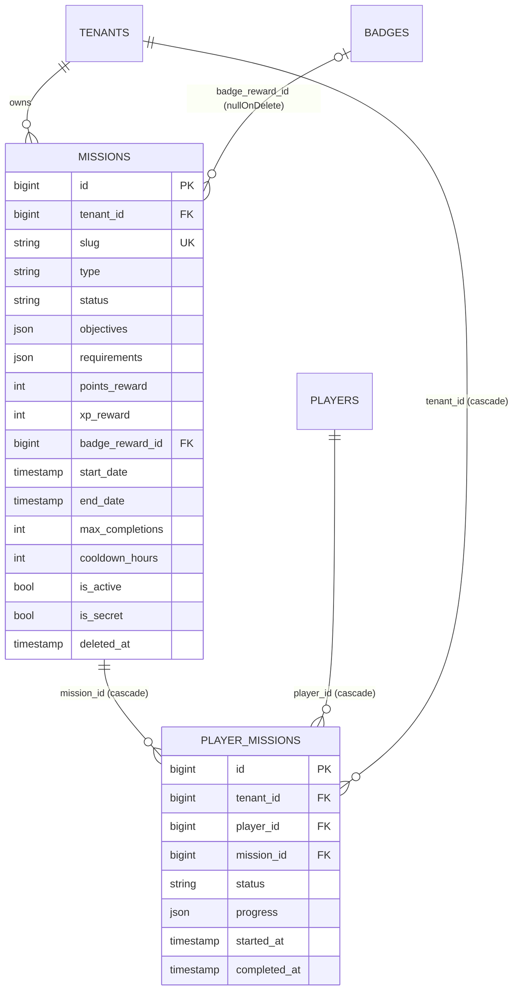
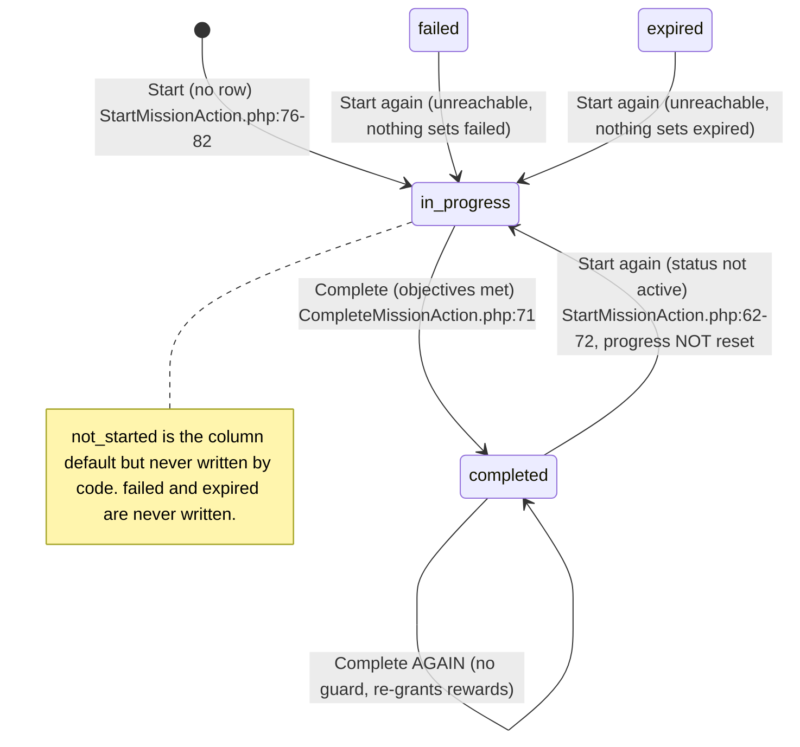
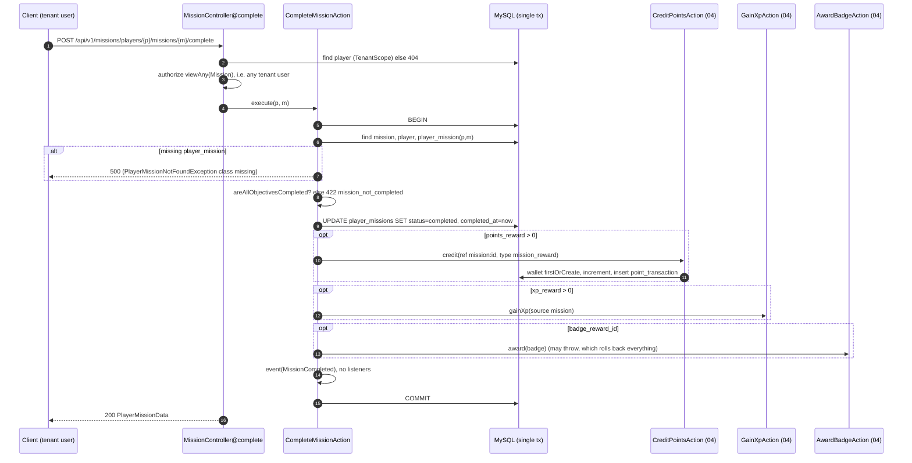
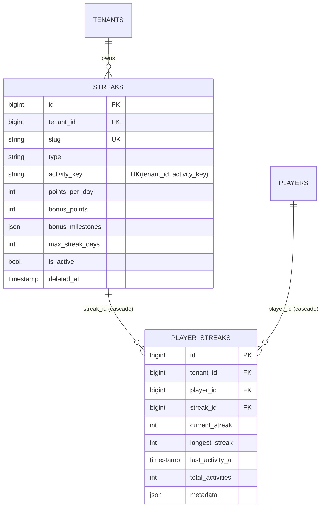
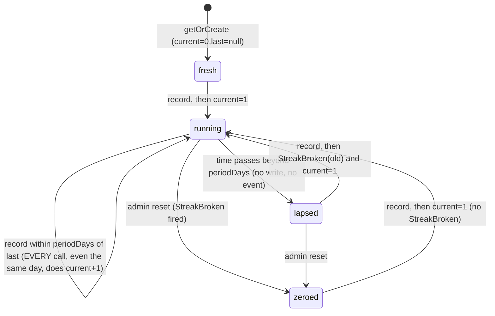
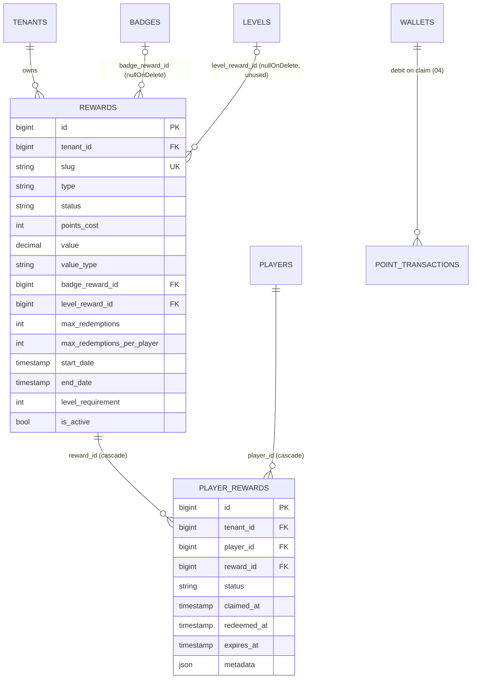
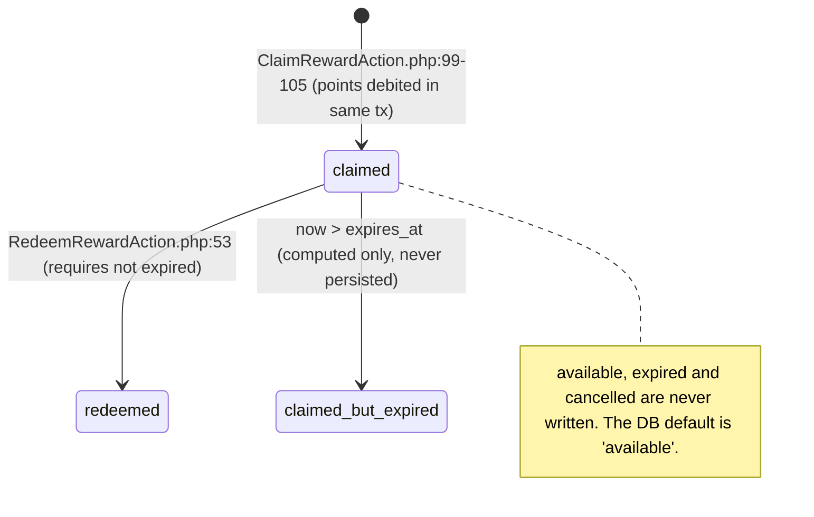
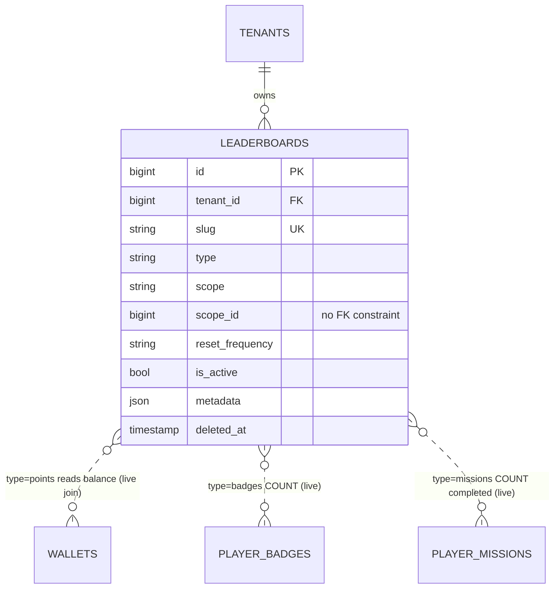
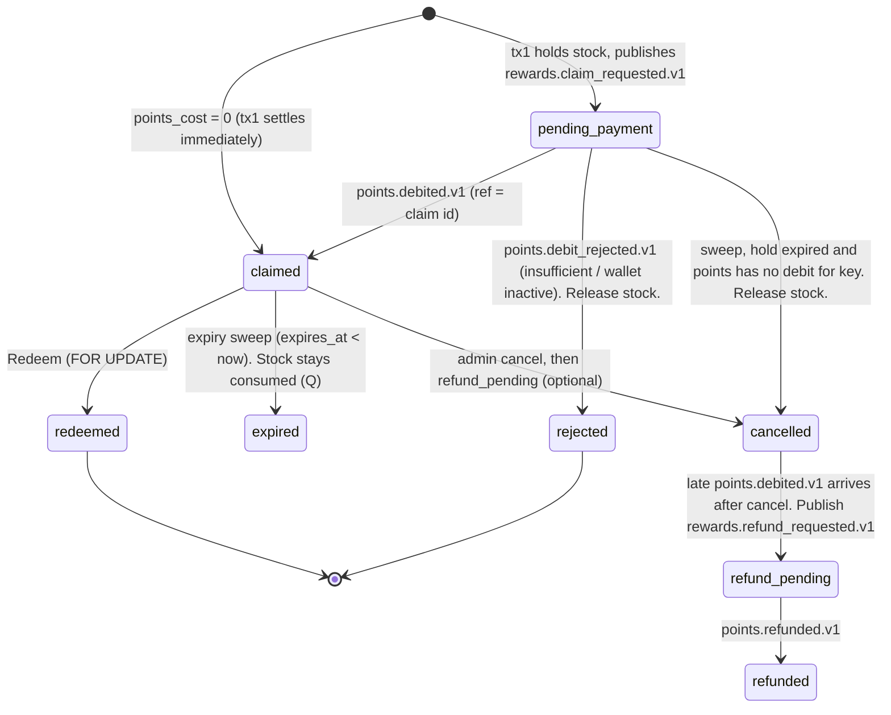
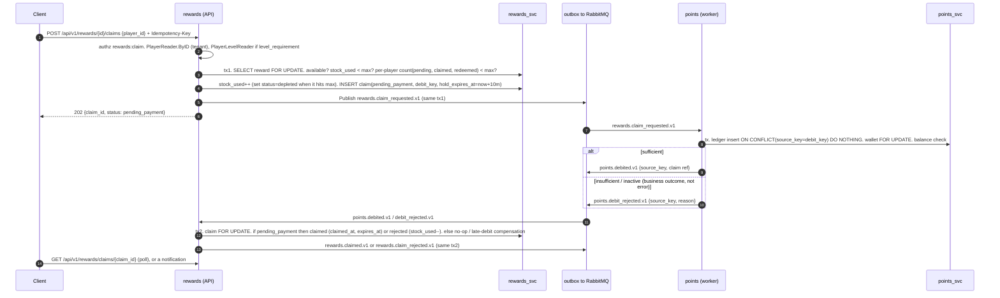

# 05 — Missions, Streaks, Rewards, Leaderboards

Scope: `app/Domain/Mechanics/{Missions,Streaks,Rewards,Leaderboards}`, their controllers, routes, migrations, factories/seeders, observers, policies and feature tests. Target: the Go modular monolith blueprint (`/Users/saba/Projects/golang_advanced_blueprint`, PRD + `docs/examples.md`).

Sibling docs own: 01 cross-cutting, 02 identity/tenancy, 03 players/programs/events, 04 points/levels/badges, 06 rules engine and `ProcessPlayerActivityJob`. This doc names every integration point with them.

Conventions:
- `path:line` refers to `/Users/saba/Projects/LevelUpOS`.
- **(inferred)** marks behaviour derived from framework semantics rather than seen in this repo's code. `vendor/` is not installed, so framework internals could not be read.
- "Laravel" means the current system and "Go" means the target.

---

## 0. Executive summary

| Mechanic | What exists | Biggest problems |
|---|---|---|
| Missions | CRUD; start, set progress, explicit complete. Completion credits points, XP and a badge synchronously in one DB tx. | `PlayerMissionNotFoundException` **does not exist**, so progress or complete on an unstarted mission gives a 500. Completion has **no status guard**: POST complete again and points and XP are granted again (unlimited farming). `max_completions`, `cooldown_hours` and `requirements` are never enforced. Restarting a mission does not reset progress. |
| Streaks | Streak definitions keyed by `activity_key`. Recording activity bumps a counter, credits `points_per_day`, and credits `bonus_points` at milestones. Also called by the rules engine (`record_streak` action). | **No per-period dedupe**: every call increments the streak and credits points (`StreakAlreadyRecordedException` is never thrown). The streak window is a rolling 24h/7d/30d with no timezone and no grace. A break is detected only lazily on the next activity; there is no sweep. `max_streak_days` is unused. In queue context (rules engine) `findByActivityKey` is **not tenant-filtered** and new `player_streaks` get a null `tenant_id`. |
| Rewards | Catalogue CRUD. Claim debits points and creates a `player_rewards` row (status `claimed`). Redeem moves claimed→redeemed and grants a badge. | **Stock oversell**: `max_redemptions` and the per-player limit count only `redeemed` rows, so claims are unlimited until redeemed. No row locks, so concurrent claims can drive the wallet negative. `level_requirement`, `level_reward_id` and Points-type `value` are unimplemented. `Depleted` is never set. Redeem picks an arbitrary row when a player holds several claims. |
| Leaderboards | Definition CRUD. Rankings are computed **live** on every request from `wallets.balance` / `player_badges` / `player_missions`, loaded fully into PHP and sliced. | `scope`, `scope_id` and `reset_frequency` are stored but **ignored**. The Points ranking SQL has ambiguous `tenant_id`/`is_active` columns, which is very likely a SQL error. Create never sets `tenant_id` (NOT NULL), so it is very likely a 500. Update mass-assigns `$request->all()` unvalidated, which lets a caller move a board to another tenant. Ties get arbitrary sequential ranks. No tests. |

No listeners exist for any domain event in scope, and no scheduler entries exist (`routes/console.php` only has `inspire`). All events are fire-and-forget synchronous dispatches with zero subscribers.

---

## 1. Shared context (applies to all four mechanics)

| Concern | Current behaviour | Ref |
|---|---|---|
| Route mounting | Every file in `routes/api/v1/*.php` is mounted at `/api/v1/{filename}` with route name prefix `api.v1.{filename}.` | `routes/api.php:21-37` |
| Auth | All routes are `auth:api` (Passport guard). Callers are tenant **users** (admins or integrations), never players. | `routes/api/v1/missions.php:8`, `config/auth.php:44-47` |
| Tenancy | Global `TenantScope`: when authenticated and the user has a `tenant_id`, it adds `WHERE (t.tenant_id = :uid_tenant OR t.tenant_id IS NULL)`. **No filter at all when unauthenticated** (queue jobs, console). | `app/Domain/Shared/Scopes/TenantScope.php:16-24` |
| tenant_id on insert | Observers set `tenant_id = auth()->user()->tenant_id` on `creating` only if authenticated. **No `LeaderboardObserver` exists.** | `app/Observers/*Observer.php:14-19`, `app/Providers/DomainServiceProvider.php:201-206` |
| Repositories | `AbstractRepository` holds `find`, `paginate(15)`, `create`, `update` (findOrFail, update, fresh) and `delete` (query delete; soft delete when the model uses `SoftDeletes`). | `app/Domain/Shared/Abstracts/AbstractRepository.php:40-98` |
| Policies | Registered via `Gate::policy`. `User::getTenantId(): int` is non-nullable, so a user with a null tenant hits a TypeError and gets a **500, not a 403** (owned by 02). | `app/Providers/DomainServiceProvider.php:137-151,181-186`, `app/Domain/User/Traits/HasUserAccessors.php:23-26` |
| "Administrative" | Roles `owner`, `super_admin`, `platform_admin`, `admin`. | `app/Domain/User/Enums/Role.php:61-69`, `app/Domain/User/Traits/HasRoleHelpers.php:58-63` |
| DTO/validation | spatie/laravel-data `^4.18` (`composer.json:17`). Request DTOs are auto-validated from attributes and types **(inferred)**. Response DTOs mark many fields `Lazy::create(...)`; laravel-data v4 **omits these from JSON unless explicitly included (inferred)**. Feature tests only assert non-lazy fields, which is consistent. | DTO files cited below |
| Domain exception JSON | `{"error": "<code>", "message": "<text>"}` with the status in each exception's `render()`. | e.g. `app/Domain/Mechanics/Missions/Exceptions/MissionNotFoundException.php:21-27` |
| Framework errors | 401 `{"message":"Unauthenticated."}`, 403 `{"message":"This action is unauthorized."}`, 422 `{"message":..., "errors":{field:[..]}}` **(inferred: Laravel defaults)**. | — |
| Pagination | `PaginatedDataCollection` produces `{"data":[...], "links":[...], "meta":{current_page, first_page_url, from, last_page, last_page_url, next_page_url, path, per_page, prev_page_url, to, total}}` **(inferred)**. Tests assert `data`/`links`/`meta`. Page size 15, `?page=N`. | `tests/Feature/Api/V1/MissionControllerTest.php:57-64` |
| Key types | All PKs are `BIGINT` auto-increment (`$table->id()`). The pivot-style models (`PlayerMission`, `PlayerStreak`, `PlayerReward`) extend `Pivot` with `$incrementing = true`. | migrations below |
| DB | `.env.example` uses MySQL and tests use SQLite `:memory:`. | `.env.example`, `phpunit.xml:26-27` |
| Listeners and schedules | None. No `app/Listeners`, no `Event::listen`, no schedule. | `routes/console.php` |

---

## 2. Missions

### 2.1 Purpose and concepts

A **Mission** is a tenant-defined task with named objectives (each has a numeric `target`). A **PlayerMission** tracks one player's attempt: status, a per-objective progress map, and timestamps. On explicit completion the player receives `points_reward` (points ledger, 04), `xp_reward` (levels, 04) and optionally `badge_reward_id` (badges, 04). Types (daily/weekly/...) are labels only: **no recurrence logic exists**.



### 2.2 Data model

**`missions`** (`database/migrations/2025_12_30_131622_create_missions_table.php:16-43`)

| Column | Type | Null | Default | Notes |
|---|---|---|---|---|
| id | bigint unsigned AI | no | | PK |
| tenant_id | bigint FK→tenants | no | | cascadeOnDelete |
| name | varchar(255) | no | | |
| slug | varchar(255) | no | | **globally unique** (not per tenant). Generated as `Str::slug(name).'-'.Str::random(5)` (`CreateMissionAction.php:27`) and regenerated on rename (`UpdateMissionAction.php:39-41`). The seeder uses `slug-{tenantId}` (`MissionsSeeder.php:220`, `AppServiceProvider.php:23-29`). |
| description | text | yes | | |
| type | varchar(50) | no | `one_time` | `MissionType` |
| status | varchar(50) | no | `draft` | `MissionStatus` |
| objectives | json | yes | | see shape below |
| requirements | json | yes | | free-form, **never evaluated** |
| points_reward | int | no | 0 | |
| xp_reward | int | no | 0 | |
| badge_reward_id | bigint FK→badges | yes | | nullOnDelete. **Cross-module FK.** |
| start_date, end_date | timestamp | yes | | availability window |
| max_completions | int | yes | | **unused** |
| cooldown_hours | int | yes | | **unused** (seeded with 168 and 336 for two milestone-style missions in `database/seeders/MissionsSeeder.php`) |
| is_active | bool | no | true | |
| is_secret | bool | no | false | **unused** (not filtered from listings) |
| metadata | json | yes | | free-form |
| created_at, updated_at, deleted_at | timestamp | yes | | soft deletes |

Indexes: `(tenant_id,type)`, `(tenant_id,status)`, `(tenant_id,is_active)`, `(start_date,end_date)`, unique `slug`.

**`player_missions`** (`database/migrations/2025_12_30_131622_create_player_missions_table.php:16-31`)

| Column | Type | Null | Default | Notes |
|---|---|---|---|---|
| id | bigint AI | no | | PK |
| tenant_id | FK tenants | no | | cascade. Set by `PlayerMissionObserver` from the auth user. |
| player_id | FK players | no | | cascade |
| mission_id | FK missions | no | | cascade. A soft-deleted mission keeps its rows. |
| status | varchar(50) | no | `not_started` | `PlayerMissionStatus` |
| progress | json | yes | | `{objective_key: int}` |
| started_at, completed_at | timestamp | yes | | |
| metadata | json | yes | | never written by code |
| created_at, updated_at | | | | no soft delete |

Indexes: **unique `(player_id, mission_id)`**, so there is one row per player per mission forever and repeats overwrite it. Also `(tenant_id,player_id)` and `(mission_id,status)`.

JSON shapes:

| Field | Shape | Evidence |
|---|---|---|
| `missions.objectives` | `{ "<objective_key>": { "target": int, "label": string } , ... }` | `MissionFactory` definition; `MissionsSeeder.php` (e.g. `'daily_login' => ['target'=>1,'label'=>...]`); `PlayerMission::areAllObjectivesCompleted` reads only `target` (`PlayerMission.php:139-146`) |
| `player_missions.progress` | `{ "<objective_key>": int }` holding absolute values | `PlayerMission.php:111-125` |
| `missions.requirements`, `metadata` | arbitrary / null | never read |

Model `Mission` (`app/Domain/Mechanics/Missions/Models/Mission.php`):
- Casts at `:57-75`: enums, json→array, datetime, int, bool.
- Global `TenantScope` (`:88-91`); `SoftDeletes` (`:23`).
- Relations: `tenant()`, `badgeReward()` → Badge (`:104-107`), `players()` belongsToMany via `PlayerMission` with pivot fields (`:112-118`).
- `isActive()` = `is_active && status===Active` (`:123-126`). `isAvailable()` = isActive, and `start_date` null or ≤ now, and `end_date` null or ≥ now (inclusive bounds, app clock, `:131-148`).
- Scopes: `active`, `available` (same predicates in SQL, `:153-175`), `ofType`.
- Accessor trait `HasMissionAccessors` declares non-nullable return types for nullable columns (`getDescription(): string`, `getStartDate(): CarbonImmutable` and others, `Traits/HasMissionAccessors.php:30-69`). Calling these on null values is a TypeError. They are not used on hot paths.

Model `PlayerMission` (`Models/PlayerMission.php`):
- Extends `Pivot`, `$incrementing = true` (`:17,34`). Casts at `:57-66`. TenantScope at `:79-82`.
- `updateObjectiveProgress(key, value)` **sets** (does not add) and saves (`:111-117`).
- `areAllObjectivesCompleted()` returns **false if the mission has no objectives**, otherwise every `progress[key] >= target` (missing counts as 0, missing target counts as 0) (`:130-149`).
- `markAsCompleted()` sets status=completed and completed_at=now and saves (`:154-159`). `markAsStarted()` sets status=in_progress and started_at=now and saves (`:164-169`). Neither clears progress or completed_at.

### 2.3 Enums and state machines

| Enum | Values | Helpers | Ref |
|---|---|---|---|
| `MissionType` | `one_time`, `daily`, `weekly`, `monthly`, `recurring`, `event` | `isRepeatable()` = daily/weekly/monthly/recurring (**unused**) | `Enums/MissionType.php:9-42` |
| `MissionStatus` | `draft`, `active`, `paused`, `completed`, `expired`, `cancelled` | `isAvailable()` = active | `Enums/MissionStatus.php:9-37` |
| `PlayerMissionStatus` | `not_started`, `in_progress`, `completed`, `failed`, `expired` | `isActive()` = not_started or in_progress; `isFinished()` = completed, failed or expired | `Enums/PlayerMissionStatus.php:9-50` |

`MissionStatus` has **no enforced transitions**. Any value can be set via `PUT /missions/{id}` (`UpdateMissionAction.php:34-52`). No job ever sets `expired`/`completed`.

```mermaid
stateDiagram-v2
    direction LR
    note right of draft: AS-IS: admin PUT may set any status to any other; nothing automatic
    [*] --> draft: create (default)
    [*] --> active: create with status=active
    draft --> active
    active --> paused
    paused --> active
    active --> completed
    active --> expired
    active --> cancelled
```

`PlayerMissionStatus`, as actually implemented:



### 2.4 Business flows

**CreateMission** (`Actions/CreateMissionAction.php:22-48`). No tx. Repository create with slug `slug(name)-rand5`. Dates are parsed with `now()->parse()` (app timezone). Fires `MissionCreated`. There is no validation that `badge_reward_id` belongs to the tenant or exists: the FK errors give a 500 if it is missing, and a **cross-tenant badge id is accepted**.

**UpdateMission** (`UpdateMissionAction.php:26-57`). Loads (tenant-scoped) → `array_filter` drops null/Optional values, so **a field cannot be cleared to null** (e.g. `end_date`) → regenerates slug if the name changed → parses dates → `update` → fires `MissionUpdated`. No tx.

**DeleteMission** (`DeleteMissionAction.php:22-31`). Soft delete. `player_missions` remain. A completed mission still counts on the missions leaderboard because the join does not check `missions.deleted_at`.

**StartMission** (`StartMissionAction.php:38-90`), all inside `DB::transaction`:
1. Find the mission (tenant scope) or throw 404 `mission_not_found`.
2. Find the player (tenant scope) or throw 404 `player_not_found`.
3. If `!mission->isAvailable()` throw 422 `mission_not_available` (inactive, status≠active, or outside the window).
4. Look up the existing `(player, mission)` row:
   - If it exists and status ∈ {not_started, in_progress}, throw 422 `mission_already_started`.
   - If it exists and is finished, call `markAsStarted()` (status=in_progress, started_at=now; **progress and completed_at untouched**), fire `MissionStarted`, return. The controller still answers 201.
5. Otherwise create a row with status in_progress, progress `[]`, started_at now. `tenant_id` comes from the observer. Fire `MissionStarted` and return 201.
- Not checked: `requirements`, `max_completions`, `cooldown_hours`, `is_secret`, player `is_active`.
- Race: two concurrent starts can both find no row. The second INSERT violates the unique `(player_id,mission_id)` constraint and gives a **500** (no handling).

**UpdateProgress** (`UpdateProgressAction.php:36-79`), inside a tx:
1. Mission not found: 404. Player not found: 404.
2. PlayerMission not found: `throw new PlayerMissionNotFoundException(...)`. **That class does not exist** in `App\Domain\Mechanics\Missions\Exceptions` (directory holds only 4 classes). PHP raises `Error: Class not found`, giving a **500**. Same in `CompleteMissionAction.php:64`.
3. `progress[objective_key] = value` (absolute set). Any key is accepted, even ones not in objectives. Works on **any status**, including completed. No availability or window check. Lowering progress is allowed.
4. Fires `MissionProgressUpdated(player, mission, playerMission, key, value)`.
5. Returns `completed = areAllObjectivesCompleted()`. **Does not change status and does not auto-complete.**

**CompleteMission** (`CompleteMissionAction.php:46-106`). One outer `DB::transaction`. The nested actions open nested transactions (savepoints).
1. Mission 404, player 404, player-mission missing gives a 500 (missing class, see above).
2. `!areAllObjectivesCompleted()` throws 422 `mission_not_completed`. A mission with no objectives can **never** complete.
3. **No status check**: a completed mission completes again.
4. `markAsCompleted()`.
5. If `points_reward > 0`: `CreditPointsAction(player, amount, "Completed mission: {name}", type=mission_reward, reference_type='mission', reference_id=mission.id)`. This does wallet `firstOrCreate`, an atomic increment of balance and lifetime_earned, a `point_transactions` row and a `PointsCredited` event (`app/Domain/Mechanics/Points/Actions/CreditPointsAction.php:28-60`). No idempotency key: the reference is the mission id, not the player-mission or attempt.
6. If `xp_reward > 0`: `GainXpAction(player, amount, source='mission', source_id=mission.id)` (04).
7. If `badge_reward_id`: `AwardBadgeAction(player, badge)`. It throws `BadgeAlreadyEarnedException` (422 `badge_already_earned`) for a non-repeatable badge already held, and **that rolls back the whole completion**. So a mission with a badge can be completed once (a re-complete returns 422), while a mission without a badge can be farmed indefinitely. It throws `BadgeInactiveException` (422) if the badge is inactive, which also blocks completion.
8. Fires `MissionCompleted` and returns the PlayerMission with the mission loaded.



### 2.5 HTTP API (prefix `/api/v1/missions`, middleware `auth:api`, `routes/api/v1/missions.php:8-19`)

| # | Method + path | Route name | Authz | Request | Success | Errors |
|---|---|---|---|---|---|---|
| 1 | GET `/api/v1/missions` | `api.v1.missions.index` | `viewAny`: user has a tenant | `?page` | 200 paginated `MissionData` (all tenant missions incl. draft/secret; no filters) | 401 |
| 2 | POST `/api/v1/missions` | `.store` | `create`: tenant and admin | `CreateMissionData` | 201 `MissionData` | 401, 403, 422 validation |
| 3 | GET `/api/v1/missions/{mission}` | `.show` | `view`: same tenant | — | 200 `MissionData` | 404 `mission_not_found` (also for other tenants, since the scope hides them) |
| 4 | PUT `/api/v1/missions/{mission}` | `.update` | `update`: same tenant and admin | `UpdateMissionData` (partial) | 200 `MissionData` | 403, 404, 422 |
| 5 | DELETE `/api/v1/missions/{mission}` | `.destroy` | `delete`: same tenant and admin | — | 204 | 403, 404 |
| 6 | POST `/api/v1/missions/start` | `.start` | `start`: user has a tenant | `StartMissionData` | **201** `PlayerMissionData` (also for a restart) | 404 mission/player, 422 `mission_not_available`/`mission_already_started`, 500 on unique race |
| 7 | POST `/api/v1/missions/progress` | `.progress` | **none** (`MissionController.php:130-138` has no `authorize`) | `UpdateProgressData` | 200 `{player_mission, completed}` | 404, **500** if not started |
| 8 | POST `/api/v1/missions/players/{player}/missions/{mission}/complete` | `.complete` | `viewAny`: any tenant user | — | 200 `PlayerMissionData` | 404 player/mission, 422 `mission_not_completed`/`badge_already_earned`/`badge_inactive`/`wallet_inactive`, **500** if not started |
| 9 | GET `/api/v1/missions/players/{player}` | `.player` | `viewAny` | `?page` | 200 paginated `PlayerMissionData` (with mission), ordered `started_at desc` | 404 `player_not_found` |

Controller refs: `app/Http/Controllers/Api/V1/MissionController.php` index `:42-49`, store `:54-61`, show `:66-77`, update `:82-95`, destroy `:100-113`, start `:118-125`, updateProgress `:130-138`, complete `:143-156`, playerMissions `:161-174`. In show, update and destroy, a resource in another tenant returns **404, not 403**, because the scope filters it before the policy runs.

Request validation (laravel-data attributes plus types; rules from types are **inferred**):

`CreateMissionData` (`DataTransferObjects/CreateMissionData.php:17-67`)

| Field | Rules | Default |
|---|---|---|
| name | required, string, max:255 | — |
| description | nullable, string, max:1000 | null |
| type | required, enum `MissionType` | `one_time` (the default makes it effectively optional, inferred) |
| status | required, enum `MissionStatus` | `draft` |
| objectives | nullable, array (shape not validated) | null |
| requirements | nullable, array | null |
| points_reward | int, min:0 | 0 |
| xp_reward | int, min:0 | 0 |
| badge_reward_id | nullable, int, min:1 (no exists rule) | null |
| start_date, end_date | nullable string (no date rule; parsed with Carbon, so a bad string gives a 500 inferred; no end ≥ start check) | null |
| max_completions | nullable, int, min:1 | null |
| cooldown_hours | nullable, int, min:0 | null |
| is_active | boolean | true |
| is_secret | boolean | false |
| metadata | nullable array | null |

`UpdateMissionData` (`UpdateMissionData.php:18-68`): the same fields, every one `sometimes|nullable`, same min/max. Nulls are dropped (§2.4).

`StartMissionData`: `player_id` required int min:1; `mission_id` required int min:1 (`StartMissionData.php:11-19`).
`UpdateProgressData`: `player_id`, `mission_id` required int min:1; `objective_key` required string; `value` required int min:0 (`UpdateProgressData.php:12-26`).

Response `MissionData` (`MissionData.php:14-68`). Always present: `id, tenant_id, name, slug, description, type, status, points_reward, xp_reward, badge_reward_id, max_completions, cooldown_hours, is_active, is_secret`. Lazy, so **omitted by default (inferred)**: `objectives, requirements, start_date, end_date, metadata, created_at, updated_at`.

Response `PlayerMissionData` (`PlayerMissionData.php:13-43`). Always present: `id, player_id, mission_id, status`. `mission` is included when the relation is loaded (it is, for all endpoints). Lazy (omitted): `progress, started_at, completed_at, metadata`.

Example: POST `/api/v1/missions/start`

```json
// request
{ "player_id": 12, "mission_id": 34 }
// 201
{ "id": 99, "player_id": 12, "mission_id": 34, "status": "in_progress",
  "mission": { "id": 34, "tenant_id": 1, "name": "Daily Tasks", "slug": "daily-tasks-aB3xZ",
               "description": "Complete 3 tasks today", "type": "daily", "status": "active",
               "points_reward": 75, "xp_reward": 30, "badge_reward_id": null,
               "max_completions": null, "cooldown_hours": null, "is_active": true, "is_secret": false } }
// 422
{ "error": "mission_already_started", "message": "Mission has already been started." }
```

POST `/api/v1/missions/progress` returns `{"player_mission": {...PlayerMissionData}, "completed": false}`.

### 2.6 Authorization (`Policies/MissionPolicy.php:15-58`)

| Ability | Rule | Used by |
|---|---|---|
| viewAny | `tenant_id !== null` | index, complete, playerMissions |
| view | same tenant | show |
| create | tenant and administrative | store |
| update / delete | same tenant and administrative | update / destroy |
| start | `tenant_id !== null` | start |
| (none) | — | **progress** |

### 2.7 Events and observers

| Event | Payload (Eloquent models) | Queued | Listeners | Fired at |
|---|---|---|---|---|
| `MissionCreated` | mission | no (plain class, `SerializesModels` only) | none | `CreateMissionAction.php:45` |
| `MissionUpdated` | mission | no | none | `UpdateMissionAction.php:54` |
| `MissionStarted` | player, mission, playerMission | no | none | `StartMissionAction.php:70,86` |
| `MissionProgressUpdated` | player, mission, playerMission, objectiveKey, newValue | no | none | `UpdateProgressAction.php:64-70` |
| `MissionCompleted` | player, mission, playerMission | no | none | `CompleteMissionAction.php:102` |

There is no `MissionDeleted` event. Observers `MissionObserver` and `PlayerMissionObserver` only fill `tenant_id` on `creating` (`app/Observers/MissionObserver.php:14-19`, `PlayerMissionObserver.php:14-19`).

### 2.8 Factories and seeders

`MissionFactory` gives status active, one objective `objective_1 {target 10}`, and random type, points and xp; states `daily`, `weekly`, `inactive`. `PlayerMissionFactory` gives status in_progress; state `completed`. `MissionsSeeder` creates 12 missions per tenant (one-time, daily, weekly, monthly with a this-month window, and milestone missions with badge rewards looked up by name) using `firstOrCreate` on `slug-{tenantId}` (`database/seeders/MissionsSeeder.php:21-246`). `PlayersSeeder` assigns missions to players (`database/seeders/PlayersSeeder.php:49,116-...`).

---

## 3. Streaks

### 3.1 Purpose and concepts

A **Streak** is a tenant definition bound to a unique `activity_key` (e.g. `daily_login`) with a period type, `points_per_day` (credited on **every** record), and `bonus_points` credited when `current_streak` exactly equals any value in `bonus_milestones`. A **PlayerStreak** stores current/longest streak, last activity time and total activity count. Recording happens via HTTP or via the rules engine's `record_streak` action (`app/Domain/Rule/Actions/ExecuteRuleAction.php:217,290-311`, owned by 06).



### 3.2 Data model

**`streaks`** (`database/migrations/2025_12_30_132831_create_streaks_table.php:16-35`)

| Column | Type | Null | Default | Notes |
|---|---|---|---|---|
| id | bigint AI | no | | |
| tenant_id | FK tenants | no | | cascade |
| name | varchar | no | | |
| slug | varchar | no | | global unique; `slug(name)-rand5` |
| description | text | yes | | |
| type | varchar(50) | no | `daily` | `StreakType` |
| activity_key | varchar(100) | no | | **unique (tenant_id, activity_key)**. Soft-deleted rows still occupy the key. |
| points_per_day | int | no | 0 | credited on every record |
| bonus_points | int | no | 0 | credited at each milestone hit |
| bonus_milestones | json | yes | | `int[]`, e.g. `[7,30,100]` (`StreaksSeeder.php`) |
| max_streak_days | int | yes | | **unused** |
| is_active | bool | no | true | |
| timestamps, deleted_at | | | | soft deletes |

**There is no `metadata` column**, yet `StreakFactory` sets `'metadata' => null` and `StreakData` reads `$streak->metadata`. Factories run unguarded, so `Streak::factory()->create()` very likely fails with "no such column: metadata" **(inferred, high confidence)**. That would break most of `StreakControllerTest`. Verify before trusting that the suite is green.

Indexes: `(tenant_id,type)`, `(tenant_id,is_active)`.

**`player_streaks`** (`database/migrations/2025_12_30_132832_create_player_streaks_table.php:16-31`)

| Column | Type | Null | Default |
|---|---|---|---|
| id | bigint AI | no | |
| tenant_id | FK | no | | (observer; **null in queue context, giving a NOT NULL violation**) |
| player_id, streak_id | FK cascade | no | |
| current_streak, longest_streak, total_activities | int | no | 0 |
| last_activity_at | timestamp | yes | |
| metadata | json | yes | |
| timestamps | | | |

Indexes: unique `(player_id, streak_id)`, `(tenant_id,player_id)`, `(streak_id,current_streak)`.

Model `Streak` (`Models/Streak.php`): casts `:48-58`, TenantScope `:71-74`, `players()` belongsToMany `:87-93`, scopes `active` and `ofType`.
Model `PlayerStreak` (`Models/PlayerStreak.php`):

| Method | Logic | Ref |
|---|---|---|
| `isActive()` | `last_activity_at != null && last_activity_at >= now() - periodDays` (a rolling window in app tz: daily = 24h, weekly = 7×24h, monthly = 30×24h). No calendar buckets, no grace, no player/tenant timezone. | `:111-121` |
| `isBroken()` | `!isActive() && current_streak > 0` | `:126-129` |
| `incrementStreak()` | `current++`, `total++`, `last_activity_at=now`, `longest=max`, save | `:134-145` |
| `resetStreak()` | `current=0`, save (longest and last_activity untouched) | `:150-154` |
| `getNextMilestone()` | smallest sorted milestone > current, else null | `:159-175` |
| `reachedMilestone(m)` | `in_array(m, milestones)` (loose) and `current === m` | `:180-188` |

### 3.3 Enums

`StreakType`: `daily` (1 day), `weekly` (7), `monthly` (30) via `periodDays()` (`Enums/StreakType.php:9-35`). There is no status enum. The implicit "states" of a PlayerStreak:



### 3.4 Business flows

**RecordActivity** (`Actions/RecordActivityAction.php:42-129`), one `DB::transaction`:
1. `streak = findByActivityKey(key)` (`Repositories/StreakRepository.php:26-29`). This is `where activity_key = ? first()` under TenantScope. **In queue/console context there is no tenant filter**, so the first row with that key from any tenant is used (every tenant is seeded with `daily_login`). If not found: 404 `streak_not_found` "Streak with activity key '{key}' not found."
2. `!is_active` throws 404 `streak_not_found` "Streak is not active."
3. Player not found: 404.
4. `getOrCreateForPlayer` (`PlayerStreakRepository.php:82-97`) does find-then-create with no lock. Concurrent first records cause a unique violation and a 500. It sets **no tenant_id**, relying on the observer, so it fails in queue context.
5. Branch:
   - `isActive()`: `was_continued=true`, increment.
   - `isBroken()`: save the old value, reset to 0, increment to 1, `was_reset=true`, fire `StreakBroken(player, streak, ps, old)`.
   - else (fresh or zeroed): increment.
6. If `points_per_day > 0`: `CreditPointsAction(amount=points_per_day, "Daily streak activity: {name}", type=credit, ref 'streak', streak.id)`. This runs **on every call**.
7. If `reachedMilestone(current)`: `milestone_reached=current`. If `bonus_points > 0`, credit `bonus_points` ("Streak milestone reached: {n} days - {name}", type=credit, ref `streak_milestone`, streak.id). Fire `StreakMilestoneReached`. Milestones can be **re-earned** after a break, since nothing records awarded milestones.
8. Fire `StreakActivityRecorded(player, streak, ps, wasContinued, wasReset, milestoneReached)`.
9. Return `{player_streak, was_continued, was_reset, milestone_reached}`.

`StreakAlreadyRecordedException` (422 `streak_already_recorded`, `Exceptions/StreakAlreadyRecordedException.php:13-27`) is declared in the docblock but **never thrown**. As a result:
- Calling record 10× in a minute gives streak +10 and 10× `points_per_day`.
- Milestone 7 is reachable in one minute.
- `max_streak_days` is never applied.

```mermaid
sequenceDiagram
    autonumber
    participant C as Client or Rule engine (06)
    participant SC as StreakController@recordActivity
    participant A as RecordActivityAction
    participant DB as DB (single tx)
    participant P as CreditPointsAction (04)
    C->>SC: POST /api/v1/streaks/activity {player_id, activity_key}
    SC->>SC: authorize recordActivity (tenant user)
    SC->>A: execute
    A->>DB: BEGIN; streak by activity_key (TenantScope only if authed)
    A->>DB: player find; player_streak find-or-create (no lock)
    alt last_activity_at >= now - periodDays
        A->>DB: current+1, total+1, last=now, longest=max
    else current>0 and lapsed
        A->>DB: current=0, then current=1
        A->>A: event StreakBroken(old)
    else fresh or zeroed
        A->>DB: current+1
    end
    opt points_per_day > 0
        A->>P: credit points_per_day (ref streak:id)
    end
    opt current in bonus_milestones
        A->>P: credit bonus_points (ref streak_milestone:id)
        A->>A: event StreakMilestoneReached
    end
    A->>A: event StreakActivityRecorded
    A->>DB: COMMIT
    SC-->>C: 200 {player_streak, was_continued, was_reset, milestone_reached}
```

**ResetStreak** (`ResetStreakAction.php:29-52`), in a tx: player 404 → `findByPlayerAndStreak` else 404 `streak_not_found` "Player streak not found." → `resetStreak()` → fire `StreakBroken(player, streak, ps, old)`, **even when old = 0**. Longest is kept.

**GetPlayerStreak** (`GetPlayerStreakAction.php:25-37`): player 404, then **getOrCreate** (a GET with a write side effect). There is no check that the streak id exists or belongs to the tenant: the FK error gives a 500 for an unknown id, and a **cross-tenant streak id creates a row (inferred)**.

**Create/Update/Delete** streak: same patterns as missions (`CreateStreakAction.php:22-41`, `UpdateStreakAction.php:26-49`, `DeleteStreakAction.php:22-31`). A duplicate `activity_key` gives a unique violation and a **500** (no validation rule).

Timezones: the code uses only app-tz `now()`. There is no tenant or player timezone, and no grace period.

### 3.5 HTTP API (prefix `/api/v1/streaks`, `auth:api`, `routes/api/v1/streaks.php:8-19`)

| # | Method + path | Name | Authz | Request | Success | Errors |
|---|---|---|---|---|---|---|
| 1 | GET `/api/v1/streaks` | `api.v1.streaks.index` | viewAny | `?page` | 200 paginated `StreakData` | 401 |
| 2 | POST `/api/v1/streaks` | `.store` | create (admin) | `CreateStreakData` | 201 `StreakData` | 403, 422, 500 duplicate key |
| 3 | GET `/api/v1/streaks/{streak}` | `.show` | view | — | 200 | 404 `streak_not_found` |
| 4 | PUT `/api/v1/streaks/{streak}` | `.update` | update (admin) | `UpdateStreakData` | 200 | 403, 404, 422 |
| 5 | DELETE `/api/v1/streaks/{streak}` | `.destroy` | delete (admin) | — | 204 | 403, 404 |
| 6 | POST `/api/v1/streaks/activity` | `.activity` | recordActivity (tenant user) | `RecordActivityData` | 200 `{player_streak, was_continued, was_reset, milestone_reached}` | 404 `streak_not_found`/`player_not_found`, 422 `wallet_inactive` |
| 7 | POST `/api/v1/streaks/players/{player}/streaks/{streak}/reset` | `.reset` | viewAny (any tenant user) | — | 200 `PlayerStreakData` | 404 |
| 8 | GET `/api/v1/streaks/players/{player}/streaks/{streak}` | `.player` | viewAny | — | 200 `PlayerStreakData` (creates if missing) | 404 player |
| 9 | GET `/api/v1/streaks/players/{player}` | `.player.all` | viewAny | `?page` | 200 paginated, ordered `current_streak desc` | 404 |

Controller: `app/Http/Controllers/Api/V1/StreakController.php` index `:41-48`, store `:53-60`, show `:65-76`, update `:81-94`, destroy `:99-112`, recordActivity `:117-129`, reset `:134-147`, playerStreak `:152-165`, playerStreaks `:170-183`.

Validation:
- `CreateStreakData` (`CreateStreakData.php:16-45`):
  - `name` required string max:255
  - `description` nullable string max:1000
  - `type` required enum (default daily)
  - `activity_key` required string max:100 (default `'default'`)
  - `points_per_day` int min:0 (0)
  - `bonus_points` int min:0 (0)
  - `bonus_milestones` nullable array (elements not validated)
  - `max_streak_days` nullable int min:1
  - `is_active` boolean (true)
- `UpdateStreakData`: the same fields as `sometimes|nullable`, plus `metadata` nullable array. `metadata` is not in `Streak::$fillable` (`Streak.php:29-41`), so `update()` silently drops it. Net effect: accepted and ignored **(inferred)**.
- `RecordActivityData`: `player_id` required int min:1; `activity_key` required string.

Responses:
- `StreakData` (`StreakData.php:13-56`). Present: `id, tenant_id, name, slug, description, type, activity_key, points_per_day, bonus_points, max_streak_days, is_active`. Lazy (omitted): `bonus_milestones, metadata, created_at, updated_at`.
- `PlayerStreakData` (`PlayerStreakData.php:12-47`). Present: `id, player_id, streak_id, current_streak, longest_streak, total_activities`, plus `streak` when loaded. Lazy (omitted): `last_activity_at, is_active, next_milestone, metadata`.

Example:

```json
// POST /api/v1/streaks/activity  {"player_id": 12, "activity_key": "daily_login"}
{ "player_streak": { "id": 5, "player_id": 12, "streak_id": 3, "current_streak": 7,
                     "longest_streak": 7, "total_activities": 31,
                     "streak": { "id": 3, "tenant_id": 1, "name": "Daily Login Streak", "slug": "daily-login-streak-1",
                                 "description": "...", "type": "daily", "activity_key": "daily_login",
                                 "points_per_day": 10, "bonus_points": 100, "max_streak_days": null, "is_active": true } },
  "was_continued": true, "was_reset": false, "milestone_reached": 7 }
```

### 3.6 Authorization (`Policies/StreakPolicy.php:15-58`)

viewAny/recordActivity: user has a tenant. view: same tenant. create/update/delete: administrative and same tenant. reset and the player views use **viewAny**, so any tenant user can reset any player's streak.

### 3.7 Events and observers

| Event | Payload | Listeners | Fired |
|---|---|---|---|
| `StreakCreated` | streak | none | `CreateStreakAction.php:38` |
| `StreakUpdated` | streak | none | `UpdateStreakAction.php:46` |
| `StreakActivityRecorded` | player, streak, playerStreak, wasContinued, wasReset, ?milestoneReached | none | `RecordActivityAction.php:113-120` |
| `StreakBroken` | player, streak, playerStreak, brokenStreak:int | none | `RecordActivityAction.php:77`, `ResetStreakAction.php:48` |
| `StreakMilestoneReached` | player, streak, playerStreak, milestone:int | none | `RecordActivityAction.php:110` |

Observers: `StreakObserver` and `PlayerStreakObserver` set tenant_id on creating (`app/Observers/StreakObserver.php:14-19`, `PlayerStreakObserver.php:14-19`).

Seeders: `StreaksSeeder` creates 6 per tenant: `daily_login`, `daily_task`, `daily_engagement`, `weekly_active`, `weekly_purchase`, `monthly_champion`, with milestones such as `[7,30,100]` or `[4,12,52]`.

---

## 4. Rewards

### 4.1 Purpose and concepts

A **Reward** is a catalogue item with a points cost and optional stock limits (`max_redemptions` global, `max_redemptions_per_player`). A player **claims** it: points are debited and a `player_rewards` row is created with status `claimed`, with `expires_at = now + 30 days` for discount-type rewards. Later the claim is **redeemed**: status `redeemed`, and the badge is awarded if `badge_reward_id` is set. There are **no codes**: no coupon or voucher code is generated or stored. The discount "value" and "value_type" (`percentage|fixed`) are descriptive only.



### 4.2 Data model

**`rewards`** (`database/migrations/2025_12_30_134526_create_rewards_table.php:16-43`)

| Column | Type | Null | Default | Notes |
|---|---|---|---|---|
| id | bigint AI | no | | |
| tenant_id | FK | no | | cascade |
| name, slug | varchar | no | | slug global unique |
| description | text | yes | | |
| type | varchar(50) | no | `points` | `RewardType` |
| status | varchar(50) | no | `draft` | `RewardStatus` |
| points_cost | int | no | 0 | |
| value | decimal(10,2) | yes | | cast `decimal:2`, so a string in PHP |
| value_type | varchar(50) | yes | | seen as `percentage`, `fixed` |
| badge_reward_id | FK badges | yes | | nullOnDelete, granted on **redeem** |
| level_reward_id | FK levels | yes | | **unused** |
| max_redemptions | int | yes | | global cap, counted over `redeemed` rows only |
| max_redemptions_per_player | int | yes | | counted over `redeemed` rows only |
| start_date, end_date | timestamp | yes | | |
| level_requirement | int | yes | | **unused** |
| is_active | bool | no | true | |
| metadata | json | yes | | |
| timestamps, deleted_at | | | | soft deletes |

Indexes: `(tenant_id,type)`, `(tenant_id,status)`, `(tenant_id,is_active)`, `(start_date,end_date)`. There is **no stock counter column**: stock is computed by `COUNT`.

**`player_rewards`** (`database/migrations/2025_12_30_134527_create_player_rewards_table.php:16-31`): id, tenant_id FK, player_id FK, reward_id FK (all cascade); `status` varchar(50) default `available`; `claimed_at`, `redeemed_at`, `expires_at` nullable; `metadata` json; timestamps. Indexes `(tenant_id,player_id)`, `(reward_id,status)`, `(player_id,status)`. There is **no uniqueness**: a player may hold many rows for the same reward.

Models:
- `Reward` (`Models/Reward.php`): casts `:57-75`; TenantScope; relations `badgeReward`, `levelReward`, `players` (`:104-126`); `isActive()` = is_active && status active (`:131-134`); `isAvailable()` = active and inside the window (`:139-156`); scopes `active`, `available`, `ofType`.
- `PlayerReward` (`Models/PlayerReward.php`): Pivot, incrementing; casts `:58-67`; `isExpired()` = expires_at set and now > expires_at (`:112-119`); `markAsClaimed` (`:124-129`, unused); `markAsRedeemed` (`:134-139`); `markAsExpired` (`:144-148`, **unused**); `canRedeem()` = status claimed and not expired (`:153-156`).

### 4.3 Enums and state machines

| Enum | Values | Ref |
|---|---|---|
| `RewardType` | `points`, `discount`, `item`, `badge`, `level`, `custom` | `Enums/RewardType.php:9-14` |
| `RewardStatus` | `draft`, `active`, `paused`, `expired`, `depleted`; `isAvailable()` = active | `Enums/RewardStatus.php:9-35` |
| `PlayerRewardStatus` | `available`, `claimed`, `redeemed`, `expired`, `cancelled`; `canRedeem()` = claimed; `isFinished()` = redeemed, expired or cancelled | `Enums/PlayerRewardStatus.php:9-47` |

```mermaid
stateDiagram-v2
    note right of draft: RewardStatus AS-IS. Only admin PUT changes it. Nothing sets depleted or expired automatically.
    [*] --> draft
    [*] --> active: create with status
    draft --> active
    active --> paused
    paused --> active
    active --> expired
    active --> depleted
```



### 4.4 Business flows

**ClaimReward** (`Actions/ClaimRewardAction.php:44-113`), one `DB::transaction`, **no row locks**:
1. Reward (tenant scope) else 404 `reward_not_found`. Player else 404.
2. `!isAvailable()` throws 422 `reward_not_available`.
3. If `max_redemptions`: `getRedemptionsCount` = `COUNT(player_rewards WHERE reward_id=? AND status='redeemed')` (`Repositories/RewardRepository.php:50-55`). If ≥ max, throw 422 `reward_depleted`. **Outstanding claims are not counted**, so N players can claim a stock-1 item until one redeems: an oversell.
4. If `max_redemptions_per_player`: the same count filtered by player, else 422 `reward_depleted` "Player has reached the maximum redemptions for this reward." Unlimited outstanding claims are allowed.
5. If `points_cost > 0`:
   - `Wallet::where('player_id')->first()`. A missing wallet or `balance < cost` throws 422 `insufficient_points` (`:77-81`).
   - `DebitPointsAction(amount=cost, "Claimed reward: {name}", type=**debit** (not `reward_purchase`), ref 'reward', reward.id)` (`:83-90`). Inside (`app/Domain/Mechanics/Points/Actions/DebitPointsAction.php:32-75`) it re-reads the wallet without a lock (`lockForUpdate` exists in `WalletRepository` but is unused), checks balance, then runs an atomic `decrement('balance')` and `increment('lifetime_spent')`, inserts a `point_transactions` row and fires `PointsDebited`.
   - The check-then-act **race**: two concurrent claims each see balance ≥ cost and both decrement, so the **balance goes negative**.
   - The debit is in the **same DB transaction** as the reward row (nested tx = savepoint).
6. `expires_at = now + 30d` iff type is `discount` (hard-coded, `:93-96`).
7. Insert `player_rewards {player, reward, status claimed, claimed_at now, expires_at}` (tenant from the observer).
8. Fire `RewardClaimed` and return 201.
- Not checked: `level_requirement`, player active, `RewardStatus::Depleted` auto-set.

```mermaid
sequenceDiagram
    autonumber
    participant C as Client
    participant RC as RewardController@claim
    participant A as ClaimRewardAction
    participant DB as DB (single tx, no locks)
    participant D as DebitPointsAction (04)
    C->>RC: POST /api/v1/rewards/claim {player_id, reward_id}
    RC->>RC: authorize claim (any tenant user)
    RC->>A: execute
    A->>DB: BEGIN; reward find; player find
    A->>A: isAvailable? else 422 reward_not_available
    A->>DB: COUNT redeemed rows (global / per player), else 422 reward_depleted
    opt points_cost > 0
        A->>DB: SELECT wallet (no lock); balance < cost then 422 insufficient_points
        A->>D: debit(cost, ref reward:id)
        D->>DB: SELECT wallet; check; UPDATE balance=balance-cost; INSERT point_transaction
    end
    A->>DB: INSERT player_rewards(status=claimed, expires_at?)
    A->>A: event RewardClaimed (no listeners)
    A->>DB: COMMIT
    RC-->>C: 201 PlayerRewardData
```

**RedeemReward** (`RedeemRewardAction.php:34-67`), in a tx:
1. Player 404.
2. `findByPlayerAndReward(player, reward)` is `first()` with **no ORDER BY and no status filter** (`PlayerRewardRepository.php:51-57`). With several claims of the same reward it may return an already-redeemed row, giving 422 even though a claimable row exists.
3. Not found: 404 `player_reward_not_found`.
4. `!canRedeem()` (not claimed, or expired): 422 `reward_not_available` "Reward cannot be redeemed. It may have expired or already been redeemed." The expired status is not persisted.
5. `markAsRedeemed()`.
6. If `reward.badge_reward_id`: `AwardBadgeAction`. Already earned gives 422, which **rolls back the redeem**.
7. Fire `RewardRedeemed`.
- Not done: credit points for `type=points` (seeded "100 Bonus Points" costs 500 and grants **nothing**), apply `level_reward_id`, fulfil items or discounts, issue a code.

**Create/Update/Delete reward**: as for missions (`CreateRewardAction.php:22-48`, `UpdateRewardAction.php:26-57`, `DeleteRewardAction.php:22-31`). `value` is accepted as a nullable string with no numeric rule, so a non-numeric value gives a DB error and a 500 **(inferred)**. Deleting a reward soft-deletes it. Existing claims remain, but `PlayerRewardData` with `reward` loaded would get null, because `belongsTo` excludes soft-deleted rows, and `RewardData::fromModel(null)` raises a TypeError, giving a **500 on GET players/{id}** **(inferred)**.

### 4.5 HTTP API (prefix `/api/v1/rewards`, `auth:api`, `routes/api/v1/rewards.php:8-18`)

| # | Method + path | Name | Authz | Request | Success | Errors |
|---|---|---|---|---|---|---|
| 1 | GET `/api/v1/rewards` | `api.v1.rewards.index` | viewAny | `?page` | 200 paginated `RewardData` | 401 |
| 2 | POST `/api/v1/rewards` | `.store` | create (admin) | `CreateRewardData` | 201 | 403, 422 |
| 3 | GET `/api/v1/rewards/{reward}` | `.show` | view | — | 200 | 404 `reward_not_found` |
| 4 | PUT `/api/v1/rewards/{reward}` | `.update` | update (admin) | `UpdateRewardData` | 200 | 403, 404, 422 |
| 5 | DELETE `/api/v1/rewards/{reward}` | `.destroy` | delete (admin) | — | 204 | 403, 404 |
| 6 | POST `/api/v1/rewards/claim` | `.claim` | claim (tenant user) | `ClaimRewardData` | **201** `PlayerRewardData` (+reward) | 404 reward/player, 422 `reward_not_available`/`reward_depleted`/`insufficient_points`/`insufficient_balance`/`wallet_inactive` |
| 7 | POST `/api/v1/rewards/players/{player}/rewards/{reward}/redeem` | `.redeem` | viewAny (any tenant user) | — | 200 `PlayerRewardData` | 404 `player_not_found`/`player_reward_not_found`, 422 `reward_not_available`/`badge_already_earned` |
| 8 | GET `/api/v1/rewards/players/{player}` | `.player` | viewAny | `?page` | 200 paginated, `claimed_at desc` | 404 |

Controller: `app/Http/Controllers/Api/V1/RewardController.php` index `:40-47`, store `:52-59`, show `:64-75`, update `:80-93`, destroy `:98-111`, claim `:116-123`, redeem `:128-141`, playerRewards `:146-159`.

Validation:
- `CreateRewardData` (`CreateRewardData.php:17-67`):
  - `name` required string max:255
  - `description` nullable string max:1000
  - `type` required enum (default points)
  - `status` required enum (default draft)
  - `points_cost` int min:0 (0)
  - `value` nullable string
  - `value_type` nullable string
  - `badge_reward_id`, `level_reward_id` nullable int min:1
  - `max_redemptions`, `max_redemptions_per_player` nullable int min:1
  - `start_date`, `end_date` nullable string
  - `level_requirement` nullable int min:1
  - `is_active` boolean (true)
  - `metadata` nullable array
- `UpdateRewardData` (`UpdateRewardData.php:18-68`): the same fields as `sometimes|nullable`.
- `ClaimRewardData`: `player_id`, `reward_id` required int min:1.

Responses:
- `RewardData` (`RewardData.php:14-69`). Present: `id, tenant_id, name, slug, description, type, status, points_cost, value_type, badge_reward_id, level_reward_id, max_redemptions, max_redemptions_per_player, level_requirement, is_active`. Lazy (omitted): `value, start_date, end_date, metadata, created_at, updated_at`.
- `PlayerRewardData` (`PlayerRewardData.php:13-48`). Present: `id, player_id, reward_id, status`, plus `reward` when loaded. Lazy (omitted): `claimed_at, redeemed_at, expires_at, is_expired, can_redeem, metadata`.

```json
// POST /api/v1/rewards/claim {"player_id":12,"reward_id":7}  -> 201
{ "id": 41, "player_id": 12, "reward_id": 7, "status": "claimed",
  "reward": { "id": 7, "tenant_id": 1, "name": "10% Off Coupon", "slug": "10-off-coupon-1", "description": null,
              "type": "discount", "status": "active", "points_cost": 300, "value_type": "percentage",
              "badge_reward_id": null, "level_reward_id": null, "max_redemptions": null,
              "max_redemptions_per_player": null, "level_requirement": null, "is_active": true } }
// 422
{ "error": "insufficient_points", "message": "Insufficient points to claim this reward." }
```

### 4.6 Authorization (`Policies/RewardPolicy.php:15-58`)

viewAny/claim: user has a tenant. view: same tenant. create/update/delete: administrative and same tenant. Redeem and the player listing use viewAny.

### 4.7 Events and observers

| Event | Payload | Listeners | Fired |
|---|---|---|---|
| `RewardCreated` | reward | none | `CreateRewardAction.php:45` |
| `RewardUpdated` | reward | none | `UpdateRewardAction.php:54` |
| `RewardClaimed` | player, reward, playerReward | none | `ClaimRewardAction.php:109` |
| `RewardRedeemed` | player, reward, playerReward | none | `RedeemRewardAction.php:63` |

`RewardObserver` and `PlayerRewardObserver` set tenant_id on creating only. Seeder: `RewardsSeeder` creates per tenant 3 points rewards, 5 discounts (`percentage`/`fixed`), 3 items with stock limits (100/1, 200/2, 500/5) and 2 badge rewards (`database/seeders/RewardsSeeder.php:28-196`). `PlayerRewardFactory` defaults to claimed; states `redeemed`, `expired`.

---

## 5. Leaderboards

### 5.1 Purpose and concepts

A **Leaderboard** is a stored definition: a `type` (what to rank: points, badges, missions, custom), a `scope` (global, segment, program) with `scope_id`, and a `reset_frequency` (never, daily, weekly, monthly). Rankings are **computed live on every request** from other modules' tables. There is no materialisation, caching, snapshot or reset. `LEADERBOARDS_IMPLEMENTATION.md:229-248,315-321` explicitly lists reset, scopes, custom and caching as future work. That document cites a migration file name that differs from reality (`2024_01_19_...` vs the actual `2026_01_12_162111_create_leaderboards_table.php`).



### 5.2 Data model

**`leaderboards`** (`database/migrations/2026_01_12_162111_create_leaderboards_table.php:16-34`):

| Column | Type | Null | Default | Notes |
|---|---|---|---|---|
| id | bigint AI | no | | |
| tenant_id | FK tenants cascade | no | | **not set on API create** |
| name | varchar | no | | |
| slug | varchar | no | | global unique. API uses `Str::slug(name)` with **no suffix**; seeder uses `slug-{tenantId}`. |
| description | text | yes | | |
| type | varchar | no | | `points, badges, missions, custom` |
| scope | varchar | no | `global` | `global, segment, program` |
| scope_id | `foreignId` **without constrained()**, so no FK | yes | | segment/program id, **ignored** |
| reset_frequency | varchar | no | `never` | **ignored** |
| is_active | bool | no | true | **ignored** when ranking |
| metadata | json | yes | | intended for custom formulas, unused |
| timestamps, deleted_at | | | | soft deletes |

Indexes: `(tenant_id,type)`, `(tenant_id,scope)`, `(tenant_id,is_active)`.

Model (`Models/Leaderboard.php`): casts to the three enums, int, bool, array (`:49-59`); TenantScope (`:72-75`); scopes `active`, `ofType`, `ofScope`. Trait helpers `isActive()`, `isGlobal()`, `resets()` (`Traits/HasLeaderboardAccessors.php:12-31`, unused).

### 5.3 Enums

`LeaderboardType`: `points`, `badges`, `missions`, `custom` (`Enums/LeaderboardType.php:9-35`). `LeaderboardScope`: `global`, `segment`, `program` (`Enums/LeaderboardScope.php:9-33`). `ResetFrequency`: `never`, `daily`, `weekly`, `monthly` (`Enums/ResetFrequency.php:9-35`). There is no state machine.

### 5.4 Ranking computation (`Repositories/LeaderboardRepository.php`)

| Type | SQL (as written) | Score | Ref |
|---|---|---|---|
| points | `players JOIN wallets ON players.id=wallets.player_id WHERE tenant_id=? AND is_active=1 ORDER BY wallets.balance DESC`, plus Player global scopes (TenantScope, soft delete) | **current spendable balance** (drops when rewards are claimed), not earned points | `:140-169` |
| badges | `players LEFT JOIN player_badges ... GROUP BY players.id ... ORDER BY score DESC`, `score = COUNT(player_badges.id)` | all-time badge count, zeros included | `:176-206` |
| missions | `players LEFT JOIN player_missions ...`, `score = COUNT(CASE WHEN player_missions.status = "completed" THEN 1 END)` | rows currently in completed. A restart drops the count, and re-completions count once. | `:213-243` |
| custom | returns `[]` | — | `:250-255` |

Behaviour:
- **Points query bug**: `where('tenant_id')` and `where('is_active')` are unqualified, and both `players` and `wallets` have those columns (`2025_12_30_123555_create_wallets_table.php`). This gives an "ambiguous column" SQL error on MySQL, Postgres and SQLite **(inferred, high confidence)**. The Points leaderboard (3 of the 6 seeded boards) likely always 500s. The TenantScope adds a qualified `players.tenant_id` clause, but the explicit unqualified ones remain.
- **Missions query**: the double-quoted `"completed"` is an identifier in Postgres or ANSI MySQL, which errors. It works in default MySQL and SQLite.
- Players without a wallet are excluded from points (inner join). Inactive or soft-deleted players are excluded everywhere.
- **Ties**: rank = position + 1 (`$index + 1`), so equal scores get distinct ranks, and the order among them is DB-arbitrary (non-deterministic).
- `change` is always 0 (TODO at `:166`).
- **Paging**: the whole tenant result set is loaded into memory, then `array_slice(offset, limit)` (`:95-100`). `limit = min(?limit default 100, 500)`, `offset` default 0, and there is no lower bound: a negative offset or limit gives array_slice semantics, i.e. slicing from the end (`LeaderboardController.php:121-124`).
- **Player rank**: full computation, then a linear scan with `$entry['player_id'] === $playerId` (strict int compare, `:107-118`). If the PDO driver returns strings (MySQL emulated prepares), this never matches and always 404s **(inferred risk)**.
- `scope`, `scope_id`, `reset_frequency` and `is_active` are never consulted. A "Weekly Points Race" equals the all-time board.

### 5.5 HTTP API (prefix `/api/v1/leaderboards`, `auth:api`, `routes/api/v1/leaderboards.php:8-28`)

Route names are double-prefixed, e.g. `api.v1.leaderboards.leaderboards.index`, because the file adds `leaderboards.` on top of the auto prefix.

| # | Method + path | Name suffix | Authz | Request | Success | Errors |
|---|---|---|---|---|---|---|
| 1 | GET `/api/v1/leaderboards` | `leaderboards.index` | **none** (TenantScope still filters) | — | 200 **JSON array** of `LeaderboardData` (not paginated) | 401 |
| 2 | GET `/api/v1/leaderboards/{leaderboard}` | `leaderboards.show` | view: same tenant | — | 200 `LeaderboardData` | 404 `{"message":"Leaderboard not found"}` |
| 3 | POST `/api/v1/leaderboards` | `leaderboards.store` | create: **always true** (any authed user, not admin-gated) | `CreateLeaderboardData` | 201 | 422, **500** (tenant_id NOT NULL; slug collision) |
| 4 | PUT `/api/v1/leaderboards/{leaderboard}` | `leaderboards.update` | update: same tenant (not admin-gated) | **raw `$request->all()`**, unvalidated | 200 | 404; 500 on invalid enum (ValueError, inferred) |
| 5 | DELETE `/api/v1/leaderboards/{leaderboard}` | `leaderboards.destroy` | delete: same tenant | — | **200** `{"message":"Leaderboard deleted successfully"}` (soft) | 404 |
| 6 | GET `/api/v1/leaderboards/{leaderboard}/entries` | `leaderboards.entries` | view | `?limit` (default 100, max 500), `?offset` (0) | 200 JSON array of entries | 404 |
| 7 | GET `/api/v1/leaderboards/{leaderboard}/players/{player}` | `leaderboards.player-rank` | view | — | 200 entry | 404 `{"message":"Player not found in leaderboard"}` |

Controller refs `app/Http/Controllers/Api/V1/LeaderboardController.php`: index `:25-32`, show `:37-48`, store `:53-70`, update `:75-88`, destroy `:93-106`, entries `:111-127`, playerRank `:132-149`.

`CreateLeaderboardData` (`DataTransferObjects/CreateLeaderboardData.php:12-23`) has no attributes. The inferred rules are:
- `name` required string
- `description` nullable string
- `type` required enum `LeaderboardType`
- `scope` required enum
- `scope_id` nullable int
- `reset_frequency` required enum
- `is_active` required boolean
- `metadata` nullable array

`LeaderboardData` (`LeaderboardData.php:10-45`): `id, tenant_id, name, slug, description, type, scope, scope_id, reset_frequency, is_active, metadata, created_at, updated_at`. Timestamps use `toISOString()` (e.g. `2026-01-12T16:21:11.000000Z`).

Entry shape (`LeaderboardRepository.php:156-167`):

```json
[{ "rank": 1, "player_id": 12,
   "player": { "id": 12, "display_name": "Ana", "avatar_url": null },
   "score": 1500, "change": 0 }]
```

### 5.6 Authorization (`Policies/LeaderboardPolicy.php:15-50`)

| Ability | Rule |
|---|---|
| viewAny | `true` (unused) |
| view, update, delete | `user.tenant_id === leaderboard.tenant_id` (no admin check) |
| create | `true` |

The inconsistency with the other three mechanics (where mutations require an administrative role) should be fixed, not ported.

### 5.7 Events, observers, seeders

No events and no observer. `LeaderboardsSeeder` creates 6 boards per tenant (All-Time/Monthly/Weekly Points, Badge Collectors, Mission Masters, Weekly Mission Champions) with slug `slug-{tenantId}` (`database/seeders/LeaderboardsSeeder.php:43-104`). `LeaderboardFactory` has states `points`, `badges`, `missions` and so on. Its slug lacks a suffix, so two factory boards with the same random name collide.

---

## 6. Admin (Filament)

There are **no Filament resources** for missions, streaks, rewards or leaderboards. `app/Filament` contains only `EventCategoryResource`. All admin management happens through the REST endpoints above, consumed by the separate React portal (`levelupos-portal`, per `LEADERBOARDS_IMPLEMENTATION.md:99-117`). The Go rewrite needs no admin UI parity for this scope.

---

## 7. Test coverage leading to an acceptance checklist

Files: `tests/Feature/Api/V1/MissionControllerTest.php` (416 lines), `StreakControllerTest.php` (424), `RewardControllerTest.php` (411). **Leaderboards have no tests.** No unit tests exist. Setup in each file: Spatie roles for web and api, a Passport personal client, a tenant, an `admin` user, a player, then `Passport::actingAs`.

Port each of these to Go e2e/service tests. ✔ marks a behaviour to keep. ✱ marks a behaviour this doc recommends changing; keep the test but update the expectation.

**Missions**

| Test (file:line) | Expectation |
|---|---|
| list paginated `:49-65` | 200, `data[*]` has id, name, slug, type, status; `links` and `meta`; 5 rows ✔ |
| tenant isolation `:67-81` | other tenant's rows hidden ✔ |
| create `:85-110` | 201, fragment name/type/points_reward/xp_reward; row has the auth tenant ✔ |
| create without name `:112-119` | 422 errors.name ✔ |
| create as non-admin `:121-134` | 403 ✔ |
| show `:138-151`, show unknown `:153-157` | 200 / 404 ✔ |
| update name `:161-176` | 200 with new name ✔ |
| delete `:179-188` | 204, soft deleted ✔ |
| start `:192-217` | 201, status in_progress, row exists ✔ |
| start unavailable `:219-234` | 422 `mission_not_available` ✔ |
| start already started `:236-257` | 422 `mission_already_started` ✔ |
| progress partial `:260-289` | 200 `completed:false`; progress stored as 5 ✔ |
| progress meets target `:291-320` | 200 `completed:true` ✔ (status unchanged) |
| complete awards `:323-358` | 200 status completed; wallet balance 100 ✔ |
| complete with objectives unmet `:360-383` | 422 `mission_not_completed` ✔ |
| player missions `:386-404` | 3 rows ✔ |
| unauthenticated `:407-414` | 401 ✔ |

Missing tests to add for Go: complete twice must not re-grant ✱; progress/complete on an unstarted mission returns 404 ✱ (currently 500); a restart resets progress ✱; window boundaries; cross-tenant mission or player ids.

**Streaks** (verify that the suite actually passes first, given the `metadata` column issue in §3.2)

| Test | Expectation |
|---|---|
| list / isolation `:46-80` | as missions ✔ |
| create `:83-106` with milestones `[7,30,100]`; missing name 422; non-admin 403 | ✔ |
| show/404/update/delete `:133-185` | ✔ |
| continue `:188-217` | last 12h ago, current 5 → 6, `was_continued:true` ✔ |
| broken `:219-247` | last 2 days ago, current 5 → 1, `was_reset:true` ✔ |
| creates player streak `:249-267` | current 1 ✔ |
| awards points `:269-287` | wallet credited `points_per_day` ✔ |
| milestone `:289-321` | current 6 → 7 gives `milestone_reached:7` and wallet = points_per_day + bonus ✔ |
| unknown key `:323-334` | 404 `streak_not_found` ✔ |
| reset `:337-356` | current 0 ✔ |
| player streaks list `:359-376`; get `:380-398`; get creates `:400-412` (current 0) | ✔ (✱ consider 404 instead of create-on-GET) |
| unauthenticated | 401 ✔ |

Add for Go: a second record in the same period is a no-op for counter and points ✱; timezone/period boundary tests; milestone not re-paid ✱; the break sweep emits `streaks.broken.v1`.

**Rewards**

| Test | Expectation |
|---|---|
| list/isolation/create/422/403/show/404/update/delete `:49-185` | ✔ |
| claim deducts `:188-223` | balance 200, cost 100 → 201 `status:claimed`, balance 100 ✔ (✱ becomes 202 pending, then claimed, on the async path, see §11.4) |
| insufficient `:225-248` | 422 `insufficient_points` ✔ (✱ async: settles as `rejected`) |
| unavailable `:250-264` | 422 `reward_not_available` ✔ |
| depleted `:266-296` | max 1 and one redeemed row → 422 `reward_depleted` ✔ (✱ claims also consume stock) |
| zero cost `:298-312` | 201 ✔ |
| redeem `:316-337` | 200 `redeemed` ✔ |
| redeem without claim `:339-350` | 404 `player_reward_not_found` ✔ |
| redeem awards badge `:352-378` | player_badges row ✔ |
| player rewards `:381-398` | 3 rows ✔ |

Add: concurrent claims of stock-1 → exactly one succeeds ✱; concurrent claims never overdraw ✱; per-player limit counts outstanding claims ✱; expiry sweep.

**Leaderboards**: no coverage. Write Go tests from §5.4 semantics after resolving the open questions: tenant isolation, competition ranking with ties, period rollover, scope filters.

---

## 8. Bugs, races, inconsistencies, unimplemented parts (do NOT port blindly)

| # | Sev | Area | Finding | Ref |
|---|---|---|---|---|
| B1 | High | Missions | `PlayerMissionNotFoundException` class missing, so progress/complete without a start gives 500 "Class not found" | `UpdateProgressAction.php:12,57`; `CompleteMissionAction.php:13,64` |
| B2 | Critical | Missions | Complete has no status guard; repeated calls re-credit points and XP. Only a non-repeatable badge reward accidentally blocks it. | `CompleteMissionAction.php:61-100` |
| B3 | High | Missions | Restart (`markAsStarted`) keeps old progress, so it can be completed again immediately. Combined with B2 this means infinite rewards. | `StartMissionAction.php:62-72`, `PlayerMission.php:164-169` |
| B4 | Med | Missions | `max_completions`, `cooldown_hours`, `requirements`, `is_secret`, `MissionType` recurrence: stored, never enforced | model and actions |
| B5 | Med | Missions | `POST /missions/progress` has no authorization | `MissionController.php:130-138` |
| B6 | Low | Missions | A mission with null/empty objectives can never be completed | `PlayerMission.php:132-134` |
| B7 | Low | Missions | Progress is an absolute set and accepts unknown keys and any status (including completed) | `PlayerMission.php:111-117` |
| B8 | Med | Missions | Duplicate start race gives a 500 (unique index, no upsert) | `StartMissionAction.php:57-82` |
| S1 | Critical | Streaks | No per-period dedupe: each call increments the streak and credits points; milestones are trivially farmable. `StreakAlreadyRecordedException` is never thrown. | `RecordActivityAction.php:68-94` |
| S2 | High | Streaks | Rolling window (`now - periodDays`) instead of calendar periods; no timezone or grace. Daily streaks break at 24h+1s even across "consecutive days". | `PlayerStreak.php:111-121` |
| S3 | High | Streaks | Queue context (rules engine via `ProcessPlayerActivityJob`): `findByActivityKey` is unscoped, so it can pick another tenant's streak with the same key (every tenant has `daily_login`). New `player_streaks` and `player_missions` rows get a null tenant, giving a NOT NULL violation. | `StreakRepository.php:26-29`, `TenantScope.php:18`, `PlayerStreakObserver.php:16` |
| S4 | Med | Streaks | Break is only detected lazily on the next activity; `StreakBroken` is never emitted for players who stop; "current_streak" reads stale until then | `RecordActivityAction.php:71-77` |
| S5 | Med | Streaks | Milestone bonus is re-earnable after every break (no awarded-milestones record); exact-equality only | `PlayerStreak.php:180-188` |
| S6 | Low | Streaks | `max_streak_days` unused; reset emits `StreakBroken` even at 0; GET player streak creates rows | `ResetStreakAction.php:44-48`, `GetPlayerStreakAction.php:33` |
| S7 | Med | Streaks | `streaks` has no `metadata` column but the factory and DTO use it (tests likely fail) | migration vs `StreakFactory`, `StreakData.php:51` |
| S8 | Med | Streaks | Duplicate `activity_key` and race on getOrCreate give a 500 | `PlayerStreakRepository.php:82-97` |
| R1 | Critical | Rewards | Stock oversell: global and per-player limits count only `redeemed` rows; unlimited outstanding claims | `RewardRepository.php:50-66`, `ClaimRewardAction.php:63-75` |
| R2 | Critical | Rewards | No locking: concurrent claims race on stock and on the wallet balance (check-then-decrement), so the balance can go negative | `ClaimRewardAction.php:77-91`, `DebitPointsAction.php:35-54` |
| R3 | Med | Rewards | No idempotency on claim: retrying a POST after a timeout double-charges | `RewardController.php:116-123` |
| R4 | Med | Rewards | Redeem selects an arbitrary row by (player, reward); it should target the player_reward id | `PlayerRewardRepository.php:51-57` |
| R5 | Med | Rewards | Unimplemented: `level_requirement`, `level_reward_id`, Points-type `value` grant, Item fulfilment, discount codes, `Depleted` auto-status, persisted expiry (`markAsExpired` unused), `cancelled`/`available` statuses | various |
| R6 | Low | Rewards | Debit uses type `debit` instead of the existing `reward_purchase`; the reference is reward.id, not the claim id (non-unique, so it cannot be used for idempotency) | `ClaimRewardAction.php:83-90`, `TransactionType.php:13` |
| R7 | Low | Rewards | Discount expiry hard-coded to 30 days | `ClaimRewardAction.php:93-96` |
| R8 | Low | Rewards | Badge already earned during redeem rolls back the redeem (422); the player cannot redeem a paid-for claim | `RedeemRewardAction.php:56-61` |
| L1 | High | Leaderboards | Points ranking: unqualified `tenant_id`/`is_active` with a join, giving ambiguous column errors | `LeaderboardRepository.php:142-152` |
| L2 | High | Leaderboards | Create never sets tenant_id (no observer), giving a NOT NULL violation; slug without suffix gives a global unique collision | `LeaderboardController.php:57-67` |
| L3 | High | Leaderboards | Update mass-assigns `$request->all()` (incl. `tenant_id`, `slug`): cross-tenant move and no validation | `LeaderboardController.php:85`, `Leaderboard.php:31-42` |
| L4 | Med | Leaderboards | Create and update are not admin-gated; index has no authorize | `LeaderboardPolicy.php:31-49` |
| L5 | High | Leaderboards | Scope, scope_id, reset_frequency and is_active ignored; periodic boards equal all-time boards | `LeaderboardRepository.php:125-133` |
| L6 | Med | Leaderboards | "Points" means spendable balance, so claiming rewards lowers rank; it cannot be period-scoped | `:150` |
| L7 | Med | Leaderboards | O(players) full load per request, then array slice; ties get distinct, non-deterministic ranks; negative offset accepted | `:95-118`, controller `:121-124` |
| L8 | Low | Leaderboards | Missions SQL uses double-quoted literal (Postgres incompatible); strict `===` on player_id may never match with string PDO results | `:223`, `:112` |
| L9 | Low | Leaderboards | Route names double-prefixed; destroy returns 200 JSON while every other resource returns 204 | `routes/api/v1/leaderboards.php` |
| X1 | Med | All | Domain events have no listeners; all events are synchronous in-tx Eloquent payloads (not durable) | `app/Providers/*` |
| X2 | Med | All | Cross-module FKs (`badge_reward_id`, `level_reward_id`, `player_id`, `tenant_id`) and cross-module joins (leaderboards) violate blueprint P5 | migrations, `LeaderboardRepository.php` |
| X3 | Low | All | Cannot clear nullable fields via PUT (nulls filtered); dates are unvalidated strings | `Update*Action.php:34-37` |
| X4 | Low | All | Cross-tenant 404 vs 403: the scope hides resources (fine; keep 404 in Go to avoid enumeration) | controllers |
| X5 | Low | All | Player-scoped endpoints (`complete`, `reset`, `redeem`, players lists) need only `viewAny`, so any tenant user can mutate any player | policies |

---

## 9. Integration points with other docs (precise)

| From | To | Today | Go |
|---|---|---|---|
| Mission complete | Points (04) | sync `CreditPointsAction`, same DB tx, type `mission_reward`, ref (`mission`, mission.id) | `missions.completed.v1`, consumed by points: credit with unique `source_key = mission_completion:<player_mission_id>:<attempt>` |
| Mission complete | Levels (04) | sync `GainXpAction`, source `mission`, source_id mission.id | levels consumes `missions.completed.v1`, keyed by the same `source_key` |
| Mission complete | Badges (04) | sync `AwardBadgeAction`; already-earned **aborts** completion | badges consumes the event; already-earned is a **no-op success**, never blocks |
| Streak record | Points (04) | sync credit `points_per_day` (ref `streak`) and bonus (ref `streak_milestone`) | `streaks.activity_recorded.v1` (with `points_awarded`) and `streaks.milestone_reached.v1` (with `bonus_points`), consumed by points with keys `streak:<player_streak_id>:<period_key>` and `streak_milestone:<player_streak_id>:<run_id>:<milestone>` |
| Rules engine (06) | Streaks | `ExecuteRuleAction::executeRecordStreak` calls `RecordActivityAction` synchronously inside the rule's tx; an exception fails the whole rule | rules publishes `rules.streak_activity_requested.v1` {request_id = rule_execution_id:action_index, tenant, player, activity_key, occurred_at}, consumed by streaks (idempotent on request_id) |
| Reward claim | Points (04) | sync `DebitPointsAction` in the same tx, no lock | saga (§11.4): `rewards.claim_requested.v1` → points debit → `points.debited.v1` / `points.debit_rejected.v1` → rewards settles |
| Reward redeem | Badges (04) | sync award; failure rolls back the redeem | `rewards.redeemed.v1`, consumed by badges (no-op on already earned) |
| Reward claim | Levels (04) | `level_requirement` not checked | rewards port `PlayerLevelReader.CurrentLevel(ctx, tenant, player)` over levels `contracts.Reader` (sync read is allowed) |
| Leaderboards | Points / badges / missions | live SQL joins over `wallets`, `player_badges`, `player_missions` | subscriptions → own `scores` table and Redis ZSET (§11.5) |
| Leaderboards | Players (03) | join `players` for display_name, avatar_url, is_active | players `Reader.SnapshotByIDs` for hydration; `players.deactivated.v1` / `players.deleted.v1` to drop entries |
| All | Players (03) | `PlayerRepository::find` under TenantScope | port `PlayerReader.ByID(ctx, tenantID, playerID)` to verify existence and tenant |
| Program scope | Programs (03) | not implemented | `programs.player_enrolled.v1` / `programs.player_unenrolled.v1` give a membership projection in leaderboards |

---

## 10. Concurrency and transaction notes (as-is, for comparison)

- All mutating player-level actions use `DB::transaction` (default isolation, REPEATABLE READ on MySQL InnoDB, **inferred**), with **no `lockForUpdate` anywhere** in these four domains.
- Nested actions (points, xp, badge) open nested transactions, i.e. savepoints. An exception anywhere rolls back the whole chain.
- Events are dispatched **inside** the transaction. If there were listeners they would observe uncommitted data, and they would run even if the tx later rolled back (no `afterCommit`).

---

## 11. Go blueprint mapping

### 11.1 Modules and dependencies

| Module | Schema | Owns | Consumes (ports, sync reads) | Subscribes | Publishes |
|---|---|---|---|---|---|
| `missions` | `missions_svc` | missions, player_missions, mission_completions | `PlayerReader` (players), optional `BadgeReader` (validate badge_reward_id) | `rules.mission_progress_requested.v1` (optional, see Q), `players.deleted.v1` | `missions.*` |
| `streaks` | `streaks_svc` | streaks, player_streaks, streak_milestone_awards, streak_activity_requests | `PlayerReader`, `TenantSettingsReader` (timezone) | `rules.streak_activity_requested.v1`, `players.deleted.v1` | `streaks.*` |
| `rewards` | `rewards_svc` | rewards, reward_claims (= player_rewards) | `PlayerReader`, `PlayerLevelReader`, `PointsLedgerReader` (sweep only) | `points.debited.v1`, `points.debit_rejected.v1`, `points.refunded.v1` | `rewards.*` |
| `leaderboards` | `leaderboards_svc` | leaderboards, leaderboard_scores, leaderboard_snapshots, applied_events, program_members | `PlayerReader` (SnapshotByIDs for hydration) | `points.credited.v1`, `points.debited.v1`, `badges.awarded.v1`, `missions.completed.v1`, `programs.player_enrolled.v1`/`unenrolled.v1`, `players.deactivated.v1` | `leaderboards.period_closed.v1` |

`MODULES_ENABLED` order (after 02/03/04 modules): `... players, programs, points, levels, badges, missions, streaks, rewards, leaderboards, rules`. A cycle exists in events only (rules → streaks, missions → points), not in imports, so it is fine.

All ids are UUIDv7 (`id.NewID`). Every table carries `tenant_id UUID NOT NULL` and every query is tenant-filtered explicitly in the repo. There is no global scope magic: the `TenantScope` "orWhereNull" behaviour is dropped. `player_id`, `badge_id` and similar are bare UUIDs with no FKs (P5). Keep `legacy_id BIGINT` for migration (see §11.9; overall id strategy is owned by doc 01/02).

### 11.2 `missions` module

**DDL sketch** (`internal/modules/missions/migrations/0001_init.sql`):

```sql
-- +goose Up
CREATE TABLE missions (
  id              UUID PRIMARY KEY,
  tenant_id       UUID NOT NULL,
  legacy_id       BIGINT UNIQUE,
  name            TEXT NOT NULL,
  slug            TEXT NOT NULL,
  description     TEXT,
  type            TEXT NOT NULL CHECK (type IN ('one_time','daily','weekly','monthly','recurring','event')),
  status          TEXT NOT NULL DEFAULT 'draft' CHECK (status IN ('draft','active','paused','completed','expired','cancelled')),
  objectives      JSONB NOT NULL DEFAULT '{}'::jsonb,   -- {"key":{"target":int,"label":text}}
  requirements    JSONB,                                -- reserved; see open questions
  points_reward   BIGINT NOT NULL DEFAULT 0 CHECK (points_reward >= 0),
  xp_reward       BIGINT NOT NULL DEFAULT 0 CHECK (xp_reward >= 0),
  badge_reward_id UUID,                                 -- bare id, no FK to badges_svc
  start_at        TIMESTAMPTZ,
  end_at          TIMESTAMPTZ CHECK (end_at IS NULL OR start_at IS NULL OR end_at >= start_at),
  max_completions INT CHECK (max_completions >= 1),
  cooldown_hours  INT CHECK (cooldown_hours >= 0),
  is_active       BOOLEAN NOT NULL DEFAULT true,
  is_secret       BOOLEAN NOT NULL DEFAULT false,
  metadata        JSONB,
  version         INT NOT NULL DEFAULT 0,
  created_at      TIMESTAMPTZ NOT NULL,
  updated_at      TIMESTAMPTZ NOT NULL,
  deleted_at      TIMESTAMPTZ
);
CREATE UNIQUE INDEX ux_missions_tenant_slug ON missions (tenant_id, slug) WHERE deleted_at IS NULL;
CREATE INDEX ix_missions_tenant_status ON missions (tenant_id, status, is_active) WHERE deleted_at IS NULL;
CREATE INDEX ix_missions_window ON missions (end_at) WHERE deleted_at IS NULL AND status = 'active';

-- one row per attempt (fixes B2/B3 and enables repeatables)
CREATE TABLE player_missions (
  id           UUID PRIMARY KEY,
  tenant_id    UUID NOT NULL,
  legacy_id    BIGINT UNIQUE,
  player_id    UUID NOT NULL,           -- bare id
  mission_id   UUID NOT NULL REFERENCES missions(id),   -- same-schema FK is fine
  attempt      INT  NOT NULL,           -- 1..n
  status       TEXT NOT NULL CHECK (status IN ('in_progress','completed','failed','expired','abandoned')),
  progress     JSONB NOT NULL DEFAULT '{}'::jsonb,       -- {"key": int}
  started_at   TIMESTAMPTZ NOT NULL,
  completed_at TIMESTAMPTZ,
  version      INT NOT NULL DEFAULT 0,
  created_at   TIMESTAMPTZ NOT NULL,
  updated_at   TIMESTAMPTZ NOT NULL,
  UNIQUE (player_id, mission_id, attempt)
);
-- at most one open attempt per player+mission (idempotent start)
CREATE UNIQUE INDEX ux_pm_open ON player_missions (player_id, mission_id) WHERE status = 'in_progress';
CREATE INDEX ix_pm_tenant_player ON player_missions (tenant_id, player_id, started_at DESC);
CREATE INDEX ix_pm_expiry ON player_missions (mission_id) WHERE status = 'in_progress';

CREATE TABLE progress_requests (           -- dedupe for event-driven progress
  request_id TEXT PRIMARY KEY, player_mission_id UUID NOT NULL, created_at TIMESTAMPTZ NOT NULL);
CREATE TABLE reconcile_markers (job TEXT PRIMARY KEY, last_run TIMESTAMPTZ NOT NULL);
```

**Domain** (`internal/domain`):
- `Mission{...}` with `Available(now) bool`: active, is_active, and inside `[start_at, end_at]` (inclusive, preserving `Mission.php:131-148`).
- `Objectives map[string]Objective{Target int64, Label string}`. Invariant: at least one objective with target ≥ 1 when status=active (fixes B6; open question).
- `PlayerMission`:
  - `SetProgress(key, value, now)`: rejects an unknown key (`ErrUnknownObjective`, Invalid) and a status other than in_progress (`ErrNotInProgress`, Conflict).
  - `Complete(now)`: requires in_progress and all targets met (`ErrObjectivesNotMet`, Conflict; legacy code `mission_not_completed`).
  - `CanStart(mission, completionsSoFar, lastCompletedAt, now)` enforces `max_completions` (`ErrMaxCompletions`) and `cooldown_hours` (`ErrCooldown`).
- Errors: `ErrMissionNotFound`(NotFound), `ErrNotAvailable`(Conflict), `ErrAlreadyStarted`(AlreadyExists), `ErrNotStarted`(NotFound, which fixes B1), `ErrObjectivesNotMet`(Conflict).

**Service methods** (`internal/app`):

| Method | Authz | Tx and locks | Publishes (outbox, same tx) |
|---|---|---|---|
| `Create/Update/Delete(ctx, p, cmd)` | `missions:manage` | single tx; Update uses `version` optimistic check | `missions.created.v1` / `.updated.v1` / `.deleted.v1` (for cache/leaderboard consumers) |
| `List/Get` | `missions:view` | read; cache-aside (`Deps.Cache`, invalidate after commit) | — |
| `Start(ctx, p, playerID, missionID)` | `missions:play` | `PlayerReader.ByID` **before** the tx (tenant check). In tx: load mission (FOR SHARE), count completions and last completion, `INSERT ... ON CONFLICT ON ux_pm_open DO NOTHING`. If there is a conflict, return the existing row with 409 `mission_already_started`. | `missions.started.v1` |
| `SetProgress(ctx, p, cmd{playerID, missionID, key, value, mode=set\|increment})` | `missions:progress` | tx: `SELECT ... FOR UPDATE` of the open attempt; apply. If `mission.auto_complete` (see Q) and targets are met, call `completeLocked`. | `missions.progress_updated.v1` (+ `missions.completed.v1` if auto) |
| `Complete(ctx, p, playerID, missionID)` | `missions:complete` | tx: `FOR UPDATE` on the open attempt. If there is none and the latest attempt is completed, return it (**idempotent 200, no re-publish**). Otherwise `Complete(now)`. | `missions.completed.v1` carrying rewards |
| `ExpireSweep(ctx)` (job) | system | batches: missions with `end_at < now AND status='active'` → `expired`; their open attempts → `expired` | `missions.expired.v1`, `missions.attempt_expired.v1` |

There is no saga for completion rewards: crediting points, XP or a badge cannot fail for a business reason that should un-complete the mission. Downstream handlers are idempotent on `player_mission_id`. A non-repeatable badge already earned is a no-op. A failed downstream grant goes through the retry ladder, then the DLQ, then a human. This replaces the "badge already earned rolls back completion" coupling (B2/R8).

**Contracts** (`contracts/`):

```go
const (
  TopicMissionCreated        = "missions.created.v1"
  TopicMissionUpdated        = "missions.updated.v1"
  TopicMissionDeleted        = "missions.deleted.v1"
  TopicMissionStarted        = "missions.started.v1"
  TopicMissionProgress       = "missions.progress_updated.v1"
  TopicMissionCompleted      = "missions.completed.v1"
  TopicMissionAttemptExpired = "missions.attempt_expired.v1"
)
type MissionCompletedV1 struct {
  TenantID        string    `json:"tenant_id"`
  PlayerID        string    `json:"player_id"`
  MissionID       string    `json:"mission_id"`
  PlayerMissionID string    `json:"player_mission_id"` // idempotency anchor for grants
  Attempt         int       `json:"attempt"`
  MissionName     string    `json:"mission_name"`      // for ledger description parity
  PointsReward    int64     `json:"points_reward"`
  XPReward        int64     `json:"xp_reward"`
  BadgeRewardID   *string   `json:"badge_reward_id,omitempty"`
  CompletedAt     time.Time `json:"completed_at"`
}
type MissionStartedV1 struct{ TenantID, PlayerID, MissionID, PlayerMissionID string; Attempt int; At time.Time }
type MissionProgressUpdatedV1 struct{ TenantID, PlayerID, MissionID, PlayerMissionID, ObjectiveKey string; Value int64; AllMet bool; At time.Time }

var (
  PermView     = authz.Permission{Module: "missions", Action: "view"}
  PermManage   = authz.Permission{Module: "missions", Action: "manage"}
  PermPlay     = authz.Permission{Module: "missions", Action: "start"}
  PermProgress = authz.Permission{Module: "missions", Action: "progress"}
  PermComplete = authz.Permission{Module: "missions", Action: "complete"}
  AllPermissions = []authz.Permission{PermView, PermManage, PermPlay, PermProgress, PermComplete}
)
type Mission struct{ ID, TenantID, Name, Type, Status string; PointsReward, XPReward int64; BadgeRewardID *string }
type Reader interface {
  MissionByID(ctx context.Context, tenantID, id string) (Mission, error)
  MissionsByIDs(ctx context.Context, tenantID string, ids []string) (map[string]Mission, error)
  CompletedCount(ctx context.Context, tenantID, playerID string) (int64, error) // e.g. for rules conditions
}
```

**Jobs**: `missions.expire_sweep` (cron `*/5 * * * *`, reconciling: it selects by state, not by delta, so a missed tick heals itself).

### 11.3 `streaks` module

**Period algorithm (redesign of S1/S2; flag the behaviour change to product)**:
- `periodKey(t, type, tz)`:
  - daily: `YYYY-MM-DD` in tz.
  - weekly: ISO week `YYYY-Www` in tz.
  - monthly: `YYYY-MM` in tz (a calendar month, replacing the 30 days).
  - `tz` = tenant timezone (02); fallback UTC; optional per-player tz (Q).
- On record at `now` with `k = periodKey(now)` and `last = last_period_key`:
  - `k == last`: **already recorded**. No counter change, no points. Return `recorded=false` (HTTP 200 with `already_recorded=true`; or 409 `streak_already_recorded` for legacy parity, see Q).
  - `k == next(last)`, or within `grace_periods` (new column, default 0): `current++`, `was_continued=true`.
  - else if `current > 0`: broken. Publish `streaks.broken.v1{broken_length=current}`, then `current=1`, `run_id++`, `was_reset=true`.
  - else: `current=1`.
  - `longest=max`, `total++`.
  - `max_streak_days`: if set, cap `current` at that value. This is an interpretation; see Q.
- Milestone: if `current ∈ milestones`, insert `streak_milestone_awards(player_streak_id, run_id, milestone)` with `ON CONFLICT DO NOTHING`. Publish only if inserted. Whether the same milestone pays again in a later run is a product decision (Q; legacy pays again, so default `repeat_milestones_per_run=true`).

**DDL sketch**:

```sql
CREATE TABLE streaks (
  id UUID PRIMARY KEY, tenant_id UUID NOT NULL, legacy_id BIGINT UNIQUE,
  name TEXT NOT NULL, slug TEXT NOT NULL, description TEXT,
  type TEXT NOT NULL CHECK (type IN ('daily','weekly','monthly')),
  activity_key TEXT NOT NULL,
  points_per_period BIGINT NOT NULL DEFAULT 0 CHECK (points_per_period >= 0), -- was points_per_day
  bonus_points BIGINT NOT NULL DEFAULT 0 CHECK (bonus_points >= 0),
  bonus_milestones INT[] NOT NULL DEFAULT '{}',
  max_streak_days INT CHECK (max_streak_days >= 1),
  grace_periods INT NOT NULL DEFAULT 0,
  is_active BOOLEAN NOT NULL DEFAULT true,
  metadata JSONB, version INT NOT NULL DEFAULT 0,
  created_at TIMESTAMPTZ NOT NULL, updated_at TIMESTAMPTZ NOT NULL, deleted_at TIMESTAMPTZ
);
CREATE UNIQUE INDEX ux_streaks_tenant_key ON streaks (tenant_id, activity_key) WHERE deleted_at IS NULL;
CREATE UNIQUE INDEX ux_streaks_tenant_slug ON streaks (tenant_id, slug) WHERE deleted_at IS NULL;

CREATE TABLE player_streaks (
  id UUID PRIMARY KEY, tenant_id UUID NOT NULL, legacy_id BIGINT UNIQUE,
  player_id UUID NOT NULL, streak_id UUID NOT NULL REFERENCES streaks(id),
  current_streak INT NOT NULL DEFAULT 0, longest_streak INT NOT NULL DEFAULT 0,
  total_activities INT NOT NULL DEFAULT 0,
  run_id INT NOT NULL DEFAULT 0,               -- increments on every break/reset
  last_activity_at TIMESTAMPTZ, last_period_key TEXT,
  broken_at TIMESTAMPTZ,                       -- set by sweep
  metadata JSONB, version INT NOT NULL DEFAULT 0,
  created_at TIMESTAMPTZ NOT NULL, updated_at TIMESTAMPTZ NOT NULL,
  UNIQUE (player_id, streak_id)
);
CREATE INDEX ix_ps_sweep ON player_streaks (streak_id, last_activity_at) WHERE current_streak > 0;

CREATE TABLE streak_milestone_awards (
  player_streak_id UUID NOT NULL REFERENCES player_streaks(id), run_id INT NOT NULL, milestone INT NOT NULL,
  awarded_at TIMESTAMPTZ NOT NULL, PRIMARY KEY (player_streak_id, run_id, milestone));

CREATE TABLE activity_requests (            -- idempotency for rules + HTTP
  request_id TEXT PRIMARY KEY, player_streak_id UUID NOT NULL, result JSONB NOT NULL, created_at TIMESTAMPTZ NOT NULL);
CREATE TABLE reconcile_markers (job TEXT PRIMARY KEY, last_run TIMESTAMPTZ NOT NULL);
```

**Service**:
- `RecordActivity(ctx, p, cmd{RequestID, TenantID, PlayerID, ActivityKey, OccurredAt})`:
  1. `PlayerReader` check (outside tx).
  2. Tx: `INSERT activity_requests ... ON CONFLICT DO NOTHING`. If it conflicts, return the stored `result` (idempotent replay).
  3. Load the streak by `(tenant_id, activity_key)`: inactive gives `ErrStreakNotFound`; the message is kept.
  4. Upsert `player_streaks ON CONFLICT (player_id, streak_id) DO NOTHING`, then `SELECT ... FOR UPDATE`.
  5. Apply the domain algorithm.
  6. Outbox: `streaks.activity_recorded.v1` (only when recorded), `streaks.broken.v1`, `streaks.milestone_reached.v1`.
  - `OccurredAt` (from the rules or event payload) drives the period, not `now`. Out-of-order deliveries older than `last_period_key` are ignored and return `stale=true` (unordered delivery, ADR-0012).
- `Reset(ctx, p, playerID, streakID)`: `streaks:reset`; `FOR UPDATE`; `current=0`, `run_id++`. Publish `streaks.broken.v1{reason:"manual"}` only if `current>0` (fixes S6).
- `GetPlayerStreak`: **read-only**. If absent, return a zero-valued projection without inserting (behaviour change from S6; the response shape is unchanged).
- `BreakSweep(ctx)` (job `streaks.break_sweep`, cron hourly):
  - For each active streak, compute per-tenant tz the oldest still-valid period key.
  - In batches of 500, `SELECT ... FOR UPDATE SKIP LOCKED` rows with `current_streak > 0 AND last_period_key < threshold`.
  - Set `current=0`, `run_id++`, `broken_at=now`, and publish `streaks.broken.v1{reason:"lapsed"}` per row in the same tx.
  - Reconciling by state, so a missed tick is healed by the next.

**Contracts**:

```go
const (
  TopicStreakActivityRecorded  = "streaks.activity_recorded.v1"
  TopicStreakMilestoneReached  = "streaks.milestone_reached.v1"
  TopicStreakBroken            = "streaks.broken.v1"
  TopicStreakCreated           = "streaks.created.v1"
  TopicStreakUpdated           = "streaks.updated.v1"
)
type StreakActivityRecordedV1 struct {
  TenantID, PlayerID, StreakID, PlayerStreakID, ActivityKey, PeriodKey, StreakName string
  RunID, CurrentStreak, LongestStreak int
  WasContinued, WasReset bool
  PointsAwarded int64     `json:"points_awarded"` // = points_per_period; points module credits with key streak:<player_streak_id>:<period_key>
  OccurredAt time.Time
}
type StreakMilestoneReachedV1 struct {
  TenantID, PlayerID, StreakID, PlayerStreakID, StreakName string
  RunID, Milestone int
  BonusPoints int64       `json:"bonus_points"`   // key streak_milestone:<player_streak_id>:<run_id>:<milestone>
  At time.Time
}
type StreakBrokenV1 struct{ TenantID, PlayerID, StreakID, PlayerStreakID string; BrokenLength, RunID int; Reason string; At time.Time }

var (
  PermView   = authz.Permission{Module: "streaks", Action: "view"}
  PermManage = authz.Permission{Module: "streaks", Action: "manage"}
  PermRecord = authz.Permission{Module: "streaks", Action: "record"}
  PermReset  = authz.Permission{Module: "streaks", Action: "reset"}
)
type Reader interface {
  PlayerStreak(ctx context.Context, tenantID, playerID, activityKey string) (PlayerStreak, error)
  PlayerStreaksByPlayerIDs(ctx context.Context, tenantID string, playerIDs []string) (map[string][]PlayerStreak, error)
}
```

Subscription: `rules.streak_activity_requested.v1` (payload owned by rules, doc 06: `{request_id, tenant_id, player_id, activity_key, occurred_at}`) maps to `RecordActivity` with RequestID=request_id. A missing streak or inactive key is a business outcome: log and ack (do not return `errs.Invalid`, which would DLQ). A rules-level failure is no longer coupled to the streak result.

### 11.4 `rewards` module and the claim saga

**Why a saga**: the claim touches two modules (rewards stock and points balance). Per the blueprint there are no cross-module transactions, and the event path is the default. Steps, from most to least reversible:

1. **Hold stock** (local, reversible, TTL), in rewards tx1.
2. **Debit points** (points module, reversible by refund), keyed by claim id.
3. **Confirm the claim** (local), in rewards tx2.

There is no external provider and the irreversible step (fulfilment/redeem) happens later.

**DDL sketch**:

```sql
CREATE TABLE rewards (
  id UUID PRIMARY KEY, tenant_id UUID NOT NULL, legacy_id BIGINT UNIQUE,
  name TEXT NOT NULL, slug TEXT NOT NULL, description TEXT,
  type TEXT NOT NULL CHECK (type IN ('points','discount','item','badge','level','custom')),
  status TEXT NOT NULL DEFAULT 'draft' CHECK (status IN ('draft','active','paused','expired','depleted')),
  points_cost BIGINT NOT NULL DEFAULT 0 CHECK (points_cost >= 0),
  value NUMERIC(10,2), value_type TEXT CHECK (value_type IN ('percentage','fixed')),
  badge_reward_id UUID, level_reward_id UUID,          -- bare ids
  max_redemptions INT CHECK (max_redemptions >= 1),     -- global stock; NULL = unlimited
  max_per_player INT CHECK (max_per_player >= 1),
  stock_used INT NOT NULL DEFAULT 0,                    -- pending + claimed + redeemed (counter under row lock)
  claim_ttl_days INT,                                   -- replaces hard-coded 30d for discounts
  start_at TIMESTAMPTZ, end_at TIMESTAMPTZ,
  level_requirement INT CHECK (level_requirement >= 1),
  is_active BOOLEAN NOT NULL DEFAULT true, metadata JSONB,
  version INT NOT NULL DEFAULT 0,
  created_at TIMESTAMPTZ NOT NULL, updated_at TIMESTAMPTZ NOT NULL, deleted_at TIMESTAMPTZ,
  CHECK (max_redemptions IS NULL OR stock_used <= max_redemptions)
);
CREATE UNIQUE INDEX ux_rewards_tenant_slug ON rewards (tenant_id, slug) WHERE deleted_at IS NULL;

CREATE TABLE reward_claims (                -- was player_rewards
  id UUID PRIMARY KEY, tenant_id UUID NOT NULL, legacy_id BIGINT UNIQUE,
  player_id UUID NOT NULL, reward_id UUID NOT NULL REFERENCES rewards(id),
  status TEXT NOT NULL CHECK (status IN ('pending_payment','claimed','rejected','redeemed','expired','cancelled','refund_pending','refunded')),
  points_cost BIGINT NOT NULL,              -- price snapshot
  debit_key TEXT NOT NULL UNIQUE,           -- 'reward_claim:<id>' (sent to points)
  client_request_id TEXT,                   -- Idempotency-Key from caller
  reject_reason TEXT,
  hold_expires_at TIMESTAMPTZ,              -- pending_payment TTL
  claimed_at TIMESTAMPTZ, redeemed_at TIMESTAMPTZ, expires_at TIMESTAMPTZ,
  code TEXT,                                -- optional voucher code (open question)
  metadata JSONB, version INT NOT NULL DEFAULT 0,
  created_at TIMESTAMPTZ NOT NULL, updated_at TIMESTAMPTZ NOT NULL
);
CREATE UNIQUE INDEX ux_claims_client_req ON reward_claims (tenant_id, client_request_id) WHERE client_request_id IS NOT NULL;
CREATE INDEX ix_claims_player ON reward_claims (tenant_id, player_id, created_at DESC);
CREATE INDEX ix_claims_pending ON reward_claims (hold_expires_at) WHERE status = 'pending_payment';
CREATE INDEX ix_claims_expiry ON reward_claims (expires_at) WHERE status = 'claimed';
CREATE INDEX ix_claims_limit ON reward_claims (reward_id, player_id) WHERE status IN ('pending_payment','claimed','redeemed');
CREATE TABLE reconcile_markers (job TEXT PRIMARY KEY, last_run TIMESTAMPTZ NOT NULL);
```

**State machine (`reward_claims.status`)**:



**Flow, async default**:



**Settlement rules**:
- tx2 is idempotent. It is guarded by `status='pending_payment'` and `debit_key` (the outcome must match the claim's key).
- A `points.debited.v1` for a claim already `cancelled` (the sweep raced it) publishes `rewards.refund_requested.v1{debit_key}`. Points refunds keyed `refund:<debit_key>` and replies `points.refunded.v1`.

**Sweep `rewards.claims_reconcile`** (every minute), for `pending_payment` with `hold_expires_at < now`:
- Ask `PointsLedgerReader.BySourceKey(ctx, tenant, debit_key)` (sync read via points `contracts.Reader`, allowed).
- Debit found: settle as claimed.
- Not found: mark `cancelled`, `stock_used--`, and publish `rewards.claim_cancelled.v1`. Points must treat a later `claim_requested` for a cancelled key as rejected. The rewards consumer handles a late debit with a refund, as above.

**Synchronous fast path (optional, needs a PR justification per the blueprint)**: the legacy contract returns **201 claimed synchronously** and the portal UI likely relies on it. If product requires it:
1. After tx1 commits, call the `PointsDebiter` port (points `contracts.Debiter.Debit(ctx, key, ...)` via a local adapter) **outside any tx**.
2. On a definitive result, run tx2 and return 201 (claimed) or 422 (`insufficient_points`).
3. On timeout or `errs.Unavailable`, return **202 pending_payment**. The event path settles it.

The subscription stays, settlement is idempotent, and whichever arrives first wins. Recommendation: ship the async path. Add the fast path only if the portal cannot handle 202 plus polling (open question Q-R1).

**Redeem**: `POST /api/v1/rewards/claims/{claim_id}/redeem`. The legacy route `/rewards/players/{player}/rewards/{reward}/redeem` maps to the oldest `claimed` claim for (player, reward) for compatibility (fixes R4).
1. Tx: `FOR UPDATE`; `claimed` and not expired, else 409 `reward_not_available`.
2. Set `redeemed`, `redeemed_at`.
3. Publish `rewards.redeemed.v1{badge_reward_id, level_reward_id, type, value}`.
4. badges, levels and points consume it: points credits `value` for `type=points` if product confirms (Q-R3). The badge grant no longer rolls back the redeem (R8).

**Expiry sweep `rewards.claims_expire`** (hourly, reconciling by state): `claimed` with `expires_at < now` becomes `expired`; publish `rewards.claim_expired.v1`.

**Reward status sweep** (same job): `active` with `end_at < now` becomes `expired`.

**Contracts**:

```go
const (
  TopicRewardClaimRequested  = "rewards.claim_requested.v1"
  TopicRewardClaimed         = "rewards.claimed.v1"
  TopicRewardClaimRejected   = "rewards.claim_rejected.v1"
  TopicRewardClaimCancelled  = "rewards.claim_cancelled.v1"
  TopicRewardRefundRequested = "rewards.refund_requested.v1"
  TopicRewardRedeemed        = "rewards.redeemed.v1"
  TopicRewardClaimExpired    = "rewards.claim_expired.v1"
  TopicRewardCreated         = "rewards.created.v1"
  TopicRewardUpdated         = "rewards.updated.v1"
)
type RewardClaimRequestedV1 struct {
  TenantID, PlayerID, RewardID, ClaimID, RewardName string
  PointsCost int64
  DebitKey   string    `json:"debit_key"`   // "reward_claim:<claim_id>"; points ledger source_key (unique)
  TxType     string    `json:"tx_type"`     // "reward_purchase" (fixes R6)
  At         time.Time
}
type RewardRedeemedV1 struct {
  TenantID, PlayerID, RewardID, ClaimID, Type string
  Value *string; ValueType *string; BadgeRewardID, LevelRewardID *string; At time.Time
}
var (
  PermView    = authz.Permission{Module: "rewards", Action: "view"}
  PermManage  = authz.Permission{Module: "rewards", Action: "manage"}
  PermClaim   = authz.Permission{Module: "rewards", Action: "claim"}
  PermRedeem  = authz.Permission{Module: "rewards", Action: "redeem"}
  PermCancel  = authz.Permission{Module: "rewards", Action: "cancel"}
)
type Reader interface {
  RewardByID(ctx context.Context, tenantID, id string) (Reward, error)
  RewardsByIDs(ctx context.Context, tenantID string, ids []string) (map[string]Reward, error)
  ClaimByID(ctx context.Context, tenantID, id string) (Claim, error)
}
```

Points (doc 04) must offer: subscription to `rewards.claim_requested.v1` and `rewards.refund_requested.v1`; topics `points.debited.v1`, `points.debit_rejected.v1` and `points.refunded.v1`, all carrying `source_key`; a unique `source_key` on ledger entries; and `contracts.Reader.EntryBySourceKey`.

### 11.5 `leaderboards` module

**Design**:
- Postgres is the source of truth for scores (blueprint: nothing exists only in Redis).
- Redis core ZSETs are a derived read model for O(log n) rank and paging.
- Scores are maintained from events, never from cross-module joins.

**Metric semantics** (resolve with product, Q-L1). Proposed defaults:
- `points`: **sum of credited points in the period** (`points.credited.v1` amount). Optionally `metric=net` also subtracts debits. Legacy used the current balance (L6), which can't be period-reset. Offer `metric=balance` for all-time parity if required, maintained from the `balance_after` field of credited/debited events.
- `badges`: +1 per `badges.awarded.v1` in the period.
- `missions`: +1 per `missions.completed.v1` in the period. Legacy counted rows currently completed, all-time.
- `custom`: deferred. Metadata formulas are not implemented today.

**DDL sketch**:

```sql
CREATE TABLE leaderboards (
  id UUID PRIMARY KEY, tenant_id UUID NOT NULL, legacy_id BIGINT UNIQUE,
  name TEXT NOT NULL, slug TEXT NOT NULL, description TEXT,
  type TEXT NOT NULL CHECK (type IN ('points','badges','missions','custom')),
  metric TEXT NOT NULL DEFAULT 'earned' CHECK (metric IN ('earned','net','balance','count')),
  scope TEXT NOT NULL DEFAULT 'global' CHECK (scope IN ('global','segment','program')),
  scope_id UUID,
  reset_frequency TEXT NOT NULL DEFAULT 'never' CHECK (reset_frequency IN ('never','daily','weekly','monthly')),
  timezone TEXT,                                  -- null = tenant tz
  is_active BOOLEAN NOT NULL DEFAULT true, metadata JSONB,
  version INT NOT NULL DEFAULT 0,
  created_at TIMESTAMPTZ NOT NULL, updated_at TIMESTAMPTZ NOT NULL, deleted_at TIMESTAMPTZ,
  CHECK ((scope = 'global') = (scope_id IS NULL))
);
CREATE UNIQUE INDEX ux_lb_tenant_slug ON leaderboards (tenant_id, slug) WHERE deleted_at IS NULL;

CREATE TABLE leaderboard_scores (
  leaderboard_id UUID NOT NULL REFERENCES leaderboards(id),
  period_key TEXT NOT NULL,              -- 'all' | '2026-10-05' | '2026-W40' | '2026-10'
  player_id UUID NOT NULL,
  score BIGINT NOT NULL,
  reached_at TIMESTAMPTZ NOT NULL,       -- tie-break: earlier wins
  PRIMARY KEY (leaderboard_id, period_key, player_id)
);
CREATE INDEX ix_scores_rank ON leaderboard_scores (leaderboard_id, period_key, score DESC, reached_at ASC);

CREATE TABLE applied_events (            -- idempotency (at-least-once delivery)
  event_id UUID NOT NULL, leaderboard_id UUID NOT NULL, applied_at TIMESTAMPTZ NOT NULL,
  PRIMARY KEY (event_id, leaderboard_id));       -- prune > 30d by job

CREATE TABLE program_members (program_id UUID NOT NULL, player_id UUID NOT NULL, tenant_id UUID NOT NULL,
  PRIMARY KEY (program_id, player_id));          -- projection from programs.* events

CREATE TABLE leaderboard_snapshots (     -- final standings at period close
  leaderboard_id UUID NOT NULL, period_key TEXT NOT NULL, rank INT NOT NULL, player_id UUID NOT NULL,
  score BIGINT NOT NULL, closed_at TIMESTAMPTZ NOT NULL, PRIMARY KEY (leaderboard_id, period_key, rank, player_id));
CREATE TABLE reconcile_markers (job TEXT PRIMARY KEY, last_run TIMESTAMPTZ NOT NULL);
```

**Subscriber** (for example `points.credited.v1`):
1. Decode. Find active leaderboards of the tenant with matching type (cached).
2. For each board, check the scope: global; program via `program_members`; segment is unsupported (Q-L2).
3. `period_key = periodKey(event.occurred_at, board.reset_frequency, tz)`.
4. Tx: `INSERT applied_events ON CONFLICT DO NOTHING`. If not inserted, skip. Otherwise `INSERT ... ON CONFLICT (lb, period, player) DO UPDATE SET score = score + EXCLUDED.score, reached_at = now()`.
5. After commit, `ZINCRBY lb:{id}:{period} delta player` on `redis.Core`. This is not in the tx, per the blueprint rule of no Redis side effects inside `InTx`. If Redis fails, the rebuild job heals it. Ordering does not matter (addition commutes; `occurred_at` decides the period).

**Ranking**:
- Standard competition ranking (1,2,2,4): `rank = 1 + COUNT(score > s)`. Use `ZCOUNT key (s +inf` on Redis, or SQL on the index.
- Within an equal score the list order is `reached_at ASC, player_id` (deterministic), but players share the rank.
- Pagination: `ZREVRANGE key offset offset+limit-1 WITHSCORES`, then hydrate via `PlayerReader.SnapshotByIDs`.
- `limit` must be in 1..500 (default 100) and `offset` ≥ 0 (validate in transport; fixes L7).
- Inactive or deleted players: filter on hydrate, and the `players.deactivated.v1` handler runs `ZREM` and deletes the score row.

**Reset / period rollover**:
- Periods are keys, so nothing is deleted at reset: the new period simply starts empty.
- Job `leaderboards.rollover` (cron `5 * * * *` hourly; reconciling) finds boards whose previous period closed since `last_run`, copies the top N into `leaderboard_snapshots`, publishes `leaderboards.period_closed.v1{leaderboard_id, period_key, top:[...]}` (enables a future "winner gets a reward"), and sets Redis TTL on old keys (e.g. 2 periods).
- Job `leaderboards.rebuild` (manual or daily) rebuilds Redis ZSETs from `leaderboard_scores`. A full backfill from source modules (points ledger, badges, missions) uses their `Reader`s with time ranges; points must expose `CreditsByTenantSince` or similar (doc 04).

**Change tracking** (`change` field): compute from yesterday's snapshot rank if available, else 0. This is optional, and legacy always returns 0.

**Contracts**:

```go
const TopicLeaderboardPeriodClosed = "leaderboards.period_closed.v1"
type LeaderboardPeriodClosedV1 struct {
  TenantID, LeaderboardID, PeriodKey string
  Top []struct{ Rank int; PlayerID string; Score int64 } `json:"top"`
  ClosedAt time.Time
}
var (
  PermView   = authz.Permission{Module: "leaderboards", Action: "view"}
  PermManage = authz.Permission{Module: "leaderboards", Action: "manage"}
)
type Reader interface {
  PlayerRank(ctx context.Context, tenantID, leaderboardID, playerID string) (Entry, error)
  Top(ctx context.Context, tenantID, leaderboardID string, limit int) ([]Entry, error)
}
```

### 11.6 Permissions catalogue and default grants

| Permission | Legacy equivalent | Suggested default grant |
|---|---|---|
| `missions:view`, `streaks:view`, `rewards:view`, `leaderboards:view` | viewAny/view (any tenant user) | all tenant roles |
| `missions:manage`, `streaks:manage`, `rewards:manage`, `leaderboards:manage` | create/update/delete (administrative; leaderboards: anyone ✱) | owner, admin, (program_manager?) |
| `missions:start`, `missions:progress`, `missions:complete` | start (tenant user) / none ✱ / viewAny | integration (developer) role and admins |
| `streaks:record`, `streaks:reset` | recordActivity / viewAny | record: integration and admins; reset: admins |
| `rewards:claim`, `rewards:redeem`, `rewards:cancel` | claim / viewAny / — | claim and redeem: integration and admins; cancel: admins |

Casbin subjects are `role:{id}` (PRD §7.6). Every resource check (tenant equality) happens in the service after loading the entity. Cross-tenant access returns NotFound (legacy parity, avoids enumeration).

### 11.7 Endpoints under `/api/v1` (Go)

Keep legacy paths for portal compatibility; mark ✱ for new or changed ones.

| Method | Path | Perm | Notes |
|---|---|---|---|
| GET/POST | `/missions` | view / manage | add filters `?status&type&active` ✱ |
| GET/PUT/DELETE | `/missions/{id}` | view / manage / manage | PUT supports explicit null ✱; DELETE 204 |
| POST | `/missions/start` | missions:start | 201 new attempt; 409 `mission_already_started` |
| POST | `/missions/progress` | missions:progress | body adds optional `mode: set\|increment` ✱ |
| POST | `/missions/players/{player}/missions/{mission}/complete` | missions:complete | idempotent 200 ✱ |
| GET | `/missions/players/{player}` | view | |
| GET/POST, GET/PUT/DELETE | `/streaks`, `/streaks/{id}` | view / manage | |
| POST | `/streaks/activity` | streaks:record | `Idempotency-Key` honoured; response adds `already_recorded` ✱ |
| POST | `/streaks/players/{player}/streaks/{streak}/reset` | streaks:reset | |
| GET | `/streaks/players/{player}/streaks/{streak}`, `/streaks/players/{player}` | view | no create-on-read ✱ |
| GET/POST, GET/PUT/DELETE | `/rewards`, `/rewards/{id}` | view / manage | |
| POST | `/rewards/claim` (legacy) and `/rewards/{id}/claims` ✱ | rewards:claim | **202 pending_payment** (async) or 201 (fast path) |
| GET | `/rewards/claims/{claim_id}` ✱ | view | poll claim state |
| POST | `/rewards/claims/{claim_id}/redeem` ✱ and legacy `/rewards/players/{p}/rewards/{r}/redeem` | rewards:redeem | |
| POST | `/rewards/claims/{claim_id}/cancel` ✱ | rewards:cancel | refund via saga |
| GET | `/rewards/players/{player}` | view | |
| GET/POST, GET/PUT/DELETE | `/leaderboards`, `/leaderboards/{id}` | view / manage | PUT validated DTO ✱; DELETE 204 ✱; index paginated ✱ (Q) |
| GET | `/leaderboards/{id}/entries?limit&offset&period=` | view | `period` defaults to current ✱ |
| GET | `/leaderboards/{id}/players/{player}?period=` | view | |

Errors are RFC 9457 problem+json (blueprint). Keep the legacy `error` code string as `type`/`code` extension for client compatibility (owned by 01).

### 11.8 Scheduled jobs (all reconciling, enqueued by `cmd/scheduler`, run by `cmd/worker`)

| Job | Schedule | Sweeps |
|---|---|---|
| `missions.expire_sweep` | */5 min | missions past `end_at` become expired; their open attempts become expired |
| `streaks.break_sweep` | hourly | `current_streak>0` with lapsed `last_period_key` (per tenant tz) become broken and publish `streaks.broken.v1` |
| `streaks.activity_requests_prune` | daily | delete idempotency rows older than 30d |
| `rewards.claims_reconcile` | every minute | stuck `pending_payment` (via the points reader) settle or cancel; `cancelled` with a late debit becomes refund_pending |
| `rewards.claims_expire` | hourly | `claimed` past `expires_at` become expired; rewards past `end_at` become expired |
| `leaderboards.rollover` | hourly | closed periods get snapshot, `period_closed.v1` and Redis TTL |
| `leaderboards.rebuild` | daily / manual | Redis ZSETs rebuilt from Postgres |
| `leaderboards.applied_events_prune` | daily | older than 30d |

### 11.9 Data migration notes

1. **IDs**: for every row, generate a UUIDv7 and store `legacy_id`. Remap foreign references using the id maps produced by 02/03/04 (tenants, players, badges, levels). The portal currently uses integer ids in URLs: decide whether the API accepts legacy ints during the transition (01).
2. **missions**: `start_date/end_date` become `start_at/end_at` (assume app-tz to UTC, check `config/app.php` timezone). The slug is re-derived per tenant. `objectives` is copied as-is: validate that each value has an integer `target`, and log missions with empty objectives (B6). Mark deleted rows via `deleted_at`.
3. **player_missions**: map to `attempt=1`. Map `not_started` to `in_progress` (it never occurs). **Completion history is lost** in legacy (re-completions overwrite the row), and the points ledger (`reference_type='mission'`) may show more credits than rows. Optionally synthesize extra attempts from ledger counts (Q).
4. **streaks**: `points_per_day` becomes `points_per_period`. `bonus_milestones` becomes `INT[]` (cast strings). `grace_periods=0`.
5. **player_streaks**: compute `last_period_key` from `last_activity_at` in tenant tz. Set `run_id=0`. Leave current values as they are: the first break sweep will normalise already-lapsed streaks and **emit `streaks.broken.v1` for them**, so suppress publication during the first run with a migration flag. Backfill `streak_milestone_awards` from point_transactions (`reference_type='streak_milestone'`) if no-repeat is chosen.
6. **rewards**: compute `stock_used = COUNT(player_rewards WHERE status IN ('claimed','redeemed'))`. **This may exceed `max_redemptions` (R1 oversell)**, so relax the CHECK during import or set status `depleted` and accept overshoot. `claim_ttl_days = 30` for discount-type rewards.
7. **reward_claims**: `player_rewards` with status claimed or redeemed map 1:1. `points_cost` is backfilled from the reward's current cost. The best effort for price at the time is the matching `point_transactions` (`reference_type='reward'`, nearest `created_at`). `debit_key = 'legacy_reward_claim:<legacy_id>'`. Claimed rows whose `expires_at < now` become `expired`.
8. **leaderboards**: the slug becomes per-tenant. Default `metric`: `balance` for points boards to preserve the current ordering, or `earned` per Q-L1. Rows with `tenant_id` null cannot exist (NOT NULL). **Backfill scores**:
   - points: replay `point_transactions` credits grouped by period.
   - badges: `player_badges.created_at`.
   - missions: `player_missions.completed_at` where status is completed.
   - Then run `leaderboards.rebuild`.
9. Drop the cross-module FKs. Nothing in the Go schema references `badges`, `levels` or `players` tables.

---

## 12. Open questions

| # | Area | Question |
|---|---|---|
| Q-M1 | Missions | Should progress auto-complete when all targets are met (event-driven missions), or stay an explicit `complete` call as today? |
| Q-M2 | Missions | Repeatables: does `daily`/`weekly` mean "attempt resets each period automatically" (needs period keys like streaks) or "can restart after `cooldown_hours`"? What does `max_completions = null` mean for `one_time` (1)? |
| Q-M3 | Missions | What is the `requirements` JSON meant to express (min level, prerequisite missions, badge held)? It is unused today. |
| Q-M4 | Missions | Should `is_secret` missions be hidden from listings for non-admin callers? |
| Q-M5 | Missions | Should progress be fed by player activity events (03/06) via `objective_key` = event key, so the rules engine emits `rules.mission_progress_requested.v1`? |
| Q-S1 | Streaks | Timezone source: tenant setting, player profile, or the `occurred_at` offset? Is there a grace period (e.g. one missed day)? |
| Q-S2 | Streaks | Duplicate record in the same period: HTTP 200 `already_recorded` or 422 `streak_already_recorded` (the legacy code exists but is unused)? |
| Q-S3 | Streaks | Should milestone bonuses repeat per run (legacy behaviour) or be once per player lifetime? |
| Q-S4 | Streaks | Meaning of `max_streak_days`: a cap on the counter, an auto-complete, or a reset to 0? |
| Q-S5 | Streaks | Monthly: calendar month (proposed) or rolling 30 days (legacy)? |
| Q-R1 | Rewards | Can the portal accept **202 pending** and poll, or is the synchronous fast path required? This decides whether a PR justification is needed per blueprint rules. |
| Q-R2 | Rewards | Do expired or cancelled claims return stock? Refund points on expiry? |
| Q-R3 | Rewards | Does redeeming a `points`-type reward credit `value` points? Should `level` type set a level via `level_reward_id`? How are items and discount codes fulfilled (code generation, external webhook)? |
| Q-R4 | Rewards | Claim vs redeem: should cost be charged at claim (today) or at redeem? |
| Q-R5 | Rewards | Discount TTL: per-reward `claim_ttl_days` (proposed) instead of hard-coded 30d? |
| Q-L1 | Leaderboards | Points metric: earned-in-period (proposed), net, or current balance (legacy)? |
| Q-L2 | Leaderboards | There is no "segment" concept in the codebase. Drop the `segment` scope or define segments (03)? |
| Q-L3 | Leaderboards | Should custom boards (metadata formulas) be implemented or removed? |
| Q-L4 | Leaderboards | Should period winners trigger rewards (consumer of `leaderboards.period_closed.v1`)? |
| Q-L5 | Leaderboards | Should `GET /leaderboards` stay an unpaginated array (portal compatibility)? |
| Q-X1 | All | Who are the callers of player-level endpoints: tenant admins in the portal, server-to-server integrations (Passport client credentials), or eventually players themselves? This decides the permission defaults in §11.6. |
| Q-X2 | All | Is the `StreakControllerTest` suite currently green, given the missing `streaks.metadata` column? Run `php artisan test tests/Feature/Api/V1/StreakControllerTest.php` to confirm before using it as the parity oracle. |
