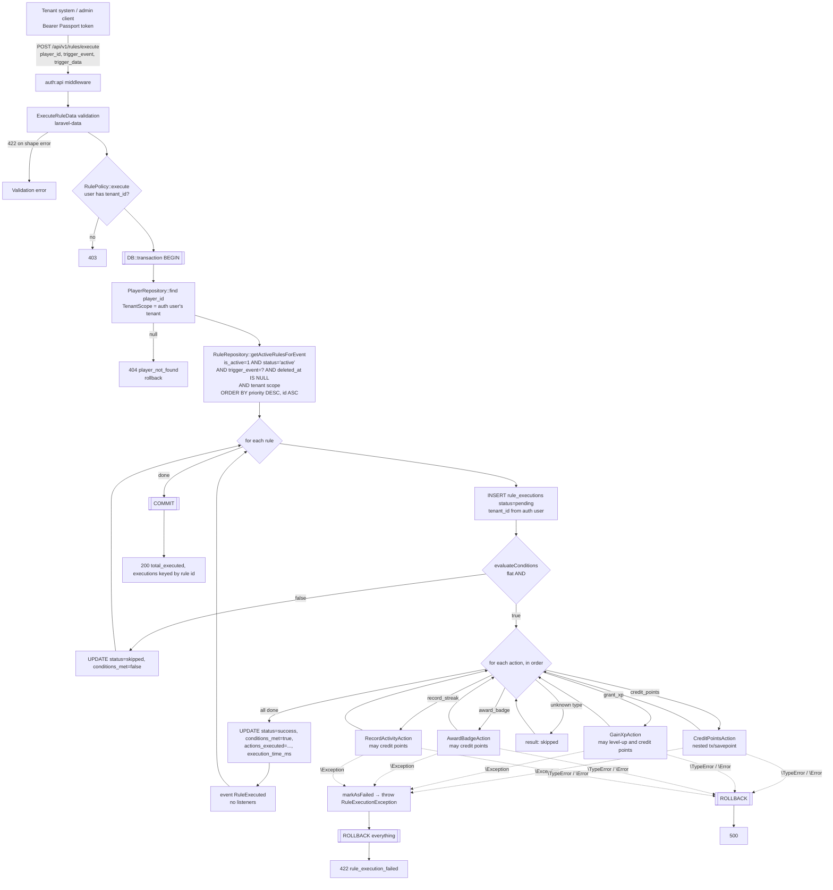
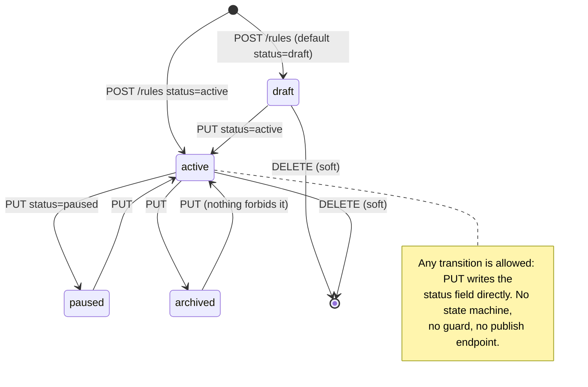
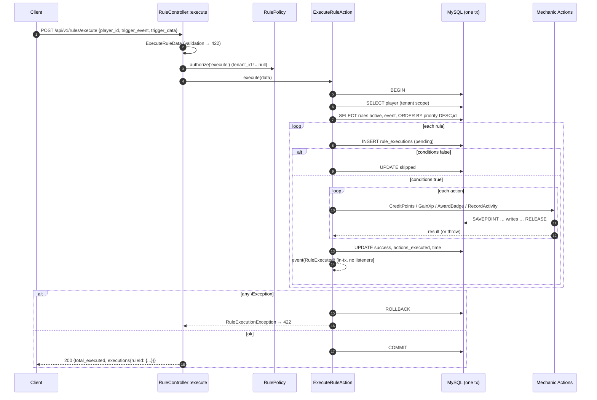

# 06 — Rules Engine & Activity Pipeline

> Scope: `app/Domain/Rule/**`, `app/Jobs/ProcessPlayerActivityJob.php`, `RuleController`, `routes/api/v1/rules.php`, the `rules` / `rule_executions` migrations, `RuleObserver` / `RuleExecutionObserver`, factories, seeder, and tests. Also covers the mechanic Actions the engine calls (call contract only; their internals belong to docs 03–05).
>
> Target: Go modular monolith per `/Users/saba/Projects/golang_advanced_blueprint` (CLAUDE.md, PRD, `docs/examples.md`). Product intent: `/Users/saba/Projects/LevelUpOS_GO/PRD.md`.
>
> Conventions: `path:line` citations are relative to `/Users/saba/Projects/LevelUpOS` unless prefixed `BP:` (blueprint repo) or `GO-PRD:` (LevelUpOS_GO/PRD.md). "**Inferred**" marks statements derived from reading code and not proven by running it. The test suite could not be run: `vendor/` is not installed in this checkout.

---

## 0. TL;DR, the facts that drive the rewrite

1. **There is no asynchronous activity pipeline.** `ProcessPlayerActivityJob` (`app/Jobs/ProcessPlayerActivityJob.php:14-69`) is a scaffold stub. Its `handle()` only logs (`:44-56`), and **nothing dispatches it**. A grep of `app/`, `routes/`, `tests/`, `database/` and `config/` finds no `ProcessPlayerActivityJob::dispatch` or `dispatch(new ProcessPlayerActivityJob…)`.
2. **The only ingestion path is synchronous**: `POST /api/v1/rules/execute` (`routes/api/v1/rules.php:18`). It goes through `RuleController::execute` (`app/Http/Controllers/Api/V1/RuleController.php:130-143`) to `ExecuteRuleAction::execute` (`app/Domain/Rule/Actions/ExecuteRuleAction.php:47-104`). The request needs an **internal numeric `player_id`**. No player is resolved or created by `external_id`, no event id is accepted, and there is **no idempotency**.
3. **The whole evaluation runs in one DB transaction** (`ExecuteRuleAction.php:49`). If any rule's action throws, everything rolls back, including the earlier rules' awards and every `rule_executions` row. That includes the row just marked `failed`, so **failed executions are never persisted**. The client gets 422 `rule_execution_failed`.
4. **Grammar size:**
   - Trigger: exact string match on `trigger_event`.
   - Conditions: a flat list, implicit AND. 2 source types (`player`, `trigger`), 8 operators, flat field keys only, no OR/NOT/nesting.
   - Actions: 4 types (`credit_points`, `grant_xp`, `award_badge`, `record_streak`).
   - Ordering: `priority DESC, id ASC`.
   - Not implemented: program scoping, cooldowns, per-player caps, schedule windows, stop-processing, mission progress, reward grants, webhooks. They are not even stored as columns. Anything like that could only sit unused inside `metadata`.
5. **Rule definitions cannot be read back over the API.** `RuleData` wraps `conditions`, `actions`, `metadata`, `created_at` and `updated_at` in `Lazy::create(...)` (`app/Domain/Rule/DataTransferObjects/RuleData.php:47-53`), and nothing ever calls `->include()`. Spatie laravel-data v4 omits lazy properties by default (**inferred** from library semantics; consistent with `tests/Feature/Api/V1/RuleControllerTest.php:56-63`, which asserts only scalar keys).
6. **Tenant isolation depends entirely on `auth()`.** This covers `TenantScope` (`app/Domain/Shared/Scopes/TenantScope.php:18-23`) and the observers that stamp `tenant_id` (`app/Observers/RuleExecutionObserver.php:16-18`, `app/Observers/WalletObserver.php:16-17`, …). The engine therefore only works inside an authenticated HTTP request. Run from a queue worker it would match **every tenant's rules** and fail on NOT NULL `tenant_id` inserts (**inferred**).
7. Versioning is "copy row, same slug, version+1, status draft" (`CreateRuleVersionAction.php:39-56`). **Nothing deactivates the previous version**, so two active versions of one rule both fire.

---

## 1. Purpose & concepts

| Concept | Laravel artefact | Meaning |
|---|---|---|
| Rule | `rules` row / `App\Domain\Rule\Models\Rule` (`app/Domain/Rule/Models/Rule.php:18-141`) | "When `trigger_event` happens for a player and all `conditions` hold, run `actions`." Tenant-owned and soft-deletable. |
| Trigger event | `rules.trigger_event` string (`database/migrations/2025_12_30_201208_create_rules_table.php:22`) | Free-form slug, e.g. `purchase_completed`. Conceptually points at the tenant event catalogue (`events.slug`, `app/Domain/Event/Models/Event.php:81-84`, doc 03), but this is **not validated and has no FK**. |
| Condition | element of `rules.conditions` JSON | Predicate on trigger payload or player attribute (§2.3). |
| Action | element of `rules.actions` JSON | Side effect on a mechanic: points, XP, badge, or streak (§2.4). |
| Rule version | another `rules` row with same `slug`, `version+1` | Copy-on-version (§3). |
| Rule execution | `rule_executions` row / `RuleExecution` model (`app/Domain/Rule/Models/RuleExecution.php`) | Audit record per (rule, player, request): status `pending → success \| skipped \| failed`. |
| Activity | no model; only the `trigger_event` + `trigger_data` request body | Laravel never persists the inbound activity itself. It is copied into every execution row (`ExecuteRuleAction.php:64-70`). |

### 1.1 Full pipeline as implemented (synchronous)



The stub job (`ProcessPlayerActivityJob`) is not on this diagram because nothing calls it.

---

## 2. Data model

### 2.1 `rules` (`database/migrations/2025_12_30_201208_create_rules_table.php:16-37`)

| Column | Type (MySQL in prod per `.env.example:23`; sqlite in tests per `phpunit.xml:26`) | Null | Default | Notes |
|---|---|---|---|---|
| `id` | bigint unsigned PK auto-inc | no | — | Also the tiebreaker in evaluation order (`Rule.php:136-140`). |
| `tenant_id` | bigint FK → `tenants.id` ON DELETE CASCADE (`:18`) | no | — | Set by `RuleObserver::creating` from `auth()->user()->tenant_id` when absent (`app/Observers/RuleObserver.php:16-18`). |
| `name` | varchar(255) | no | — | |
| `slug` | varchar(255) | no | — | API: `Str::slug(name).'-'.Str::random(5)` (`CreateRuleAction.php:27`). Regenerated on rename (`UpdateRuleAction.php:39-41`). Seeder: `slug-{tenantId}` via the `slugForTenant` macro (`database/seeders/RulesSeeder.php:247`, `app/Providers/AppServiceProvider.php:23-31`). **Not unique.** It is the version-chain key. |
| `description` | text | yes | null | |
| `trigger_event` | varchar(100) | no | — | Matched by exact equality (`Rule.php:128-131`). |
| `status` | varchar(50) | no | `'draft'` | Cast to `RuleStatus` (`Rule.php:53`). |
| `version` | int | no | 1 | `RuleObserver` also defaults it to 1 (`RuleObserver.php:20-22`). |
| `conditions` | json | yes | null | Array cast (`Rule.php:55`). |
| `actions` | json | **no** | — | Array cast (`Rule.php:56`). |
| `priority` | int | no | 0 | Higher runs first. |
| `is_active` | bool | no | true | Second activity switch, independent of `status`. |
| `metadata` | json | yes | null | Opaque. No code reads it. |
| `created_at`, `updated_at` | timestamp | yes | — | |
| `deleted_at` | timestamp | yes | — | SoftDeletes (`Rule.php:22`). |

Indexes (`:33-36`): `(tenant_id, trigger_event)`, `(tenant_id, status)`, `(tenant_id, is_active)`, `(slug, version)`. None are unique, and the last one does not include `tenant_id`. There is **no** index covering the hot query `(tenant_id, trigger_event, status, is_active, deleted_at)`.

### 2.2 `rule_executions` (`database/migrations/2025_12_30_201209_create_rule_executions_table.php:16-35`)

| Column | Type | Null | Default | Notes |
|---|---|---|---|---|
| `id` | bigint PK | no | — | |
| `tenant_id` | FK → tenants CASCADE | no | — | Stamped from `auth()` (`RuleExecutionObserver.php:16-18`). |
| `rule_id` | FK → rules CASCADE | no | — | Points at the specific version row. CASCADE only fires on hard delete; rules are soft-deleted. |
| `player_id` | FK → players CASCADE | no | — | |
| `trigger_event` | varchar(100) | no | — | Copied from request. |
| `trigger_data` | json | yes | null | Full request payload, copied **once per evaluated rule**. |
| `conditions_met` | bool | yes | null | null while pending, true/false after. |
| `actions_executed` | json | yes | null | `[{index, type, result:{…}}]` (`ExecuteRuleAction.php:186-190`). |
| `execution_status` | varchar(50) | no | `'pending'` | Plain string, no enum: `pending`/`success`/`skipped`/`failed` (`HasRuleExecutionHelpers.php:9-27`). |
| `error_message` | text | yes | null | Only set by `markAsFailed`, which is always rolled back (§4.6). |
| `execution_time_ms` | int | yes | null | Set only on success (`ExecuteRuleAction.php:83-84`). |
| `metadata` | json | yes | null | Never written. |
| `created_at` | timestamp | **no** | — | Model has `$timestamps = false` (`RuleExecution.php:28`). Observer fills `now()` (`RuleExecutionObserver.php:20-22`). No `updated_at`. |

Indexes (`:31-34`): `(tenant_id, rule_id)`, `(tenant_id, player_id)`, `(trigger_event, created_at)`, `(execution_status)`. There is no uniqueness, so nothing prevents duplicates.

### 2.3 Condition grammar, as implemented

Source: `ExecuteRuleAction::evaluateConditions` (`:109-122`), `evaluateCondition` (`:127-155`), `getPlayerFieldValue` (`:160-168`).

```
conditions   := null | [] | [ condition, ... ]          // implicit AND, short-circuit on first false
condition    := { "type": source, "field": string, "operator": operator, "value": any }
source       := "trigger" | "player"
operator     := "equals" | "not_equals" | "greater_than" | "less_than"
              | "greater_than_or_equal" | "less_than_or_equal" | "contains" | "in"
```

| Rule | Behaviour | Cite |
|---|---|---|
| `conditions` null or empty | Rule matches. | `:111-113` |
| Missing or falsy `type`, `field`, or `operator` | **Condition passes (true)**, silently. | `:134-136` |
| `type: "trigger"` | `actual = trigger_data[field] ?? null`. **Flat top-level key only**: no dot paths, no nesting. | `:140` |
| `type: "player"` | `field = "level"` → `$player->currentLevel?->level ?? 0`. The `Player` model has **no `currentLevel` relation** (`app/Domain/Player/Models/Player.php:19-124`), so this is always `0` (**inferred**: Eloquent returns null for an unknown attribute when strict mode is off, and strict mode is not enabled in `AppServiceProvider`). | `:163` |
| | `field = "points"` → `$player->wallet?->balance ?? 0`. The relation is lazy-loaded **once** and cached on the model, so later rules in the same request may see a stale balance. | `:164` |
| | `field = "is_active"` → `players.is_active`. | `:165` |
| | Any other field → `$player->getAttribute(field)`: any column, e.g. `external_id`, `email`, or `metadata` as a whole array. No path into `metadata`. | `:166` |
| Unknown `type` | `actual = null`. | `:141` |
| `equals` / `not_equals` | PHP **loose** `==` / `!=`. `"100" == 100` is true and `null == 0` is true. | `:145-146` |
| `greater_than` … `less_than_or_equal` | PHP loose ordering. A missing field (`null`) makes `less_than` true (`null < 5`). A non-numeric string compares as a string (`"abc" > 5` is true in PHP 8). | `:147-150` |
| `contains` | `str_contains((string) actual, (string) value)`. An empty `value` is always true. An array `actual` triggers "Array to string conversion", which Laravel turns into `ErrorException`, failing the whole request with 422 (**inferred**). | `:151` |
| `in` | `in_array(actual, (array) value)`, loose. A scalar `value` is wrapped. | `:152` |
| Unknown operator | **true**. This affects the seeder's `minimum` (`RulesSeeder.php:88, 107`). | `:153` |
| `conditions` is an object or contains a non-array element | `evaluateCondition(array …)` raises `TypeError`, which is not caught by `catch (\Exception)`, giving 500 and rollback (**inferred**). | `:115-116` |

Examples:

```json
// matches when trigger_data.amount > 200 (tests/Feature/Api/V1/RuleControllerTest.php:285-292)
[{"type":"trigger","field":"amount","operator":"greater_than","value":200}]

// player attribute
[{"type":"player","field":"points","operator":"greater_than_or_equal","value":1000}]

// membership
[{"type":"trigger","field":"category","operator":"in","value":["shoes","bags"]}]

// substring
[{"type":"trigger","field":"sku","operator":"contains","value":"PRO-"}]

// SEEDED rule, effectively ALWAYS TRUE: missing "type" means the condition is ignored (RulesSeeder.php:59-65)
[{"field":"is_first_purchase","operator":"equals","value":true}]
```

**Not implemented, and not even stored:** `any`/`or`, `not`, nested groups, dot paths, `exists`, `between`, regex, date/time comparisons, and the PRD aggregate conditions (`first_time`, `count`, `sum`, `unique`, `time_window`, `sequence`; GO-PRD:577-585).

### 2.4 Action grammar, as implemented

Source: `executeActions` (`:175-202`), `executeAction` (`:209-220`).

```
actions := [ action, ... ]           // executed in array order; first throw aborts the whole request
action  := credit_points | grant_xp | award_badge | record_streak | <unknown>
```

| `type` | Parameters read | Call | Result stored | Cite |
|---|---|---|---|---|
| `credit_points` | `amount` (int, default **0**), `description` (default `"Rule execution: {rule_name}"`), `rule_name` (default `Unknown`; read **from the action JSON**, not the rule), `rule_id` (read **from the action JSON**, normally absent, so null) | `CreditPointsAction::execute(new CreditPointsData(player_id, amount, description, type: Credit, reference_type: 'rule', reference_id: action.rule_id))` | `{status:"success", amount}` | `:227-243` |
| `grant_xp` | `amount` (int, default 0), `rule_id` (from JSON) | `GainXpAction::execute(new GainXpData(player_id, amount, source:'rule', source_id: action.rule_id))` | `{status:"success", amount}` | `:250-262` |
| `award_badge` | `badge_id` (int). Missing → skipped | `AwardBadgeAction::execute(new AwardBadgeData(player_id, badge_id))` | `{status:"success", badge_id}` or `{status:"skipped", reason:"No badge_id provided"}` | `:269-283` |
| `record_streak` | `activity_key` (string). Missing → skipped | `RecordActivityAction::execute(new RecordActivityData(player_id, activity_key))` | `{status:"success", activity_key, was_continued, milestone_reached}` | `:290-309` |
| anything else | — | none | `{status:"skipped", reason:"Unknown action type: X"}`. The rule still counts as **success** | `:218` |

Typing hazards: `ExecuteRuleAction.php` has `declare(strict_types=1)` and the DTOs take `int`. A float `amount` (`10.5`), a string (`"10"`), or the seeder's `'amount' => 'amount'` (`RulesSeeder.php:94`) therefore all raise `TypeError`. That is uncaught, so the request returns 500 and rolls back (**inferred**). DTOs built with `new` skip laravel-data validation, so `#[Min(1)]` on `amount` (`CreditPointsData.php:20-21`) is **not enforced**: `amount: 0` writes a zero transaction, and **a negative amount debits the wallet** through `Wallet::credit` → `increment('balance', negative)` (`app/Domain/Mechanics/Points/Models/Wallet.php:110-114`).

Examples:

```json
[
  {"type":"credit_points","amount":50,"description":"Purchase bonus"},
  {"type":"grant_xp","amount":100},
  {"type":"award_badge","badge_id":7},
  {"type":"record_streak","activity_key":"daily_login"}
]
```

**Mechanic call contracts** (detail in docs 04 and 05):

| Mechanic Action | Own tx | Throws (each fails the whole request) | Side effects / nested awards | Domain events |
|---|---|---|---|---|
| `CreditPointsAction` (`app/Domain/Mechanics/Points/Actions/CreditPointsAction.php:28-60`) | yes (savepoint) | `WalletInactiveException` | `getOrCreateForPlayer` wallet (no row lock, `WalletRepository.php:32-43`); atomic `increment` but `balance_before` read is racy; inserts `point_transactions` | `PointsCredited` |
| `GainXpAction` (`app/Domain/Mechanics/Levels/Actions/GainXpAction.php:37-101`) | yes | `PlayerNotFoundException` | read-modify-write `addXp` (`PlayerLevel.php:92-97`, lost-update race); level-up loop; `CreditPointsAction` for `points_reward` | `XpGained`, `PlayerLeveledUp` |
| `AwardBadgeAction` (`app/Domain/Mechanics/Badges/Actions/AwardBadgeAction.php:43-106`) | yes | `BadgeNotFound`, `PlayerNotFound`, `BadgeInactive`, **`BadgeAlreadyEarned`** (non-stackable), `BadgeMaxAwardsReached` | insert `player_badges` (unique `(player_id,badge_id)`, migration `…player_badges_table.php:27`) or increment count; credit `points_value` | `BadgeAwarded` |
| `RecordActivityAction` (`app/Domain/Mechanics/Streaks/Actions/RecordActivityAction.php:42-129`) | yes | `StreakNotFoundException` (missing or inactive) | **increments on every call, including the same day** (`PlayerStreak.php:134-145`; `StreakAlreadyRecordedException` is declared but never thrown); credit `points_per_day`; milestone bonus | `StreakBroken`, `StreakMilestoneReached`, `StreakActivityRecorded` |

`BadgeAlreadyEarned` has a severe consequence. A rule with a non-stackable `award_badge` succeeds once for a player. After that, every later activity of that trigger type for that player fails with 422 and rolls back **all** rules for that activity, forever.

### 2.5 Fields asked about that do not exist

| Feature | Status in Laravel |
|---|---|
| Program scoping (`program_id`) | **Absent.** No column; rules are tenant-wide. |
| Stop-processing flag | **Absent.** All matching rules always run. |
| Cooldown / max executions per player / per day | **Absent.** |
| Schedule window (`starts_at`/`ends_at`) | **Absent.** |
| Segment / audience | **Absent.** |
| `mission_progress`, `grant_reward`, `emit_webhook`, `set_level` actions | **Absent.** Missions progress only through their own API (`UpdateProgressAction`, doc 05). |
| Trigger filters beyond the event name | **Absent** (use conditions with `type:trigger`). |
| Internal triggers (`level_up`, `badge_earned`, `mission_completed`) | Seeded as rules (`RulesSeeder.php:187-228`), but **nothing emits these triggers**. No listener converts domain events into executions, so those rules are dead configuration. |

### 2.6 Ordering

`ORDER BY priority DESC, id ASC` (`Rule.php:136-140`, used by `RuleRepository.php:26-33`). The ordering is deterministic. It matters because actions mutate state that later rules read through `player.points` (§2.3) and because the first failure aborts later rules. The test "executes multiple rules in priority order" (`RuleControllerTest.php:321-371`) only checks the final balance of 30, **not the order**.

---

## 3. `RuleStatus`, lifecycle, versioning

`app/Domain/Rule/Enums/RuleStatus.php:7-34`: `Draft='draft'`, `Active='active'`, `Paused='paused'`, `Archived='archived'`. `isActive()` is true only for `Active`.

A rule is **live** iff `is_active = true AND status = 'active' AND deleted_at IS NULL` (`Rule.php:98-101`, `:119-123`).



### 3.1 Versioning (`CreateRuleVersionAction`, `app/Domain/Rule/Actions/CreateRuleVersionAction.php:26-61`)

1. Load the source row by id (tenant-scoped). Missing → `RuleNotFoundException` (404).
2. Filter non-null input fields (`:34-37`).
3. **Keep the slug** (`:39`). `version = source.version + 1` (`:41`), computed from the **row passed in**, not the max in the chain.
4. Insert a **new row**: unspecified fields come from the source, `status = Draft` (`:49`), and `is_active` is copied (usually `true`).
5. Fire `RuleCreated` (`:58`).

Semantics and gaps:
- Versions are linked only by `slug`. No `parent_id`, no `rule_group_id`.
- **Which version is active?** Every row whose status is active and `is_active` is set. Activating v2 through `PUT /rules/{v2}` with `status:active` does **not** pause v1, so both fire (double award). `RuleRepository::getLatestVersionBySlug` (`RuleRepository.php:46-52`) exists but **nothing uses it**.
- Making a version from v1 when v2 exists produces another v2 (duplicate version numbers; index `(slug, version)` is not unique).
- `PUT /rules/{id}` with a new `name` **regenerates the slug** (`UpdateRuleAction.php:39-41`), which **detaches that row from its version chain**.
- `PUT` mutates rows in place, including live ones, so history is lost. Executions point at the row id, so you cannot tell which definition produced an execution.
- `Rule::createNewVersion()` (`Rule.php:106-114`) is an unused alternative (replicate) with the same semantics.
- The `slug` is not tenant-qualified in API-created rules. Collisions across tenants are improbable (5 random chars) but the index is not tenant-scoped.

### 3.2 Create / update / delete

| Action | Behaviour | Cite |
|---|---|---|
| `CreateRuleAction` | Inserts with `version=1`, random-suffixed slug, fields from DTO; fires `RuleCreated`. **No validation of `trigger_event` against the event catalogue** and none of the condition or action structure. | `CreateRuleAction.php:22-42` |
| `UpdateRuleAction` | Drops `null` and `Optional` fields, so **you cannot clear `description`, `conditions` or `metadata` to null** (sending `[]` for conditions works). Slug regenerates on rename. `AbstractRepository::update` → `fresh()`. Fires `RuleUpdated`. | `UpdateRuleAction.php:26-49`, `app/Domain/Shared/Abstracts/AbstractRepository.php:84-90` |
| `DeleteRuleAction` | Soft delete via an Eloquent builder `delete()` with the SoftDeletes scope. No event. Executions remain. | `DeleteRuleAction.php:22-31`, `AbstractRepository.php:95-98` |

---

## 4. Execution: `ExecuteRuleAction` and `ProcessPlayerActivityJob`

### 4.1 `ProcessPlayerActivityJob` (stub, `app/Jobs/ProcessPlayerActivityJob.php`)

| Property | Value | Cite |
|---|---|---|
| Interfaces | `ShouldQueue`; traits Dispatchable, InteractsWithQueue, Queueable, SerializesModels | `:14-19` |
| Payload | `Player $player` (serialized as a model identifier), `string $activityType`, `array $activityData` | `:34-38` |
| `$tries` | 3 (overrides Horizon supervisor `tries: 1`, `config/horizon.php:194`) | `:24` |
| `$timeout` | 120s. **Greater than the redis `retry_after` of 90s** (`config/queue.php:71`), so a job running over 90s is re-released and runs twice concurrently. Horizon supervisor timeout is 60 (`config/horizon.php:195`). | `:29` |
| Connection / queue | defaults: `QUEUE_CONNECTION` (`config/queue.php:16`, default `redis`; `.env.example:38` says `database`), queue `default` | — |
| Backoff, uniqueness, middleware | none | — |
| `handle()` | `logger()->info('Processing player activity', …)` only | `:44-56` |
| `failed()` | logs error | `:61-68` |
| Dispatched from | **nowhere** | grep |

If it were wired up: no `auth()` exists in a worker, so `TenantScope` would be a no-op (`TenantScope.php:18`) and the observers would not stamp `tenant_id`. Rule loading would return every tenant's rules, and execution and wallet inserts would violate NOT NULL `tenant_id` (**inferred**). **Do not port it.** It represents only an intent.

### 4.2 `ExecuteRuleAction::execute`, step by step (`ExecuteRuleAction.php:47-104`)

| # | Step | Detail |
|---|---|---|
| 1 | `DB::transaction(...)` | One outer transaction for the whole request (`:49`). Mechanic actions open nested transactions, which become savepoints. |
| 2 | Resolve player | `playerRepository->find(player_id)` (`:50`), tenant-scoped through `TenantScope` on `Player` (`Player.php:68-71`). Missing or other tenant → `PlayerNotFoundException` → 404 `{message, error:"player_not_found"}` (`app/Domain/Player/Exceptions/PlayerNotFoundException.php:21-27`). **No lookup by `external_id`, no auto-create**, and `players.is_active` is not checked. |
| 3 | Load rules | `getActiveRulesForEvent(trigger_event)` → `active()->forEvent()->orderedByPriority()->get()` with tenant scope and SoftDeletes (`RuleRepository.php:26-33`). No caching; one query per request. |
| 4 | Per rule: start timer | `microtime(true)` (`:61`). |
| 5 | Insert execution | `status='pending'`, `trigger_data` (or `[]`), `tenant_id` from auth (`:64-70`, `RuleExecutionObserver.php:14-23`). |
| 6 | Evaluate | `evaluateConditions` (`:73`). False → `markAsSkipped()` → UPDATE `status=skipped, conditions_met=false` (`HasRuleExecutionHelpers.php:22-27`), then continue. `execution_time_ms` stays null. |
| 7 | Execute actions | Sequential (`:81`, `:183-199`). The per-action catch appends an error entry and **re-throws**, so the error entry is lost (`:191-197`). |
| 8 | Success | `execution_time_ms` = elapsed ms including actions. `markAsSuccessful(actionsExecuted)` → UPDATE `status=success, conditions_met=true, actions_executed` (`:83-85`, `HasRuleExecutionHelpers.php:9-15`). |
| 9 | Event | `event(new RuleExecuted(rule, player, execution, true, actionsExecuted))` (`:87`). Dispatched **inside the open transaction**, so a later rollback leaves a phantom event. No listeners exist. |
| 10 | Failure | `catch (\Exception $e)` → `markAsFailed(msg)` then `throw new RuleExecutionException("Failed to execute rule '{name}': {msg}")` (`:91-96`). The outer transaction rolls back, **including the failed marker**. `\Error` and `\TypeError` bypass this catch and also roll back, returning 500. |
| 11 | Return | `['executions' => [rule_id => RuleExecution], 'total_executed' => successCount]` (`:99-102`). |

Properties:
- **Atomicity**: all-or-nothing across all rules and all actions.
- **Error handling per rule vs per request**: there is none per rule. One bad rule blocks every rule for that trigger.
- **Idempotency**: none. The request has no event id, and a retry double-awards.
- **Concurrency**: two concurrent requests for one player run in separate transactions. The wallet uses an atomic increment, but XP (`addXp` read-modify-write) and streak increments can lose updates. Badge award relies on the unique index, so a race returns 500 or 422 (**inferred**).
- **Execution record content**: the input snapshot (`trigger_event`, `trigger_data`) is stored. **Not stored**: per-condition results, the rule version or definition snapshot, the player snapshot, or an activity or request id.

### 4.3 Sequence (synchronous path)



---

## 5. HTTP API (Laravel)

All routes sit under `/api/v1/rules` (`routes/api.php:21-36` mounts each file as a prefix), inside `Route::middleware('auth:api')` (Passport bearer, `config/auth.php:44-47`). There is no rate limiting, no `Idempotency-Key` handling, and no route-model binding: `{rule}` is an `int` controller parameter. CORS is appended globally (`bootstrap/app.php:16`).

| # | Method & path | Controller | Policy | Success | Errors |
|---|---|---|---|---|---|
| 1 | `GET /api/v1/rules` | `index` (`RuleController.php:36-43`) | `viewAny` | 200 paginated (15/page, no filters/sort, all versions and statuses, tenant-scoped) | 401, 403 |
| 2 | `POST /api/v1/rules` | `store` (`:48-55`) | `create` | **201** `RuleData` | 401, 403, 422 |
| 3 | `GET /api/v1/rules/{rule}` | `show` (`:60-71`) | `view` (after find) | 200 `RuleData` | 401, 404 `rule_not_found`, 403 |
| 4 | `PUT /api/v1/rules/{rule}` | `update` (`:76-89`) | `update` | 200 `RuleData` | 401, 404, 403, 422 |
| 5 | `DELETE /api/v1/rules/{rule}` | `destroy` (`:94-107`) | `delete` | **204** | 401, 404, 403 |
| 6 | `POST /api/v1/rules/{rule}/version` | `createVersion` (`:112-125`) | `update` | **201** `RuleData` (new row) | 401, 404, 403, 422 |
| 7 | `GET /api/v1/rules/{rule}/executions` | `executions` (`:148-161`) | `view` | 200 paginated `RuleExecutionData` (15/page, `created_at DESC`, eager `player`, `RuleExecutionRepository.php:38-45`) | 401, 404, 403 |
| 8 | `POST /api/v1/rules/execute` | `execute` (`:130-143`) | `execute` | **200** (synchronous, not 202) | 401, 403, 404 `player_not_found`, 422 validation / `rule_execution_failed`, 500 on TypeError |

Find-before-authorize means another tenant's rule id returns 404 (scope), not 403, so nothing leaks. A data validation 422 happens **before** authorization, because the laravel-data object resolves before the method body runs.

Route quirk: `GET /api/v1/rules/execute` matches `show('execute')` and gives 500 on the int coercion (**inferred**).

### 5.1 Validation (laravel-data attributes; inferred rules)

`CreateRuleData` (`app/Domain/Rule/DataTransferObjects/CreateRuleData.php:18-45`):

| Field | Rules |
|---|---|
| `name` | required, string, max:255 |
| `description` | nullable, string, max:1000 |
| `trigger_event` | required, string, max:100 |
| `status` | required, enum `RuleStatus` (PHP default `Draft`; whether an omitted value passes validation depends on laravel-data default handling. The 403 test at `RuleControllerTest.php:124-142` omits `status` and expects 403, which suggests it passes. **Inferred.**) |
| `conditions` | nullable, array. **No structure validation.** |
| `actions` | required, array (so non-empty). **No structure validation.** |
| `priority` | integer, min:0 (default 0) |
| `is_active` | boolean (default true) |
| `metadata` | nullable, array |

`UpdateRuleData` (`UpdateRuleData.php:19-46`): every field is `sometimes|nullable` with the same type and size rules, and `status` is enum. It is also used for `/version`.

`ExecuteRuleData` (`ExecuteRuleData.php:13-21`): `player_id` required, integer, min:1; `trigger_event` required, string (**no max**); `trigger_data` nullable array (no size limit).

Validation errors use Laravel's default shape: `422 {"message": "...", "errors": {"field": ["..."]}}`.

### 5.2 Response shapes

`RuleData` (`RuleData.php:15-55`). The **actual JSON** omits the `Lazy::create` fields (`conditions`, `actions`, `metadata`, `created_at`, `updated_at`) (**inferred** from laravel-data semantics):

```json
{
  "id": 12, "tenant_id": 3, "name": "First Purchase Bonus",
  "slug": "first-purchase-bonus-a8KzQ", "description": "Award points on first purchase",
  "trigger_event": "purchase_completed", "status": "active", "version": 1,
  "priority": 10, "is_active": true
}
```

Paginated (index, executions): `{"data":[…], "links":[…], "meta":{"current_page":1,"per_page":15,"total":…,…}}` (asserted at `RuleControllerTest.php:56-62`).

`POST /execute` → 200. `executions` is keyed by **rule id**, so it serializes as a JSON **object** when ids are non-sequential. `trigger_data`, `actions_executed`, `metadata`, `created_at` are lazy and omitted. `rule` is `whenLoaded` and not loaded.

```json
{
  "total_executed": 1,
  "executions": {
    "41": {"id": 901, "rule_id": 41, "player_id": 7, "trigger_event": "purchase_completed",
           "conditions_met": true, "execution_status": "success",
           "error_message": null, "execution_time_ms": 4}
  }
}
```

Error bodies:

| Exception | Status | Body | Cite |
|---|---|---|---|
| `RuleNotFoundException` | 404 | `{"error":"rule_not_found","message":"Rule not found."}` | `app/Domain/Rule/Exceptions/RuleNotFoundException.php:21-27` |
| `RuleExecutionException` | 422 | `{"error":"rule_execution_failed","message":"Failed to execute rule 'X': <inner message>"}` | `RuleExecutionException.php:21-27` |
| `PlayerNotFoundException` | 404 | `{"message":"Player not found.","error":"player_not_found"}` | `PlayerNotFoundException.php:21-27` |
| AuthorizationException | 403 | `{"message":"This action is unauthorized."}` | framework |
| Unauthenticated | 401 | `{"message":"Unauthenticated."}` | framework |

Example request:

```http
POST /api/v1/rules/execute
Authorization: Bearer <passport token>
Content-Type: application/json

{"player_id": 7, "trigger_event": "purchase_completed",
 "trigger_data": {"order_id": "12345", "amount": 100.00}}
```

---

## 6. Authorization matrix

`RulePolicy` (`app/Domain/Rule/Policies/RulePolicy.php:15-58`) is registered in `DomainServiceProvider.php:147`. "Administrative" means Owner, SuperAdmin, PlatformAdmin, or Admin (`app/Domain/User/Enums/Role.php:61-69`, `HasRoleHelpers.php:58-63`, Spatie roles).

| Ability | Rule | Owner / SuperAdmin / PlatformAdmin / Admin (with tenant) | ProgramManager | Developer | Tenant user, no role | User with `tenant_id = null` |
|---|---|---|---|---|---|---|
| viewAny (list) | `tenant_id !== null` | ✅ | ✅ | ✅ | ✅ | ❌, **500 inferred**: `getTenantId(): int` raises TypeError on null (`HasUserAccessors.php:23-26`) |
| view / executions | same tenant | ✅ | ✅ | ✅ | ✅ | ❌ (500) |
| create | tenant ∧ administrative | ✅ | ❌ | ❌ | ❌ | ❌ |
| update / version | same tenant ∧ administrative | ✅ | ❌ | ❌ | ❌ | ❌ |
| delete | same tenant ∧ administrative | ✅ | ❌ | ❌ | ❌ | ❌ |
| execute (ingest) | `tenant_id !== null` | ✅ | ✅ | ✅ | ✅ | ❌ (500) |

There is no machine credential: ingestion uses a **user** Passport token. Platform-level users without a tenant cannot use the API at all (TypeError), and if they could, `TenantScope` would not filter them. Tenant API keys belong to doc 02.

---

## 7. Domain events & observers

| Event | Fired at | Payload | Listeners |
|---|---|---|---|
| `RuleCreated` (`app/Domain/Rule/Events/RuleCreated.php`) | `CreateRuleAction.php:39`, `CreateRuleVersionAction.php:58` | `Rule` | **none** (no `app/Listeners`, no `Event::listen`) |
| `RuleUpdated` | `UpdateRuleAction.php:46` | `Rule` | none |
| `RuleExecuted` | `ExecuteRuleAction.php:87` (success only; inside tx) | rule, player, execution, `conditionsMet` (always true), actions | none |
| (no `RuleDeleted`, `RuleSkipped`, `RuleFailed`) | — | — | — |
| Downstream mechanic events | `PointsCredited`, `XpGained`, `PlayerLeveledUp`, `BadgeAwarded`, `StreakBroken`, `StreakMilestoneReached`, `StreakActivityRecorded` | see docs 04/05 | none. None are `ShouldBroadcast`, and none are `ShouldDispatchAfterCommit`. |

Observers (registered `DomainServiceProvider.php:207-208`):
- `RuleObserver::creating`: `tenant_id ← auth()->user()->tenant_id` if unset; `version ← 1` if unset (`app/Observers/RuleObserver.php:14-23`).
- `RuleExecutionObserver::creating`: `tenant_id` from auth; `created_at ← now()` if unset (`app/Observers/RuleExecutionObserver.php:14-23`).
- Indirect: `WalletObserver`, `PlayerLevelObserver` and others stamp the tenant from `auth()` on rows the engine creates (`app/Observers/WalletObserver.php:16-17`, `PlayerLevelObserver.php:16-17`).

---

## 8. Filament

**No rule features exist in the admin panel.** `AdminPanelProvider` auto-discovers resources under `app/Filament/Resources` (`app/Providers/Filament/AdminPanelProvider.php:35`). The only resource there is `Domain/Event/Models/EventCategories/EventCategoryResource.php`. There is no rule builder, no rule list, no execution log viewer, and no simulator. The Go PRD expects "Rule builder, rule list, validation, simulation" (GO-PRD:397-398, 416), so that is entirely new work.

---

## 9. Tests → acceptance checklist, and a golden corpus

### 9.1 Existing tests (`tests/Feature/Api/V1/RuleControllerTest.php`, the only rule test file)

Setup (`:20-45`): roles seeded for `web`/`api`, Passport personal client, tenant, Admin user as tenant owner, one player.

| # | Test (line) | Go acceptance criterion |
|---|---|---|
| 1 | list returns paginated rules (`:48`) | `GET /rules` returns `data[]` with `id,name,slug/key,trigger_event,status,version` and pagination meta |
| 2 | list excludes other tenants (`:66`) | tenant isolation on list |
| 3 | create (`:84`) | 201, `version=1`, persisted with caller's tenant |
| 4 | create missing name → 422 (`:115`) | problem+json 422 with field error `name` |
| 5 | create as non-admin → 403 (`:124`) | permission `rules:create` required |
| 6 | show (`:146`) | 200 with id, name |
| 7 | show unknown → 404 (`:161`) | 404 |
| 8 | update name (`:169`) | 200 reflects new name |
| 9 | delete soft (`:187`) | 204; row retained with `deleted_at` |
| 10 | create version (`:200`) | 201, `version=2`, `status=draft`, same chain key |
| 11 | execute credits wallet (`:232`) | one active rule with `credit_points 50` → execution `success`, wallet balance 50 |
| 12 | execute skips on unmet condition (`:279`) | `trigger.amount > 200` with amount 100 → `skipped`, `conditions_met=false`, `total_executed=0` |
| 13 | multiple rules (`:321`) | two rules (10 + 20) → `total_executed=2`, balance 30 (order **not** asserted) |
| 14 | executions list (`:375`) | 3 rows for rule |
| 15 | unauthenticated → 401 (`:394`) | 401 |

Missing coverage that Go must add: failure rollback semantics, ordering, every operator, player-field conditions, `award_badge`/`record_streak`/`grant_xp`, cross-tenant player, idempotency, version activation, and the async path.

### 9.2 Proposed golden corpus (parity harness)

Format: `testdata/rules/golden/*.yaml`, run by a pure-evaluator test (`go test ./internal/modules/rules/internal/domain/eval/...`) and by an end-to-end test (ingest, then assert mechanic state). Each case has `rules`, `player` snapshot, `activity`, `expect.executions[] {rule, status}`, `expect.effects[]`, and optional `expect_laravel` where Go deliberately diverges.

| ID | Rules | Activity / state | Expected (Go) | Laravel behaviour, if different |
|---|---|---|---|---|
| G01 | none | any | no executions, decision recorded | no rows |
| G02 | R(credit 50) | `purchase_completed` | R matched; effect `points.credit 50` | same |
| G03 | R(cond `trigger.amount > 200`) | amount=100 | skipped | same |
| G04 | R(cond `trigger.amount >= 100`) | amount=100.00 | matched | same |
| G05 | R1 p=10 credit 10, R2 p=20 credit 20 | — | eval order R2, R1; effects in that order; total 30 | same total |
| G06 | equal priority, ids 5 and 3 | — | order by creation (id 3 first) | same |
| G07 | cond missing `type` | — | **compile error at write time**; legacy migrated rule treated as `true` | always true |
| G08 | cond operator `minimum` | — | compile error; migrated → flagged | always true |
| G09 | `trigger.amount equals "100"` | amount=100 | match (documented numeric coercion) | match (loose ==) |
| G10 | `trigger.coupon less_than 5` | coupon absent | **false** (missing → not matched) | true (`null < 5`) |
| G11 | `trigger.sku contains ""` | sku="X" | compile error (empty needle) | true |
| G12 | `trigger.tag in ["a","b"]` | tag="b" | match | same |
| G13 | `player.points >= 100` | balance 150 | match (snapshot pre-activity) | match |
| G14 | R1 credit 100; R2 cond `player.points >= 100` | balance 0 | R2 **skipped**: single pre-activity snapshot, deterministic | depends on lazy-load timing (R2 sees stale 0 → skipped) |
| G15 | `player.level >= 2` | level 3 | match | **always 0 → skipped** (no relation) |
| G16 | award_badge non-stackable | badge already earned | rule matched; badge effect **rejected** (business outcome); other rules unaffected | whole request 422, all rolled back |
| G17 | credit `amount: 0` | — | compile error | 0-point transaction |
| G18 | credit `amount: -5` | — | compile error | wallet debited 5 |
| G19 | credit `amount: 10.5` | — | compile error (integer points) | 500 TypeError |
| G20 | unknown action type | — | compile error; migrated → effect `skipped` | `skipped`, rule success |
| G21 | record_streak twice same day | — | second is no-op (idempotent per period) | increments twice |
| G22 | duplicate activity `event_id` | — | second ingest returns original activity; no new effects | double award |
| G23 | two versions of same rule (v1 active, v2 published) | — | only active version fires | both fire |
| G24 | rule `paused` / `is_active=false` / soft-deleted | — | not evaluated | same |
| G25 | player of other tenant | — | activity rejected `player_not_found` | 404 |
| G26 | unknown player external id (auto-create off) | — | activity settled `rejected: player_not_found` | n/a (internal id only) |
| G27 | `grant_xp 500` crossing two levels | — | effect `levels.grant_xp 500`; levels module awards both levels once | same (sync) |
| G28 | same activity redelivered after crash mid-publish | — | identical decision id; effects deduped by idempotency key | n/a |

---

## 10. Bugs, races, non-determinism, unimplemented parts (do not port blindly)

| # | Issue | Evidence | Go decision |
|---|---|---|---|
| B1 | Async job is a stub and never dispatched | `ProcessPlayerActivityJob.php:44-56` | Build the real async pipeline (§11) |
| B2 | One failing action rolls back all rules; failed executions never persist | `ExecuteRuleAction.php:49, 91-96` | Per-effect outcomes; business rejections are results |
| B3 | Non-stackable badge permanently blocks a trigger for a player | §2.4 | Badge rejection = settled outcome, not an error |
| B4 | Conditions with missing `type`/`field`/`operator` or an unknown operator evaluate **true** | `:134-136, :153` | Validate at write time; reject |
| B5 | Seeder rules are malformed (no `type`, `minimum` operator, `amount: "amount"`) | `RulesSeeder.php:59-65, 86-95, 105-108` | Fix seeds; migration flags |
| B6 | `player.level` is always 0 (no `currentLevel` relation) | `ExecuteRuleAction.php:163`, `Player.php` | Read from a levels port |
| B7 | `reference_id` / `source_id` / `rule_name` read from the action JSON, not the rule | `:230, :239, :258` | Engine injects rule id, version, activity, decision |
| B8 | No validation of action params: 0 or negative amounts, float → TypeError 500 | §2.4 | Compile-time validation |
| B9 | No idempotency; retries double-award | §4.2 | `(tenant_id, event_id)` unique + derived effect keys |
| B10 | Multiple active versions both fire; rename breaks chain; duplicate version numbers | §3.1 | `rules` + immutable `rule_versions` + `active_version_id` + publish |
| B11 | `RuleData` omits conditions and actions in responses | `RuleData.php:47-53` | Return full definition |
| B12 | `Lazy` / `TypeError` 500s for null-tenant users | `HasUserAccessors.php:23-26` | Casbin + principal tenant |
| B13 | `TenantScope` and tenant stamping rely on `auth()`; unusable from workers | `TenantScope.php:18`, observers | Explicit `tenant_id` in every query and payload |
| B14 | `RuleExecuted` fired inside tx (phantom on rollback) | `:87` | Outbox in owning tx |
| B15 | Streak increments on every call (same day) | `PlayerStreak.php:134-145` | Period-bucketed idempotent record (doc 05) |
| B16 | XP read-modify-write lost update; wallet `balance_before` racy | `PlayerLevel.php:92-97`, `CreditPointsAction.php:37-49` | Row lock + version (docs 04) |
| B17 | `player.points` stale or fresh depending on first lazy-load | `:164` | Single pre-activity snapshot |
| B18 | Loose PHP comparison semantics (`null < 5`, `"abc" > 5`) | `:144-154` | Typed semantics + documented coercions |
| B19 | `trigger_data` duplicated into every execution row | `:68` | Store once on activity |
| B20 | Job `timeout 120 > retry_after 90` (would double-run) | `ProcessPlayerActivityJob.php:29`, `config/queue.php:71` | n/a (blueprint retry ladder) |
| B21 | `GET /rules/execute` → 500 | routes | chi routes with typed path params |
| B22 | Internal triggers (`level_up`, `badge_earned`, …) never fire | §2.5 | Optional bridge with depth cap (§11.9) |
| B23 | No hot-path index `(tenant_id, trigger_event, status, is_active)` | migration `:33-36` | Partial index on published versions |
| B24 | Seeder event lookup has wrong OR precedence (`where tenant OR (null AND slug)`) | `RulesSeeder.php:233-236` | n/a |
| B25 | Can't null-out description, conditions or metadata via PUT | `UpdateRuleAction.php:34-37` | JSON Merge Patch semantics or full PUT |

---

## 11. Go blueprint mapping, concrete design

### 11.1 Divergence: product intent vs Laravel vs blueprint

| Topic | GO-PRD intent | Laravel reality | Blueprint constraint | Decision |
|---|---|---|---|---|
| Ingest endpoint | `POST /v1/events` with `event_id`, `user_id`, `event_type`, `timestamp`, `properties`, `context` (GO-PRD:448-469) | `POST /rules/execute` with internal `player_id` | Transport validates shape; event path default | `POST /api/v1/activities` (the `/events` path is already the event-type catalogue, doc 03); body follows the PRD format |
| Response | sync decision with `effects` and `state_delta` (GO-PRD:471-487) | sync 200 with executions | "The event path is the default. Always." Sync is an exception (BP:CLAUDE.md "Multi-step workflows") | **202 Accepted** + `activity_id`, `decision_url`. Sync decision only via `POST /rules/simulate` (no writes). A sync fast path is P2 and needs a PR justification. |
| Dedupe | `event_id` per tenant (GO-PRD:108) | none | `Idempotency-Key` middleware (R11) + idempotent subscribers | Both: header middleware **and** unique `(tenant_id, event_id)` |
| Atomic actions | "Action execution atomic with state updates" (GO-PRD:135) | one giant tx | No multi-module tx (BP:PRD §8) | Decision is atomic within `rules_svc`; each effect is atomic within its target module; eventual across modules |
| Rule cache | Redis compiled rules, invalidated on publish (GO-PRD:143, 567) | none | Evict after commit (R44), module-prefixed cache (R42) | §11.6 |
| Conditions | first_time, count, sum, unique, time_window, property_match, sequence (GO-PRD:577-585) | 8 scalar operators | — | v1 = property_match plus combinators; v2 = aggregates (§11.5) |
| Actions | award_points(currency), unlock_badge, advance_mission, set_level, emit_webhook, create_reward, send_notification (GO-PRD:587-595) | 4 types | jobs via outbox (R46) | §11.4 |
| Limits | max per user/day, cooldowns, caps (GO-PRD:575) | none | — | `limits` on version + counters table |
| Versioning | published drafts, `POST /rules/{id}/publish` (GO-PRD:137, 442) | copy-row | — | immutable versions + publish |
| Latency | p95 < 50ms, p99 < 100ms sync with cached rules (GO-PRD:717) | n/a | Outbox dispatcher poll adds latency | Targets in §11.10 |
| Program scope | rules belong to programs (GO-PRD:553, 573) | tenant-wide | — | nullable `program_id`; null = tenant-wide (Laravel parity) |

### 11.2 Modules

```
internal/modules/activity/   schema activity_svc   — ingestion, raw activity store, status projection
internal/modules/rules/      schema rules_svc      — definitions, versions, evaluator, decisions, executions
```

Why two modules: ingest must stay a cheap single-insert write path that is available even when evaluation is degraded (GO-PRD:723 "accept events async even if sync decision path is overloaded"). Rules owns definitions and the decision log. A merge into one module is viable if the team prefers fewer modules; nothing below depends on the split except topic names.

Layering (BP:CLAUDE.md "Layout"):

```
rules/
  module.go             // New(d, cfg, players ports.PlayerReader, levels ports.LevelReader, points ports.PointsReader)
  config.go             // RULES_ prefix: CacheTTL, MaxRulesPerTrigger, MaxActionsPerRule, MaxCausationDepth
  contracts/            // topics.go, events.go, permissions.go, types.go (Reader for "rules engine" admin reads)
  ports.go
  adapters/             // players_local.go, levels_local.go, points_local.go (wrap their contracts.Reader)
  internal/domain/      // Rule, RuleVersion, Decision, Execution, invariants, errors.go
  internal/domain/eval/ // PURE evaluator: Compile(raw) (*Program, error); Evaluate(*Program, Facts) Result
  internal/app/         // Service: CRUD, Publish, Simulate, Decide(activity) — tx + outbox + authz
  internal/ports/       // PlayerReader, LevelReader, PointsReader + snapshot types; mocks
  internal/repo/        // unexported gorm models; cached ruleset repo decorator
  internal/transport/   // chi handlers, DTOs (validate tags), swag
  migrations/           // 0001_init.sql, 0002_seed_permissions.go
activity/
  module.go, contracts/{topics,events,permissions}.go, internal/{domain,app,repo,transport}, migrations/
```

### 11.3 End-to-end async pipeline

```mermaid
sequenceDiagram
    autonumber
    participant T as Tenant system
    participant A as activity (HTTP)
    participant OB as outbox (same tx)
    participant D as dispatcher → RabbitMQ
    participant R as rules (worker subscriber)
    participant PR as players/levels/points Readers (ports)
    participant MX as points / levels / badges / streaks / missions / rewards (job consumers)
    T->>A: POST /api/v1/activities {event_id, player_external_id, event_type, occurred_at, properties}<br/>Idempotency-Key
    A->>A: InTx: INSERT activities ON CONFLICT (tenant_id,event_id) DO NOTHING
    A->>OB: Publish activity.received.v1 (only if inserted)
    A-->>T: 202 {activity_id, status:"pending"} (replay: 200 same body)
    D->>R: activity.received.v1 (at-least-once, unordered)
    R->>R: load compiled ruleset (redis-cache by tenant generation → DB)
    R->>PR: resolve player by external id; snapshot (only if rules reference player.*)
    R->>R: eval.Evaluate (pure, deterministic)
    R->>R: InTx: INSERT decisions ON CONFLICT(activity_id) DO NOTHING<br/>INSERT rule_executions; UPSERT rule_player_counters (limits)
    R->>OB: Publish job.points.credit / job.levels.grant_xp / job.badges.award / … (one per effect)<br/>+ rules.decision_made.v1
    D->>MX: job.* (exactly one consumer group each)
    MX->>MX: InTx: apply with UNIQUE(idempotency_key); publish own fact (points.credited.v1, badges.award_rejected.v1, …)
    D->>R: outcome facts → settle rule_execution_effects (applied/rejected)
    D->>A: rules.decision_made.v1 → activity status=decided
```

### 11.4 Effects: fact events vs `job.<name>` commands

| Option | Pros | Cons |
|---|---|---|
| A. One fact `rules.decision_made.v1` with all effects; each mechanic subscribes and filters its types | Pure event path; rules does not import mechanic contracts; free fan-out to webhooks and analytics | Every mechanic receives every decision; the effect schema (owned by rules) becomes the mechanics' command schema, coupling them to rules' versioning; a target can't "own" its command |
| B. Per-effect `job.<target>.<verb>` through the outbox (R46) | Matches the blueprint "events vs jobs" rule exactly: "do this" to one consumer, state-change triggered, so through the outbox. The target owns its command payload in its `contracts/`. Retry/DLQ is per effect. | rules imports target `contracts` (legal from anywhere, BP:CLAUDE.md import rules) |

**Recommendation: B for effects, plus one fact `rules.decision_made.v1`** for audit, webhooks (doc on notifications), and the activity status projection. Job names (declared in the target modules' `Jobs()` without `Schedule`, consumed by the worker):

| Effect (action type) | Job topic | Payload struct (in target `contracts/`) | Owner doc |
|---|---|---|---|
| `credit_points` | `job.points.credit` | `pointscontracts.CreditCmdV1` | 04 |
| `grant_xp` | `job.levels.grant_xp` | `levelscontracts.GrantXPCmdV1` | 04 |
| `award_badge` | `job.badges.award` | `badgescontracts.AwardCmdV1` | 04 |
| `record_streak` | `job.streaks.record` | `streakscontracts.RecordCmdV1` | 05 |
| `progress_mission` (new) | `job.missions.progress` | `missionscontracts.ProgressCmdV1` | 05 |
| `grant_reward` (new) | `job.rewards.grant` | `rewardscontracts.GrantCmdV1` | 05 |
| `emit_webhook` (new) | none: `rules.decision_made.v1` consumed by webhooks module | — | 01/notifications |

Shared command envelope fields (each struct embeds them):

```go
// e.g. internal/modules/points/contracts/jobs.go
const JobCredit = "job.points.credit"

type RuleSource struct {
	ActivityID    string `json:"activity_id"`
	DecisionID    string `json:"decision_id"`
	RuleID        string `json:"rule_id"`
	RuleVersionID string `json:"rule_version_id"`
	ActionIndex   int    `json:"action_index"`
}

type CreditCmdV1 struct {
	IdempotencyKey string     `json:"idempotency_key"` // uuidv5(NS_EFFECT, activity_id|rule_version_id|action_index)
	TenantID       string     `json:"tenant_id"`
	PlayerID       string     `json:"player_id"`
	Amount         int64      `json:"amount"`          // > 0, validated at compile time AND by consumer (errs.Invalid → DLQ)
	Currency       string     `json:"currency,omitempty"`
	Description    string     `json:"description"`
	Source         RuleSource `json:"source"`
	OccurredAt     time.Time  `json:"occurred_at"`     // activity time, NOT processing time
}
```

Consumer contract for every target:
- Idempotent through `UNIQUE (tenant_id, idempotency_key)` on its ledger or award row, `ON CONFLICT DO NOTHING`, then return the existing outcome (BP:examples.md §7, §11).
- **A business rejection is a result, not an error.** Wallet inactive, badge already earned or max reached, streak/mission inactive: write a rejection row keyed by the idempotency key, publish `<target>.<verb>_rejected.v1`, and ack. Never DLQ these (fixes B2/B3).
- A malformed payload, or `amount <= 0` → `errs.Invalid` → immediate DLQ.
- Transient DB errors → retry ladder 5s/30s/2m, then DLQ (BP:CLAUDE.md "Consuming").

### 11.5 Rule grammar v1 (Go), backward-compatible superset

Stored per version as `definition jsonb` with `grammar_version`. Compiled at **write time**: invalid → `errs.Invalid` → 422 problem+json with JSON-pointer field errors. Legacy rows are imported as `grammar_version = 0` and run through a compat compiler (§11.12).

```jsonc
{
  "trigger": { "event_type": "purchase_completed" },
  "scope":   { "program_id": null },                       // null = tenant-wide
  "when": {                                                 // optional; absent = true
    "all": [                                                // all | any | not, nestable to depth 5
      { "fact": "activity.properties.amount", "op": "gte", "value": 100 },
      { "any": [
          { "fact": "player.level", "op": "in", "value": [3, 4] },
          { "not": { "fact": "activity.properties.coupon", "op": "exists" } }
      ]}
    ]
  },
  "actions": [
    { "type": "credit_points", "amount": 50, "description": "Purchase bonus" },
    { "type": "credit_points", "amount_from": "activity.properties.amount", "multiplier": 1, "round": "floor" },
    { "type": "grant_xp", "amount": 100 },
    { "type": "award_badge", "badge_id": "b-uuid" },
    { "type": "record_streak", "streak_key": "daily_login" },
    { "type": "progress_mission", "mission_id": "m-uuid", "increment": 1 },
    { "type": "grant_reward", "reward_id": "r-uuid" }
  ],
  "priority": 10,                                            // higher first; tie → rule created order (uuidv7 id ASC)
  "stop_processing": false,                                  // if matched, skip lower-priority rules for this activity
  "limits": {
    "max_per_player": 1,                                     // lifetime; 1 == "first_time"
    "max_per_player_per_window": { "count": 3, "window": "day", "tz": "UTC" },
    "cooldown_seconds": 3600
  },
  "schedule": { "starts_at": "2026-11-01T00:00:00Z", "ends_at": null }   // compared to activity.occurred_at
}
```

| Element | v0 (Laravel, migrated) | v1 (Go) | v2 (later; needs history store) |
|---|---|---|---|
| Fact sources | `trigger.<key>`, `player.{level,points,is_active,<column>}` | `activity.properties.<dot.path>`, `activity.context.<path>`, `activity.event_type`, `player.{level,xp_total,points_balance,is_active,metadata.<path>,created_at}` | `history.count(event_type, window)`, `history.sum(path, window)`, `history.unique(path, window)` |
| Operators | equals, not_equals, greater_than, less_than, greater_than_or_equal, less_than_or_equal, contains, in | `eq, neq, gt, gte, lt, lte, contains, in, not_in, exists, between, starts_with`. v0 names are aliases. | `regex` (RE2, length-capped), `sequence` |
| Combinators | implicit AND list | `all`, `any`, `not`, nested | — |
| Semantics | PHP loose | **Typed**: numbers compare numerically (JSON numbers as `json.Number` → decimal; numeric strings coerced only for ordering ops); missing fact → every op false except `exists`=false and `neq`=true; type mismatch → false, never error | — |
| Limits / schedule / stop / scope | absent | implemented (rules-owned counters) | — |

The evaluator package (`internal/modules/rules/internal/domain/eval`):
- No I/O, no clock, no globals. Input is `Facts{Activity, Player *PlayerSnapshot, Now time.Time}`. Output is `Result{Matched []RuleMatch{RuleVersionID, Effects []Effect, Trace []CondTrace}, Skipped …}`.
- `Compile` produces an immutable `Program` (an AST with fact paths pre-split and constants pre-parsed), cached per ruleset.
- Ordering: sort by `(priority DESC, rule_id ASC)` once at compile time. `stop_processing` cuts the list.
- Limits are **not** checked in the pure evaluator. It returns candidate matches with their `limits`, and the service enforces them against counters inside the decision tx (§11.8).
- 100% branch coverage target; the golden corpus (§9.2) runs against it.
- Reports `NeedsPlayer bool` so the service skips the player port call when no rule references `player.*`.

### 11.6 Rule cache

- Key on `Deps.Cache` (redis-cache, prefix-bound to `rules:`): `rs:{tenant_id}:{generation}:{event_type}`. Value: serialized published versions for that trigger. The `Program` is compiled in-process.
- `rules_svc.ruleset_generations(tenant_id, generation)`. Every publish, pause, archive or delete increments it **inside the same tx**. Readers read the generation (cheap PK read, or cache it 1–2s in-process), then the key. Stale keys simply age out (TTL 10m). No `Del` inside the tx (R44, arch test). Optionally `Del` the old key after commit.
- In-process LRU of compiled `Program`s keyed by the same tuple (`tenant`, `generation`, `event_type`) avoids recompiling and redis round-trips on the hot path.
- Read path: singleflight + TTL jitter + negative cache for "no rules for this trigger" (R9/R42). A cache failure falls through to Postgres.

### 11.7 Decision service (`rules/internal/app/decide.go`)

```go
func (s *Service) Decide(ctx context.Context, ev activitycontracts.ActivityReceivedV1, envelopeEventID string) error {
	// 0. idempotency fast-path: decision exists for activity → return nil (redelivery).
	// 1. ruleset := s.rulesets.Get(ctx, ev.TenantID, ev.EventType)        // cache → DB
	//    no rules → still record an empty decision (audit) and publish decision_made.v1
	// 2. player := s.players.ByExternalID / ByID (port); not found → decision outcome "player_not_found" (NOT an error)
	//    port Unavailable → return errs.Unavailable (retry ladder)
	// 3. snap := s.playerFacts(ctx, ...) only if ruleset.NeedsPlayer
	// 4. res := eval.Evaluate(ruleset.Program, eval.Facts{...})            // pure
	// 5. s.tx(ctx, func(tx) error {
	//      inserted := repo.InsertDecision(tx, decision{ID: uuidv5(NS_DECISION, activity_id), ...}) ON CONFLICT DO NOTHING
	//      if !inserted { return nil }                                       // lost race to another delivery
	//      for each match: enforce limits via counters (FOR UPDATE / conditional upsert) → status matched|limited
	//      repo.InsertExecutions(tx, ...)                                    // one row per evaluated rule version
	//      for each effect of matched: s.outbox.Publish(ctx, tx, <job topic>, <cmd with derived key>)
	//      return s.outbox.Publish(ctx, tx, contracts.TopicDecisionMade, ...)
	//    })
}
```

Error classification: undecodable payload or unknown tenant → `errs.Invalid` (DLQ). Player not found → a settled outcome. A port or DB transient → `errs.Unavailable`/`Internal` (retry). The evaluator cannot error at runtime because compilation guarantees well-formedness.

### 11.8 Per-player correctness without ordering (ADR-0012)

Delivery is unordered and at-least-once (BP:docs/adr/0012-no-per-key-ordering.md). Strategy per concern:

| Concern | Mechanism |
|---|---|
| Same activity delivered twice | `decisions.activity_id` UNIQUE; derived ids (`uuidv5`) make every effect key identical on redelivery; targets dedupe on `idempotency_key`. Redis `event_id` dedupe is only belt-and-braces. |
| `max_per_player`, `first_time`, cooldown, per-window caps | `rule_player_counters` row per `(tenant, rule_id, player_id, window_key)`, updated in the decision tx with `INSERT … ON CONFLICT DO UPDATE SET count = count+1 WHERE count < $max RETURNING` (no row returned → `limited`). Correct under concurrency without ordering. Cooldown uses `last_fired_at` compared against **activity.occurred_at** (with `GREATEST`). |
| Two activities for the same player evaluated concurrently, with conditions on mutable player state (`points_balance`, `level`) | Accept **eventual** semantics: conditions see a snapshot at evaluation time (document to tenants). Optional strict mode: `pg_advisory_xact_lock(hashtextextended(tenant||player,0))` in the decision tx serializes evaluation per player inside `rules_svc`. That gives mutual exclusion, not ordering. It does not make reads of other modules' state consistent, because those come via ports. |
| Points credits | Commutative; row lock + `version` in points (BP:CLAUDE.md "Money movements"). |
| XP / level-ups | Commutative if level is **derived from total XP** (level = max L with threshold ≤ total), and level-up rewards are keyed `UNIQUE(player_id, level_id)`. Order-independent and exactly-once (doc 04). |
| Badges | `UNIQUE(player_id, badge_id)` for non-stackable; stackable keyed by `idempotency_key` with a capped count under row lock. |
| Streaks | Not commutative by count. Record **period buckets** keyed by `activity.occurred_at` (`UNIQUE(player_streak_id, period_start)`), and derive current/longest from buckets. Late or out-of-order arrival yields the same final state (doc 05). |
| Missions progress | Increment keyed by idempotency key; completion transition guarded by a state machine plus row lock; completion publishes once. |
| Out-of-order versions (rule published while activities in flight) | A decision records `ruleset_generation` and `rule_version_id`. The version **live at evaluation time** wins. Documented, deterministic per decision. |

### 11.9 Internal triggers (`level_up`, `badge_earned`, `mission_completed`)

These are optional and behind config. `activity` subscribes to `levels.leveled_up.v1`, `badges.awarded.v1` and `missions.completed.v1`, and converts each into an internal activity with `event_id = "sys:" + source event_id` (deterministic, so idempotent) and `causation_depth = parent+1`. Rules refuses to emit effects when `depth > RULES_MAX_CAUSATION_DEPTH` (default 3), which prevents badge→badge loops. Laravel never fired these (B22), so parity means **off by default**.

### 11.10 Performance targets

| Path | Target | Budget notes |
|---|---|---|
| `POST /activities` (202) | p95 < 15ms, p99 < 40ms | One insert + one outbox insert in one tx; no cross-module calls; per-tenant rate limit (R38) |
| Evaluator (pure) | < 1ms for 200 rules / 20 conditions each | Precompiled AST, no reflection, no allocation in the hot loop |
| Decision handler (cache hit, player snapshot local port) | p95 < 20ms | 1 generation read + redis GET (or LRU hit) + ≤3 port reads + 1 tx |
| Activity → decision committed | p95 < 100ms (meets GO-PRD:717's intent for the async path) | Dominated by the dispatcher poll interval. Needs a ≤ 25ms poll or LISTEN/NOTIFY wake-up in the dispatcher (platform change, ADR) |
| `POST /rules/simulate` (sync, no writes) | p95 < 50ms, p99 < 100ms | Same evaluator. This is the PRD "sync decision" deliverable without violating the event-path rule. |

### 11.11 goose DDL sketch

```sql
-- internal/modules/activity/migrations/0001_init.sql
-- +goose Up
CREATE TABLE activities (
    id                  UUID PRIMARY KEY,                 -- uuidv7
    tenant_id           UUID NOT NULL,                    -- bare uuid, no FK (P5)
    event_id            TEXT NOT NULL,                    -- tenant-supplied dedupe key
    event_type          TEXT NOT NULL,
    player_id           UUID NULL,                        -- resolved later by rules, or supplied
    player_external_id  TEXT NULL,
    occurred_at         TIMESTAMPTZ NOT NULL,
    received_at         TIMESTAMPTZ NOT NULL,
    properties          JSONB NOT NULL DEFAULT '{}',
    context             JSONB NOT NULL DEFAULT '{}',
    payload_sha256      BYTEA NOT NULL,                   -- detects same event_id + different body → 409
    causation_depth     SMALLINT NOT NULL DEFAULT 0,
    status              TEXT NOT NULL DEFAULT 'pending',  -- pending | decided | rejected
    decision_id         UUID NULL,
    reject_reason       TEXT NULL,
    CHECK (player_id IS NOT NULL OR player_external_id IS NOT NULL)
);
CREATE UNIQUE INDEX ux_activities_tenant_event ON activities (tenant_id, event_id);
CREATE INDEX ix_activities_tenant_player_time ON activities (tenant_id, player_external_id, occurred_at DESC);
CREATE INDEX ix_activities_pending ON activities (received_at) WHERE status = 'pending';   -- sweep
-- +goose Down
DROP TABLE activities;
```

```sql
-- internal/modules/rules/migrations/0001_init.sql
-- +goose Up
CREATE TABLE rules (
    id                 UUID PRIMARY KEY,                  -- uuidv7: creation order = tiebreak order
    tenant_id          UUID NOT NULL,
    key                TEXT NOT NULL,                     -- stable chain key (legacy slug)
    name               TEXT NOT NULL,
    description        TEXT NULL,
    program_id         UUID NULL,                         -- bare uuid (programs module)
    status             TEXT NOT NULL DEFAULT 'draft',     -- draft | active | paused | archived
    active_version_id  UUID NULL,
    legacy_id          BIGINT NULL,
    created_at         TIMESTAMPTZ NOT NULL,
    updated_at         TIMESTAMPTZ NOT NULL,
    deleted_at         TIMESTAMPTZ NULL
);
CREATE UNIQUE INDEX ux_rules_tenant_key ON rules (tenant_id, key) WHERE deleted_at IS NULL;

CREATE TABLE rule_versions (
    id               UUID PRIMARY KEY,
    rule_id          UUID NOT NULL REFERENCES rules(id),  -- same-schema FK is allowed
    tenant_id        UUID NOT NULL,                       -- denormalized for hot query
    version          INT  NOT NULL,
    grammar_version  SMALLINT NOT NULL DEFAULT 1,
    trigger_event    TEXT NOT NULL,
    definition       JSONB NOT NULL,                      -- §11.5 document (immutable once published)
    priority         INT  NOT NULL DEFAULT 0,
    state            TEXT NOT NULL DEFAULT 'draft',       -- draft | published | superseded
    legacy_id        BIGINT NULL,                         -- Laravel rules.id this was imported from
    created_by       UUID NULL,
    created_at       TIMESTAMPTZ NOT NULL,
    published_at     TIMESTAMPTZ NULL,
    UNIQUE (rule_id, version)
);
-- hot path: live versions for a tenant+trigger
CREATE INDEX ix_rule_versions_live ON rule_versions (tenant_id, trigger_event, priority DESC, rule_id)
    WHERE state = 'published';

CREATE TABLE ruleset_generations (
    tenant_id   UUID PRIMARY KEY,
    generation  BIGINT NOT NULL
);

CREATE TABLE decisions (
    id                  UUID PRIMARY KEY,                 -- uuidv5(NS_DECISION, activity_id)
    tenant_id           UUID NOT NULL,
    activity_id         UUID NOT NULL UNIQUE,
    player_id           UUID NULL,
    event_type          TEXT NOT NULL,
    outcome             TEXT NOT NULL,                    -- evaluated | player_not_found | depth_exceeded
    ruleset_generation  BIGINT NOT NULL,
    evaluated_at        TIMESTAMPTZ NOT NULL,
    duration_us         INT NOT NULL
);
CREATE INDEX ix_decisions_tenant_player ON decisions (tenant_id, player_id, evaluated_at DESC);

CREATE TABLE rule_executions (
    id               UUID PRIMARY KEY,
    tenant_id        UUID NOT NULL,
    decision_id      UUID NULL REFERENCES decisions(id),  -- NULL only for imported legacy rows
    activity_id      UUID NULL,
    rule_id          UUID NOT NULL,
    rule_version_id  UUID NOT NULL,
    player_id        UUID NOT NULL,
    trigger_event    TEXT NOT NULL,
    status           TEXT NOT NULL,                       -- matched | skipped | limited | legacy_success | legacy_skipped
    conditions_met   BOOLEAN NOT NULL,
    trace            JSONB NULL,                          -- per-condition results ("why did user get X")
    effects          JSONB NOT NULL DEFAULT '[]',         -- [{index,type,params,idempotency_key,state:pending|applied|rejected,reason}]
    legacy_trigger_data JSONB NULL,
    created_at       TIMESTAMPTZ NOT NULL,
    UNIQUE (decision_id, rule_version_id)
);
CREATE INDEX ix_rule_exec_rule_time ON rule_executions (tenant_id, rule_id, created_at DESC);
CREATE INDEX ix_rule_exec_player_time ON rule_executions (tenant_id, player_id, created_at DESC);
CREATE INDEX ix_rule_exec_pending_effects ON rule_executions (created_at) WHERE effects @> '[{"state":"pending"}]';

CREATE TABLE rule_player_counters (
    tenant_id      UUID NOT NULL,
    rule_id        UUID NOT NULL,
    player_id      UUID NOT NULL,
    window_key     TEXT NOT NULL,                         -- 'lifetime' | '2026-10-05' | '2026-W40'
    count          INT NOT NULL,
    last_fired_at  TIMESTAMPTZ NOT NULL,
    PRIMARY KEY (rule_id, player_id, window_key)
);
-- +goose Down
DROP TABLE rule_player_counters; DROP TABLE rule_executions; DROP TABLE decisions;
DROP TABLE ruleset_generations; DROP TABLE rule_versions; DROP TABLE rules;
```

Effects settle when outcome facts arrive (`points.credited.v1`, `badges.award_rejected.v1`, …, matched by `idempotency_key`). A reconciling job `rules.settle_sweep` (cron, sweeping from its last-run marker, R47) finds effects pending longer than N minutes and re-publishes the same job command with the same key, which is safe because targets are idempotent. The same applies to `activity.pending_sweep`, which re-publishes `activity.received.v1` for activities still pending after N minutes.

### 11.12 Contracts

```go
// activity/contracts/topics.go
const TopicActivityReceived = "activity.received.v1"

type ActivityReceivedV1 struct {
	ActivityID       string          `json:"activity_id"`
	TenantID         string          `json:"tenant_id"`
	EventID          string          `json:"event_id"`
	EventType        string          `json:"event_type"`
	PlayerID         string          `json:"player_id,omitempty"`
	PlayerExternalID string          `json:"player_external_id,omitempty"`
	OccurredAt       time.Time       `json:"occurred_at"`
	ReceivedAt       time.Time       `json:"received_at"`
	Properties       json.RawMessage `json:"properties"`
	Context          json.RawMessage `json:"context,omitempty"`
	CausationDepth   int             `json:"causation_depth"`
}

// rules/contracts/topics.go
const (
	TopicDecisionMade   = "rules.decision_made.v1"
	TopicRulePublished  = "rules.rule_published.v1"  // audit / admin UI live refresh
	TopicRuleArchived   = "rules.rule_archived.v1"
)

type DecisionMadeV1 struct {
	DecisionID  string          `json:"decision_id"`
	ActivityID  string          `json:"activity_id"`
	TenantID    string          `json:"tenant_id"`
	PlayerID    string          `json:"player_id,omitempty"`
	Outcome     string          `json:"outcome"`
	Matched     []MatchedRuleV1 `json:"matched"`
	EvaluatedAt time.Time       `json:"evaluated_at"`
}
type MatchedRuleV1 struct {
	RuleID        string     `json:"rule_id"`
	RuleVersionID string     `json:"rule_version_id"`
	Effects       []EffectV1 `json:"effects"`
}
type EffectV1 struct {
	Index          int             `json:"index"`
	Type           string          `json:"type"`
	IdempotencyKey string          `json:"idempotency_key"`
	Params         json.RawMessage `json:"params"`
}

// rules/contracts/permissions.go
var (
	PermView        = authz.Permission{Module: "rules", Action: "view"}
	PermCreate      = authz.Permission{Module: "rules", Action: "create"}
	PermUpdate      = authz.Permission{Module: "rules", Action: "update"}
	PermDelete      = authz.Permission{Module: "rules", Action: "delete"}
	PermPublish     = authz.Permission{Module: "rules", Action: "publish"}
	PermSimulate    = authz.Permission{Module: "rules", Action: "simulate"}
	PermViewExecs   = authz.Permission{Module: "rules", Action: "view_executions"}
	AllPermissions  = []authz.Permission{PermView, PermCreate, PermUpdate, PermDelete, PermPublish, PermSimulate, PermViewExecs}
)
// activity/contracts/permissions.go
var (
	PermIngest = authz.Permission{Module: "activity", Action: "ingest"}
	PermView   = authz.Permission{Module: "activity", Action: "view"}
)
```

Ports consumed by rules (consumer-defined, BP:examples.md §10), each with a batch method from day one:
- `PlayerReader.ByExternalID(ctx, tenantID, extID)`, `ByIDs`
- `LevelReader.Snapshots(ctx, tenantID, playerIDs)`
- `PointsReader.Balances(ctx, tenantID, playerIDs)`

Seed grants that reproduce Laravel (§6):

| Role | rules:view, view_executions | create/update/delete/publish | simulate | activity:ingest, activity:view |
|---|---|---|---|---|
| owner, super_admin, platform_admin, admin | ✅ | ✅ | ✅ | ✅ |
| program_manager, developer, (any tenant member) | ✅ | ❌ | ✅ (new) | ✅ |

Resource scoping in the service: a rule's `tenant_id != principal.TenantID` → `errs.NotFound` (matches Laravel's 404-not-403). Machine ingestion via tenant API keys produces a principal with `activity:ingest` (doc 02).

### 11.13 Endpoints (Go)

| Method & path | Perm | Notes | Status |
|---|---|---|---|
| `POST /api/v1/activities` | activity:ingest | Body = GO-PRD:448-469 format; `event_id` required (≤128); `event_type` required (≤100, `^[a-z0-9_.:-]+$`); one of `player_id` / `player_external_id`; `occurred_at` RFC3339, default now, reject > 5m future; `properties` ≤ 32KB | **202** new; **200** replay same body; **409** same `event_id` different body; 422; 429 |
| `POST /api/v1/activities/batch` | activity:ingest | ≤ 500 items, per-item result | 207-style body with 202 overall |
| `GET /api/v1/activities/{id}` | activity:view | status + decision summary (effects and their settle state) | 200/404 |
| `GET /api/v1/rules` | rules:view | filters `status`, `trigger_event`, `program_id`; cursor pagination | 200 |
| `POST /api/v1/rules` | rules:create | creates rule + version 1 (draft unless `publish:true`); full definition returned | 201 |
| `GET /api/v1/rules/{id}` | rules:view | includes active and draft version definitions (fixes B11) | 200/404 |
| `PUT /api/v1/rules/{id}` | rules:update | metadata (name, description, program); definition edits allowed only on the **draft** version | 200 |
| `POST /api/v1/rules/{id}/versions` | rules:update | new draft from current/active or from body | 201 |
| `POST /api/v1/rules/{id}/versions/{version}/publish` | rules:publish | atomically: previous published → superseded, `active_version_id` set, `status=active`, generation++ | 200 |
| `POST /api/v1/rules/{id}/pause` / `/resume` / `/archive` | rules:update | generation++ | 200 |
| `DELETE /api/v1/rules/{id}` | rules:delete | soft delete, generation++ | 204 |
| `GET /api/v1/rules/{id}/executions` | rules:view_executions | cursor pagination, `trace` + `effects` | 200 |
| `POST /api/v1/rules/simulate` | rules:simulate | `{activity, player_snapshot?, rule_ids? \| draft_definition?}` → evaluator result + trace; no writes | 200 |
| `POST /api/v1/rules/execute` | activity:ingest | **legacy compatibility shim**, only if old clients exist: maps `{player_id, trigger_event, trigger_data}` to an activity with `event_id = Idempotency-Key` header (required) | 202 |

All non-GET routes go through the platform `Idempotency-Key` middleware (R11). Errors are problem+json (BP:CLAUDE.md "Errors").

### 11.14 Data migration notes

1. **Ids**: Laravel bigints become uuids. Coordinate with doc 01: recommended deterministic `uuidv5(namespace_per_table, legacy_id)` so cross-module bare uuid references (player_id, tenant_id, badge_id) agree without a lookup table. Keep `legacy_id` columns.
2. **Rules → rules + rule_versions**: group Laravel rows by `(tenant_id, slug)`.
   - Each row becomes one `rule_version` (`version` from the row; on duplicate numbers, renumber by `id` and report).
   - `active_version_id` = the highest-version row with `status=active AND is_active=1 AND deleted_at IS NULL`.
   - If a group has **more than one** live row, Laravel fires all of them (B10). Either split them into separate logical rules (exact parity) or collapse them (behaviour change). Report each case. **Open question Q3.**
   - Rows with `is_active=0` but `status=active` → rule status `paused`.
   - Rename-orphaned chains (slug changed by PUT) cannot be re-linked automatically. Import them as separate rules.
3. **Definitions**: translate `conditions` and `actions` with the v0 compat compiler into `grammar_version=0` definitions that reproduce Laravel truthiness:
   - condition missing `type`/`field`/`operator` → dropped (≡ true)
   - unknown operator → dropped
   - `player.level` → literal 0 if exact parity is wanted, otherwise `player.level` (Q4)
   - `amount` non-int or ≤ 0 → rule imported as **draft** and flagged.

   Produce a CSV report per tenant. The seeded rules (`RulesSeeder.php`) all hit at least one of these cases.
4. **Executions**: import as `rule_executions` with `decision_id`/`activity_id` NULL, status `legacy_success`/`legacy_skipped`, `trigger_data` → `legacy_trigger_data`, `actions_executed` → `effects` with `state:"applied"`. No `failed` rows can exist (B2). `pending` rows should not exist; report them if found.
5. **Point transactions with `reference_type='rule'`** mostly have a null `reference_id` (B7) and cannot be back-linked to rules. Doc 04 owns that table.
6. **MySQL JSON → jsonb**: numbers become `json.Number`/decimal. Floats like `100.00` survive as `100`; verify the corpus G04.
7. **Cutover**: during dual-run, the Laravel `/rules/execute` has no event id. Route tenants to the Go `/activities` endpoint with their own `event_id`; the shim requires `Idempotency-Key`.

---

## 12. Open questions

| # | Question | Why it matters |
|---|---|---|
| Q1 | Must ingestion return the decision synchronously (PRD "immediate gamification outcomes"), or is 202 + poll/webhook acceptable for v1? | The blueprint makes sync an exception that needs justification; it drives the dispatcher latency work. |
| Q2 | Auto-create unknown players on first activity (by `player_external_id`), or reject? | Laravel requires an existing internal id. The PRD's `user_id` implies an external id and possibly auto-create. Doc 03 owns players. |
| Q3 | Migrating rule groups with multiple live versions: exact parity (split) or fix (collapse)? | Changes award totals. |
| Q4 | `player.level` conditions are always 0 today: honour real levels after migration, or freeze parity? | Existing rules using it would start (or stop) matching. |
| Q5 | Are rules program-scoped (PRD) or tenant-wide (Laravel)? If program-scoped, must the player be enrolled in the program (`program_player`) for the rule to apply? | Needs a programs Reader port and enrolment check. |
| Q6 | Should business-rejected effects (badge already earned) mark the rule execution `matched` with a rejected effect, or roll back the rule's sibling effects? (The proposal is independent effects, no compensation.) | Saga vs independent effects. |
| Q7 | Are aggregate conditions (`count`/`sum`/`first_time` over windows) in scope for v1? They need an activity history store or counters per (player, event_type, window) maintained in `rules_svc`. | Storage and latency design. |
| Q8 | Which auth do tenant systems use for ingest: tenant API keys (PRD) or user OAuth tokens (Laravel)? | Doc 02; affects the `Principal` and rate limiting key. |
| Q9 | Should internal domain events (`level_up`, `badge_earned`, `mission_completed`) be valid rule triggers? Laravel seeds them but never fires them. | Loop safety and depth cap. |
| Q10 | Retention for `activities` and `rule_executions` (GDPR delete-by-user, GO-PRD:736-740)? | Partitioning by month and purge jobs. |
| Q11 | Are point currencies (PRD `award_points(currency)`) in scope? Laravel has a single wallet per player. | Shape of `CreditCmdV1`. |
| Q12 | Is a dispatcher LISTEN/NOTIFY wake-up acceptable (platform ADR) to hit < 100ms activity→decision? | Blueprint dispatcher polls. |
